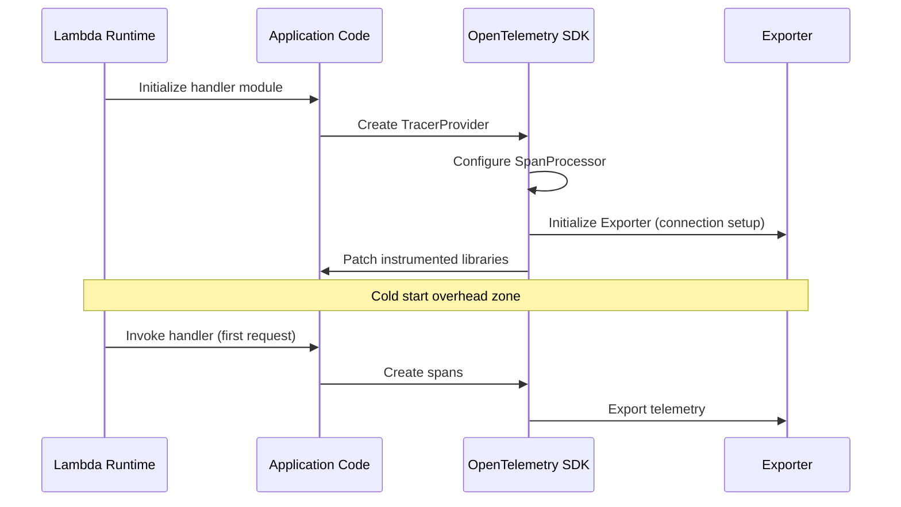

# How to Handle Cold Start Overhead in Lambda with OpenTelemetry

Author: [nawazdhandala](https://www.github.com/nawazdhandala)

Tags: OpenTelemetry, AWS Lambda, Cold Start, Serverless, Performance, Observability

Description: Learn practical strategies to measure, reduce, and manage OpenTelemetry cold start overhead in AWS Lambda functions for production workloads.

---

Cold starts are already a pain point for AWS Lambda users. Adding OpenTelemetry instrumentation on top can make things worse if you are not careful. The SDK initialization, span processors, and exporters all need to bootstrap before your function can handle its first request. In latency-sensitive applications, this extra overhead can push cold start times past acceptable thresholds.

This post walks through the problem in detail and shows you practical techniques for keeping OpenTelemetry cold start overhead under control without sacrificing observability.

## Why OpenTelemetry Adds Cold Start Latency

When a Lambda function cold starts, the runtime initializes your code from scratch. Without instrumentation, this involves loading your handler code, importing dependencies, and establishing any connections your function needs. OpenTelemetry adds several additional steps to this process.

The SDK needs to create a TracerProvider, configure span processors, and set up exporters. If you are using auto-instrumentation, the framework also needs to patch libraries like the AWS SDK, HTTP clients, and database drivers. Each of these operations takes time.

Here is a typical cold start timeline showing where the overhead comes from:



On a typical Node.js Lambda function, OpenTelemetry auto-instrumentation can add anywhere from 200ms to 800ms of cold start latency depending on how many libraries you instrument and which exporter you use.

## Measuring Cold Start Overhead Accurately

Before you optimize, you need to measure. The first step is to record cold start duration as a custom metric so you can track it over time.

```javascript
// cold-start-metric.js
// Records cold start duration as an OpenTelemetry metric
const { metrics } = require('@opentelemetry/api');
const { MeterProvider } = require('@opentelemetry/sdk-metrics');

const meter = metrics.getMeter('lambda-cold-start');

// Create a histogram to track cold start durations
const coldStartDuration = meter.createHistogram('lambda.cold_start.duration', {
  description: 'Time spent in cold start initialization',
  unit: 'ms',
});

let isColdStart = true;
const initStartTime = Date.now();

module.exports.handler = async (event, context) => {
  if (isColdStart) {
    const duration = Date.now() - initStartTime;

    // Record the cold start duration with function metadata
    coldStartDuration.record(duration, {
      'faas.name': context.functionName,
      'faas.version': context.functionVersion,
      'faas.cold_start': true,
    });

    isColdStart = false;
  }

  // Your actual handler logic here
  return { statusCode: 200, body: 'OK' };
};
```

This approach captures the time between module load and the first invocation. The `isColdStart` flag ensures you only record this metric once per execution environment. You can then visualize these metrics in your observability backend to see how cold start times trend across deployments.

## Lazy Initialization of the TracerProvider

One of the most effective techniques is deferring TracerProvider setup until it is actually needed. Instead of initializing everything at module load time, you can delay the heavy work.

```javascript
// lazy-tracer-init.js
// Defers OpenTelemetry initialization to reduce cold start impact
const { trace, context } = require('@opentelemetry/api');

let tracerProvider = null;
let initialized = false;

function getTracer() {
  if (!initialized) {
    // Only import and configure when first span is needed
    const { NodeTracerProvider } = require('@opentelemetry/sdk-trace-node');
    const { SimpleSpanProcessor } = require('@opentelemetry/sdk-trace-base');
    const { OTLPTraceExporter } = require('@opentelemetry/exporter-trace-otlp-http');

    tracerProvider = new NodeTracerProvider({
      // Use resource detectors that are fast to resolve
      resource: new Resource({
        'service.name': process.env.AWS_LAMBDA_FUNCTION_NAME,
        'faas.instance': process.env.AWS_LAMBDA_LOG_STREAM_NAME,
      }),
    });

    // SimpleSpanProcessor exports synchronously, avoiding batching delays
    tracerProvider.addSpanProcessor(
      new SimpleSpanProcessor(new OTLPTraceExporter())
    );

    tracerProvider.register();
    initialized = true;
  }

  return trace.getTracer('my-lambda-function');
}

module.exports.handler = async (event) => {
  const tracer = getTracer();
  const span = tracer.startSpan('handle-request');

  try {
    // Process the event
    const result = await processEvent(event);
    return result;
  } finally {
    span.end();
  }
};
```

The key idea here is that the `require()` calls for OpenTelemetry packages happen inside the `getTracer` function rather than at the top of the file. Node.js caches module imports, so subsequent calls to `getTracer` will not re-import anything. The first invocation pays the cost, but the cold start phase itself becomes faster because the Lambda runtime finishes initialization sooner.

## Using the Collector Extension Instead of In-Process Export

Exporting telemetry directly from your Lambda function means the SDK has to manage HTTP connections, handle retries, and deal with buffering. All of that adds to both cold start time and invocation latency. A better approach is to offload export responsibility to the OpenTelemetry Collector Lambda extension.

```yaml
# collector-config.yaml
# Minimal collector config for the Lambda extension
receivers:
  otlp:
    protocols:
      # Use HTTP protocol for lower overhead in Lambda
      http:
        endpoint: 0.0.0.0:4318

exporters:
  otlphttp:
    endpoint: https://your-backend.example.com/v1
    headers:
      Authorization: "Bearer ${OTEL_AUTH_TOKEN}"
    # Compress payloads to reduce network time
    compression: gzip

service:
  pipelines:
    traces:
      receivers: [otlp]
      exporters: [otlphttp]
```

With this setup, your function sends telemetry to localhost over HTTP, which is fast and does not require TLS handshakes. The collector extension runs as a separate process in the Lambda execution environment and handles the actual export to your backend asynchronously. This means your function can return its response without waiting for telemetry to be delivered.

```javascript
// handler-with-extension.js
// Configure the SDK to export to the local collector extension
const { OTLPTraceExporter } = require('@opentelemetry/exporter-trace-otlp-http');

const exporter = new OTLPTraceExporter({
  // Send to the collector extension running locally
  url: 'http://localhost:4318/v1/traces',
  // Short timeout since we are talking to localhost
  timeoutMillis: 1000,
});
```

This pattern consistently shaves 100-300ms off cold start times because the function no longer needs to establish outbound HTTPS connections during initialization.

## Reducing Instrumentation Library Overhead

Auto-instrumentation patches every supported library it finds in your dependencies. If your Lambda function only uses the AWS SDK and makes HTTP calls, there is no reason to load instrumentation for databases, messaging systems, and other libraries you are not using.

```javascript
// selective-instrumentation.js
// Only instrument the libraries your function actually uses
const { NodeTracerProvider } = require('@opentelemetry/sdk-trace-node');
const { registerInstrumentations } = require('@opentelemetry/instrumentation');
const { AwsInstrumentation } = require('@opentelemetry/instrumentation-aws-sdk');
const { HttpInstrumentation } = require('@opentelemetry/instrumentation-http');

const provider = new NodeTracerProvider();
provider.register();

// Register only the instrumentations you need
registerInstrumentations({
  instrumentations: [
    // AWS SDK instrumentation for DynamoDB, S3, SQS, etc.
    new AwsInstrumentation({
      suppressInternalInstrumentation: true,
    }),
    // HTTP instrumentation for outbound API calls
    new HttpInstrumentation({
      // Skip health check endpoints to reduce noise
      ignoreIncomingRequestHook: (req) => {
        return req.url === '/health';
      },
    }),
  ],
});
```

By cherry-picking only the instrumentations you need, you avoid the overhead of loading and initializing libraries that produce no useful telemetry for your function. In a Node.js function, dropping unused instrumentations can save 50-150ms of cold start time.

## Provisioned Concurrency as a Pragmatic Solution

Sometimes the engineering effort to squeeze out every last millisecond of cold start optimization is not worth it. If you have Lambda functions that need consistently low latency and you have the budget for it, provisioned concurrency eliminates cold starts entirely.

```yaml
# serverless.yml
# Configure provisioned concurrency for latency-sensitive functions
functions:
  api-handler:
    handler: src/handler.main
    runtime: nodejs20.x
    memorySize: 512
    # Keep 5 warm instances ready at all times
    provisionedConcurrency: 5
    environment:
      # Full OpenTelemetry configuration without cold start concerns
      OTEL_SERVICE_NAME: api-handler
      OTEL_EXPORTER_OTLP_ENDPOINT: http://localhost:4318
      OTEL_TRACES_SAMPLER: parentbased_traceidratio
      OTEL_TRACES_SAMPLER_ARG: "0.1"
    layers:
      - arn:aws:lambda:us-east-1:123456789:layer:otel-collector:1
```

With provisioned concurrency, the execution environment stays warm and the OpenTelemetry SDK stays initialized. The cold start cost is paid once when the provisioned environment spins up, and all subsequent invocations are warm. This lets you use full auto-instrumentation without worrying about its impact on user-facing latency.

## Sampling to Reduce Per-Invocation Overhead

Even after cold start, each invocation pays a cost for creating and exporting spans. In high-throughput Lambda functions, you can reduce this overhead with aggressive sampling.

```javascript
// sampling-config.js
// Configure head-based sampling to reduce telemetry volume
const { TraceIdRatioBasedSampler, ParentBasedSampler } = require('@opentelemetry/sdk-trace-base');

const sampler = new ParentBasedSampler({
  // Sample 10% of traces that have no parent
  root: new TraceIdRatioBasedSampler(0.1),
});

const provider = new NodeTracerProvider({
  sampler: sampler,
});
```

A 10% sampling rate means 90% of invocations skip span creation and export entirely. The traces you do capture are still complete because `ParentBasedSampler` respects the sampling decision of the parent span. This approach works especially well for Lambda functions processing queue messages or handling high-volume API traffic.

## Putting It All Together

The optimal strategy depends on your specific constraints. For most teams, the combination that works best is: use the collector extension for export, selectively instrument only the libraries you use, and apply sampling appropriate to your traffic volume. If cold start latency is truly critical, add provisioned concurrency to the mix.

Monitor your cold start metrics over time. As the OpenTelemetry ecosystem evolves, SDK initialization continues to get faster. What takes 500ms today might take 200ms in the next major release. The measurement infrastructure you build now will help you track these improvements automatically.
