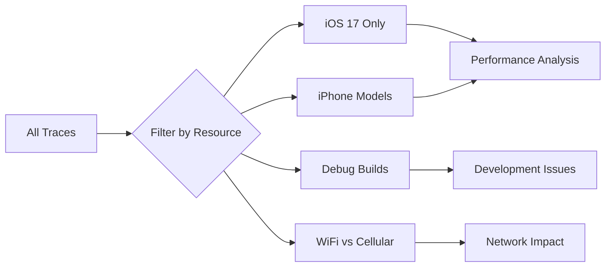

# How to Collect Device Resource Information with OpenTelemetry on iOS

Author: [nawazdhandala](https://www.github.com/nawazdhandala)

Tags: OpenTelemetry, Swift, iOS, Resource Attributes, Device Info, Mobile

Description: Enrich your OpenTelemetry traces with device and app information to understand how different iOS devices, OS versions, and configurations affect your application's behavior.

Every OpenTelemetry span belongs to a resource, which represents the entity producing telemetry data. In iOS applications, this resource includes critical information about the device, operating system, and app version. Properly configured resource attributes help you segment and analyze telemetry data by device characteristics, making it possible to identify device-specific issues and understand performance variations across your user base.

## Why Resource Attributes Matter

When you look at a trace in your observability backend, resource attributes provide the context needed to understand the environment where that trace was generated. Without this information, you might see that an operation took 5 seconds, but you won't know if it happened on a new iPhone 15 with iOS 17 or an older iPhone X running iOS 15.

Resource attributes answer questions like: Are crashes more common on specific iOS versions? Do network requests perform differently on iPad versus iPhone? Which app version introduced a performance regression? This contextual information transforms raw trace data into actionable insights.

## Understanding OpenTelemetry Resources

A resource in OpenTelemetry is a set of attributes that identify the source of telemetry data. These attributes are attached to every span, making them available for filtering, grouping, and analysis. OpenTelemetry defines semantic conventions for resource attributes to ensure consistency across different platforms and languages.

```swift
import OpenTelemetryApi
import OpenTelemetrySdk
import ResourceExtension

// Resources are immutable collections of attributes
let resource = Resource(attributes: [
    ResourceAttributes.serviceName.rawValue: AttributeValue.string("my-ios-app"),
    ResourceAttributes.serviceVersion.rawValue: AttributeValue.string("1.2.3"),
    "deployment.environment": AttributeValue.string("production")
])
```

The resource is configured once during SDK initialization and applies to all spans created by your application. This makes resource attributes efficient, as they're stored once per batch of spans rather than repeated for each individual span.

## Basic Device Information Collection

Start by collecting fundamental device information that identifies the hardware and operating system. UIKit provides APIs to access this data through UIDevice and ProcessInfo.

```swift
import UIKit
import OpenTelemetryApi
import ResourceExtension

class DeviceResourceProvider {
    static func createResource() -> Resource {
        let device = UIDevice.current
        let processInfo = ProcessInfo.processInfo

        var attributes: [String: AttributeValue] = [:]

        // Service identification
        attributes[ResourceAttributes.serviceName.rawValue] = AttributeValue.string(
            Bundle.main.bundleIdentifier ?? "unknown"
        )

        attributes[ResourceAttributes.serviceVersion.rawValue] = AttributeValue.string(
            Bundle.main.infoDictionary?["CFBundleShortVersionString"] as? String ?? "unknown"
        )

        // Build information
        if let buildNumber = Bundle.main.infoDictionary?["CFBundleVersion"] as? String {
            attributes["service.build"] = AttributeValue.string(buildNumber)
        }

        // Device information
        attributes[ResourceAttributes.deviceModelIdentifier.rawValue] = AttributeValue.string(
            deviceModelIdentifier()
        )

        attributes["device.type"] = AttributeValue.string(device.userInterfaceIdiom.description)

        // Operating system
        attributes[ResourceAttributes.osName.rawValue] = AttributeValue.string(
            device.systemName
        )

        attributes[ResourceAttributes.osVersion.rawValue] = AttributeValue.string(
            device.systemVersion
        )

        // Process information
        attributes[ResourceAttributes.processExecutableName.rawValue] = AttributeValue.string(
            processInfo.processName
        )

        attributes[ResourceAttributes.processExecutablePath.rawValue] = AttributeValue.string(
            processInfo.arguments[0]
        )

        return Resource(attributes: attributes)
    }

    private static func deviceModelIdentifier() -> String {
        var systemInfo = utsname()
        uname(&systemInfo)

        let machineMirror = Mirror(reflecting: systemInfo.machine)
        let identifier = machineMirror.children.reduce("") { identifier, element in
            guard let value = element.value as? Int8, value != 0 else {
                return identifier
            }
            return identifier + String(UnicodeScalar(UInt8(value)))
        }

        return identifier
    }
}

extension UIUserInterfaceIdiom {
    var description: String {
        switch self {
        case .phone: return "phone"
        case .pad: return "tablet"
        case .tv: return "tv"
        case .carPlay: return "carplay"
        case .mac: return "mac"
        case .vision: return "vision"
        default: return "unknown"
        }
    }
}
```

This code collects the essential device information that helps you understand the environment where your app runs. The device model identifier is particularly useful because it tells you the exact hardware model (like "iPhone14,2" for iPhone 13 Pro).

## Collecting App Configuration

Beyond device hardware, your app's configuration affects behavior and performance. Include information about feature flags, environment settings, and deployment targets.

```swift
import Foundation
import OpenTelemetryApi

class AppConfigurationResourceProvider {
    static func addConfigurationAttributes(to resource: Resource) -> Resource {
        var attributes = resource.attributes

        // Deployment environment
        let environment = getEnvironment()
        attributes["deployment.environment"] = AttributeValue.string(environment)

        // App configuration
        attributes["app.debug_enabled"] = AttributeValue.bool(isDebugBuild())

        // Locale and region
        attributes["device.locale"] = AttributeValue.string(Locale.current.identifier)
        attributes["device.timezone"] = AttributeValue.string(
            TimeZone.current.identifier
        )

        // Language preferences
        if let preferredLanguage = Locale.preferredLanguages.first {
            attributes["device.language"] = AttributeValue.string(preferredLanguage)
        }

        // Screen information
        let screen = UIScreen.main
        attributes["device.screen.width"] = AttributeValue.int(
            Int(screen.bounds.width * screen.scale)
        )
        attributes["device.screen.height"] = AttributeValue.int(
            Int(screen.bounds.height * screen.scale)
        )
        attributes["device.screen.scale"] = AttributeValue.double(
            Double(screen.scale)
        )

        return Resource(attributes: attributes)
    }

    private static func getEnvironment() -> String {
        #if DEBUG
        return "development"
        #else
        // Check for TestFlight or App Store distribution
        if Bundle.main.appStoreReceiptURL?.lastPathComponent == "sandboxReceipt" {
            return "staging"
        }
        return "production"
        #endif
    }

    private static func isDebugBuild() -> Bool {
        #if DEBUG
        return true
        #else
        return false
        #endif
    }
}
```

Locale and timezone information help you understand regional differences in app behavior. Screen dimensions can reveal issues specific to certain device sizes or when users have accessibility features enabled.

## Memory and Storage Information

Memory pressure and available storage affect app performance significantly. Include this information in your resource attributes to correlate performance issues with device constraints.

```swift
import Foundation
import OpenTelemetryApi

class DeviceCapacityResourceProvider {
    static func addCapacityAttributes(to resource: Resource) -> Resource {
        var attributes = resource.attributes

        // Physical memory
        let physicalMemory = ProcessInfo.processInfo.physicalMemory
        attributes["device.memory.total"] = AttributeValue.int(
            Int(physicalMemory / 1_024 / 1_024) // Convert to MB
        )

        // Storage information
        if let diskSpace = getDiskSpace() {
            attributes["device.storage.total"] = AttributeValue.int(
                Int(diskSpace.total / 1_024 / 1_024) // MB
            )
            attributes["device.storage.available"] = AttributeValue.int(
                Int(diskSpace.available / 1_024 / 1_024) // MB
            )
        }

        // Processor information
        attributes["device.cpu.count"] = AttributeValue.int(
            ProcessInfo.processInfo.processorCount
        )

        attributes["device.cpu.active_count"] = AttributeValue.int(
            ProcessInfo.processInfo.activeProcessorCount
        )

        return Resource(attributes: attributes)
    }

    private static func getDiskSpace() -> (total: UInt64, available: UInt64)? {
        guard let path = NSSearchPathForDirectoriesInDomains(
            .documentDirectory,
            .userDomainMask,
            true
        ).first else {
            return nil
        }

        do {
            let attributes = try FileManager.default.attributesOfFileSystem(
                forPath: path
            )

            if let totalSpace = attributes[.systemSize] as? NSNumber,
               let freeSpace = attributes[.systemFreeSize] as? NSNumber {
                return (totalSpace.uint64Value, freeSpace.uint64Value)
            }
        } catch {
            return nil
        }

        return nil
    }
}
```

## Network Connectivity Information

Mobile apps deal with varying network conditions. Including network type and reachability status in resource attributes helps you analyze how connectivity affects your app.

```swift
import Network
import OpenTelemetryApi

class NetworkResourceProvider {
    private let monitor = NWPathMonitor()
    private var currentPath: NWPath?

    func startMonitoring() {
        monitor.pathUpdateHandler = { [weak self] path in
            self?.currentPath = path
        }

        monitor.start(queue: DispatchQueue.global(qos: .utility))
    }

    func addNetworkAttributes(to resource: Resource) -> Resource {
        guard let path = currentPath else {
            return resource
        }

        var attributes = resource.attributes

        // Network status
        attributes["network.available"] = AttributeValue.bool(
            path.status == .satisfied
        )

        // Connection type
        if path.usesInterfaceType(.wifi) {
            attributes["network.connection.type"] = AttributeValue.string("wifi")
        } else if path.usesInterfaceType(.cellular) {
            attributes["network.connection.type"] = AttributeValue.string("cellular")

            // Cellular generation if available
            if path.isExpensive {
                attributes["network.cellular.expensive"] = AttributeValue.bool(true)
            }
        } else if path.usesInterfaceType(.wiredEthernet) {
            attributes["network.connection.type"] = AttributeValue.string("ethernet")
        } else {
            attributes["network.connection.type"] = AttributeValue.string("unknown")
        }

        // Network constraints
        attributes["network.constrained"] = AttributeValue.bool(path.isConstrained)

        return Resource(attributes: attributes)
    }

    func stopMonitoring() {
        monitor.cancel()
    }
}
```

Note that network status can change during the app's lifetime. These attributes represent the initial state when the SDK is configured. For real-time network status tracking, add span attributes or events instead of resource attributes.

## Combining All Resource Providers

Create a comprehensive resource by combining all the individual resource providers. This happens once during app initialization.

```swift
import UIKit
import OpenTelemetryApi
import OpenTelemetrySdk
import ResourceExtension

class TelemetryInitializer {
    static func initializeOpenTelemetry() -> TracerProviderSdk {
        // Start with basic device resource
        var resource = DeviceResourceProvider.createResource()

        // Add configuration attributes
        resource = AppConfigurationResourceProvider.addConfigurationAttributes(
            to: resource
        )

        // Add capacity information
        resource = DeviceCapacityResourceProvider.addCapacityAttributes(
            to: resource
        )

        // Add network information
        let networkProvider = NetworkResourceProvider()
        networkProvider.startMonitoring()

        // Give the monitor a moment to detect network status
        Thread.sleep(forTimeInterval: 0.1)

        resource = networkProvider.addNetworkAttributes(to: resource)

        // Create and configure the tracer provider
        let exporter = createExporter()
        let processor = BatchSpanProcessor(spanExporter: exporter)

        let tracerProvider = TracerProviderBuilder()
            .with(resource: resource)
            .add(spanProcessor: processor)
            .build()

        OpenTelemetry.registerTracerProvider(tracerProvider: tracerProvider)

        return tracerProvider
    }

    private static func createExporter() -> SpanExporter {
        // Return your configured exporter
        // For example: OtlpHttpTraceExporter or StdoutExporter
        return StdoutExporter()
    }
}
```

## Accessing Resource Attributes at Runtime

Sometimes you need to read resource attributes during app execution, perhaps to include them in error reports or custom logging.

```swift
import OpenTelemetryApi

class ResourceInspector {
    static func logResourceAttributes() {
        let resource = OpenTelemetry.instance.tracerProvider.resource

        print("=== OpenTelemetry Resource Attributes ===")
        for (key, value) in resource.attributes.sorted(by: { $0.key < $1.key }) {
            print("\(key): \(value)")
        }
        print("=========================================")
    }

    static func getServiceVersion() -> String? {
        let resource = OpenTelemetry.instance.tracerProvider.resource
        if case .string(let version) = resource.attributes[
            ResourceAttributes.serviceVersion.rawValue
        ] {
            return version
        }
        return nil
    }

    static func getDeviceModel() -> String? {
        let resource = OpenTelemetry.instance.tracerProvider.resource
        if case .string(let model) = resource.attributes[
            ResourceAttributes.deviceModelIdentifier.rawValue
        ] {
            return model
        }
        return nil
    }
}
```

## Resource Detection Best Practices

Collect resource attributes that provide value for analysis. Avoid collecting personally identifiable information like device names, user IDs, or location data in resource attributes. This data persists across all telemetry and could create privacy concerns.

Keep resource attribute collection fast. The SDK initialization happens during app launch, and slow resource detection delays your app's startup. Most of the APIs shown here are synchronous and return quickly, but be cautious with network-dependent attributes.

Use consistent attribute naming across your telemetry. OpenTelemetry semantic conventions provide standardized names for common attributes. Follow these conventions when possible, and use descriptive namespaced names for custom attributes.

## Analyzing Telemetry by Device Characteristics

With rich resource attributes, you can slice your telemetry data in powerful ways. Your observability backend can answer questions like:



Create dashboards that show:
- Average response times by iOS version
- Error rates on different device types
- Memory usage patterns across device models
- Network request performance on WiFi versus cellular

These insights help you make informed decisions about which devices to prioritize for optimization, which iOS versions cause the most issues, and how different environments affect your app's behavior.

## Dynamic Resource Updates

Resources are typically immutable after SDK initialization, but you can create a new resource if your app's context changes significantly. This is uncommon but useful for apps that can switch between different operating modes.

```swift
class DynamicResourceManager {
    private var tracerProvider: TracerProviderSdk?

    func updateResourceForUserContext(userId: String, subscription: String) {
        // Create a new resource with updated context
        var baseResource = DeviceResourceProvider.createResource()

        var attributes = baseResource.attributes
        attributes["user.subscription_tier"] = AttributeValue.string(subscription)
        attributes["user.cohort"] = AttributeValue.string(getUserCohort(userId))

        let updatedResource = Resource(attributes: attributes)

        // Recreate the tracer provider with the new resource
        let exporter = createExporter()
        let processor = BatchSpanProcessor(spanExporter: exporter)

        tracerProvider?.shutdown()

        tracerProvider = TracerProviderBuilder()
            .with(resource: updatedResource)
            .add(spanProcessor: processor)
            .build()

        OpenTelemetry.registerTracerProvider(tracerProvider: tracerProvider!)
    }

    private func getUserCohort(_ userId: String) -> String {
        // Determine user cohort based on some logic
        return "standard"
    }

    private func createExporter() -> SpanExporter {
        return StdoutExporter()
    }
}
```

## Privacy and User Data Considerations

Be thoughtful about what information you include in resource attributes. These attributes are attached to all telemetry data and persist in your observability backend. Follow these guidelines:

Never include user names, email addresses, or other personal identifiers directly in resource attributes. If you need to track user-specific behavior, use anonymized or hashed identifiers and ensure your users have consented to telemetry collection.

Avoid collecting precise location data or IP addresses as resource attributes. These can reveal user identity and locations over time.

Consider what device information is actually necessary. While it's tempting to collect everything, focus on attributes that provide actionable insights for your specific use cases.

## Integration with App Lifecycle

Initialize your resource collection early in the app lifecycle to ensure all telemetry includes proper resource attributes from the start.

```swift
import UIKit

@main
class AppDelegate: UIResponder, UIApplicationDelegate {
    func application(
        _ application: UIApplication,
        didFinishLaunchingWithOptions launchOptions: [UIApplication.LaunchOptionsKey: Any]?
    ) -> Bool {
        // Initialize OpenTelemetry with resource attributes
        // before any other telemetry-generating code runs
        _ = TelemetryInitializer.initializeOpenTelemetry()

        // Log resource attributes for verification during development
        #if DEBUG
        ResourceInspector.logResourceAttributes()
        #endif

        return true
    }
}
```

## The Foundation for Meaningful Telemetry

Resource attributes transform OpenTelemetry from a generic tracing system into a powerful mobile observability tool. By enriching every span with device, app, and environment information, you create telemetry data that tells the complete story of how your iOS app performs across your entire user base.

The resource configuration shown here provides a solid foundation. You can extend it with additional attributes specific to your app's domain, but the core device and system information covered here addresses the most common analysis needs. With proper resource attributes in place, your traces become a rich source of insights about real-world app behavior.
