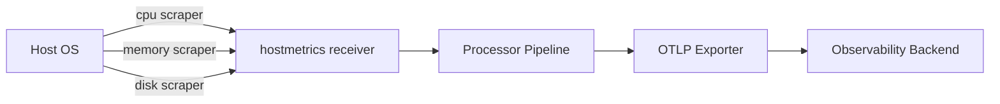

# How to Collect Host CPU, Memory, and Disk Metrics with the Collector

Author: [nawazdhandala](https://www.github.com/nawazdhandala)

Tags: OpenTelemetry, Collector, Host Metrics, CPU, Memory, Disk, Infrastructure Monitoring, Observability

Description: Learn how to collect host-level CPU, memory, and disk metrics using the OpenTelemetry Collector's hostmetrics receiver with practical configuration examples.

---

Infrastructure monitoring starts with the basics: how much CPU is being consumed, how much memory is available, and whether your disks are running out of space. These three signals form the foundation of any serious observability practice. The OpenTelemetry Collector ships with a built-in `hostmetrics` receiver that gathers all of these metrics from the machine it runs on, without requiring any additional agents or exporters.

This guide walks through configuring the hostmetrics receiver to collect CPU, memory, and disk telemetry, filtering out noise, and shipping the data to your backend.

## How the Host Metrics Receiver Works

The hostmetrics receiver is part of the OpenTelemetry Collector Contrib distribution. It uses operating system APIs to read system-level statistics at a configurable interval. Each scrape produces a batch of metrics that flow through the collector pipeline just like any other telemetry data.

The receiver supports multiple scrapers, each responsible for a different category of host metrics. For this guide, we focus on three:

- **cpu**: Per-core and aggregate CPU time broken down by state (user, system, idle, iowait, etc.)
- **memory**: Physical memory usage including used, free, buffered, and cached
- **disk**: Disk I/O operations, bytes read/written, and operation time per device



## Installing the Collector

The hostmetrics receiver is included in the Collector Contrib distribution. If you are using the core distribution, you will need to switch to Contrib or build a custom collector that includes this receiver.

On a Debian-based Linux host, you can install the Contrib distribution with:

```bash
# Download the latest Collector Contrib .deb package
wget https://github.com/open-telemetry/opentelemetry-collector-releases/releases/download/v0.96.0/otelcol-contrib_0.96.0_linux_amd64.deb

# Install the package
sudo dpkg -i otelcol-contrib_0.96.0_linux_amd64.deb
```

After installation, the collector binary is available at `/usr/bin/otelcol-contrib` and can be managed via systemd.

## Basic Configuration

Here is a minimal configuration that enables CPU, memory, and disk scrapers with a 30-second collection interval:

```yaml
# otel-collector-config.yaml
receivers:
  hostmetrics:
    # How often to scrape host metrics
    collection_interval: 30s
    scrapers:
      # Collects CPU time per core and per state
      cpu:
      # Collects physical memory usage statistics
      memory:
      # Collects disk I/O statistics per device
      disk:

processors:
  # Batch metrics before export to reduce network overhead
  batch:
    timeout: 10s
    send_batch_size: 256

exporters:
  otlp:
    # Replace with your actual backend endpoint
    endpoint: "otel-backend.example.com:4317"
    tls:
      insecure: false

service:
  pipelines:
    metrics:
      receivers: [hostmetrics]
      processors: [batch]
      exporters: [otlp]
```

This configuration starts collecting metrics immediately on launch. The CPU scraper reports metrics like `system.cpu.time` with labels for each CPU core and state. The memory scraper produces `system.memory.usage` with labels for state (used, free, buffered, cached). The disk scraper emits `system.disk.io` and `system.disk.operations` with per-device breakdowns.

## Understanding the Metrics Produced

Each scraper emits a specific set of metrics that follow OpenTelemetry semantic conventions. Knowing what each metric represents helps you build useful dashboards and alerts.

**CPU Metrics:**

| Metric | Type | Description |
|--------|------|-------------|
| system.cpu.time | Sum (cumulative) | Seconds spent in each CPU state per core |
| system.cpu.utilization | Gauge | CPU utilization as a ratio (0.0 to 1.0) per core |

**Memory Metrics:**

| Metric | Type | Description |
|--------|------|-------------|
| system.memory.usage | Sum | Bytes of physical memory by state |
| system.memory.utilization | Gauge | Memory utilization ratio by state |

**Disk Metrics:**

| Metric | Type | Description |
|--------|------|-------------|
| system.disk.io | Sum (cumulative) | Bytes read and written per device |
| system.disk.operations | Sum (cumulative) | Count of read/write operations per device |
| system.disk.io_time | Sum (cumulative) | Time spent on I/O operations per device |
| system.disk.operation_time | Sum (cumulative) | Time spent on read/write operations |

## Filtering Devices and CPU Cores

Production hosts often have dozens of CPU cores and multiple disk devices, some of which you may not care about. The hostmetrics receiver supports filtering to reduce cardinality and noise.

```yaml
receivers:
  hostmetrics:
    collection_interval: 30s
    scrapers:
      cpu:
        metrics:
          # Disable per-core utilization if you only need aggregate
          system.cpu.utilization:
            enabled: true
          system.cpu.time:
            enabled: true
      memory:
        metrics:
          system.memory.usage:
            enabled: true
          system.memory.utilization:
            enabled: true
      disk:
        # Only collect metrics for specific disk devices
        include:
          devices: ["sda", "sdb", "nvme0n1"]
          match_type: strict
        # Exclude loop and ram devices
        exclude:
          devices: ["loop.*", "ram.*"]
          match_type: regexp
```

The include/exclude filters on the disk scraper are particularly useful in environments where virtual devices, loop mounts, and RAM disks generate metrics you never look at. Filtering at the receiver level is more efficient than dropping metrics later in the pipeline because it avoids the overhead of collecting and processing data you will just throw away.

## Adding Resource Attributes

When collecting metrics from multiple hosts, you need a way to distinguish which host produced which data. The `resourcedetection` processor automatically attaches host-level attributes like hostname, OS type, and cloud metadata.

```yaml
processors:
  # Automatically detect and attach host resource attributes
  resourcedetection:
    detectors: [system, env]
    system:
      # Attach hostname and OS information
      hostname_sources: ["os"]
      resource_attributes:
        host.name:
          enabled: true
        host.id:
          enabled: true
        os.type:
          enabled: true

  batch:
    timeout: 10s
    send_batch_size: 256

service:
  pipelines:
    metrics:
      receivers: [hostmetrics]
      processors: [resourcedetection, batch]
      exporters: [otlp]
```

After adding resourcedetection, every metric emitted by the hostmetrics receiver carries attributes like `host.name=web-server-01` and `os.type=linux`. This makes it straightforward to filter, group, and alert on metrics from specific machines in your backend.

## Running Multiple Instances for Different Intervals

Sometimes you want to collect CPU metrics more frequently than disk metrics. The collector supports multiple instances of the same receiver with different configurations:

```yaml
receivers:
  # Fast polling for CPU to catch spikes
  hostmetrics/fast:
    collection_interval: 10s
    scrapers:
      cpu:

  # Slower polling for disk, which changes less frequently
  hostmetrics/slow:
    collection_interval: 60s
    scrapers:
      memory:
      disk:

service:
  pipelines:
    metrics:
      receivers: [hostmetrics/fast, hostmetrics/slow]
      processors: [batch]
      exporters: [otlp]
```

The named instances (`hostmetrics/fast` and `hostmetrics/slow`) let you tune collection intervals per scraper category. CPU spikes can be short-lived, so a 10-second interval helps catch them. Disk usage trends slowly, so polling every 60 seconds is usually sufficient and reduces data volume.

## Production Considerations

Running the hostmetrics receiver in production requires a few additional considerations.

First, the collector process itself consumes CPU and memory. On a busy host, a 10-second scrape interval with all scrapers enabled typically uses less than 50MB of RAM and negligible CPU. However, if you enable many scrapers with very short intervals across hundreds of hosts, the downstream data volume can grow quickly.

Second, the hostmetrics receiver must run on the host itself, not inside a container, to access system-level statistics accurately. If you run the collector in Docker or Kubernetes, you need to mount the host's `/proc` and `/sys` filesystems into the container:

```yaml
# Docker Compose example for host metric collection
services:
  otel-collector:
    image: otel/opentelemetry-collector-contrib:0.96.0
    volumes:
      # Mount host filesystems for accurate metrics
      - /proc:/hostfs/proc:ro
      - /sys:/hostfs/sys:ro
      - /:/hostfs:ro
    environment:
      # Tell the receiver where to find host filesystems
      - HOST_PROC=/hostfs/proc
      - HOST_SYS=/hostfs/sys
      - HOST_ETC=/hostfs/etc
      - HOST_RUN=/hostfs/run
```

In the collector config, set the `root_path` to point to the mounted host filesystem:

```yaml
receivers:
  hostmetrics:
    # Point to the mounted host filesystem root
    root_path: /hostfs
    collection_interval: 30s
    scrapers:
      cpu:
      memory:
      disk:
```

Third, consider using the `filter` processor to drop metrics with high cardinality that you do not need. Per-core CPU metrics on a 128-core machine generate a lot of time series. If aggregate CPU utilization is sufficient for your use case, disable per-core reporting to keep costs down.

## Verifying Data Collection

After launching the collector, confirm that metrics are flowing by checking the collector logs:

```bash
# Run the collector in the foreground with debug logging
otelcol-contrib --config otel-collector-config.yaml 2>&1 | grep -i "hostmetrics"
```

You should see log lines indicating that the hostmetrics receiver has started and is scraping at the configured interval. If your backend supports querying, look for metrics named `system.cpu.time`, `system.memory.usage`, and `system.disk.io` to confirm end-to-end data flow.

## Wrap Up

The hostmetrics receiver gives you a solid foundation for infrastructure monitoring with minimal setup. CPU, memory, and disk metrics cover the most common failure modes in production systems: resource exhaustion, memory leaks, and disk space issues. By configuring scrapers selectively, filtering unnecessary devices, and attaching resource attributes, you can build a clean, efficient metrics pipeline that scales across your entire fleet. Combined with the batch processor and OTLP exporter, this configuration integrates naturally with any OpenTelemetry-compatible backend.
