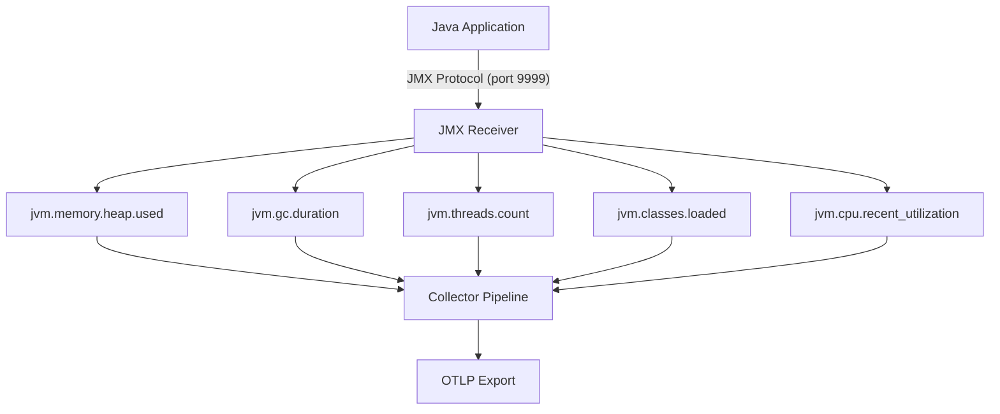

# How to Collect JVM Metrics with the JMX Receiver in the Collector

Author: [nawazdhandala](https://www.github.com/nawazdhandala)

Tags: OpenTelemetry, Collector, JVM, JMX, Java, Metrics, Monitoring, Garbage Collection, Observability

Description: Learn how to collect JVM metrics like heap memory, garbage collection, and thread counts using the JMX receiver in the OpenTelemetry Collector.

---

Java applications run on the JVM, and the JVM exposes a rich set of runtime metrics through Java Management Extensions (JMX). Heap memory usage, garbage collection pause times, thread pool sizes, and class loading statistics are all available through MBeans. The OpenTelemetry Collector's JMX receiver connects to running Java applications over the JMX protocol and converts these MBean attributes into OpenTelemetry metrics that flow through your standard pipeline.

This guide focuses specifically on collecting JVM-level metrics: the runtime data that every Java application produces regardless of what framework or libraries it uses. We cover the full setup from enabling JMX on your Java processes through configuring the receiver, selecting the right MBeans, and tuning for production.

## JVM Metrics That Matter

Before diving into configuration, it helps to understand which JVM metrics are most useful for operations and debugging.

**Heap Memory**: The JVM divides heap memory into generations (Young, Old) and specific spaces (Eden, Survivor, Tenured). Monitoring heap usage reveals memory pressure, potential leaks, and whether your `-Xmx` settings are appropriate.

**Garbage Collection**: GC pause times directly impact application latency. Monitoring GC frequency, duration, and the amount of memory reclaimed helps you tune GC parameters and detect when GC activity is becoming a bottleneck.

**Threads**: Thread count and thread states (RUNNABLE, BLOCKED, WAITING, TIMED_WAITING) show whether your application has enough concurrency capacity and whether threads are getting stuck.

**Class Loading**: The number of loaded classes grows during deployment and plugin loading. A steadily increasing count in a long-running application can indicate a classloader leak.

**CPU**: JVM-level CPU metrics show how much processor time your Java process consumes, complementing host-level metrics.



## Enabling JMX on Your Java Application

The JMX receiver connects to Java applications over a network socket. You need to enable remote JMX access when starting your Java process.

For development and testing:

```bash
# Start a Java application with JMX enabled on port 9999
# Authentication disabled for local development only
java \
  -Dcom.sun.management.jmxremote \
  -Dcom.sun.management.jmxremote.port=9999 \
  -Dcom.sun.management.jmxremote.rmi.port=9999 \
  -Dcom.sun.management.jmxremote.authenticate=false \
  -Dcom.sun.management.jmxremote.ssl=false \
  -Dcom.sun.management.jmxremote.local.only=false \
  -Djava.rmi.server.hostname=0.0.0.0 \
  -jar myapp.jar
```

For production environments, always enable authentication and consider SSL:

```bash
# Production JMX configuration with authentication
java \
  -Dcom.sun.management.jmxremote \
  -Dcom.sun.management.jmxremote.port=9999 \
  -Dcom.sun.management.jmxremote.rmi.port=9999 \
  -Dcom.sun.management.jmxremote.authenticate=true \
  -Dcom.sun.management.jmxremote.ssl=true \
  -Dcom.sun.management.jmxremote.password.file=/etc/jmx/jmxremote.password \
  -Dcom.sun.management.jmxremote.access.file=/etc/jmx/jmxremote.access \
  -jar myapp.jar
```

The password file contains username-password pairs, and the access file defines read/write permissions per user. These files must have restricted permissions (readable only by the JVM process owner).

## Configuring the JMX Receiver

The JMX receiver in the OpenTelemetry Collector uses a Groovy-based metric gathering script internally to query MBeans. It requires a JDK to be available because it runs a small JMX client process.

Here is the basic configuration for collecting core JVM metrics:

```yaml
# otel-collector-config.yaml
receivers:
  jmx:
    # JMX service URL for the target Java application
    endpoint: "service:jmx:rmi:///jndi/rmi://localhost:9999/jmxrmi"
    # Path to the JMX metric gatherer JAR
    jar_path: "/opt/opentelemetry-jmx-metrics.jar"
    # Collection interval
    collection_interval: 30s
    # Use the built-in JVM target system for standard metrics
    target_system: "jvm"

processors:
  batch:
    timeout: 10s

exporters:
  otlp:
    endpoint: "otel-backend.example.com:4317"

service:
  pipelines:
    metrics:
      receivers: [jmx]
      processors: [batch]
      exporters: [otlp]
```

The `target_system: "jvm"` setting tells the receiver to use its built-in JVM metric definitions, which cover all the standard MBeans that every JVM exposes. This is the fastest way to get started because you do not need to define individual MBean queries.

## Installing the JMX Metric Gatherer

The JMX receiver depends on the OpenTelemetry JMX metric gatherer JAR. Download it from the official releases:

```bash
# Download the JMX metric gatherer JAR
wget -O /opt/opentelemetry-jmx-metrics.jar \
  https://github.com/open-telemetry/opentelemetry-java-contrib/releases/download/v1.33.0/opentelemetry-jmx-metrics.jar
```

You also need a JDK (not just a JRE) installed on the collector host because the metric gatherer uses JDK tools to connect to remote JMX endpoints:

```bash
# On Debian/Ubuntu, install the JDK
sudo apt-get install -y openjdk-17-jdk

# Set JAVA_HOME for the collector
export JAVA_HOME=/usr/lib/jvm/java-17-openjdk-amd64
```

Make sure the `JAVA_HOME` environment variable is set for the collector process, either in the systemd service file or in your container environment.

## Metrics Produced by the JVM Target System

When using `target_system: "jvm"`, the receiver collects these metrics automatically:

| Metric | Type | Description |
|--------|------|-------------|
| jvm.memory.heap.used | Gauge | Current heap memory used in bytes |
| jvm.memory.heap.committed | Gauge | Heap memory committed by the JVM |
| jvm.memory.heap.max | Gauge | Maximum heap memory configured (-Xmx) |
| jvm.memory.nonheap.used | Gauge | Non-heap memory used (Metaspace, code cache) |
| jvm.memory.pool.used | Gauge | Memory used per pool (Eden, Survivor, Old Gen) |
| jvm.gc.duration | Histogram | GC pause duration distribution |
| jvm.gc.collections.count | Sum | Total number of GC cycles |
| jvm.gc.collections.elapsed | Sum | Total time spent in GC |
| jvm.threads.count | Gauge | Current thread count by state |
| jvm.classes.loaded | Gauge | Number of currently loaded classes |
| jvm.classes.unloaded | Sum | Total classes unloaded since JVM start |
| jvm.cpu.recent_utilization | Gauge | Recent CPU utilization by the JVM process |

These metrics follow the OpenTelemetry semantic conventions for JVM instrumentation and are compatible with dashboards and alerts built for standard JVM monitoring.

## Monitoring Multiple Java Applications

In a typical production environment, you run multiple Java services on the same host or across a cluster. The collector supports multiple JMX receiver instances, each targeting a different application:

```yaml
receivers:
  # Application server on port 9999
  jmx/app_server:
    endpoint: "service:jmx:rmi:///jndi/rmi://localhost:9999/jmxrmi"
    jar_path: "/opt/opentelemetry-jmx-metrics.jar"
    collection_interval: 30s
    target_system: "jvm"
    resource_attributes:
      service.name: "order-service"

  # Background worker on port 9998
  jmx/worker:
    endpoint: "service:jmx:rmi:///jndi/rmi://localhost:9998/jmxrmi"
    jar_path: "/opt/opentelemetry-jmx-metrics.jar"
    collection_interval: 30s
    target_system: "jvm"
    resource_attributes:
      service.name: "order-worker"

service:
  pipelines:
    metrics:
      receivers: [jmx/app_server, jmx/worker]
      processors: [batch]
      exporters: [otlp]
```

Each receiver instance gets a unique name suffix (after the `/`) and its own configuration. The `resource_attributes` field attaches service identity to the metrics, making it easy to filter and aggregate in your backend. The JMX receiver also supports built-in target systems beyond `jvm`, including `kafka`, `activemq`, `tomcat`, and `hadoop`.

## Configuring JMX Authentication

For production deployments with JMX authentication enabled, add credentials to the receiver configuration:

```yaml
receivers:
  jmx:
    endpoint: "service:jmx:rmi:///jndi/rmi://app-server:9999/jmxrmi"
    jar_path: "/opt/opentelemetry-jmx-metrics.jar"
    collection_interval: 30s
    target_system: "jvm"
    # JMX authentication credentials
    username: "monitor"
    password: "${env:JMX_PASSWORD}"
```

Store the password in an environment variable rather than in the configuration file directly. The `${env:...}` syntax supports variable substitution from environment variables set by your container runtime or orchestrator.

## Tuning Collection for Production

The JMX receiver spawns a child JVM process to handle the JMX connection, which uses around 100-200MB of heap by default. If you are monitoring many applications from a single collector, this adds up.

**Collection interval**: For GC metrics, 30 seconds is a good starting point. If you need to catch short GC pauses, reduce it to 15 seconds. For memory trending, 60 seconds is often sufficient.

**Connection recovery**: If the target Java application restarts, the JMX connection drops. The receiver automatically reconnects, but there will be a brief gap in metrics. Your alerting should account for these gaps during deployments.

## Building Dashboards and Alerts

With JVM metrics flowing to your backend, here are the most valuable dashboard panels and alert conditions:

**Heap utilization**: Display `jvm.memory.heap.used / jvm.memory.heap.max` as a percentage. Alert when this consistently exceeds 85%, as it indicates the application is under memory pressure and approaching OutOfMemoryError territory.

**GC pause time**: Track the p99 of `jvm.gc.duration`. Alert when p99 GC pause times exceed your application's latency budget. For a web service with a 200ms SLA, GC pauses above 100ms are concerning.

**GC frequency**: A sudden increase in `jvm.gc.collections.count` rate, especially for old generation collections (Full GC), indicates memory pressure or an allocation rate problem.

**Thread count trends**: Track `jvm.threads.count` over time. A steadily growing thread count suggests a thread leak. Alert when thread count exceeds a baseline threshold (e.g., 2x the normal operating count).

**Memory pool breakdown**: Show `jvm.memory.pool.used` for each pool (Eden, Survivor S0, Survivor S1, Old Gen, Metaspace). This helps you understand where memory is being consumed and whether specific pools are undersized.

## Wrap Up

The JMX receiver bridges the gap between Java's native monitoring infrastructure and the OpenTelemetry ecosystem. By pointing it at your Java applications' JMX endpoints and using the built-in JVM target system, you get comprehensive runtime metrics without modifying application code. Heap memory, garbage collection, threads, class loading, and CPU utilization are all collected automatically and flow through the same pipeline as the rest of your telemetry. For production deployments, enable authentication, tune collection intervals, attach service identity attributes, and build alerts around the metrics that most directly impact your application's reliability.
