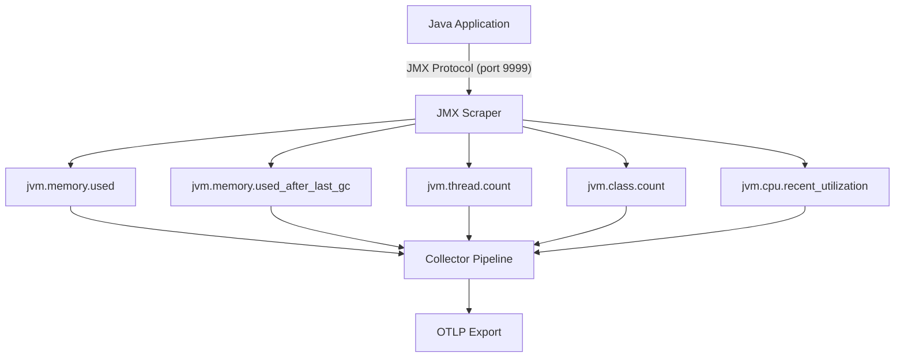

# How to Collect JVM Metrics with the JMX Receiver in the Collector

Author: [nawazdhandala](https://www.github.com/nawazdhandala)

Tags: OpenTelemetry, Collector, JVM, JMX, Java, Metric, Monitoring, Garbage Collection, Observability

Description: Learn how to collect JVM metrics like heap memory, garbage collection, and thread counts using the JMX receiver in the OpenTelemetry Collector.

---

Java applications run on the JVM, and the JVM exposes a rich set of runtime metrics through Java Management Extensions (JMX). Heap memory usage, thread pool sizes, CPU data, and class loading statistics are all available through MBeans. The OpenTelemetry JMX Scraper connects to running Java applications over the JMX protocol and converts these MBean attributes into OpenTelemetry metrics that flow through your standard Collector pipeline.

This guide focuses specifically on collecting JVM-level metrics: the runtime data that every Java application produces regardless of what framework or libraries it uses. We cover the full setup from enabling JMX on your Java processes through configuring the scraper and Collector, selecting the right MBeans, and tuning for production.

## JVM Metrics That Matter

Before diving into configuration, it helps to understand which JVM metrics are most useful for operations and debugging.

**Heap Memory**: The JVM divides heap memory into generations (Young, Old) and specific spaces (Eden, Survivor, Tenured). Monitoring heap usage reveals memory pressure, potential leaks, and whether your `-Xmx` settings are appropriate.

**Garbage Collection**: GC activity directly impacts application latency. Remote JMX scraping can report memory used after the latest GC for each pool. For GC pause duration, use the OpenTelemetry Java agent's runtime telemetry, because the YAML-based JMX Scraper does not collect JMX notification-based `jvm.gc.duration`.

**Threads**: Thread count and thread states (RUNNABLE, BLOCKED, WAITING, TIMED_WAITING) show whether your application has enough concurrency capacity and whether threads are getting stuck.

**Class Loading**: The number of loaded classes grows during deployment and plugin loading. A steadily increasing count in a long-running application can indicate a classloader leak.

**CPU**: JVM-level CPU metrics show how much processor time your Java process consumes, complementing host-level metrics.


```mermaid
flowchart TD
    A["Java Application"] -->|"JMX Protocol (port 9999)"| B["JMX Scraper"]
    B --> C["jvm.memory.used"]
    B --> D["jvm.memory.used_after_last_gc"]
    B --> E["jvm.thread.count"]
    B --> F["jvm.class.count"]
    B --> G["jvm.cpu.recent_utilization"]
    C --> H["Collector Pipeline"]
    D --> H
    E --> H
    F --> H
    G --> H
    H --> I["OTLP Export"]
```

## Enabling JMX on Your Java Application

The JMX Scraper connects to Java applications over a network socket. You need to enable remote JMX access when starting your Java process.

For development and testing:

```bash
# Start a Java application with JMX enabled on port 9999

# Authentication disabled for local development only
java \
  -Dcom.sun.management.jmxremote \
  -Dcom.sun.management.jmxremote.port=9999 \
  -Dcom.sun.management.jmxremote.rmi.port=9999 \
  -Dcom.sun.management.jmxremote.authenticate=false \
  -Dcom.sun.management.jmxremote.ssl=false \
  -Dcom.sun.management.jmxremote.local.only=false \
  -Djava.rmi.server.hostname=0.0.0.0 \
  -jar myapp.jar
```

For production environments, always enable authentication and consider SSL:

```bash
# Production JMX configuration with authentication
java \
  -Dcom.sun.management.jmxremote \
  -Dcom.sun.management.jmxremote.port=9999 \
  -Dcom.sun.management.jmxremote.rmi.port=9999 \
  -Dcom.sun.management.jmxremote.authenticate=true \
  -Dcom.sun.management.jmxremote.ssl=true \
  -Dcom.sun.management.jmxremote.password.file=/etc/jmx/jmxremote.password \
  -Dcom.sun.management.jmxremote.access.file=/etc/jmx/jmxremote.access \
  -jar myapp.jar
```

The password file contains username-password pairs, and the access file defines read/write permissions per user. These files must have restricted permissions (readable only by the JVM process owner).

## Configuring the JMX Scraper and Collector

The legacy JMX receiver in the OpenTelemetry Collector is deprecated. The current OpenTelemetry setup runs the standalone JMX Scraper as a small Java process and sends the metrics to the Collector over OTLP.

Here is the basic configuration for collecting core JVM metrics:

```yaml
# otel-collector-config.yaml
receivers:
  otlp:
    protocols:
      grpc:
        endpoint: "0.0.0.0:4317"

processors:
  batch:
    timeout: 10s

exporters:
  otlp:
    endpoint: "otel-backend.example.com:4317"

service:
  pipelines:
    metrics:
      receivers: [otlp]
      processors: [batch]
      exporters: [otlp]
```

Run the JMX Scraper separately and point it at both the target JVM and the Collector:

```bash
java \
  -Dotel.jmx.service.url=service:jmx:rmi:///jndi/rmi://localhost:9999/jmxrmi \
  -Dotel.jmx.target.system=jvm \
  -Dotel.metric.export.interval=30s \
  -Dotel.metrics.exporter=otlp \
  -Dotel.exporter.otlp.endpoint=http://localhost:4317 \
  -Dotel.service.name=myapp \
  -jar /opt/opentelemetry-jmx-scraper.jar
```

The `otel.jmx.target.system=jvm` setting tells the scraper to use its built-in JVM metric definitions. This is the fastest way to get started because you do not need to define individual MBean queries.

## Installing the JMX Scraper

Download the OpenTelemetry JMX Scraper JAR from the official releases:

```bash
# Download the JMX Scraper JAR
wget -O /opt/opentelemetry-jmx-scraper.jar \
  https://github.com/open-telemetry/opentelemetry-java-contrib/releases/download/v1.57.0/opentelemetry-jmx-scraper.jar
```

You also need a Java runtime installed where the scraper runs:

```bash
# On Debian/Ubuntu, install a Java runtime
sudo apt-get install -y openjdk-17-jre-headless

# Set JAVA_HOME if your service environment does not already provide Java
export JAVA_HOME=/usr/lib/jvm/java-17-openjdk-amd64
```

Make sure the `java` executable is available to the scraper process, either through `PATH` or through a service-level `JAVA_HOME`.

## Metrics Produced by the JVM Target System

When using `otel.jmx.target.system=jvm`, the scraper collects these metrics automatically:

| Metric | Type | Description |
|--------|------|-------------|
| jvm.memory.used | UpDownCounter | Current memory used in bytes, with memory type and pool attributes |
| jvm.memory.committed | UpDownCounter | Memory committed by the JVM, with memory type and pool attributes |
| jvm.memory.limit | UpDownCounter | Maximum obtainable memory for the pool |
| jvm.memory.used_after_last_gc | UpDownCounter | Memory used after the latest GC for the pool |
| jvm.thread.count | UpDownCounter | Current platform thread count |
| jvm.class.loaded | Counter | Total classes loaded since JVM start |
| jvm.class.unloaded | Counter | Total classes unloaded since JVM start |
| jvm.class.count | UpDownCounter | Number of currently loaded classes |
| jvm.cpu.count | UpDownCounter | Number of processors available to the JVM |
| jvm.cpu.time | Counter | CPU time used by the JVM process |
| jvm.cpu.recent_utilization | Gauge | Recent CPU utilization by the JVM process |

These metrics follow the OpenTelemetry semantic conventions for JVM instrumentation and are compatible with dashboards and alerts built for standard JVM monitoring. The current JMX Scraper JVM target does not emit `jvm.gc.duration`; collect that metric with the OpenTelemetry Java agent runtime telemetry if you need GC pause histograms.

## Monitoring Multiple Java Applications

In a typical production environment, you run multiple Java services on the same host or across a cluster. Run one JMX Scraper process for each target JVM and set service identity on each process:

```bash
# Application server on port 9999
java \
  -Dotel.jmx.service.url=service:jmx:rmi:///jndi/rmi://localhost:9999/jmxrmi \
  -Dotel.jmx.target.system=jvm \
  -Dotel.metrics.exporter=otlp \
  -Dotel.exporter.otlp.endpoint=http://localhost:4317 \
  -Dotel.service.name=order-service \
  -jar /opt/opentelemetry-jmx-scraper.jar

# Background worker on port 9998
java \
  -Dotel.jmx.service.url=service:jmx:rmi:///jndi/rmi://localhost:9998/jmxrmi \
  -Dotel.jmx.target.system=jvm \
  -Dotel.metrics.exporter=otlp \
  -Dotel.exporter.otlp.endpoint=http://localhost:4317 \
  -Dotel.service.name=order-worker \
  -jar /opt/opentelemetry-jmx-scraper.jar
```

The service name attaches service identity to the metrics, making it easy to filter and aggregate in your backend. The JMX Scraper also supports built-in target systems beyond `jvm`, including `kafka`, `kafka-connect`, `activemq`, `tomcat`, and `hadoop`.

## Configuring JMX Authentication

For production deployments with JMX authentication enabled, add credentials to the scraper configuration:

```bash
java \
  -Dotel.jmx.service.url=service:jmx:rmi:///jndi/rmi://app-server:9999/jmxrmi \
  -Dotel.jmx.target.system=jvm \
  -Dotel.jmx.username=monitor \
  -Dotel.jmx.password="${JMX_PASSWORD}" \
  -Dotel.metrics.exporter=otlp \
  -Dotel.exporter.otlp.endpoint=http://localhost:4317 \
  -jar /opt/opentelemetry-jmx-scraper.jar
```

Store the password in an environment variable rather than in a command or configuration file directly. You can also provide scraper settings in a Java properties file or through environment variables such as `OTEL_JMX_USERNAME` and `OTEL_JMX_PASSWORD`.

## Tuning Collection for Production

The JMX Scraper runs as a separate JVM process to handle the JMX connection. If you are monitoring many applications from a single host, this adds up.

**Collection interval**: For memory, thread, class, and CPU metrics, 30 seconds is a good starting point. For slower memory trending, 60 seconds is often sufficient.

**Connection recovery**: If the target Java application restarts, the JMX connection drops. The scraper reconnects after the next export attempt, but there will be a brief gap in metrics. Your alerting should account for these gaps during deployments.

## Building Dashboards and Alerts

With JVM metrics flowing to your backend, here are the most valuable dashboard panels and alert conditions:

**Heap utilization**: Display `jvm.memory.used / jvm.memory.limit` as a percentage for datapoints where `jvm.memory.type` is `heap`. Alert when this consistently exceeds 85%, as it indicates the application is under memory pressure and approaching OutOfMemoryError territory.

**Memory after GC**: Track `jvm.memory.used_after_last_gc` for heap pools. A rising post-GC old-generation baseline often indicates retained objects or a memory leak.

**GC pause time**: If you also run the OpenTelemetry Java agent, track the p99 of `jvm.gc.duration`. Alert when p99 GC pause times exceed your application's latency budget.

**Thread count trends**: Track `jvm.thread.count` over time. A steadily growing thread count suggests a thread leak. Alert when thread count exceeds a baseline threshold (e.g., 2x the normal operating count).

**Memory pool breakdown**: Show `jvm.memory.used` grouped by `jvm.memory.pool.name` for pools such as Eden, Survivor, Old Gen, Metaspace, and code cache. This helps you understand where memory is being consumed and whether specific pools are undersized.

## Wrap Up

The JMX Scraper bridges the gap between Java's native monitoring infrastructure and the OpenTelemetry ecosystem. By pointing it at your Java applications' JMX endpoints and using the built-in JVM target system, you get runtime metrics without modifying application code. Heap memory, post-GC memory, threads, class loading, and CPU utilization flow through the same Collector pipeline as the rest of your telemetry. For production deployments, enable authentication, tune collection intervals, attach service identity attributes, and build alerts around the metrics that most directly impact your application's reliability.
