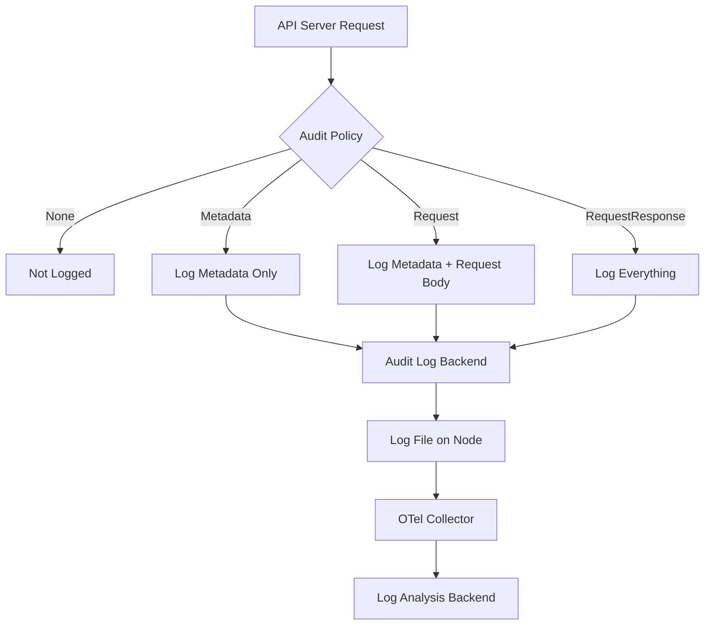

# How to Collect Kubernetes Audit Logs with the OpenTelemetry Collector

Author: [nawazdhandala](https://www.github.com/nawazdhandala)

Tags: OpenTelemetry, Kubernetes, Audit Logs, Security, Observability, Logging

Description: A practical guide to collecting and processing Kubernetes audit logs using the OpenTelemetry Collector for security monitoring and compliance.

---

Kubernetes audit logs record every request made to the API server. They tell you who did what, when they did it, and whether the request was allowed. This information is critical for security monitoring, compliance, and debugging access issues. But by default, these logs sit on the control plane nodes as files, disconnected from the rest of your observability stack.

The OpenTelemetry Collector can ingest Kubernetes audit logs, parse them, enrich them with additional context, and export them to any backend you use for log analysis. This guide covers the full setup from configuring the Kubernetes API server audit policy to building the collector pipeline.

## How Kubernetes Audit Logging Works

The Kubernetes API server generates audit events at various stages of request processing. Each event includes the user, the resource being accessed, the verb (get, create, delete, etc.), and the outcome. You control what gets logged through an audit policy.

There are four audit levels:
- **None** - Do not log the event
- **Metadata** - Log the request metadata (user, resource, verb) but not the request or response body
- **Request** - Log metadata plus the request body
- **RequestResponse** - Log everything including the response body



## Step 1: Configure the Kubernetes Audit Policy

Before the collector can ingest anything, you need to tell the API server what to log. The audit policy is a YAML file that defines rules for different resource types.

This policy captures important security events at the Metadata level while logging sensitive operations like secret access and RBAC changes with full request details.

```yaml
# audit-policy.yaml
# Defines what the API server should audit
# Rules are evaluated in order - first match wins
apiVersion: audit.k8s.io/v1
kind: Policy
rules:
  # Don't log read-only requests to health endpoints
  - level: None
    nonResourceURLs:
      - "/healthz*"
      - "/readyz*"
      - "/livez*"

  # Don't log requests from system components that are very noisy
  - level: None
    users:
      - "system:kube-proxy"
      - "system:kube-scheduler"
      - "system:kube-controller-manager"
    verbs: ["get", "list", "watch"]

  # Log secret access with full request metadata
  - level: Request
    resources:
      - group: ""
        resources: ["secrets"]

  # Log RBAC changes with full request and response
  - level: RequestResponse
    resources:
      - group: "rbac.authorization.k8s.io"
        resources: ["clusterroles", "clusterrolebindings", "roles", "rolebindings"]

  # Log pod exec and attach (potential security concern)
  - level: RequestResponse
    resources:
      - group: ""
        resources: ["pods/exec", "pods/attach", "pods/portforward"]

  # Log all other write operations at Metadata level
  - level: Metadata
    verbs: ["create", "update", "patch", "delete", "deletecollection"]

  # Log everything else at Metadata level
  - level: Metadata
```

## Step 2: Enable Audit Logging on the API Server

For self-managed clusters, you need to pass the audit policy file and log output settings to the API server. If you are using kubeadm, modify the API server manifest.

This configuration tells the API server to write audit logs to a file that the collector will read. The max age and backup settings prevent disk usage from growing unbounded.

```yaml
# Add these flags to the kube-apiserver configuration
# For kubeadm: /etc/kubernetes/manifests/kube-apiserver.yaml
apiVersion: v1
kind: Pod
metadata:
  name: kube-apiserver
  namespace: kube-system
spec:
  containers:
    - name: kube-apiserver
      command:
        - kube-apiserver
        # ... existing flags ...
        # Point to the audit policy file
        - --audit-policy-file=/etc/kubernetes/audit/audit-policy.yaml
        # Write audit events to this log file
        - --audit-log-path=/var/log/kubernetes/audit/audit.log
        # Keep logs for 30 days
        - --audit-log-maxage=30
        # Keep up to 10 backup files
        - --audit-log-maxbackup=10
        # Rotate when file reaches 100MB
        - --audit-log-maxsize=100
      volumeMounts:
        # Mount the audit policy
        - name: audit-policy
          mountPath: /etc/kubernetes/audit
          readOnly: true
        # Mount the log output directory
        - name: audit-logs
          mountPath: /var/log/kubernetes/audit
  volumes:
    - name: audit-policy
      hostPath:
        path: /etc/kubernetes/audit
        type: DirectoryOrCreate
    - name: audit-logs
      hostPath:
        path: /var/log/kubernetes/audit
        type: DirectoryOrCreate
```

For managed Kubernetes services like EKS or GKE, audit logging is handled differently. EKS sends audit logs to CloudWatch, while GKE sends them to Cloud Logging. You would use the appropriate receiver in the collector to pull from those sources.

## Step 3: Set Up the OpenTelemetry Collector

Now comes the main event. The collector reads the audit log file, parses the JSON entries, and forwards them to your backend. We use the `filelog` receiver since audit logs are written as JSON lines to a file.

This collector configuration reads the audit log file, parses the JSON structure, and extracts key fields into log attributes for easy querying.

```yaml
# otel-collector-audit.yaml
# Collector configuration for ingesting Kubernetes audit logs
receivers:
  filelog:
    # Path to the audit log file
    include:
      - /var/log/kubernetes/audit/audit.log
    # Start reading from the beginning on first run
    start_at: beginning
    # Each line is a complete JSON audit event
    operators:
      # Parse the JSON structure of each audit log entry
      - type: json_parser
        id: audit_json
        timestamp:
          parse_from: attributes.stageTimestamp
          layout: '%Y-%m-%dT%H:%M:%S.%fZ'
      # Extract the user who made the request
      - type: move
        from: attributes.user.username
        to: attributes.k8s.audit.user
      # Extract the resource being accessed
      - type: move
        from: attributes.objectRef.resource
        to: attributes.k8s.audit.resource
      # Extract the verb (create, get, delete, etc.)
      - type: move
        from: attributes.verb
        to: attributes.k8s.audit.verb
      # Extract the namespace
      - type: move
        from: attributes.objectRef.namespace
        to: attributes.k8s.audit.namespace
      # Set severity based on response code
      - type: severity_parser
        parse_from: attributes.responseStatus.code
        mapping:
          info: [200, 201, 204]
          warn: [400, 403, 404]
          error: [500, 502, 503]

processors:
  batch:
    timeout: 10s
    send_batch_size: 512

  # Add resource attributes to identify the source
  resource:
    attributes:
      - key: log.source
        value: "kubernetes-audit"
        action: upsert
      - key: k8s.cluster.name
        value: "production"
        action: upsert

  # Filter out noisy events that aren't useful for security
  filter:
    logs:
      exclude:
        match_type: regexp
        record_attributes:
          # Exclude watch events as they generate too much volume
          - key: k8s.audit.verb
            value: "watch"

exporters:
  otlp:
    endpoint: "your-log-backend:4317"
    tls:
      insecure: false

service:
  pipelines:
    logs:
      receivers: [filelog]
      processors: [resource, filter, batch]
      exporters: [otlp]
```

## Step 4: Deploy the Collector on Control Plane Nodes

The collector needs to run on the control plane nodes where the API server writes audit logs. Use a DaemonSet with node affinity to target only those nodes.

This DaemonSet ensures the collector runs on control plane nodes and has access to the audit log directory.

```yaml
# collector-daemonset-audit.yaml
# Deploy the collector only on control plane nodes
apiVersion: apps/v1
kind: DaemonSet
metadata:
  name: otel-audit-collector
  namespace: observability
spec:
  selector:
    matchLabels:
      app: otel-audit-collector
  template:
    metadata:
      labels:
        app: otel-audit-collector
    spec:
      # Only schedule on control plane nodes
      nodeSelector:
        node-role.kubernetes.io/control-plane: ""
      tolerations:
        # Tolerate the control plane taint
        - key: node-role.kubernetes.io/control-plane
          effect: NoSchedule
      containers:
        - name: collector
          image: otel/opentelemetry-collector-contrib:0.96.0
          args: ["--config=/etc/otel/config.yaml"]
          volumeMounts:
            - name: config
              mountPath: /etc/otel
            # Mount the audit log directory from the host
            - name: audit-logs
              mountPath: /var/log/kubernetes/audit
              readOnly: true
          resources:
            requests:
              cpu: 100m
              memory: 128Mi
            limits:
              cpu: 250m
              memory: 256Mi
      volumes:
        - name: config
          configMap:
            name: otel-audit-collector-config
        - name: audit-logs
          hostPath:
            path: /var/log/kubernetes/audit
            type: Directory
```

## Step 5: Create Useful Queries and Alerts

Once audit logs are flowing into your backend, you can build queries for common security scenarios.

Here are some patterns you should monitor:

**Detect unauthorized access attempts.** Look for audit events where the response code is 403 (Forbidden). A spike in 403s from a single user or service account could indicate a compromised credential or misconfigured RBAC.

**Track secret access.** Any time someone reads or modifies a secret, you want to know about it. Filter for events where `k8s.audit.resource` equals "secrets" and the verb is not "watch" or "list".

**Monitor exec into pods.** Pod exec is one of the most dangerous operations in Kubernetes. Someone running exec to get a shell in a production pod should always generate an alert.

**Watch for RBAC changes.** Modifications to ClusterRoles and ClusterRoleBindings can grant broad permissions. These changes should be reviewed.

The following OpenTelemetry Collector configuration adds a routing processor that sends high-priority audit events to a separate pipeline for alerting.

```yaml
# Additional processor for routing critical events
processors:
  # Route security-critical events to a separate exporter
  attributes:
    actions:
      # Tag high-severity events for alerting
      - key: security.priority
        value: "high"
        action: upsert
    include:
      match_type: regexp
      record_attributes:
        - key: k8s.audit.resource
          value: "secrets|clusterroles|clusterrolebindings"
        - key: k8s.audit.verb
          value: "create|update|patch|delete"
```

## Handling High Volume

Audit logs can produce significant volume, especially in busy clusters. A few strategies help manage this.

First, tune your audit policy. Be aggressive about setting the level to None for events you truly do not need. System components generate a lot of read traffic that is rarely useful for security monitoring.

Second, use the filter processor in the collector to drop events before they reach your backend. Watch events in particular can account for a large portion of audit log volume.

Third, consider sampling. If you are running a very large cluster, you might not need every single metadata-level event. The probabilistic sampler processor can reduce volume while still giving you statistical coverage.

## Wrapping Up

Kubernetes audit logs are a goldmine for security and compliance monitoring. By piping them through the OpenTelemetry Collector, you get the flexibility to parse, enrich, filter, and route these logs to any backend. The key steps are configuring a sensible audit policy on the API server, deploying the collector on control plane nodes with access to the log files, and building collector pipelines that extract the fields you need for security analysis. Once this pipeline is running, you have a solid foundation for detecting unauthorized access, tracking sensitive operations, and meeting audit compliance requirements.
