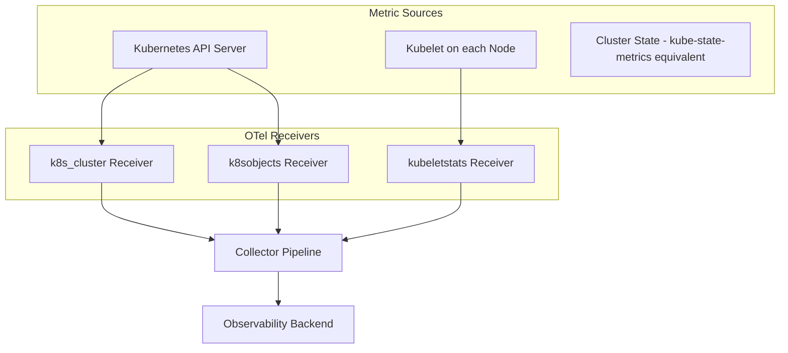
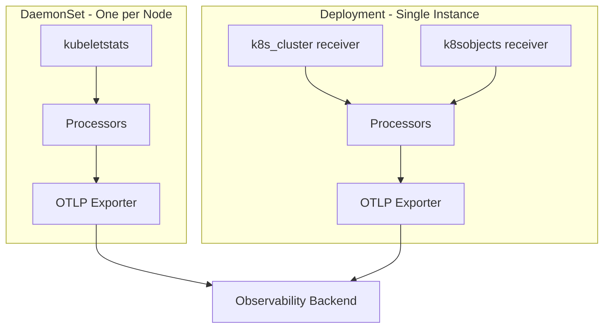

# How to Collect Kubernetes Cluster Metrics (Nodes, Pods, Containers) with OpenTelemetry

Author: [nawazdhandala](https://www.github.com/nawazdhandala)

Tags: OpenTelemetry, Kubernetes, Metrics, Monitoring, Cluster, Nodes, Pods, Containers

Description: A hands-on guide to collecting comprehensive Kubernetes cluster metrics for nodes, pods, and containers using the OpenTelemetry Collector's Kubernetes receivers.

---

Kubernetes gives you a lot of moving parts to keep track of. Nodes can run out of resources. Pods can get stuck in CrashLoopBackOff. Containers can hit their memory limits and get OOM-killed. Without proper metrics collection, you're flying blind.

The OpenTelemetry Collector has several receivers specifically designed for Kubernetes environments. Together, they can pull metrics from the kubelet, the Kubernetes API server, and the cluster's internal state. This gives you full visibility into node health, pod lifecycle, container resource usage, and much more.

In this guide, we'll configure the collector to gather metrics at every level of the Kubernetes hierarchy: cluster, node, pod, and container.

## The Kubernetes Metrics Landscape

Kubernetes metrics come from several different sources, and OpenTelemetry has a receiver for each one.



Here's what each receiver collects:

- **k8s_cluster receiver**: Cluster-level and object-level metrics from the Kubernetes API. Pod phases, deployment replica counts, node conditions, resource requests and limits. Think of it as a replacement for kube-state-metrics.
- **kubeletstats receiver**: Container, pod, and node resource usage metrics from the kubelet's summary API. CPU usage, memory usage, filesystem usage, network stats.
- **k8sobjects receiver**: Raw Kubernetes events and objects. Useful for tracking events like pod scheduling, image pulls, and OOM kills.

## Prerequisites

You need:

- A Kubernetes cluster (1.21+)
- kubectl access with cluster-admin or equivalent permissions
- Helm 3 installed
- The OpenTelemetry Collector Contrib distribution

## RBAC Setup

All three receivers need permission to query the Kubernetes API. Here's the ServiceAccount, ClusterRole, and ClusterRoleBinding the collector needs.

```yaml
# rbac.yaml
# Grants the collector permission to read Kubernetes resources for metrics collection
apiVersion: v1
kind: ServiceAccount
metadata:
  name: otel-collector
  namespace: observability
---
apiVersion: rbac.authorization.k8s.io/v1
kind: ClusterRole
metadata:
  name: otel-collector
rules:
  # Needed by k8s_cluster receiver for cluster metrics
  - apiGroups: [""]
    resources:
      - nodes
      - pods
      - namespaces
      - services
      - endpoints
      - replicationcontrollers
      - resourcequotas
    verbs: ["get", "list", "watch"]
  - apiGroups: ["apps"]
    resources:
      - deployments
      - replicasets
      - statefulsets
      - daemonsets
    verbs: ["get", "list", "watch"]
  - apiGroups: ["batch"]
    resources:
      - jobs
      - cronjobs
    verbs: ["get", "list", "watch"]
  - apiGroups: ["autoscaling"]
    resources:
      - horizontalpodautoscalers
    verbs: ["get", "list", "watch"]
  # Needed by kubeletstats receiver for node/pod/container metrics
  - apiGroups: [""]
    resources:
      - nodes/stats
      - nodes/proxy
    verbs: ["get"]
  # Needed by k8sobjects receiver for events
  - apiGroups: [""]
    resources:
      - events
    verbs: ["get", "list", "watch"]
---
apiVersion: rbac.authorization.k8s.io/v1
kind: ClusterRoleBinding
metadata:
  name: otel-collector
roleRef:
  apiGroup: rbac.authorization.k8s.io
  kind: ClusterRole
  name: otel-collector
subjects:
  - kind: ServiceAccount
    name: otel-collector
    namespace: observability
```

Apply this before deploying the collector:

```bash
# Create namespace and apply RBAC resources
kubectl create namespace observability
kubectl apply -f rbac.yaml
```

## Collecting Node and Container Metrics with kubeletstats

The kubeletstats receiver connects to the kubelet on each node and pulls resource usage data. This is the receiver that gives you real-time CPU, memory, filesystem, and network stats for containers and pods.

Because it queries each node's kubelet, this receiver works best in a DaemonSet so each collector instance talks to its local kubelet.

```yaml
# kubeletstats-config.yaml
# Collects node, pod, and container metrics from the local kubelet
receivers:
  kubeletstats:
    # Use the ServiceAccount token to authenticate with the kubelet
    auth_type: serviceAccount
    # Connect to the kubelet on the local node
    endpoint: "https://${env:K8S_NODE_NAME}:10250"
    # How often to scrape metrics
    collection_interval: 30s
    # Skip TLS verification for the kubelet's self-signed cert
    insecure_skip_verify: true
    # Which metric groups to collect
    metric_groups:
      - node        # Node-level CPU, memory, filesystem, network
      - pod         # Pod-level aggregated metrics
      - container   # Per-container metrics
    # Extra metadata to add to metrics for better correlation
    extra_metadata_labels:
      - container.id
      - k8s.volume.type
    # Optional: collect volume metrics
    metrics:
      k8s.pod.filesystem.available:
        enabled: true
      k8s.pod.filesystem.capacity:
        enabled: true
      k8s.pod.filesystem.usage:
        enabled: true

processors:
  batch:
    send_batch_size: 1024
    timeout: 5s

exporters:
  otlp:
    endpoint: "your-backend.example.com:4317"
    tls:
      insecure: false

service:
  pipelines:
    metrics:
      receivers: [kubeletstats]
      processors: [batch]
      exporters: [otlp]
```

Here are some of the key metrics you'll get from kubeletstats:

**Node metrics:**
- `k8s.node.cpu.utilization` - CPU usage percentage
- `k8s.node.memory.available` - Available memory in bytes
- `k8s.node.memory.usage` - Memory used in bytes
- `k8s.node.filesystem.available` - Disk space available
- `k8s.node.network.io` - Network bytes sent/received

**Pod metrics:**
- `k8s.pod.cpu.utilization` - Pod CPU usage
- `k8s.pod.memory.usage` - Pod memory usage
- `k8s.pod.network.io` - Pod network traffic

**Container metrics:**
- `k8s.container.cpu.utilization` - Container CPU usage
- `k8s.container.memory.usage` - Container memory usage
- `k8s.container.cpu_limit_utilization` - CPU usage as a percentage of the limit
- `k8s.container.memory_limit_utilization` - Memory usage as a percentage of the limit

The limit utilization metrics are particularly valuable. They tell you how close each container is to hitting its resource limits, which helps you right-size your requests and limits.

## Collecting Cluster State Metrics with k8s_cluster

The k8s_cluster receiver watches the Kubernetes API for object state changes. It gives you metrics about the desired state of your cluster: how many replicas a deployment wants vs. how many are available, which pods are pending, which nodes have conditions like MemoryPressure.

This receiver should run as a single instance (Deployment with 1 replica) because it watches the whole cluster.

```yaml
# k8s-cluster-config.yaml
# Collects cluster-wide state metrics from the Kubernetes API
receivers:
  k8s_cluster:
    auth_type: serviceAccount
    # How often to sync state from the API server
    collection_interval: 30s
    # Which resource types to watch
    node_conditions_to_report:
      - Ready
      - MemoryPressure
      - DiskPressure
      - PIDPressure
    # Allocatable resource types to track
    allocatable_types_to_report:
      - cpu
      - memory
      - storage
    # Distribution of resource metrics
    metrics:
      k8s.pod.status_reason:
        enabled: true
      k8s.container.ready:
        enabled: true
      k8s.container.restarts:
        enabled: true

processors:
  batch:
    send_batch_size: 512
    timeout: 10s
  # Add cluster name as a resource attribute
  resource:
    attributes:
      - key: k8s.cluster.name
        value: "production-us-east-1"
        action: upsert

exporters:
  otlp:
    endpoint: "your-backend.example.com:4317"
    tls:
      insecure: false

service:
  pipelines:
    metrics:
      receivers: [k8s_cluster]
      processors: [resource, batch]
      exporters: [otlp]
```

Key metrics from the k8s_cluster receiver include:

- `k8s.deployment.desired` / `k8s.deployment.available` - Replica counts
- `k8s.pod.phase` - Pod phase (Pending, Running, Succeeded, Failed)
- `k8s.container.restarts` - Container restart count (great for detecting crash loops)
- `k8s.node.condition` - Node conditions (Ready, MemoryPressure, etc.)
- `k8s.namespace.phase` - Namespace status
- `k8s.replicaset.desired` / `k8s.replicaset.available` - ReplicaSet counts
- `k8s.hpa.current_replicas` / `k8s.hpa.desired_replicas` - HPA state

## Capturing Kubernetes Events

The k8sobjects receiver watches for Kubernetes events. These aren't traditional metrics - they're structured event data that tells you when things happen in the cluster, like pod scheduling, image pulls, liveness probe failures, and OOM kills.

```yaml
# k8s-events-config.yaml
# Captures Kubernetes events as logs for debugging and alerting
receivers:
  k8sobjects:
    auth_type: serviceAccount
    objects:
      - name: events
        mode: watch
        # Optionally filter to specific namespaces
        # namespaces: [default, production]

processors:
  batch:
    send_batch_size: 256
    timeout: 10s
  # Add useful attributes from the event
  attributes:
    actions:
      - key: event.domain
        value: "k8s"
        action: upsert

exporters:
  otlp:
    endpoint: "your-backend.example.com:4317"
    tls:
      insecure: false

service:
  pipelines:
    logs:
      receivers: [k8sobjects]
      processors: [attributes, batch]
      exporters: [otlp]
```

Events are incredibly useful for debugging. When a deployment rolls out, you'll see the events for pod scheduling, image pulling, container starting, and readiness probe passing. When something goes wrong, you'll see the failure events too.

## Putting It All Together

In practice, you'll want a DaemonSet for kubeletstats (since it needs to query each node's kubelet) and a Deployment for the cluster-level receivers. Here's how the full architecture looks:



You can combine the cluster receiver and events receiver into one Deployment since neither needs node-local access. The kubeletstats receiver should stay in the DaemonSet.

## Enriching Metrics with Kubernetes Metadata

Raw metrics are more useful when they carry context. The `k8sattributes` processor enriches telemetry data with Kubernetes metadata by querying the API server.

```yaml
# Add this processor to enrich metrics with pod and node metadata
processors:
  k8sattributes:
    auth_type: "serviceAccount"
    passthrough: false
    extract:
      metadata:
        - k8s.pod.name
        - k8s.pod.uid
        - k8s.namespace.name
        - k8s.node.name
        - k8s.deployment.name
        - k8s.statefulset.name
        - k8s.daemonset.name
        - k8s.job.name
      labels:
        # Extract specific pod labels as attributes
        - tag_name: app
          key: app
          from: pod
        - tag_name: team
          key: team
          from: pod
      annotations:
        - tag_name: version
          key: app.kubernetes.io/version
          from: pod
    pod_association:
      - sources:
          - from: resource_attribute
            name: k8s.pod.ip
      - sources:
          - from: connection
```

This processor adds attributes like `k8s.deployment.name`, `k8s.namespace.name`, and custom labels to every metric data point. When you're looking at container CPU usage in your dashboard, you can group by deployment or filter by namespace without any manual mapping.

## Useful Dashboards and Alerts

With all these metrics flowing in, here are some practical things to monitor:

**Node health**: Alert when `k8s.node.condition` shows `Ready=false` for more than 5 minutes. Also watch `k8s.node.memory.available` dropping below 10% of total memory.

**Pod stability**: Alert when `k8s.container.restarts` increases by more than 3 in a 10-minute window. This catches crash loops early.

**Resource saturation**: Use `k8s.container.cpu_limit_utilization` and `k8s.container.memory_limit_utilization` to identify containers that are consistently running near their limits. These are candidates for resource limit increases.

**Deployment health**: Compare `k8s.deployment.desired` with `k8s.deployment.available`. If they don't match for more than a few minutes, something is wrong with the rollout.

**Pending pods**: Watch for `k8s.pod.phase` staying at Pending. This usually means the cluster doesn't have enough resources to schedule the pod.

## Wrapping Up

Collecting Kubernetes metrics with OpenTelemetry is a matter of combining the right receivers for the right levels of the stack. The kubeletstats receiver gives you the live resource usage data you need for capacity planning and troubleshooting. The k8s_cluster receiver gives you the state of your workloads. And the k8sobjects receiver captures the events that explain why things changed.

Together, they give you the same visibility you'd get from a combination of Prometheus, kube-state-metrics, and event exporters, all through a single OpenTelemetry Collector pipeline that you can route to any backend.
