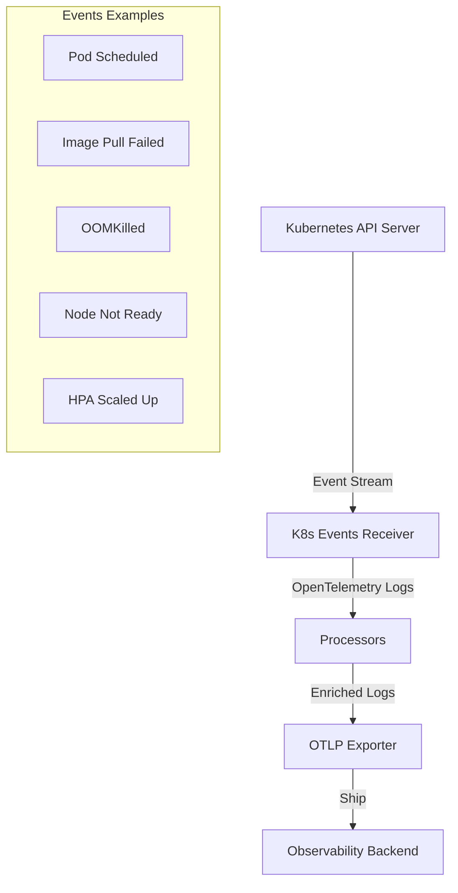
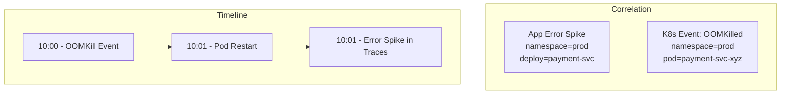

# How to Collect Kubernetes Events as OpenTelemetry Logs

Author: [nawazdhandala](https://www.github.com/nawazdhandala)

Tags: OpenTelemetry, Kubernetes, Events, Logs, Collector, K8s Events Receiver

Description: Learn how to collect Kubernetes cluster events and ship them as structured OpenTelemetry logs for alerting, debugging, and audit trails.

---

Kubernetes events are one of the most underused sources of observability data. Every time a pod gets scheduled, an image pull fails, a node runs out of memory, or a horizontal pod autoscaler scales up, Kubernetes creates an event. These events tell you what is happening in your cluster at the orchestration level, stuff that no application-level instrumentation can capture.

The problem is that Kubernetes events are ephemeral. By default, they stick around for only one hour before the API server garbage-collects them. If you were not watching at the right time, the evidence is gone. Collecting these events as OpenTelemetry logs gives you a permanent, searchable, and correlated record of cluster activity.

## Why Kubernetes Events Matter

Events cover a wide range of cluster activities. Here are some of the most useful ones:

- **Pod scheduling failures**: "FailedScheduling" events tell you when and why pods cannot be placed on nodes.
- **Image pull errors**: "Failed" events with "ErrImagePull" or "ImagePullBackOff" reasons.
- **OOMKilled containers**: Events fire when a container exceeds its memory limit.
- **Volume mount failures**: "FailedMount" events indicate persistent volume problems.
- **Node conditions**: "NodeNotReady", "NodeHasDiskPressure", and similar events.
- **HPA scaling decisions**: Events show when autoscalers change replica counts and why.
- **Liveness/readiness probe failures**: "Unhealthy" events with probe failure details.



## The Kubernetes Events Receiver

The OpenTelemetry Collector Contrib distribution includes the `k8seventsreceiver`. This receiver watches the Kubernetes API for events and converts them into OpenTelemetry log records. Each event becomes a structured log entry with all the original event fields preserved as attributes.

Here is the basic configuration. The receiver connects to the Kubernetes API using the collector's service account.

This minimal configuration starts collecting all Kubernetes events from every namespace and ships them as logs.

```yaml
# collector-config.yaml
receivers:
  # Watch for Kubernetes events across all namespaces
  k8s_events:
    auth_type: serviceAccount
    # Collect events from all namespaces
    namespaces: []

processors:
  batch:
    send_batch_size: 256
    timeout: 5s

exporters:
  otlp:
    endpoint: your-backend.example.com:4317

service:
  pipelines:
    logs:
      receivers: [k8s_events]
      processors: [batch]
      exporters: [otlp]
```

Setting `namespaces: []` (an empty list) watches all namespaces. To limit collection to specific namespaces, list them explicitly.

This configuration limits event collection to only the production and staging namespaces.

```yaml
receivers:
  k8s_events:
    auth_type: serviceAccount
    # Only watch these namespaces
    namespaces:
      - production
      - staging
      - kube-system
```

## RBAC Requirements

The receiver needs permission to list and watch events in the Kubernetes API. Here are the required RBAC resources.

These RBAC resources grant the minimum permissions the K8s Events Receiver needs to operate.

```yaml
# rbac.yaml
apiVersion: v1
kind: ServiceAccount
metadata:
  name: otel-collector
  namespace: observability
---
apiVersion: rbac.authorization.k8s.io/v1
kind: ClusterRole
metadata:
  name: otel-collector-events
rules:
  # Permission to watch events
  - apiGroups: [""]
    resources: ["events"]
    verbs: ["get", "list", "watch"]
  # Also need to watch namespaces for namespace-scoped watching
  - apiGroups: [""]
    resources: ["namespaces"]
    verbs: ["get", "list", "watch"]
---
apiVersion: rbac.authorization.k8s.io/v1
kind: ClusterRoleBinding
metadata:
  name: otel-collector-events
subjects:
  - kind: ServiceAccount
    name: otel-collector
    namespace: observability
roleRef:
  kind: ClusterRole
  name: otel-collector-events
  apiGroup: rbac.authorization.k8s.io
```

Use a `ClusterRole` and `ClusterRoleBinding` because events exist in all namespaces. A namespace-scoped `Role` would only let you see events in a single namespace.

## What the Event Logs Look Like

When a Kubernetes event gets converted to an OpenTelemetry log record, the receiver maps event fields to log attributes. Here is an example of what you get when a pod fails to pull an image.

```json
{
  "timestamp": "2026-02-06T10:15:30Z",
  "severityText": "WARNING",
  "body": "Failed to pull image \"registry.example.com/myapp:v2.0.0\": rpc error: code = NotFound desc = failed to pull and unpack image",
  "attributes": {
    "k8s.event.reason": "Failed",
    "k8s.event.action": "Pulling",
    "k8s.event.count": 3,
    "k8s.event.uid": "abc123-def456",
    "k8s.event.name": "myapp-pod-7f8b9.pulling-image",
    "k8s.object.kind": "Pod",
    "k8s.object.name": "myapp-pod-7f8b9d6c4-x2k9j",
    "k8s.object.uid": "pod-uid-789",
    "k8s.object.fieldpath": "spec.containers{myapp}",
    "k8s.namespace.name": "production"
  },
  "resource": {
    "k8s.cluster.name": "production-us-east-1"
  }
}
```

The severity level maps from the Kubernetes event type: "Normal" events become INFO, and "Warning" events become WARNING.

## Enriching Events with Additional Context

Raw events are useful, but you can make them even more valuable by adding cluster context and transforming attributes.

This configuration adds cluster identification and uses the resource processor to attach environment metadata.

```yaml
receivers:
  k8s_events:
    auth_type: serviceAccount
    namespaces: []

processors:
  # Add cluster context
  resource:
    attributes:
      - key: k8s.cluster.name
        value: "production-us-east-1"
        action: upsert
      - key: deployment.environment
        value: "production"
        action: upsert

  # Use transform processor to set severity based on event type
  transform:
    log_statements:
      - context: log
        statements:
          # Mark certain event reasons as errors for alerting
          - set(severity_number, 17) where attributes["k8s.event.reason"] == "OOMKilling"
          - set(severity_text, "ERROR") where attributes["k8s.event.reason"] == "OOMKilling"
          - set(severity_number, 17) where attributes["k8s.event.reason"] == "FailedScheduling"
          - set(severity_text, "ERROR") where attributes["k8s.event.reason"] == "FailedScheduling"
          - set(severity_number, 17) where attributes["k8s.event.reason"] == "NodeNotReady"
          - set(severity_text, "ERROR") where attributes["k8s.event.reason"] == "NodeNotReady"

  batch:
    send_batch_size: 256
    timeout: 5s

exporters:
  otlp:
    endpoint: your-backend.example.com:4317

service:
  pipelines:
    logs:
      receivers: [k8s_events]
      processors: [resource, transform, batch]
      exporters: [otlp]
```

Elevating certain event reasons to ERROR severity is a practical trick. It lets you set up alerts in your backend that fire on OOMKill events or scheduling failures without writing complex queries.

## Filtering Noisy Events

Not every event is worth storing. In busy clusters, normal scheduling events for healthy pods generate a lot of volume with little value. Use the filter processor to drop events you do not care about.

This configuration drops routine events while keeping everything that indicates a problem or an interesting state change.

```yaml
processors:
  # Drop noisy events that add little value
  filter:
    error_mode: ignore
    logs:
      log_record:
        # Drop normal "Scheduled" events (too noisy in large clusters)
        - 'attributes["k8s.event.reason"] == "Scheduled" and IsMatch(body, "Successfully assigned.*")'
        # Drop normal "Pulled" events
        - 'attributes["k8s.event.reason"] == "Pulled"'
        # Drop normal "Created" container events
        - 'attributes["k8s.event.reason"] == "Created" and attributes["k8s.object.kind"] == "Pod"'
        # Drop normal "Started" container events
        - 'attributes["k8s.event.reason"] == "Started" and attributes["k8s.object.kind"] == "Pod"'
```

A good rule of thumb: keep Warning events and any Normal events related to scaling, restarts, or configuration changes. Drop Normal events for routine pod lifecycle operations that happen thousands of times per day in a healthy cluster.

## Deploying as a Singleton

Unlike most collector components that run as a DaemonSet, the events receiver should run as a single replica Deployment. Events are cluster-wide, not node-specific. Running multiple replicas would duplicate every event.

This Deployment manifest runs a single collector instance dedicated to event collection.

```yaml
# events-collector-deployment.yaml
apiVersion: apps/v1
kind: Deployment
metadata:
  name: otel-events-collector
  namespace: observability
spec:
  # Single replica to avoid duplicate events
  replicas: 1
  strategy:
    type: Recreate
  selector:
    matchLabels:
      app: otel-events-collector
  template:
    metadata:
      labels:
        app: otel-events-collector
    spec:
      serviceAccountName: otel-collector
      containers:
        - name: collector
          image: otel/opentelemetry-collector-contrib:0.96.0
          args: ["--config=/etc/otel/config.yaml"]
          resources:
            requests:
              cpu: 50m
              memory: 64Mi
            limits:
              cpu: 200m
              memory: 256Mi
          volumeMounts:
            - name: config
              mountPath: /etc/otel
      volumes:
        - name: config
          configMap:
            name: otel-events-config
```

The `strategy: Recreate` ensures that during updates, the old pod is terminated before the new one starts. This prevents a brief period where two instances might watch events simultaneously, causing duplicates.

Resource requirements are minimal. The receiver maintains a watch connection to the API server and processes events as they arrive. Even in large clusters, the event volume is manageable for a small pod.

## Combining Events with Other Telemetry

The real value of Kubernetes events comes when you correlate them with your application telemetry. When a service starts throwing errors, you can check if there was a recent OOMKill, a failed deployment, or a node becoming NotReady around the same time.

To make correlation easier, ensure your events carry the same resource attributes as your application telemetry. The namespace and pod name are the natural join keys.



In your observability backend, you can now query events alongside traces and metrics. "Show me all Kubernetes events in the production namespace in the last hour where the event reason was OOMKilling" gives you an instant view of memory pressure across your cluster.

## Alerting on Critical Events

With events flowing as structured logs, you can set up alerts for conditions that need immediate attention.

Common alert rules:

- **OOMKill events**: Any OOMKilling event in production namespaces.
- **Repeated CrashLoopBackOff**: BackOff events with a high count indicate a pod that keeps crashing.
- **FailedScheduling**: Pods cannot be placed, usually means resource exhaustion.
- **Node conditions**: NodeNotReady or NodeHasDiskPressure events.
- **Volume failures**: FailedMount or FailedAttachVolume events.

Here is an example using a log-based alert query pattern:

```
# Alert query pseudo-code for your observability backend
severity == "ERROR"
  AND attributes["k8s.event.reason"] IN ("OOMKilling", "FailedScheduling", "NodeNotReady")
  AND attributes["k8s.namespace.name"] == "production"
```

## Handling Event Replay on Startup

When the collector starts (or restarts), the K8s Events Receiver lists existing events before starting its watch stream. This means you may see a burst of events that already occurred. In most observability backends, this is harmless since events are idempotent based on their UID.

If duplicate events are a concern, you can use the receiver's configuration to limit the initial event window or rely on your backend's deduplication.

## Complete Production Configuration

Here is a full configuration that puts together everything covered in this guide.

```yaml
# Full production configuration for K8s events collection
receivers:
  k8s_events:
    auth_type: serviceAccount
    namespaces: []

processors:
  memory_limiter:
    check_interval: 1s
    limit_mib: 128
    spike_limit_mib: 32

  resource:
    attributes:
      - key: k8s.cluster.name
        value: "production-us-east-1"
        action: upsert

  transform:
    log_statements:
      - context: log
        statements:
          # Promote critical events to ERROR severity
          - set(severity_number, 17) where attributes["k8s.event.reason"] == "OOMKilling"
          - set(severity_text, "ERROR") where attributes["k8s.event.reason"] == "OOMKilling"
          - set(severity_number, 17) where attributes["k8s.event.reason"] == "FailedScheduling"
          - set(severity_text, "ERROR") where attributes["k8s.event.reason"] == "FailedScheduling"

  filter:
    error_mode: ignore
    logs:
      log_record:
        # Drop routine lifecycle events
        - 'attributes["k8s.event.reason"] == "Scheduled"'
        - 'attributes["k8s.event.reason"] == "Pulled"'
        - 'attributes["k8s.event.reason"] == "Created" and attributes["k8s.object.kind"] == "Pod"'
        - 'attributes["k8s.event.reason"] == "Started" and attributes["k8s.object.kind"] == "Pod"'

  batch:
    send_batch_size: 256
    timeout: 5s

exporters:
  otlp:
    endpoint: your-backend.example.com:4317
    sending_queue:
      enabled: true
      queue_size: 1000
    retry_on_failure:
      enabled: true

service:
  pipelines:
    logs:
      receivers: [k8s_events]
      processors: [memory_limiter, resource, transform, filter, batch]
      exporters: [otlp]
```

## Conclusion

Kubernetes events are free observability data. The cluster is already generating them. All you need to do is collect them before they disappear. The K8s Events Receiver in the OpenTelemetry Collector makes this trivial: deploy a single collector instance with the right RBAC, point it at your backend, and you get a permanent record of everything your cluster is doing at the orchestration level.

Filter out the noise, elevate critical events to error severity, and correlate them with your application telemetry. When something goes wrong, the Kubernetes events timeline is often the fastest way to understand what changed and why.
