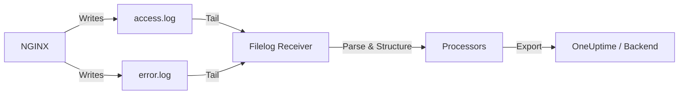

# How to Collect NGINX Access and Error Logs with the OpenTelemetry Collector

Author: [nawazdhandala](https://www.github.com/nawazdhandala)

Tags: OpenTelemetry, Collector, NGINX, Logs, Web Server, Observability, Infrastructure

Description: Learn how to collect and parse NGINX access and error logs using the OpenTelemetry Collector filelog receiver with structured attribute extraction.

---

NGINX is the web server and reverse proxy behind a huge portion of the internet. Whether you use it as a static file server, a reverse proxy for your application, or an API gateway, the access and error logs it produces are essential for understanding traffic patterns, debugging issues, and detecting anomalies. Traditionally these logs get shipped with tools like Filebeat or Fluentd. But if you are already running the OpenTelemetry Collector for metrics and traces, you can handle NGINX logs in the same pipeline and avoid running yet another agent.

This post covers how to configure the OpenTelemetry Collector to tail NGINX access and error logs, parse them into structured attributes, and export them to your observability backend.

## NGINX Log Formats

Before configuring the Collector, it helps to know what NGINX logs look like and where they live.

The default NGINX access log uses the "combined" format, which looks like this:

```
192.168.1.100 - frank [10/Feb/2026:13:55:36 +0000] "GET /api/users HTTP/1.1" 200 4523 "https://example.com/dashboard" "Mozilla/5.0 (X11; Linux x86_64)"
```

The error log has a different format:

```
2026/02/10 13:55:36 [error] 12345#0: *67890 open() "/var/www/html/missing.css" failed (2: No such file or directory), client: 192.168.1.100, server: example.com, request: "GET /missing.css HTTP/1.1"
```

The default log locations on most Linux distributions are `/var/log/nginx/access.log` and `/var/log/nginx/error.log`. If you have custom `access_log` or `error_log` directives in your NGINX config, adjust the paths accordingly.



## Basic Configuration

Here is a minimal configuration that tails both NGINX log files and ships them to a backend.

```yaml
# Receivers section
receivers:
  # Tail the NGINX access log
  filelog/nginx_access:
    include:
      - /var/log/nginx/access.log
    # Start from the end so we only collect new entries
    start_at: end
    # Add a source attribute to identify this log stream
    attributes:
      log.source: "nginx-access"

  # Tail the NGINX error log
  filelog/nginx_error:
    include:
      - /var/log/nginx/error.log
    start_at: end
    attributes:
      log.source: "nginx-error"

# Processors
processors:
  batch:
    timeout: 10s
    send_batch_size: 500

# Exporters
exporters:
  otlphttp:
    endpoint: https://oneuptime.com/otlp
    headers:
      x-oneuptime-token: ${ONEUPTIME_TOKEN}

# Pipelines
service:
  pipelines:
    logs:
      receivers: [filelog/nginx_access, filelog/nginx_error]
      processors: [batch]
      exporters: [otlphttp]
```

This basic setup ships raw log lines to your backend. It works, but you lose the ability to filter and query by individual fields like status code, client IP, or request path. For that, we need to parse the logs.

## Parsing Access Logs with Regex

The filelog receiver supports operators that process log lines as they are read. A regex parser can extract structured fields from the combined log format.

```yaml
receivers:
  filelog/nginx_access:
    include:
      - /var/log/nginx/access.log
    start_at: end

    # Operators process log lines in order
    operators:
      # Parse the combined log format with a regex
      - type: regex_parser
        # Match the standard NGINX combined log format
        regex: '^(?P<remote_addr>\S+) - (?P<remote_user>\S+) \[(?P<time_local>[^\]]+)\] "(?P<method>\S+) (?P<path>\S+) (?P<protocol>\S+)" (?P<status>\d+) (?P<body_bytes_sent>\d+) "(?P<http_referer>[^"]*)" "(?P<http_user_agent>[^"]*)"'
        # Parse the timestamp from the log line
        timestamp:
          parse_from: attributes.time_local
          layout: "%d/%b/%Y:%H:%M:%S %z"

      # Convert status code to integer for filtering
      - type: add
        field: attributes.http.status_code
        value: EXPR(attributes.status)

      # Set severity based on status code range
      - type: severity_parser
        parse_from: attributes.status
        mapping:
          info: "2\\d{2}"
          info2: "3\\d{2}"
          warn: "4\\d{2}"
          error: "5\\d{2}"

processors:
  # Add service context
  resource/nginx:
    attributes:
      - key: service.name
        value: "nginx"
        action: upsert
      - key: deployment.environment
        value: "production"
        action: upsert

  batch:
    timeout: 10s
    send_batch_size: 500

exporters:
  otlphttp:
    endpoint: https://oneuptime.com/otlp
    headers:
      x-oneuptime-token: ${ONEUPTIME_TOKEN}

service:
  pipelines:
    logs:
      receivers: [filelog/nginx_access]
      processors: [resource/nginx, batch]
      exporters: [otlphttp]
```

The regex parser breaks each access log line into named attributes: `remote_addr`, `method`, `path`, `status`, `body_bytes_sent`, `http_referer`, and `http_user_agent`. The timestamp parser converts the NGINX time format into the log record timestamp. The severity parser maps HTTP status codes to log severity levels so that 5xx errors show up as error-level entries.

## Parsing Error Logs

NGINX error logs have a completely different format than access logs. They need their own parser.

```yaml
receivers:
  filelog/nginx_error:
    include:
      - /var/log/nginx/error.log
    start_at: end

    operators:
      # Parse NGINX error log format
      - type: regex_parser
        regex: '^(?P<time>\d{4}/\d{2}/\d{2} \d{2}:\d{2}:\d{2}) \[(?P<level>\w+)\] (?P<pid>\d+)#(?P<tid>\d+): (?:\*(?P<connection_id>\d+) )?(?P<message>.*?)(?:, client: (?P<client>[^,]+))?(?:, server: (?P<server>[^,]+))?(?:, request: "(?P<request>[^"]*)")?(?:, upstream: "(?P<upstream>[^"]*)")?(?:, host: "(?P<host>[^"]*)")?$'
        timestamp:
          parse_from: attributes.time
          layout: "%Y/%m/%d %H:%M:%S"

      # Map NGINX error levels to OTel severity
      - type: severity_parser
        parse_from: attributes.level
        mapping:
          debug: "debug"
          info: "info"
          warn: "warn"
          error: "error"
          error2: "crit"
          fatal: "alert"
          fatal2: "emerg"

processors:
  resource/nginx:
    attributes:
      - key: service.name
        value: "nginx"
        action: upsert

  batch:
    timeout: 10s

exporters:
  otlphttp:
    endpoint: https://oneuptime.com/otlp
    headers:
      x-oneuptime-token: ${ONEUPTIME_TOKEN}

service:
  pipelines:
    logs:
      receivers: [filelog/nginx_error]
      processors: [resource/nginx, batch]
      exporters: [otlphttp]
```

The error log regex extracts the NGINX error level, process ID, the error message, and optional context fields like client IP, server name, and upstream address. The severity parser maps NGINX levels (debug, info, warn, error, crit, alert, emerg) to OpenTelemetry severity levels.

## Using a Custom NGINX Log Format

If you control the NGINX configuration, you can switch to a JSON log format that eliminates the need for regex parsing entirely.

```nginx
# In nginx.conf, define a JSON log format
log_format json_combined escape=json
    '{'
    '"time_local":"$time_local",'
    '"remote_addr":"$remote_addr",'
    '"request_method":"$request_method",'
    '"request_uri":"$request_uri",'
    '"status":$status,'
    '"body_bytes_sent":$body_bytes_sent,'
    '"http_referer":"$http_referer",'
    '"http_user_agent":"$http_user_agent",'
    '"request_time":$request_time,'
    '"upstream_response_time":"$upstream_response_time",'
    '"upstream_addr":"$upstream_addr"'
    '}';

# Use it in your server block
access_log /var/log/nginx/access.log json_combined;
```

Then the Collector configuration becomes much simpler.

```yaml
receivers:
  filelog/nginx_access:
    include:
      - /var/log/nginx/access.log
    start_at: end

    operators:
      # Parse JSON directly instead of regex
      - type: json_parser
        timestamp:
          parse_from: attributes.time_local
          layout: "%d/%b/%Y:%H:%M:%S %z"

      - type: severity_parser
        parse_from: attributes.status
        mapping:
          info: "2\\d{2}"
          info2: "3\\d{2}"
          warn: "4\\d{2}"
          error: "5\\d{2}"

processors:
  batch:
    timeout: 10s

exporters:
  otlphttp:
    endpoint: https://oneuptime.com/otlp
    headers:
      x-oneuptime-token: ${ONEUPTIME_TOKEN}

service:
  pipelines:
    logs:
      receivers: [filelog/nginx_access]
      processors: [batch]
      exporters: [otlphttp]
```

JSON parsing is faster, more reliable, and easier to maintain than regex. It also makes it easy to add new fields to your logs without updating the parser. If you have the ability to change the NGINX log format, this is the recommended approach.

## Troubleshooting

If logs are not appearing in your backend, work through these checks.

**Permission denied.** The Collector process needs read access to the NGINX log files. If NGINX runs as `www-data` and the Collector runs as `otel`, add the Collector user to the appropriate group or adjust file permissions.

```bash
# Check log file permissions
ls -la /var/log/nginx/

# Add the otel user to the adm group (common for log access)
sudo usermod -aG adm otel
```

**Regex not matching.** If your NGINX log format differs from the standard combined format, the regex will fail silently. Test your regex against an actual log line using a tool like regex101.com. Enable debug logging to see parser errors.

**Logs appearing without parsed attributes.** This means the regex matched but some groups are empty. Check for optional fields in your log format that might not always be present.

**High CPU usage.** If NGINX produces very high log volume, the regex parser can consume significant CPU. Switch to the JSON log format to reduce parsing overhead, or increase the batch size to reduce export frequency.

## Summary

NGINX access and error logs are a goldmine of operational data. The OpenTelemetry Collector filelog receiver lets you collect, parse, and structure these logs without running a dedicated log shipper. Use regex parsing for the default combined format, or switch to JSON logs for better performance and simpler configuration. Filter out noise, add resource attributes for context, and use the file storage extension to survive restarts gracefully.

With structured NGINX logs flowing into a backend like OneUptime, you can build dashboards showing request rates by path, error rates by status code, slow request analysis by response time, and upstream health. Combined with NGINX metrics and application traces, you get full observability across your web stack.
