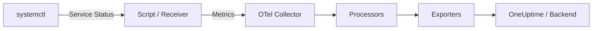

# How to Collect SystemD Service Status with the OpenTelemetry Collector

Author: [nawazdhandala](https://www.github.com/nawazdhandala)

Tags: OpenTelemetry, Collector, SystemD, Linux, Service Monitoring, Metrics, Infrastructure

Description: Learn how to collect SystemD service status and health metrics using the OpenTelemetry Collector to monitor Linux service availability and detect failures.

---

On any Linux server running systemd, the health of your services determines the health of your applications. A crashed web server, a stopped database, or a failed queue worker can go unnoticed for minutes or hours if you are not actively monitoring service states. The OpenTelemetry Collector can scrape systemd service status and push that data into your observability pipeline, giving you real-time visibility into which services are running, which have failed, and which are degraded.

This post walks through how to set up systemd service monitoring with the OpenTelemetry Collector using a combination of script-based metric collection and the host metrics receiver.

## Why Monitor SystemD Services?

Systemd manages nearly everything on a modern Linux box. Your nginx process, your PostgreSQL database, your application workers, cron timers, and even the Docker daemon are all systemd units. When one of these units enters a failed state, you need to know about it quickly.

Traditional approaches involve writing custom Nagios checks or running periodic shell scripts. With the OpenTelemetry Collector, you can fold this monitoring into the same pipeline that handles your application metrics and traces. No extra tools, no separate alerting systems.



## Approach: Using the Script Receiver

The most flexible way to collect systemd service status is the script receiver (also known as the scripted metric receiver or the exec receiver in some configurations). This approach runs a script at a defined interval, parses the output, and converts it into OpenTelemetry metrics.

However, since the script-based approach requires a custom script, let us first look at how to write a small helper that queries systemd and outputs metrics in a format the Collector can consume. We will use a shell script that produces Prometheus-style metrics, then scrape those metrics with the Prometheus receiver.

## Writing the SystemD Status Script

Create a script that queries systemd for service states and outputs Prometheus exposition format.

```bash
#!/bin/bash
# /opt/otel/scripts/systemd_status.sh
# Queries systemd for service status and outputs Prometheus metrics

# List of services to monitor
SERVICES="nginx postgresql redis docker grafana-server"

for svc in $SERVICES; do
    # Get the active state (active, inactive, failed, activating, deactivating)
    state=$(systemctl is-active "$svc" 2>/dev/null)

    # Map state to numeric value for metrics
    # 1 = active, 0 = inactive, -1 = failed, 2 = activating/deactivating
    case "$state" in
        active)      value=1 ;;
        inactive)    value=0 ;;
        failed)      value=-1 ;;
        activating)  value=2 ;;
        deactivating) value=2 ;;
        *)           value=-2 ;;  # unknown
    esac

    # Output in Prometheus exposition format
    echo "systemd_service_active{service=\"$svc\",state=\"$state\"} $value"
done

# Count total failed units
failed_count=$(systemctl --state=failed --no-legend | wc -l)
echo "systemd_failed_units_total $failed_count"

# System boot time
boot_ts=$(date -d "$(systemctl show --property=UserspaceTimestamp | cut -d= -f2)" +%s 2>/dev/null || echo 0)
echo "systemd_boot_timestamp_seconds $boot_ts"
```

Make the script executable.

```bash
# Set permissions
chmod +x /opt/otel/scripts/systemd_status.sh

# Test it
/opt/otel/scripts/systemd_status.sh
```

The output will look something like this:

```
systemd_service_active{service="nginx",state="active"} 1
systemd_service_active{service="postgresql",state="active"} 1
systemd_service_active{service="redis",state="active"} 1
systemd_service_active{service="docker",state="active"} 1
systemd_service_active{service="grafana-server",state="inactive"} 0
systemd_failed_units_total 0
systemd_boot_timestamp_seconds 1707200400
```

## Serving Metrics and Collector Configuration

We need to serve the script output over HTTP so the Prometheus receiver can scrape it. A lightweight approach is running a small wrapper that listens on a port and executes the script on each request. You can use tools like `ncat`, `socat`, or a simple Python HTTP server for this. Once the metrics are available on an HTTP endpoint, configure the Collector to scrape them.

## Collector Configuration: Prometheus Scraping

Configure the Collector to scrape the metrics endpoint your script serves.

```yaml
# Receivers section
receivers:
  # Scrape the systemd status metrics from our script
  prometheus/systemd:
    config:
      scrape_configs:
        - job_name: "systemd_services"
          # Scrape every 30 seconds
          scrape_interval: 30s
          # Where our script serves metrics
          static_configs:
            - targets: ["localhost:9110"]
              labels:
                host: "web-server-01"

  # Also collect host-level metrics for context
  hostmetrics:
    collection_interval: 30s
    scrapers:
      cpu:
      memory:
      disk:
      load:
      process:
        # Monitor specific processes that match systemd services
        include:
          match_type: regexp
          names: ["nginx.*", "postgres.*", "redis.*"]

# Processors
processors:
  # Add resource attributes for the host
  resourcedetection:
    detectors: [system, env]
    timeout: 5s

  # Tag with environment info
  attributes/env:
    actions:
      - key: deployment.environment
        value: "production"
        action: insert
      - key: service.namespace
        value: "infrastructure"
        action: insert

  batch:
    timeout: 10s
    send_batch_size: 500

# Export to OneUptime
exporters:
  otlphttp:
    endpoint: https://oneuptime.com/otlp
    headers:
      x-oneuptime-token: ${ONEUPTIME_TOKEN}
    compression: gzip

# Pipeline definition
service:
  pipelines:
    metrics:
      receivers: [prometheus/systemd, hostmetrics]
      processors: [resourcedetection, attributes/env, batch]
      exporters: [otlphttp]
```

The Prometheus receiver scrapes our custom endpoint and converts the metrics to OpenTelemetry format. The host metrics receiver adds CPU, memory, and process-level data so you can correlate service status with resource usage.

## Pairing with Journald Logs

For even richer context, add the journald receiver to collect logs from the same services you are monitoring. This gives you both the "what happened" (service entered a failed state) and the "why" (the error messages leading up to the failure). Add a `journald` receiver to your config targeting specific units like nginx, postgresql, and redis-server, then wire it into a separate logs pipeline alongside your metrics pipeline.

## Running the Collector as a SystemD Service

The Collector itself should run as a systemd service so it starts on boot and restarts on failure.

```ini
# /etc/systemd/system/otel-collector.service
[Unit]
Description=OpenTelemetry Collector
After=network-online.target
Wants=network-online.target

[Service]
Type=simple
User=otel
Group=otel
ExecStart=/usr/local/bin/otelcol-contrib --config /etc/otel/config.yaml
Restart=always
RestartSec=5
EnvironmentFile=/etc/otel/env

# Security hardening
NoNewPrivileges=true
ProtectSystem=full
ProtectHome=true

[Install]
WantedBy=multi-user.target
```

Enable and start the service.

```bash
# Reload systemd to pick up the new unit file
sudo systemctl daemon-reload

# Enable the collector to start on boot
sudo systemctl enable otel-collector

# Start the collector
sudo systemctl start otel-collector

# Check status
sudo systemctl status otel-collector
```

Store your OneUptime token and any other secrets in the environment file.

```bash
# /etc/otel/env
ONEUPTIME_TOKEN=your-token-here
```

## Alerting on Service Failures

Once metrics are flowing into your backend, set up alerts for the conditions that matter most.

**Service down.** Alert when `systemd_service_active` drops to -1 (failed) or 0 (inactive) for any critical service. A service that should be running but is not is the most urgent condition.

**Failed unit count increasing.** Alert when `systemd_failed_units_total` is greater than zero. This catches services you might not have explicitly listed in your monitoring script.

**Service flapping.** If a service rapidly alternates between active and failed states, it may be crash-looping. Track the rate of state changes and alert if a service transitions more than a few times in a short window.

**Restart loop detection.** If your service has `Restart=always` in its unit file, systemd will keep restarting it. The service might appear healthy in a point-in-time check but actually be restarting every 30 seconds. Correlate with process uptime metrics from the host metrics receiver.

## Troubleshooting

If metrics are not showing up, check these common issues.

First, verify the script runs correctly when executed manually. If it produces errors, fix them before involving the Collector.

Second, confirm the HTTP server is running and responding on the expected port.

```bash
# Test the metrics endpoint
curl http://localhost:9110
```

Third, check the Collector logs for scrape errors.

```yaml
service:
  telemetry:
    logs:
      level: debug
```

Fourth, make sure the Collector user has permission to run `systemctl` commands. If the Collector runs as a non-root user, it may not be able to query all service states. You can grant specific permissions with a polkit rule or run the status script via sudo with a restricted sudoers entry.

## Summary

Monitoring systemd service status with the OpenTelemetry Collector bridges the gap between traditional infrastructure monitoring and modern observability. By writing a simple status script and scraping it with the Prometheus receiver, you get real-time service state metrics flowing through the same pipeline as your application telemetry. Pair that with the journald receiver for log context, and you have a complete picture of what is running, what has failed, and why.

This approach works for any number of services and scales across fleets of servers. Combined with a backend like OneUptime that supports OpenTelemetry natively, you can build dashboards showing service health across your entire infrastructure and get alerted the moment something goes wrong.
