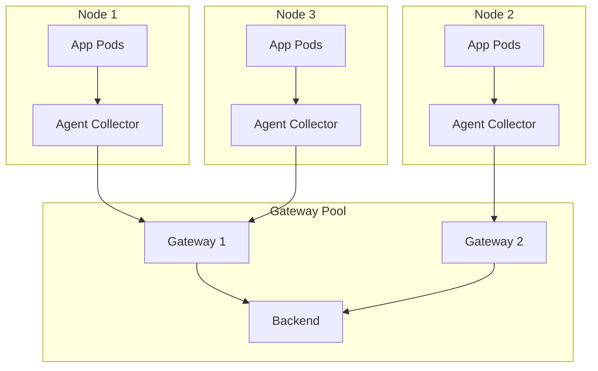

# How to Configure Collector Agent and Gateway Topology for Large Clusters

Author: [nawazdhandala](https://www.github.com/nawazdhandala)

Tags: OpenTelemetry, Collector, Kubernetes, Gateway, Agent, Scalability, Architecture

Description: A practical guide to designing and configuring OpenTelemetry Collector agent and gateway topologies that scale to large Kubernetes clusters with thousands of nodes.

---

Running the OpenTelemetry Collector on a small cluster is straightforward. Deploy a DaemonSet, point it at your backend, done. But when your cluster grows to hundreds or thousands of nodes, that simple setup starts showing cracks. Export connections multiply. Backends get hammered with thousands of individual streams. Configuration changes require rolling restarts across every node.

The solution is a two-tier architecture: lightweight agents on every node feeding into a centralized gateway layer. This guide covers how to design, configure, and operate this topology at scale.

## The Problem with Agents-Only at Scale

When every agent exports directly to your backend, you end up with N connections to your backend where N is the number of nodes. At 500 nodes, that is 500 persistent gRPC connections. Most backends handle this fine. At 2,000 nodes, things get interesting. At 5,000, you are likely hitting connection limits and causing back-pressure.

Beyond connection count, there are other issues:

- **Sampling decisions are local**: Each agent only sees its own traffic, making tail-based sampling across distributed traces impossible.
- **Processing duplication**: Every agent runs the same enrichment, filtering, and transformation logic independently.
- **Configuration sprawl**: Changing an export endpoint means updating every single agent.

## The Two-Tier Architecture

The agent-gateway topology separates concerns. Agents handle local collection and basic processing. Gateways handle aggregation, advanced processing, and export.



The agents run as a DaemonSet. One per node. They collect telemetry from local pods via OTLP, do minimal processing, and forward to the gateway pool. The gateways run as a Deployment with multiple replicas behind a Kubernetes Service. They handle the heavy lifting: batching, filtering, sampling, and exporting to your backends.

## Configuring the Agent Collector

The agent should be lightweight. It collects data, adds basic node-level metadata, and ships it to the gateway. Do not add heavy processors here. Keep memory and CPU requests low since this runs on every single node.

This is a minimal agent configuration that collects OTLP data from local pods, enriches it with Kubernetes metadata, and forwards to the gateway service.

```yaml
# agent-collector-config.yaml
# Runs as DaemonSet - one per node
receivers:
  otlp:
    protocols:
      grpc:
        endpoint: 0.0.0.0:4317
      http:
        endpoint: 0.0.0.0:4318

  # Collect node-level host metrics
  hostmetrics:
    collection_interval: 30s
    scrapers:
      cpu: {}
      memory: {}
      disk: {}
      network: {}

processors:
  # Add Kubernetes metadata from the local node
  k8sattributes:
    auth_type: "serviceAccount"
    extract:
      metadata:
        - k8s.pod.name
        - k8s.namespace.name
        - k8s.node.name
        - k8s.deployment.name
    pod_association:
      - sources:
          - from: connection

  # Light batching to reduce per-span overhead
  batch:
    send_batch_size: 512
    timeout: 2s

  # Memory limiter to protect the node
  memory_limiter:
    check_interval: 1s
    limit_mib: 256
    spike_limit_mib: 64

exporters:
  # Forward everything to the gateway service
  otlp:
    endpoint: otel-gateway.observability.svc.cluster.local:4317
    tls:
      insecure: true
    # Use round-robin load balancing across gateway replicas
    balancer_name: round_robin

service:
  pipelines:
    traces:
      receivers: [otlp]
      processors: [memory_limiter, k8sattributes, batch]
      exporters: [otlp]
    metrics:
      receivers: [otlp, hostmetrics]
      processors: [memory_limiter, k8sattributes, batch]
      exporters: [otlp]
    logs:
      receivers: [otlp]
      processors: [memory_limiter, k8sattributes, batch]
      exporters: [otlp]
```

Note the `memory_limiter` processor is listed first in the pipeline. This is intentional. If the agent hits its memory limit, it starts dropping data at the ingestion point rather than crashing.

## Deploying the Agent as a DaemonSet

The Kubernetes DaemonSet ensures one agent pod runs on every node. Keep the resource requests tight. On a 2,000-node cluster, every extra 100Mi of memory requested translates to 200Gi of cluster capacity consumed.

This DaemonSet manifest deploys the agent collector on every node with constrained resource limits and appropriate Kubernetes RBAC.

```yaml
# agent-daemonset.yaml
apiVersion: apps/v1
kind: DaemonSet
metadata:
  name: otel-agent
  namespace: observability
spec:
  selector:
    matchLabels:
      app: otel-agent
  template:
    metadata:
      labels:
        app: otel-agent
    spec:
      serviceAccountName: otel-agent
      containers:
        - name: collector
          image: otel/opentelemetry-collector-contrib:0.96.0
          args: ["--config=/etc/otel/config.yaml"]
          resources:
            requests:
              cpu: 100m
              memory: 128Mi
            limits:
              cpu: 500m
              memory: 384Mi
          ports:
            - containerPort: 4317
              hostPort: 4317
              protocol: TCP
            - containerPort: 4318
              hostPort: 4318
              protocol: TCP
          volumeMounts:
            - name: config
              mountPath: /etc/otel
      volumes:
        - name: config
          configMap:
            name: otel-agent-config
```

Using `hostPort` means application pods can reach the agent at `${NODE_IP}:4317`. This avoids routing through the Kubernetes service mesh and keeps telemetry collection local to the node.

## Configuring the Gateway Collector

The gateway is where you do the expensive work. Tail sampling, attribute filtering, metric aggregation, format conversion - put it all here. Gateways have more generous resource allocations because there are fewer of them and they handle aggregate traffic.

This gateway configuration includes tail-based sampling, attribute filtering, and exports to multiple backends.

```yaml
# gateway-collector-config.yaml
# Runs as Deployment with 3-10 replicas
receivers:
  otlp:
    protocols:
      grpc:
        endpoint: 0.0.0.0:4317

processors:
  # Larger batches at the gateway level
  batch:
    send_batch_size: 8192
    send_batch_max_size: 10000
    timeout: 5s

  # More generous memory limits
  memory_limiter:
    check_interval: 1s
    limit_mib: 2048
    spike_limit_mib: 512

  # Tail sampling only works at the gateway
  # because it needs to see complete traces
  tail_sampling:
    decision_wait: 30s
    num_traces: 100000
    expected_new_traces_per_sec: 5000
    policies:
      # Always keep error traces
      - name: errors
        type: status_code
        status_code:
          status_codes: [ERROR]
      # Keep slow traces
      - name: slow-traces
        type: latency
        latency:
          threshold_ms: 2000
      # Sample 10% of everything else
      - name: probabilistic
        type: probabilistic
        probabilistic:
          sampling_percentage: 10

  # Filter out noisy health check spans
  filter:
    error_mode: ignore
    traces:
      span:
        - 'attributes["http.route"] == "/healthz"'
        - 'attributes["http.route"] == "/readyz"'

exporters:
  otlp/traces:
    endpoint: your-trace-backend.example.com:4317
    headers:
      Authorization: "Bearer ${BACKEND_TOKEN}"
    sending_queue:
      enabled: true
      num_consumers: 20
      queue_size: 10000
    retry_on_failure:
      enabled: true
      max_elapsed_time: 300s

  otlp/metrics:
    endpoint: your-metrics-backend.example.com:4317
    headers:
      Authorization: "Bearer ${BACKEND_TOKEN}"

  otlp/logs:
    endpoint: your-logs-backend.example.com:4317
    headers:
      Authorization: "Bearer ${BACKEND_TOKEN}"

service:
  pipelines:
    traces:
      receivers: [otlp]
      processors: [memory_limiter, filter, tail_sampling, batch]
      exporters: [otlp/traces]
    metrics:
      receivers: [otlp]
      processors: [memory_limiter, batch]
      exporters: [otlp/metrics]
    logs:
      receivers: [otlp]
      processors: [memory_limiter, batch]
      exporters: [otlp/logs]
```

Pay attention to the `sending_queue` configuration on the exporters. At gateway scale, you need buffering to handle bursts. The `num_consumers` setting controls parallelism of export requests. Twenty consumers with a queue of 10,000 can absorb significant spikes.

## Deploying the Gateway as a Deployment

The gateway runs as a standard Deployment behind a ClusterIP service. Scale the replicas based on throughput.

This Deployment manifest runs the gateway with multiple replicas and a Horizontal Pod Autoscaler.

```yaml
# gateway-deployment.yaml
apiVersion: apps/v1
kind: Deployment
metadata:
  name: otel-gateway
  namespace: observability
spec:
  replicas: 3
  selector:
    matchLabels:
      app: otel-gateway
  template:
    metadata:
      labels:
        app: otel-gateway
    spec:
      serviceAccountName: otel-gateway
      containers:
        - name: collector
          image: otel/opentelemetry-collector-contrib:0.96.0
          args: ["--config=/etc/otel/config.yaml"]
          resources:
            requests:
              cpu: "1"
              memory: 2Gi
            limits:
              cpu: "4"
              memory: 4Gi
          ports:
            - containerPort: 4317
              protocol: TCP
          volumeMounts:
            - name: config
              mountPath: /etc/otel
      volumes:
        - name: config
          configMap:
            name: otel-gateway-config
---
# Service for agents to connect to
apiVersion: v1
kind: Service
metadata:
  name: otel-gateway
  namespace: observability
spec:
  selector:
    app: otel-gateway
  ports:
    - port: 4317
      targetPort: 4317
      protocol: TCP
---
# Auto-scale based on CPU usage
apiVersion: autoscaling/v2
kind: HorizontalPodAutoscaler
metadata:
  name: otel-gateway
  namespace: observability
spec:
  scaleTargetRef:
    apiVersion: apps/v1
    kind: Deployment
    name: otel-gateway
  minReplicas: 3
  maxReplicas: 20
  metrics:
    - type: Resource
      resource:
        name: cpu
        target:
          type: Utilization
          averageUtilization: 70
```

## Load Balancing Considerations

Standard Kubernetes services use random or round-robin load balancing for gRPC connections. Since gRPC uses long-lived connections, a naive setup results in uneven distribution. Agent pods that connect first may all hit the same gateway replica.

There are two solutions:

**Option 1: Use the load-balancing exporter on agents.** The `loadbalancingexporter` in the collector can distribute traces across gateway replicas based on trace ID, ensuring all spans from the same trace hit the same gateway (required for tail sampling).

This agent-side exporter configuration distributes traces to gateway pods by trace ID using DNS-based service discovery.

```yaml
# Agent exporter config for trace-aware load balancing
exporters:
  loadbalancing:
    routing_key: traceID
    protocol:
      otlp:
        tls:
          insecure: true
    resolver:
      dns:
        # Use a headless service so individual pod IPs resolve
        hostname: otel-gateway-headless.observability.svc.cluster.local
        port: 4317
```

**Option 2: Use a headless service** with client-side balancing. The agent's gRPC client resolves all gateway pod IPs and distributes connections across them.

For tail sampling, Option 1 is mandatory. Spans from the same trace must reach the same gateway instance for the sampling decision to work correctly.

## Sizing Guidelines

Here are rough numbers based on real-world deployments:

| Cluster Size | Agent CPU/Mem | Gateway Replicas | Gateway CPU/Mem |
|---|---|---|---|
| 50 nodes | 100m / 128Mi | 2 | 500m / 1Gi |
| 200 nodes | 100m / 256Mi | 3 | 1 / 2Gi |
| 1,000 nodes | 200m / 384Mi | 5-8 | 2 / 4Gi |
| 5,000 nodes | 200m / 384Mi | 10-20 | 4 / 8Gi |

These numbers assume moderate telemetry volume per node. If your workloads are particularly chatty (high span counts, verbose logging), scale the gateway replicas up accordingly.

## Monitoring the Topology

Both agents and gateways should expose their internal metrics. The collector has built-in Prometheus metrics for pipeline health.

Key things to monitor:

- **Agent queue depth**: If agents are backing up, the gateway is overloaded.
- **Gateway memory usage**: Tail sampling holds traces in memory. Watch for OOM kills.
- **Export latency**: High export latency on the gateway means your backend is struggling.
- **Dropped telemetry**: The `otelcol_processor_dropped_spans` metric reveals data loss.

Enable the zpages extension on the gateway for live debugging during incidents.

```yaml
# Enable zpages for live pipeline debugging
extensions:
  zpages:
    endpoint: 0.0.0.0:55679

service:
  extensions: [zpages]
```

## Conclusion

The agent-gateway topology is the standard pattern for running OpenTelemetry at scale. Agents stay light, handle local collection, and protect nodes from memory spikes. Gateways centralize expensive processing, reduce backend connection counts, and enable features like tail sampling that need a global view.

Start with the basic two-tier setup, add the load-balancing exporter when you need tail sampling, and scale gateway replicas horizontally with HPA. This architecture handles clusters from 50 to 5,000+ nodes without fundamental changes to the design.
