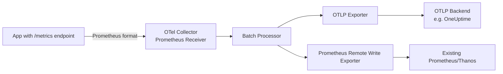

# How to Use the Collector as a Prometheus Scraper During Migration

Author: [nawazdhandala](https://www.github.com/nawazdhandala)

Tags: OpenTelemetry, Collector, Prometheus, Scraping, Migration, Metrics

Description: Learn how to configure the OpenTelemetry Collector to scrape Prometheus endpoints and forward metrics as OTLP, enabling a smooth migration path from Prometheus to OpenTelemetry.

---

One of the most practical steps in migrating from Prometheus to OpenTelemetry is replacing your Prometheus server's scraping role with the OpenTelemetry Collector. The Collector includes a Prometheus receiver that can scrape any Prometheus-compatible endpoint and convert the metrics into OTLP format for downstream export. This means you can keep your existing application instrumentation untouched while shifting the collection layer to OpenTelemetry.

This approach is especially valuable as a first migration step. You change nothing in your application code. You simply point the Collector at the same `/metrics` endpoints your Prometheus server was scraping, and the Collector handles the conversion and forwarding.

## Architecture Overview

Here is how the data flows when the Collector replaces Prometheus as the scraper:



The Collector sits in the middle, scraping your existing Prometheus endpoints and fanning out the metrics to both your new OTLP backend and your existing Prometheus infrastructure. This dual-export capability is what makes the Collector such a powerful migration tool.

## Configuring the Prometheus Receiver

The Prometheus receiver in the OpenTelemetry Collector uses the same configuration format as a Prometheus `scrape_config`. If you already have a working `prometheus.yml`, you can copy the relevant sections directly.

Here is a basic Collector configuration that scrapes two application endpoints:

```yaml
# collector-config.yaml
receivers:
  # The Prometheus receiver scrapes metrics in Prometheus exposition format
  prometheus:
    config:
      scrape_configs:
        # Scrape the order service every 15 seconds
        - job_name: "order-service"
          scrape_interval: 15s
          static_configs:
            - targets: ["order-service:8080"]
              labels:
                environment: "production"
                team: "backend"

        # Scrape the payment service
        - job_name: "payment-service"
          scrape_interval: 15s
          static_configs:
            - targets: ["payment-service:8080"]
              labels:
                environment: "production"
                team: "payments"

processors:
  # Batch metrics to reduce export overhead
  batch:
    timeout: 10s
    send_batch_size: 500

exporters:
  # Send metrics to an OTLP-compatible backend
  otlp:
    endpoint: "oneuptime-collector.example.com:4317"
    tls:
      insecure: false

service:
  pipelines:
    metrics:
      receivers: [prometheus]
      processors: [batch]
      exporters: [otlp]
```

This configuration tells the Collector to scrape both services every 15 seconds, batch the resulting metrics, and push them to an OTLP endpoint. The labels you add under `static_configs` become resource attributes on the OTLP metrics, which helps with filtering and grouping in your backend.

## Using Service Discovery

In production, you probably do not hardcode targets. If your services run on Kubernetes, you can use the same service discovery mechanisms that Prometheus supports. The Prometheus receiver in the Collector supports all Prometheus SD configurations.

```yaml
receivers:
  prometheus:
    config:
      scrape_configs:
        - job_name: "kubernetes-pods"
          scrape_interval: 15s

          # Discover pods via the Kubernetes API
          kubernetes_sd_configs:
            - role: pod

          relabel_configs:
            # Only scrape pods with the annotation prometheus.io/scrape: "true"
            - source_labels: [__meta_kubernetes_pod_annotation_prometheus_io_scrape]
              action: keep
              regex: true

            # Use the port from the prometheus.io/port annotation
            - source_labels: [__meta_kubernetes_pod_annotation_prometheus_io_port]
              action: replace
              target_label: __address__
              regex: (.+)
              replacement: "${1}"

            # Use the path from the prometheus.io/path annotation
            - source_labels: [__meta_kubernetes_pod_annotation_prometheus_io_path]
              action: replace
              target_label: __metrics_path__
              regex: (.+)

            # Preserve the pod name as a label
            - source_labels: [__meta_kubernetes_pod_name]
              action: replace
              target_label: pod
```

This is essentially the same relabeling configuration you would use in a standard Prometheus deployment. The key point is that your existing Prometheus SD config can be migrated with minimal changes.

## Handling Metric Name Conversion

When the Prometheus receiver ingests metrics, it preserves the original Prometheus metric names by default. A metric like `http_requests_total` stays as `http_requests_total` in OTLP. However, the receiver does apply some normalization:

- The `_total` suffix on counters is preserved in the metric name
- Histogram metrics (`_bucket`, `_sum`, `_count`) are consolidated into a single OTLP Histogram data point
- The `up` metric and scrape metadata metrics are included by default

If you want to control this behavior, you can use the resource processor or attributes processor to rename or transform metrics in the pipeline:

```yaml
processors:
  # Transform metric names to follow OpenTelemetry conventions
  metricstransform:
    transforms:
      # Rename a specific metric
      - include: http_requests_total
        action: update
        new_name: http.server.request.count

      # Add a prefix to all metrics from a specific job
      - include: ".*"
        match_type: regexp
        action: update
        operations:
          - action: add_label
            new_label: collector
            new_value: otel
```

This is optional and most teams skip renaming during the initial migration. It is better to get the data flowing first and standardize naming later.

## Dual Export: OTLP and Prometheus Remote Write

During migration, you likely need to keep your existing Prometheus or Thanos infrastructure running. The Collector can export to both your new OTLP backend and your existing Prometheus infrastructure simultaneously:

```yaml
exporters:
  # New OTLP backend
  otlp:
    endpoint: "oneuptime-collector.example.com:4317"
    tls:
      insecure: false

  # Existing Prometheus remote write endpoint
  prometheusremotewrite:
    endpoint: "http://prometheus.example.com:9090/api/v1/write"
    resource_to_telemetry_conversion:
      enabled: true

service:
  pipelines:
    metrics:
      receivers: [prometheus]
      processors: [batch]
      # Fan out to both backends
      exporters: [otlp, prometheusremotewrite]
```

The `resource_to_telemetry_conversion` setting converts OTLP resource attributes back into Prometheus labels, which keeps your existing dashboards and alerts working without modification.

## Validating the Migration

Before decommissioning your Prometheus server, validate that the Collector is scraping all expected targets and that metric values match.

Add the logging exporter at debug level to verify data is flowing:

```yaml
exporters:
  logging:
    # Set verbosity to detailed to see individual metric data points
    verbosity: detailed

service:
  pipelines:
    metrics:
      receivers: [prometheus]
      processors: [batch]
      exporters: [otlp, logging]
```

You can also enable the Collector's built-in health check and zPages extensions for monitoring:

```yaml
extensions:
  # Health check endpoint for liveness probes
  health_check:
    endpoint: 0.0.0.0:13133

  # zPages for live debugging of pipeline state
  zpages:
    endpoint: 0.0.0.0:55679

service:
  extensions: [health_check, zpages]
  pipelines:
    metrics:
      receivers: [prometheus]
      processors: [batch]
      exporters: [otlp]
```

The zPages interface at `http://localhost:55679/debug/pipelinez` shows you how many data points are flowing through each pipeline stage. This is invaluable for catching configuration issues before they affect production monitoring.

## Scaling the Collector Scraper

A single Collector instance can scrape hundreds of targets, but for large deployments you may need to distribute the scraping load. The target allocator component, designed for Kubernetes environments, distributes scrape targets across multiple Collector instances:

```yaml
# target-allocator-config.yaml
receivers:
  prometheus:
    config:
      scrape_configs:
        - job_name: "kubernetes-pods"
          kubernetes_sd_configs:
            - role: pod
    # Point to the target allocator instead of doing local SD
    target_allocator:
      endpoint: "http://target-allocator:80"
      interval: 30s
      collector_id: "${POD_NAME}"
```

The target allocator ensures each Collector replica scrapes a distinct subset of targets, preventing duplicate metrics and distributing the load evenly.

## Common Pitfalls

A few things to watch out for during this migration:

- **Scrape interval alignment**: Make sure the Collector's scrape intervals match what Prometheus was using. Different intervals will produce different rate calculations for counters.
- **Honor labels**: By default, the Prometheus receiver may overwrite labels like `job` and `instance`. Use `honor_labels: true` in your scrape config if your applications set these explicitly.
- **Memory usage**: The Prometheus receiver maintains in-memory state for stale marker detection. Monitor the Collector's memory usage, especially if you are scraping thousands of targets.
- **Staleness handling**: The Prometheus receiver emits stale markers when targets disappear. Make sure your backend handles these correctly to avoid phantom metrics.

## Conclusion

Using the OpenTelemetry Collector as a Prometheus scraper is the lowest-risk first step in any Prometheus-to-OpenTelemetry migration. Your applications do not change at all. You simply point the Collector at your existing `/metrics` endpoints, and it handles the conversion to OTLP. Combined with dual-export to both your new and existing backends, this approach lets you validate the new pipeline before making any irreversible changes.
