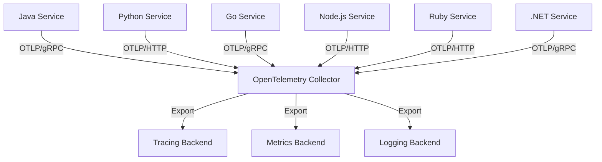
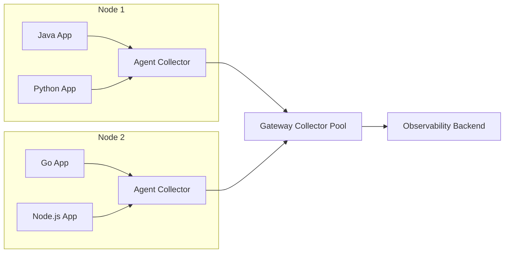

# How to Set Up Collector as a Central Hub for Multi-Language Applications

Author: [nawazdhandala](https://www.github.com/nawazdhandala)

Tags: OpenTelemetry, Collector, Multi-Language, OTLP, Observability, Architecture

Description: Learn how to configure the OpenTelemetry Collector as a central telemetry hub that receives data from applications written in any programming language.

---

When your organization runs applications in multiple programming languages, the OpenTelemetry Collector becomes the most important piece of your observability infrastructure. Instead of configuring each application to send telemetry directly to your backend, you route everything through a central collector. This gives you a single place to manage processing, filtering, sampling, and routing of all telemetry data regardless of which language produced it.

The collector speaks OTLP natively, which means any OpenTelemetry SDK in any language can send data to it without translation. It also supports legacy formats like Jaeger, Zipkin, and Prometheus, so even services that have not migrated to OpenTelemetry can participate. This post covers how to design and configure a collector-centric architecture for multi-language environments.

## Why a Central Collector Matters

Sending telemetry directly from each application to a backend creates several problems. You need to configure backend credentials in every service. You lose the ability to do centralized sampling or filtering. Changing backends means updating every application. And different language SDKs may have different default behaviors for batching, retries, and compression.

A central collector solves all of these issues:



The collector becomes the single integration point. Applications only need to know the collector address. All backend configuration, authentication, and routing logic lives in the collector.

## Collector Deployment Topology

For multi-language environments, a two-tier collector architecture works best. The first tier consists of agent collectors running as sidecars or DaemonSets close to your applications. The second tier is a pool of gateway collectors that handle processing and export.



The agent collectors are lightweight. They accept telemetry locally, do basic batching, and forward to the gateway. The gateway collectors handle the heavy lifting: sampling decisions, attribute enrichment, tail-based sampling, and export to backends.

## Receiver Configuration

The collector needs to accept telemetry from all your languages. Configure both gRPC and HTTP receivers since different SDKs default to different protocols:

```yaml
# collector-config.yaml
# Configure receivers to accept OTLP over both gRPC and HTTP.
# Java and Go SDKs typically default to gRPC, while Python and
# Node.js often use HTTP. Supporting both avoids SDK reconfiguration.
receivers:
  otlp:
    protocols:
      grpc:
        endpoint: 0.0.0.0:4317
        # Set a reasonable max message size for large traces
        max_recv_msg_size_mib: 16
      http:
        endpoint: 0.0.0.0:4318
        # Enable CORS for browser-based applications
        cors:
          allowed_origins:
            - "https://*.yourdomain.com"
          allowed_headers:
            - "Content-Type"
            - "X-Requested-With"
```

This configuration accepts telemetry from any OpenTelemetry SDK. The gRPC receiver on port 4317 is preferred by Java and Go SDKs for its efficiency. The HTTP receiver on port 4318 works well for Python, Node.js, and browser applications.

## Processing Pipeline

The processing pipeline is where the central collector really shines. You can normalize data from different languages, enrich it with common attributes, and apply consistent sampling:

```yaml
# Processors handle data transformation and enrichment.
# These run in order for every span, metric, and log that passes through.
processors:
  # Batch spans for efficient export
  batch:
    timeout: 5s
    send_batch_size: 1024
    send_batch_max_size: 2048

  # Add common resource attributes to all telemetry
  resource:
    attributes:
      - key: deployment.environment
        value: production
        action: upsert
      - key: collector.version
        value: "0.96.0"
        action: insert

  # Normalize span names from different languages.
  # Some SDKs produce "GET /api/users" while others produce "HTTP GET".
  # The transform processor can standardize these.
  transform:
    trace_statements:
      - context: span
        statements:
          # Ensure all HTTP spans follow the same naming pattern
          - replace_pattern(name, "^HTTP\\s+(GET|POST|PUT|DELETE)", "$$1")

  # Apply memory limits to prevent OOM kills
  memory_limiter:
    check_interval: 1s
    limit_mib: 2048
    spike_limit_mib: 512
```

The transform processor is particularly useful in multi-language environments. Different SDKs and instrumentation libraries may produce slightly different span names or attribute keys for the same operation. The transform processor lets you normalize these differences at the collector level rather than fixing them in each application.

## Handling Different Signal Types

Multi-language applications typically produce all three signal types: traces, metrics, and logs. Configure separate pipelines for each:

```yaml
# Service configuration with separate pipelines for each signal type.
# This allows different processing logic for traces vs metrics vs logs.
service:
  pipelines:
    traces:
      receivers: [otlp]
      processors: [memory_limiter, resource, transform, batch]
      exporters: [otlphttp/traces]

    metrics:
      receivers: [otlp]
      processors: [memory_limiter, resource, batch]
      exporters: [otlphttp/metrics]

    logs:
      receivers: [otlp]
      processors: [memory_limiter, resource, batch]
      exporters: [otlphttp/logs]

exporters:
  otlphttp/traces:
    endpoint: https://oneuptime.com/otlp
  otlphttp/metrics:
    endpoint: https://oneuptime.com/otlp
  otlphttp/logs:
    endpoint: https://oneuptime.com/otlp
```

Separate pipelines let you apply different processing rules to each signal type. You might want aggressive sampling for traces but full fidelity for metrics. You might want to filter sensitive attributes from logs but keep them in traces.

## SDK Configuration for Each Language

Each language SDK needs to know where the collector is. Here is how to configure the most common languages to send to a central collector.

For Java, use environment variables with the Java agent:

```bash
# Configure the Java agent to send to the central collector.
# OTLP/gRPC is the default and most efficient protocol for Java.
export OTEL_SERVICE_NAME=payment-service
export OTEL_EXPORTER_OTLP_ENDPOINT=http://otel-collector:4317
export OTEL_EXPORTER_OTLP_PROTOCOL=grpc
export OTEL_RESOURCE_ATTRIBUTES=service.version=2.1.0,team=payments
```

For Python applications:

```bash
# Configure the Python SDK using environment variables.
# Python defaults to HTTP/protobuf which works well for most setups.
export OTEL_SERVICE_NAME=recommendation-service
export OTEL_EXPORTER_OTLP_ENDPOINT=http://otel-collector:4318
export OTEL_EXPORTER_OTLP_PROTOCOL=http/protobuf
export OTEL_RESOURCE_ATTRIBUTES=service.version=1.5.0,team=ml
```

For Go applications:

```bash
# Configure the Go SDK. Go supports both gRPC and HTTP exporters.
export OTEL_SERVICE_NAME=api-gateway
export OTEL_EXPORTER_OTLP_ENDPOINT=http://otel-collector:4317
export OTEL_EXPORTER_OTLP_PROTOCOL=grpc
export OTEL_RESOURCE_ATTRIBUTES=service.version=3.0.1,team=platform
```

For Node.js applications:

```bash
# Configure the Node.js SDK. HTTP is the most common choice.
export OTEL_SERVICE_NAME=notification-service
export OTEL_EXPORTER_OTLP_ENDPOINT=http://otel-collector:4318
export OTEL_EXPORTER_OTLP_PROTOCOL=http/protobuf
export OTEL_RESOURCE_ATTRIBUTES=service.version=1.2.0,team=messaging
```

Using environment variables for SDK configuration is the recommended approach because it works identically across all languages and fits naturally into container orchestration systems like Kubernetes.

## Health Monitoring for the Collector

A central collector is a critical piece of infrastructure. If it goes down, you lose all telemetry. Add health check extensions and monitoring:

```yaml
# Extensions for health monitoring and debugging
extensions:
  health_check:
    endpoint: 0.0.0.0:13133
  zpages:
    endpoint: 0.0.0.0:55679

service:
  extensions: [health_check, zpages]
  telemetry:
    logs:
      level: info
    metrics:
      # The collector exposes its own metrics in Prometheus format
      address: 0.0.0.0:8888
```

The health check extension provides a `/` endpoint that Kubernetes liveness and readiness probes can hit. The zpages extension gives you a web UI to inspect the collector's internal state, including pipeline status and recent traces.

## Scaling the Gateway Collector

For production environments handling telemetry from many services, run multiple gateway collector instances behind a load balancer:

```yaml
# Kubernetes deployment for the gateway collector pool
apiVersion: apps/v1
kind: Deployment
metadata:
  name: otel-gateway-collector
spec:
  replicas: 3
  selector:
    matchLabels:
      app: otel-gateway-collector
  template:
    spec:
      containers:
        - name: collector
          image: otel/opentelemetry-collector-contrib:0.96.0
          resources:
            requests:
              cpu: "1"
              memory: 2Gi
            limits:
              cpu: "2"
              memory: 4Gi
          ports:
            - containerPort: 4317
            - containerPort: 4318
            - containerPort: 13133
          livenessProbe:
            httpGet:
              path: /
              port: 13133
          readinessProbe:
            httpGet:
              path: /
              port: 13133
```

Put a Kubernetes Service in front of the deployment so that agent collectors and application SDKs have a stable DNS name to target.

## Conclusion

The OpenTelemetry Collector is the natural center of gravity for multi-language observability. It eliminates the need to configure backend-specific exporters in every language, provides a single place to apply processing and sampling rules, and creates a clean separation between telemetry production and consumption. When you have services in Java, Python, Go, Node.js, and other languages all producing telemetry, the collector turns that diversity from a problem into a non-issue. Every language sends OTLP to the collector, and the collector handles the rest.
