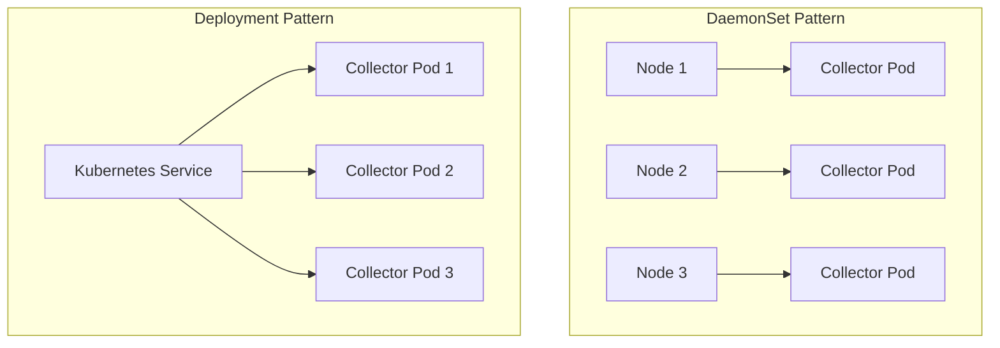
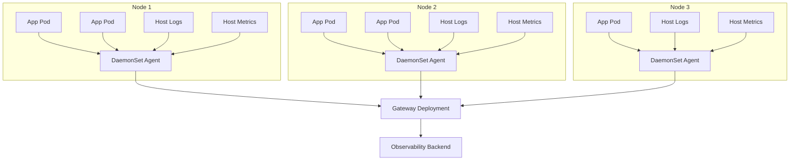

# How to Set Up the Collector as a DaemonSet vs. Deployment in Kubernetes

Author: [nawazdhandala](https://www.github.com/nawazdhandala)

Tags: OpenTelemetry, Kubernetes, Collector, DaemonSet, Deployment, Infrastructure, Observability

Description: Understand the differences between running the OpenTelemetry Collector as a DaemonSet and as a Deployment in Kubernetes, with practical configuration examples for both approaches.

---

When you deploy the OpenTelemetry Collector in Kubernetes, one of the first decisions you'll face is: should it run as a DaemonSet or a Deployment? Both work, but they serve very different purposes and fit different use cases.

The short answer is that many production setups use both. A DaemonSet runs one collector pod on every node to gather local telemetry, and a Deployment runs a pool of collector pods that act as a centralized gateway. But understanding why and when to use each pattern is important for building a reliable observability pipeline.

## DaemonSet vs. Deployment: The Core Difference

A DaemonSet ensures exactly one pod runs on each node in your cluster. A Deployment manages a set of replicated pods that Kubernetes schedules wherever there's capacity.



Here's when you'd pick each:

**DaemonSet** is the right choice when:
- You need to collect host-level or node-level metrics (CPU, memory, disk)
- You're scraping log files from the node's filesystem
- You want to receive telemetry locally on each node to minimize cross-node traffic
- You're collecting Kubernetes node metrics via the kubelet

**Deployment** is the right choice when:
- You need a centralized gateway that receives data from multiple sources
- You're doing heavy processing like tail sampling across traces
- You want to scale independently of the number of nodes
- You're aggregating data before exporting to a backend

## Setting Up the Collector as a DaemonSet

The DaemonSet collector typically runs as an "agent" that collects data local to each node. It scrapes node-level metrics, reads log files, and receives OTLP data from application pods running on the same node.

Here's a complete DaemonSet configuration using the OpenTelemetry Operator:

```yaml
# otel-collector-daemonset.yaml
# Collector running as a DaemonSet - one per node for local data collection
apiVersion: opentelemetry.io/v1beta1
kind: OpenTelemetryCollector
metadata:
  name: otel-agent
  namespace: observability
spec:
  mode: daemonset
  # Tolerate all taints so the collector runs on every node including masters
  tolerations:
    - operator: Exists
  # Resource limits for the collector agent
  resources:
    requests:
      cpu: 100m
      memory: 256Mi
    limits:
      cpu: 500m
      memory: 512Mi
  # Mount host filesystem paths for log collection and node metrics
  volumes:
    - name: varlog
      hostPath:
        path: /var/log
    - name: varlibdockercontainers
      hostPath:
        path: /var/lib/docker/containers
  volumeMounts:
    - name: varlog
      mountPath: /var/log
      readOnly: true
    - name: varlibdockercontainers
      mountPath: /var/lib/docker/containers
      readOnly: true
  env:
    # Make the node name available as an environment variable
    - name: K8S_NODE_NAME
      valueFrom:
        fieldRef:
          fieldPath: spec.nodeName
  config:
    receivers:
      otlp:
        protocols:
          grpc:
            # Receive OTLP from apps on this node
            endpoint: 0.0.0.0:4317
          http:
            endpoint: 0.0.0.0:4318
      # Collect host metrics from the node
      hostmetrics:
        collection_interval: 30s
        scrapers:
          cpu:
          memory:
          disk:
          filesystem:
          load:
          network:
      # Read container logs from the filesystem
      filelog:
        include:
          - /var/log/pods/*/*/*.log
        operators:
          - type: router
            routes:
              - output: parser-docker
                expr: 'body matches "^\\{"'
              - output: parser-containerd
                expr: 'body matches "^[^ Z]+Z"'
          - type: json_parser
            id: parser-docker
          - type: regex_parser
            id: parser-containerd
            regex: "^(?P<time>[^ Z]+Z) (?P<stream>stdout|stderr) (?P<logtag>[^ ]*) ?(?P<log>.*)$"

    processors:
      batch:
        send_batch_size: 1024
        timeout: 5s
      memory_limiter:
        check_interval: 5s
        limit_mib: 400
        spike_limit_mib: 100
      # Add Kubernetes metadata to all telemetry
      k8sattributes:
        auth_type: "serviceAccount"
        passthrough: false
        extract:
          metadata:
            - k8s.pod.name
            - k8s.pod.uid
            - k8s.namespace.name
            - k8s.node.name
            - k8s.deployment.name
        pod_association:
          - sources:
              - from: resource_attribute
                name: k8s.pod.ip
          - sources:
              - from: connection

    exporters:
      otlp:
        # Forward everything to the central gateway collector
        endpoint: "otel-gateway-collector.observability.svc.cluster.local:4317"
        tls:
          insecure: true

    service:
      pipelines:
        traces:
          receivers: [otlp]
          processors: [memory_limiter, k8sattributes, batch]
          exporters: [otlp]
        metrics:
          receivers: [otlp, hostmetrics]
          processors: [memory_limiter, k8sattributes, batch]
          exporters: [otlp]
        logs:
          receivers: [otlp, filelog]
          processors: [memory_limiter, k8sattributes, batch]
          exporters: [otlp]
```

A few things to notice here. The DaemonSet tolerates all taints so it runs on every node, including control plane nodes. It mounts host paths for log collection. And it uses `K8S_NODE_NAME` to identify which node each agent runs on.

The `hostmetrics` receiver scrapes system-level metrics directly from the node. The `filelog` receiver reads container log files from the node's filesystem. And the `otlp` receiver accepts data from application pods.

### How Applications Send Data to the DaemonSet Agent

Application pods need to know where to send their telemetry. Since there's a collector on every node, you can use the node's IP address. The Kubernetes downward API makes this easy.

```yaml
# Example application deployment that sends telemetry to the local DaemonSet agent
apiVersion: apps/v1
kind: Deployment
metadata:
  name: my-app
spec:
  template:
    spec:
      containers:
        - name: my-app
          image: myregistry/my-app:latest
          env:
            # Use the node's internal IP to reach the DaemonSet collector
            - name: OTEL_EXPORTER_OTLP_ENDPOINT
              value: "http://$(NODE_IP):4317"
            - name: NODE_IP
              valueFrom:
                fieldRef:
                  fieldPath: status.hostIP
```

This keeps traffic local to the node, avoiding unnecessary cross-node hops.

## Setting Up the Collector as a Deployment

The Deployment collector typically runs as a "gateway" that aggregates data from all the DaemonSet agents (or directly from applications). It handles cross-trace processing like tail sampling, and it exports to your observability backend.

```yaml
# otel-collector-deployment.yaml
# Collector running as a Deployment - centralized gateway for aggregation
apiVersion: opentelemetry.io/v1beta1
kind: OpenTelemetryCollector
metadata:
  name: otel-gateway
  namespace: observability
spec:
  mode: deployment
  replicas: 3
  # Enable autoscaling for the gateway
  autoscaler:
    minReplicas: 2
    maxReplicas: 10
    targetCPUUtilization: 70
    targetMemoryUtilization: 80
  resources:
    requests:
      cpu: 500m
      memory: 1Gi
    limits:
      cpu: 2
      memory: 4Gi
  config:
    receivers:
      otlp:
        protocols:
          grpc:
            # Receive OTLP from DaemonSet agents and external sources
            endpoint: 0.0.0.0:4317
          http:
            endpoint: 0.0.0.0:4318

    processors:
      batch:
        send_batch_size: 2048
        timeout: 10s
      memory_limiter:
        check_interval: 5s
        limit_mib: 3072
        spike_limit_mib: 512
      # Tail sampling requires all spans of a trace to hit the same instance
      tail_sampling:
        decision_wait: 30s
        num_traces: 100000
        expected_new_traces_per_sec: 1000
        policies:
          # Always keep error traces
          - name: errors
            type: status_code
            status_code:
              status_codes:
                - ERROR
          # Always keep slow traces
          - name: slow-traces
            type: latency
            latency:
              threshold_ms: 2000
          # Sample 10% of everything else
          - name: probabilistic
            type: probabilistic
            probabilistic:
              sampling_percentage: 10

    exporters:
      otlp/traces:
        endpoint: "your-traces-backend.example.com:4317"
        tls:
          insecure: false
      otlp/metrics:
        endpoint: "your-metrics-backend.example.com:4317"
        tls:
          insecure: false
      otlp/logs:
        endpoint: "your-logs-backend.example.com:4317"
        tls:
          insecure: false

    service:
      pipelines:
        traces:
          receivers: [otlp]
          processors: [memory_limiter, tail_sampling, batch]
          exporters: [otlp/traces]
        metrics:
          receivers: [otlp]
          processors: [memory_limiter, batch]
          exporters: [otlp/metrics]
        logs:
          receivers: [otlp]
          processors: [memory_limiter, batch]
          exporters: [otlp/logs]
```

The gateway deployment uses a Horizontal Pod Autoscaler to scale based on CPU and memory utilization. It also has more generous resource limits because it's doing heavier processing.

Notice the tail sampling processor. This is one of the main reasons to use a Deployment: tail sampling needs to see all spans of a trace before making a keep/drop decision. That's only possible in a centralized gateway.

## The Two-Tier Architecture

Most production Kubernetes deployments use both patterns together.



The DaemonSet agents handle local collection, enrichment with Kubernetes metadata, and initial batching. The gateway Deployment handles cross-trace processing, aggregation, and export to your backend.

This separation gives you several benefits:

1. **Resilience**: If the gateway is temporarily down, agents can buffer data locally
2. **Efficiency**: Local agents reduce cross-node network traffic
3. **Flexibility**: You can scale the gateway independently of your cluster size
4. **Processing**: Complex operations like tail sampling work correctly at the gateway level

## Quick Comparison Table

| Aspect | DaemonSet | Deployment |
|--------|-----------|------------|
| Pods per node | Exactly one | Scheduled by Kubernetes |
| Scaling | Automatic with nodes | Manual or via HPA |
| Best for | Node-local collection | Centralized processing |
| Host metrics | Yes (direct access) | No |
| Log file access | Yes (via hostPath) | No |
| Tail sampling | Not practical | Works well |
| Resource overhead | Per node | Fixed pool |

## Common Pitfalls

**Don't put tail sampling in the DaemonSet.** Tail sampling needs all spans of a trace to make a decision. Since traces span multiple nodes, the spans will arrive at different DaemonSet agents. The sampling decision won't be consistent.

**Watch your memory limits on the DaemonSet.** On busy nodes with lots of pods, the agent can consume more memory than you'd expect. Set up the `memory_limiter` processor and monitor the collector's own metrics.

**Use a Service for the gateway.** Applications and agents should connect to the gateway via a Kubernetes Service, not directly to pod IPs. This gives you load balancing and resilience if a gateway pod restarts.

**Don't forget RBAC.** The `k8sattributes` processor and `kubeletstats` receiver need ServiceAccount permissions to query the Kubernetes API. Make sure your Helm chart or manifests include the right ClusterRole and ClusterRoleBinding.

## Wrapping Up

The DaemonSet vs. Deployment decision isn't really an either/or choice. The DaemonSet pattern gives you node-local collection with access to host resources. The Deployment pattern gives you centralized processing with independent scaling. Together, they form a robust two-tier architecture that handles everything from log collection to tail sampling.

Start with the pattern that matches your immediate needs. If you're mainly collecting application traces, a Deployment might be enough. If you need host metrics and log files, start with a DaemonSet. And when your requirements grow, combine them.
