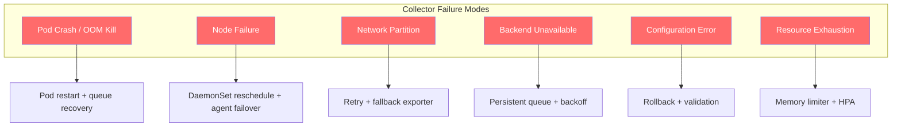
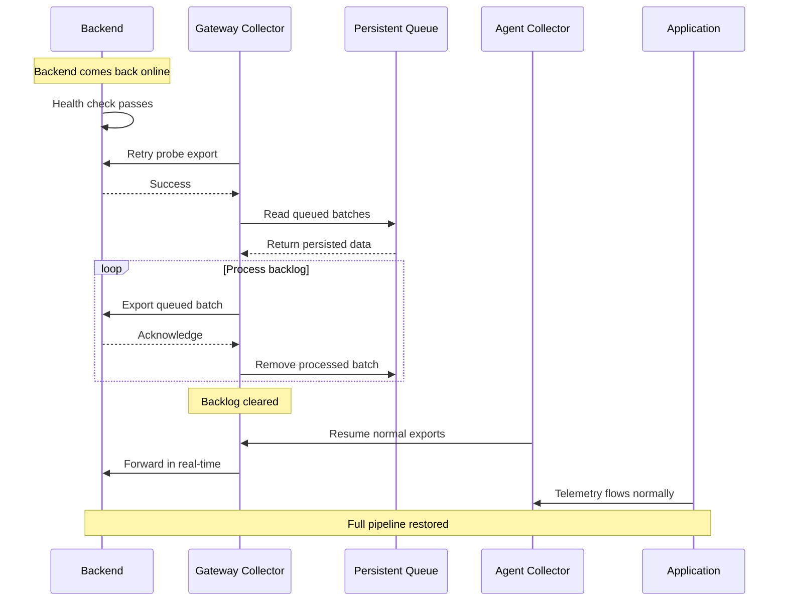

# How to Handle Collector Failover and Recovery in Production

Author: [nawazdhandala](https://www.github.com/nawazdhandala)

Tags: OpenTelemetry, Failover, Recovery, Production, High Availability

Description: A practical guide to implementing failover and recovery strategies for OpenTelemetry Collectors in production, covering redundancy, persistent queues, and automated recovery.

---

Production systems fail. Collectors crash, nodes go down, networks partition. The question is not whether your OpenTelemetry pipeline will experience failures but how well it recovers from them. A well-designed failover strategy means the difference between a brief gap in your telemetry and a complete blind spot during the incident you need visibility into the most.

This guide walks through the concrete steps to make your collector deployments resilient to the failures that actually happen in production.

## Failure Modes You Need to Handle

Before building solutions, let's catalog what actually goes wrong:



Each failure mode needs a different recovery strategy. Let's go through them.

## Pod Crash Recovery with Persistent Queues

When a collector pod crashes and restarts, anything in its in-memory queues is gone. Persistent queues solve this by writing pending exports to disk. When the pod comes back, it reads the queue from disk and picks up where it left off.

```yaml
# collector-config.yaml
# Persistent queue configuration for crash recovery
extensions:
  # The file storage extension provides persistent storage
  # for the sending queue
  file_storage/queue:
    directory: /var/lib/otel/queue
    # Limit the total size on disk to prevent filling the volume
    max_file_size_mib: 4096
    # Timeout for individual file operations
    timeout: 10s
    # Use fsync to ensure data is written to disk, not just
    # the OS buffer cache. This is slower but guarantees
    # durability across crashes
    fsync: true

receivers:
  otlp:
    protocols:
      grpc:
        endpoint: 0.0.0.0:4317

processors:
  memory_limiter:
    check_interval: 1s
    limit_mib: 1536
    spike_limit_mib: 384

  batch:
    send_batch_size: 1024
    timeout: 5s

exporters:
  otlp:
    endpoint: backend.observability.svc:4317
    retry_on_failure:
      enabled: true
      initial_interval: 5s
      max_interval: 60s
      max_elapsed_time: 600s
    sending_queue:
      enabled: true
      num_consumers: 10
      queue_size: 10000
      # This line is what makes the queue survive crashes
      storage: file_storage/queue

service:
  extensions: [file_storage/queue]
  pipelines:
    traces:
      receivers: [otlp]
      processors: [memory_limiter, batch]
      exporters: [otlp]
    metrics:
      receivers: [otlp]
      processors: [memory_limiter, batch]
      exporters: [otlp]
    logs:
      receivers: [otlp]
      processors: [memory_limiter, batch]
      exporters: [otlp]
```

The Kubernetes deployment needs a PersistentVolumeClaim to back this:

```yaml
# collector-statefulset.yaml
# Using StatefulSet instead of Deployment so each replica gets
# its own persistent volume that follows it across reschedules
apiVersion: apps/v1
kind: StatefulSet
metadata:
  name: otel-collector
  namespace: observability
spec:
  serviceName: otel-collector
  replicas: 3
  selector:
    matchLabels:
      app: otel-collector
  template:
    metadata:
      labels:
        app: otel-collector
    spec:
      terminationGracePeriodSeconds: 120
      containers:
        - name: collector
          image: otel/opentelemetry-collector-contrib:0.96.0
          args: ["--config=/etc/otel/config.yaml"]
          ports:
            - containerPort: 4317
              name: otlp-grpc
            - containerPort: 13133
              name: health
          resources:
            requests:
              cpu: "1"
              memory: 1536Mi
            limits:
              cpu: "2"
              memory: 2048Mi
          # Use the collector's built-in health check
          livenessProbe:
            httpGet:
              path: /
              port: 13133
            initialDelaySeconds: 15
            periodSeconds: 10
            failureThreshold: 3
          readinessProbe:
            httpGet:
              path: /
              port: 13133
            initialDelaySeconds: 5
            periodSeconds: 5
          volumeMounts:
            - name: config
              mountPath: /etc/otel
            - name: queue-data
              mountPath: /var/lib/otel/queue
      volumes:
        - name: config
          configMap:
            name: otel-collector-config
  # Each replica gets its own PVC for queue persistence
  volumeClaimTemplates:
    - metadata:
        name: queue-data
      spec:
        accessModes: [ReadWriteOnce]
        storageClassName: fast-ssd
        resources:
          requests:
            storage: 10Gi
```

## Node Failure and Agent Failover

When a node dies, the agent collector on that node dies with it. Applications on that node cannot send telemetry. For the applications that survive (because Kubernetes reschedules them to other nodes), they need to find their new local agent.

The standard approach uses a DaemonSet with hostPort, so applications always connect to `localhost:4317`:

```yaml
# agent-daemonset.yaml
apiVersion: apps/v1
kind: DaemonSet
metadata:
  name: otel-agent
  namespace: observability
spec:
  selector:
    matchLabels:
      app: otel-agent
  # Use RollingUpdate with maxUnavailable=1 to keep agents
  # running on as many nodes as possible during updates
  updateStrategy:
    type: RollingUpdate
    rollingUpdate:
      maxUnavailable: 1
  template:
    metadata:
      labels:
        app: otel-agent
    spec:
      # Tolerate all taints so the agent runs on every node,
      # including control plane nodes
      tolerations:
        - operator: Exists
      containers:
        - name: collector
          image: otel/opentelemetry-collector-contrib:0.96.0
          args: ["--config=/etc/otel/config.yaml"]
          ports:
            # hostPort makes the agent accessible at the node's
            # IP address, so pods connect to localhost:4317
            - containerPort: 4317
              hostPort: 4317
              name: otlp-grpc
            - containerPort: 4318
              hostPort: 4318
              name: otlp-http
          resources:
            requests:
              cpu: 100m
              memory: 128Mi
            limits:
              cpu: 250m
              memory: 384Mi
```

When a node goes down and pods get rescheduled to a new node, the DaemonSet guarantees there is already an agent on that new node. The application pods just connect to `localhost:4317` on whatever node they land on.

## Multi-Backend Failover

For the gateway tier, you want failover between multiple backends. If your primary backend is down, exports should automatically route to a secondary:

```yaml
# gateway-config-with-failover.yaml
receivers:
  otlp:
    protocols:
      grpc:
        endpoint: 0.0.0.0:4317

processors:
  memory_limiter:
    check_interval: 1s
    limit_mib: 2048
    spike_limit_mib: 512
  batch:
    send_batch_size: 1024
    timeout: 5s

exporters:
  # Primary backend with aggressive timeouts
  otlp/primary:
    endpoint: primary.observability.svc:4317
    timeout: 10s
    retry_on_failure:
      enabled: true
      initial_interval: 1s
      max_interval: 10s
      # Short max_elapsed_time so we fail fast to the fallback
      max_elapsed_time: 30s
    sending_queue:
      enabled: true
      queue_size: 1000

  # Secondary backend with more patience
  otlp/secondary:
    endpoint: secondary.observability.svc:4317
    timeout: 30s
    retry_on_failure:
      enabled: true
      initial_interval: 5s
      max_interval: 60s
      max_elapsed_time: 300s
    sending_queue:
      enabled: true
      queue_size: 5000
      storage: file_storage

  # Last-resort file output for when everything else fails
  file/emergency:
    path: /var/lib/otel/emergency/telemetry.jsonl
    rotation:
      max_megabytes: 2048
      max_days: 3
      max_backups: 5

extensions:
  file_storage:
    directory: /var/lib/otel/queue

service:
  extensions: [file_storage]
  pipelines:
    traces:
      receivers: [otlp]
      processors: [memory_limiter, batch]
      # Fan out to all three exporters
      # Each one handles its own retry/queue independently
      exporters: [otlp/primary, otlp/secondary, file/emergency]
```

Wait, the above sends to all three destinations simultaneously, which is wasteful. If you want true failover (primary first, then secondary only if primary fails), you need to use the failover connector or a routing strategy.

Here is how to set up proper failover ordering with the `failover` connector:

```yaml
# Using the experimental failover connector for ordered failover
connectors:
  failover/traces:
    # Try exporters in order. If the first fails, try the second.
    # Only move to the next tier after retry_gap expires.
    priority_levels:
      - [otlp/primary]
      - [otlp/secondary]
      - [file/emergency]
    retry_gap: 30s
    retry_interval: 15s
    max_retries: 5

service:
  pipelines:
    traces/input:
      receivers: [otlp]
      processors: [memory_limiter, batch]
      exporters: [failover/traces]
    traces/primary:
      receivers: [failover/traces]
      exporters: [otlp/primary]
    traces/secondary:
      receivers: [failover/traces]
      exporters: [otlp/secondary]
    traces/emergency:
      receivers: [failover/traces]
      exporters: [file/emergency]
```

## Recovery Sequence After an Outage

When things come back online after an outage, you need an orderly recovery. Here is the typical sequence:



During recovery, be careful about overwhelming the backend with the backlog. Use the `num_consumers` setting on the sending queue to control how many batches are exported in parallel:

```yaml
exporters:
  otlp:
    endpoint: backend.observability.svc:4317
    sending_queue:
      enabled: true
      # During recovery, this controls how aggressively
      # the backlog is drained. Too many consumers can
      # overwhelm a backend that just came back up.
      # Start with a modest number and increase if needed.
      num_consumers: 5
      queue_size: 10000
      storage: file_storage
```

## Configuration Rollback Strategy

Bad configuration deployments are a common cause of collector failures. Protect against this with validation and rollback:

```bash
#!/bin/bash
# deploy-collector-config.sh
# Validates collector config before deploying and rolls back on failure

CONFIG_FILE="$1"
NAMESPACE="observability"
CONFIGMAP_NAME="otel-collector-config"

# Step 1: Validate the configuration syntax using the collector binary
echo "Validating configuration..."
otelcol-contrib validate --config="$CONFIG_FILE"
if [ $? -ne 0 ]; then
    echo "Configuration validation failed. Aborting deployment."
    exit 1
fi

# Step 2: Back up the current configuration
echo "Backing up current configuration..."
kubectl get configmap "$CONFIGMAP_NAME" -n "$NAMESPACE" -o yaml > /tmp/otel-config-backup.yaml

# Step 3: Apply the new configuration
echo "Applying new configuration..."
kubectl create configmap "$CONFIGMAP_NAME" \
    --from-file=config.yaml="$CONFIG_FILE" \
    -n "$NAMESPACE" \
    --dry-run=client -o yaml | kubectl apply -f -

# Step 4: Restart collectors to pick up the new config
echo "Restarting collectors..."
kubectl rollout restart statefulset/otel-collector -n "$NAMESPACE"

# Step 5: Wait for rollout and check health
echo "Waiting for rollout..."
kubectl rollout status statefulset/otel-collector -n "$NAMESPACE" --timeout=120s
if [ $? -ne 0 ]; then
    echo "Rollout failed. Rolling back..."
    kubectl apply -f /tmp/otel-config-backup.yaml
    kubectl rollout restart statefulset/otel-collector -n "$NAMESPACE"
    kubectl rollout status statefulset/otel-collector -n "$NAMESPACE" --timeout=120s
    echo "Rolled back to previous configuration."
    exit 1
fi

echo "Deployment successful."
```

## Health Monitoring for Failover Decisions

Set up comprehensive health monitoring so failover decisions are based on real data:

```yaml
# collector-config-with-health.yaml
extensions:
  health_check:
    endpoint: 0.0.0.0:13133
    # Include detailed component health information
    path: /health
    # Check interval for internal health evaluation
    check_collector_pipeline:
      enabled: true
      interval: 30s
      exporter_failure_threshold: 5

service:
  extensions: [health_check]
  telemetry:
    metrics:
      # Expose internal metrics for monitoring
      address: 0.0.0.0:8888
      level: detailed
```

Use these Prometheus alerts to detect when failover is needed:

```yaml
# alerting-rules.yaml
groups:
  - name: otel-collector-failover
    rules:
      # Alert when a collector is consistently failing to export
      - alert: CollectorExportFailure
        expr: >
          rate(otelcol_exporter_send_failed_spans[5m]) > 0
          and
          rate(otelcol_exporter_sent_spans[5m]) == 0
        for: 2m
        labels:
          severity: critical
        annotations:
          summary: "Collector {{ $labels.instance }} cannot export to {{ $labels.exporter }}"

      # Alert when the persistent queue is filling up
      - alert: CollectorQueueNearFull
        expr: >
          otelcol_exporter_queue_size / otelcol_exporter_queue_capacity > 0.8
        for: 5m
        labels:
          severity: warning
        annotations:
          summary: "Export queue is {{ $value | humanizePercentage }} full"

      # Alert when a collector pod has restarted multiple times
      - alert: CollectorCrashLoop
        expr: >
          increase(kube_pod_container_status_restarts_total{
            container="collector",
            namespace="observability"
          }[1h]) > 3
        labels:
          severity: critical
        annotations:
          summary: "Collector pod {{ $labels.pod }} has restarted {{ $value }} times in the last hour"
```

## Testing Failover

Never deploy a failover strategy without testing it. Here are concrete tests to run:

```bash
# Test 1: Kill a collector pod and verify recovery
echo "Test 1: Pod failure recovery"
kubectl delete pod otel-collector-0 -n observability
# Watch the pod come back and verify the queue is drained
kubectl logs -f otel-collector-0 -n observability | grep -i "queue"

# Test 2: Simulate backend failure by blocking network
echo "Test 2: Backend failure"
kubectl exec -n observability otel-collector-0 -- \
  iptables -A OUTPUT -d backend.observability.svc -j DROP
# Wait and check that the queue is growing
sleep 60
kubectl exec -n observability otel-collector-0 -- \
  curl -s localhost:8888/metrics | grep queue_size
# Restore network and verify queue drains
kubectl exec -n observability otel-collector-0 -- \
  iptables -D OUTPUT -d backend.observability.svc -j DROP

# Test 3: Verify persistent queue survives restart
echo "Test 3: Queue persistence"
kubectl exec -n observability otel-collector-0 -- \
  ls -la /var/lib/otel/queue/
kubectl delete pod otel-collector-0 -n observability
# After restart, check that queue files are still there
kubectl exec -n observability otel-collector-0 -- \
  ls -la /var/lib/otel/queue/
```

## Wrapping Up

Collector failover and recovery is not a single feature you turn on. It is a combination of persistent queues for crash recovery, StatefulSets for stable storage, DaemonSets for node-level redundancy, multi-backend failover for export resilience, and comprehensive monitoring to know when something is wrong. Test your failover paths regularly because the worst time to discover they do not work is during a real incident.
