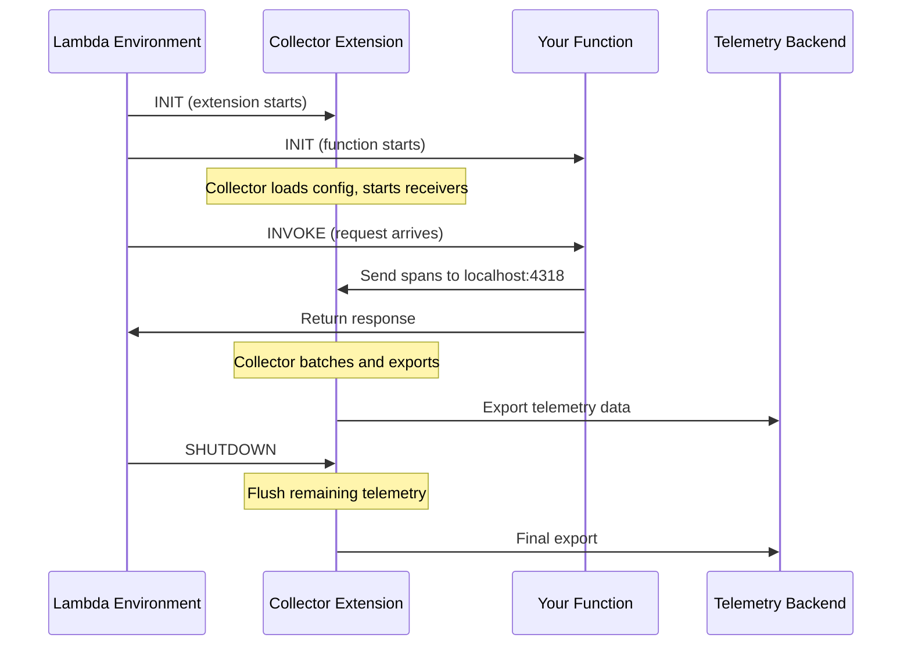

# How to Configure the Collector Lambda Extension

Author: [nawazdhandala](https://www.github.com/nawazdhandala)

Tags: OpenTelemetry, Collector, AWS Lambda, Lambda Extension, Serverless, Configuration

Description: Step-by-step guide to deploying and configuring the OpenTelemetry Collector as a Lambda extension for efficient telemetry export from serverless functions.

---

The OpenTelemetry Collector Lambda extension runs as a companion process alongside your Lambda function. Instead of your function exporting telemetry directly to a remote backend, it sends data to the collector over localhost. The collector handles buffering, batching, and export asynchronously, which keeps your function's response times fast and your telemetry pipeline reliable.

This post covers how to deploy the extension, write effective collector configurations for the Lambda environment, and handle the unique lifecycle constraints that come with serverless.

## How the Extension Fits Into Lambda's Lifecycle

Lambda extensions have their own lifecycle that runs in parallel with your function. The collector extension initializes during the `INIT` phase, runs alongside your function during `INVOKE` phases, and gets a `SHUTDOWN` signal when the execution environment is being reclaimed.



The critical detail here is that the collector extension can continue running after your function returns its response. Lambda gives extensions up to 2 seconds after shutdown to finish their work. This means telemetry export does not block your function's response latency.

## Adding the Extension Layer

The collector extension is distributed as a Lambda layer. You add it the same way you would add any other layer.

```bash
# Add the collector extension layer to your function
aws lambda update-function-configuration \
  --function-name my-function \
  --layers arn:aws:lambda:us-east-1:184161586896:layer:opentelemetry-collector-amd64:1 \
  --environment "Variables={
    OPENTELEMETRY_COLLECTOR_CONFIG_URI=/var/task/collector-config.yaml,
    OTEL_SERVICE_NAME=my-function
  }"
```

The `OPENTELEMETRY_COLLECTOR_CONFIG_URI` variable tells the extension where to find its configuration file. You can bundle this file with your function's deployment package or reference one from an S3 bucket. For most use cases, bundling it with your function code is simplest.

## Writing a Basic Collector Configuration

The collector configuration for Lambda is different from what you would use on a long-running server. Lambda functions are ephemeral, so you need to think carefully about batching, timeouts, and memory limits.

```yaml
# collector-config.yaml
# Collector configuration optimized for the Lambda environment
receivers:
  otlp:
    protocols:
      # HTTP is preferred over gRPC in Lambda for lower overhead
      http:
        endpoint: 0.0.0.0:4318

processors:
  batch:
    # Short timeout because Lambda may freeze at any time
    timeout: 5s
    # Small batch size to avoid buffering too much in memory
    send_batch_size: 50
    send_batch_max_size: 100

exporters:
  otlphttp:
    endpoint: https://ingest.example.com
    headers:
      # Use environment variable substitution for secrets
      api-key: "${API_KEY}"
    compression: gzip
    retry_on_failure:
      enabled: true
      initial_interval: 1s
      max_interval: 5s
      # Fewer retries than a normal deployment
      max_elapsed_time: 15s

service:
  pipelines:
    traces:
      receivers: [otlp]
      processors: [batch]
      exporters: [otlphttp]
    metrics:
      receivers: [otlp]
      processors: [batch]
      exporters: [otlphttp]
```

There are several deliberate choices in this configuration. The batch timeout is set to 5 seconds rather than the typical 30 seconds used in server deployments. This is because Lambda execution environments can be frozen between invocations, and any data sitting in the batch processor's buffer will be stuck there until the next invocation thaws the environment. A shorter timeout ensures data gets exported quickly.

The retry configuration is also conservative. In a server environment, you might retry for minutes. In Lambda, the extension has limited time to work, so capping retries at 15 seconds prevents the extension from hanging during shutdown.

## Configuring for Multiple Signal Types

Most production setups need to handle traces, metrics, and logs. You can configure separate pipelines for each signal type, with different processing rules.

```yaml
# multi-signal-config.yaml
# Handle traces, metrics, and logs with separate pipelines
receivers:
  otlp:
    protocols:
      http:
        endpoint: 0.0.0.0:4318

processors:
  batch/traces:
    timeout: 5s
    send_batch_size: 50
  batch/metrics:
    # Metrics can tolerate slightly longer batching
    timeout: 10s
    send_batch_size: 200
  batch/logs:
    timeout: 5s
    send_batch_size: 100

  # Add Lambda resource attributes to all telemetry
  resource:
    attributes:
      - key: cloud.provider
        value: aws
        action: upsert
      - key: cloud.platform
        value: aws_lambda
        action: upsert

  # Filter out noisy health check spans
  filter/traces:
    error_mode: ignore
    traces:
      span:
        - 'attributes["http.route"] == "/health"'

exporters:
  otlphttp/traces:
    endpoint: https://traces.example.com
    headers:
      api-key: "${TRACES_API_KEY}"
  otlphttp/metrics:
    endpoint: https://metrics.example.com
    headers:
      api-key: "${METRICS_API_KEY}"
  otlphttp/logs:
    endpoint: https://logs.example.com
    headers:
      api-key: "${LOGS_API_KEY}"

service:
  pipelines:
    traces:
      receivers: [otlp]
      processors: [resource, filter/traces, batch/traces]
      exporters: [otlphttp/traces]
    metrics:
      receivers: [otlp]
      processors: [resource, batch/metrics]
      exporters: [otlphttp/metrics]
    logs:
      receivers: [otlp]
      processors: [resource, batch/logs]
      exporters: [otlphttp/logs]
```

Each pipeline gets its own batch processor instance with settings tuned for that signal type. Metrics typically have higher cardinality but lower urgency, so the batch timeout can be longer. Traces and logs benefit from faster export to keep debugging workflows responsive.

The resource processor adds cloud-specific attributes to all telemetry. This is useful when your backend receives data from multiple environments and you need to filter or group by platform.

## Memory Management

Lambda functions have a fixed memory allocation, and the collector extension shares that memory with your function. If the collector buffers too much data, it can cause out-of-memory errors that crash your function.

```yaml
# memory-aware-config.yaml
# Configuration with memory limits to prevent OOM errors
receivers:
  otlp:
    protocols:
      http:
        endpoint: 0.0.0.0:4318

processors:
  # Memory limiter prevents the collector from using too much RAM
  memory_limiter:
    # Check memory usage every second
    check_interval: 1s
    # Start dropping data at 40MB to leave room for the function
    limit_mib: 40
    # Begin throttling at 30MB
    spike_limit_mib: 10

  batch:
    timeout: 5s
    send_batch_size: 50

exporters:
  otlphttp:
    endpoint: https://ingest.example.com
    headers:
      api-key: "${API_KEY}"

service:
  pipelines:
    traces:
      receivers: [otlp]
      # Memory limiter must come before batch processor
      processors: [memory_limiter, batch]
      exporters: [otlphttp]
```

The `memory_limiter` processor is essential in Lambda. Set `limit_mib` based on your function's total memory allocation minus what your function code needs. For a 256MB function where your code uses around 150MB, setting the collector's limit to 40MB leaves a comfortable buffer.

The `memory_limiter` must be the first processor in the pipeline. If you put it after the batch processor, the batch buffer can grow unbounded before the limiter has a chance to intervene.

## Loading Configuration from S3

For teams managing many Lambda functions, maintaining a collector config file in each function's deployment package becomes tedious. You can load the configuration from S3 instead.

```bash
# Point the extension at an S3 configuration file
aws lambda update-function-configuration \
  --function-name my-function \
  --environment "Variables={
    OPENTELEMETRY_COLLECTOR_CONFIG_URI=s3://my-configs-bucket/collector/lambda-config.yaml
  }"
```

Your function's execution role needs `s3:GetObject` permission on the configuration file.

```json
{
  "Version": "2012-10-17",
  "Statement": [
    {
      "Effect": "Allow",
      "Action": "s3:GetObject",
      "Resource": "arn:aws:s3:::my-configs-bucket/collector/*"
    }
  ]
}
```

This approach lets you update the collector configuration for all functions by changing a single S3 object. The extension fetches the configuration during the INIT phase, so changes take effect on the next cold start.

## Environment Variable Configuration

For simpler setups, you can configure the collector entirely through environment variables without a YAML file.

```bash
# Minimal configuration using only environment variables
aws lambda update-function-configuration \
  --function-name my-function \
  --environment "Variables={
    OTEL_EXPORTER_OTLP_ENDPOINT=https://ingest.example.com,
    OTEL_EXPORTER_OTLP_HEADERS=api-key=your-key-here,
    OTEL_EXPORTER_OTLP_COMPRESSION=gzip,
    OTEL_SERVICE_NAME=my-function
  }"
```

When no configuration file is specified, the collector extension uses sensible defaults with an OTLP receiver on port 4318 and an OTLP exporter configured through standard OpenTelemetry environment variables. This is the quickest way to get started, though you lose the ability to add processors or configure multiple pipelines.

## Verifying the Extension Is Working

After deploying, you should verify that the extension is running and exporting data. Check the function's CloudWatch logs for collector startup messages.

```bash
# Check CloudWatch logs for collector extension output
aws logs filter-log-events \
  --log-group-name /aws/lambda/my-function \
  --filter-pattern "opentelemetry" \
  --start-time $(date -d '1 hour ago' +%s)000
```

You should see log lines indicating the collector started, the receivers are listening, and the exporters connected successfully. If you see connection errors, verify your function's VPC configuration allows outbound HTTPS traffic to your telemetry backend.

The collector Lambda extension transforms how you handle telemetry in serverless environments. By separating the concerns of instrumentation and export, it gives your functions faster response times while providing a reliable, configurable telemetry pipeline that works within Lambda's unique constraints.
