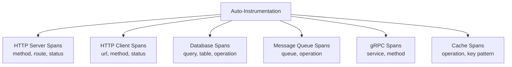
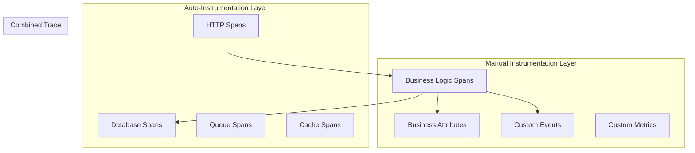

# How to Compare OpenTelemetry Auto-Instrumentation vs Manual Instrumentation

Author: [nawazdhandala](https://www.github.com/nawazdhandala)

Tags: OpenTelemetry, Auto-Instrumentation, Manual Instrumentation, Tracing, Observability

Description: A detailed comparison of OpenTelemetry auto-instrumentation and manual instrumentation approaches, with code examples showing when to use each strategy.

---

One of the first decisions you face when adopting OpenTelemetry is how to instrument your applications. Do you use auto-instrumentation that works with little or no code changes, or do you manually instrument your code for precise control? The answer for most teams is "both," but understanding the trade-offs helps you decide where each approach fits.

## What Auto-Instrumentation Actually Does

Auto-instrumentation uses language-specific mechanisms to intercept calls to popular libraries and frameworks, creating spans and metrics automatically. The approach varies by language:

- **Java**: A Java agent that uses bytecode manipulation to intercept method calls
- **Python**: Module-level patching (monkey patching) of library functions
- **.NET**: Runtime hooks and DiagnosticSource listeners
- **Node.js**: Module loading hooks that wrap require/import calls
- **Go**: Currently no auto-instrumentation agent (requires manual or compile-time instrumentation)

Here is what auto-instrumentation looks like in practice:

```bash
# Java auto-instrumentation via agent
# No code changes needed in the application
java -javaagent:opentelemetry-javaagent.jar \
  -Dotel.service.name=payment-service \
  -Dotel.exporter.otlp.endpoint=http://collector:4317 \
  -jar payment-service.jar
```

```python
# Python auto-instrumentation setup
# Install the auto-instrumentation packages
# pip install opentelemetry-distro opentelemetry-exporter-otlp

# Run with the auto-instrumentation command
# opentelemetry-instrument python app.py

# Or configure programmatically
from opentelemetry.instrumentation.auto_instrumentation import sitecustomize
from opentelemetry.instrumentation.flask import FlaskInstrumentor
from opentelemetry.instrumentation.requests import RequestsInstrumentor
from opentelemetry.instrumentation.sqlalchemy import SQLAlchemyInstrumentor

# Each instrumentor patches a specific library
FlaskInstrumentor().instrument()
RequestsInstrumentor().instrument()
SQLAlchemyInstrumentor().instrument()
```

With just these few lines (or a command-line flag), you get spans for every HTTP request handled by Flask, every outgoing HTTP call through requests, and every database query through SQLAlchemy. No changes to your business logic code.

## What You Get for Free

Auto-instrumentation typically captures:



For a typical web service, this covers 80-90% of the span data you need for understanding request flow and identifying performance bottlenecks.

## What Auto-Instrumentation Misses

Auto-instrumentation cannot see inside your business logic. It instruments the boundaries (HTTP, database, queue) but not the domain-specific operations that happen between those boundaries.

Consider this example:

```python
# This function has important business logic steps
# Auto-instrumentation will not create spans for these
def process_order(order):
    # Step 1: Validate the order (auto-instrumentation sees nothing here)
    validation_result = validate_order_rules(order)

    # Step 2: Calculate pricing (complex logic, no library calls)
    final_price = calculate_dynamic_pricing(order, validation_result)

    # Step 3: Check fraud score (calls an internal service)
    # Auto-instrumentation WILL capture the HTTP call to the fraud service
    fraud_score = fraud_service.check(order)

    # Step 4: Apply business rules (pure Python, invisible to auto-instrumentation)
    if fraud_score > 0.8:
        flag_for_review(order)

    # Step 5: Save to database (auto-instrumentation WILL capture this)
    db.save(order)
```

In this example, auto-instrumentation captures the HTTP call to the fraud service and the database save. But the validation, pricing calculation, and business rule application are invisible. If `calculate_dynamic_pricing` is slow, you will not see it in your traces.

## Manual Instrumentation for Business Logic

This is where manual instrumentation fills the gap:

```python
# Same function with manual instrumentation added
# Gives visibility into business-specific operations
from opentelemetry import trace

tracer = trace.get_tracer("order-service")

def process_order(order):
    with tracer.start_as_current_span("process-order") as span:
        span.set_attribute("order.id", order.id)
        span.set_attribute("order.item_count", len(order.items))

        # Step 1: Validate with its own span
        with tracer.start_as_current_span("validate-order") as val_span:
            validation_result = validate_order_rules(order)
            val_span.set_attribute("validation.passed", validation_result.is_valid)
            val_span.set_attribute("validation.rules_checked", validation_result.rules_count)

        # Step 2: Pricing calculation with timing visibility
        with tracer.start_as_current_span("calculate-pricing") as price_span:
            final_price = calculate_dynamic_pricing(order, validation_result)
            price_span.set_attribute("pricing.final_amount", float(final_price))
            price_span.set_attribute("pricing.discount_applied", final_price < order.list_price)

        # Step 3: Fraud check (auto-instrumentation handles the HTTP call,
        # but we add business context)
        with tracer.start_as_current_span("fraud-check") as fraud_span:
            fraud_score = fraud_service.check(order)
            fraud_span.set_attribute("fraud.score", fraud_score)
            fraud_span.set_attribute("fraud.flagged", fraud_score > 0.8)

        # Step 4: Business rules
        if fraud_score > 0.8:
            with tracer.start_as_current_span("flag-for-review"):
                flag_for_review(order)

        # Step 5: Database save (auto-instrumentation handles the query span)
        db.save(order)
```

Now you have complete visibility into every step of the order processing pipeline, including business-specific attributes that make traces useful for debugging domain problems.

## The Hybrid Approach

The most effective strategy combines both:



Auto-instrumentation provides the infrastructure layer. Manual instrumentation provides the business layer. Together, they give you full visibility.

## Performance Impact

Auto-instrumentation adds overhead because it intercepts every call to instrumented libraries, even calls you might not care about. The Java agent, for example, instruments all JDBC calls, all HTTP calls, and all gRPC calls by default.

```yaml
# Java agent configuration to limit auto-instrumentation scope
# Disabling unnecessary instrumentations reduces overhead
# Set via environment variables or system properties

# Disable specific instrumentations you do not need
OTEL_INSTRUMENTATION_COMMON_DEFAULT_ENABLED: "true"
OTEL_INSTRUMENTATION_JDBC_ENABLED: "true"
OTEL_INSTRUMENTATION_HTTP_CLIENT_ENABLED: "true"
# Disable instrumentations for libraries you are not using
OTEL_INSTRUMENTATION_KAFKA_ENABLED: "false"
OTEL_INSTRUMENTATION_GRPC_ENABLED: "false"
OTEL_INSTRUMENTATION_REDIS_ENABLED: "false"
```

Manual instrumentation gives you precise control. You only create spans where you need them, so the overhead is exactly what you choose.

In practice, the performance impact of auto-instrumentation is small for most applications. The Java agent adds roughly 1-3% latency overhead and about 50-100 MB of additional memory usage. Python auto-instrumentation has similar proportional overhead.

## Maintenance Burden

Auto-instrumentation requires minimal maintenance. When you update the agent version, you automatically get instrumentation for new library versions and new libraries.

Manual instrumentation is code you own and maintain. When you refactor business logic, you need to update spans. When you add new features, you need to add instrumentation. This is the ongoing cost of manual instrumentation.

```python
# Manual instrumentation that needs updating when code changes
# This is maintenance you take on with manual instrumentation
def process_order_v2(order):
    with tracer.start_as_current_span("process-order") as span:
        span.set_attribute("order.id", order.id)
        # When you add new fields, remember to add attributes
        span.set_attribute("order.priority", order.priority)
        span.set_attribute("order.channel", order.sales_channel)

        # When you add new steps, remember to add spans
        with tracer.start_as_current_span("loyalty-check"):
            loyalty_tier = check_loyalty_status(order.customer_id)
            # New business logic needs new instrumentation
```

## Language-Specific Considerations

The auto-instrumentation experience varies significantly by language:

| Language | Auto-Instrumentation Maturity | Mechanism | Zero-Code Possible |
|----------|------------------------------|-----------|-------------------|
| Java | Excellent | Java agent | Yes |
| Python | Good | Module patching | Yes (with CLI) |
| .NET | Good | Runtime hooks | Yes (with startup hook) |
| Node.js | Good | Require hooks | Yes (with --require) |
| Go | Limited | None (compile-time only) | No |
| Rust | None | N/A | No |

For Go and Rust, manual instrumentation is the only option. For Java, auto-instrumentation is so mature that many teams use it exclusively for infrastructure spans.

## Recommendation

Start with auto-instrumentation for quick wins. It takes minutes to set up and immediately gives you visibility into the communication patterns between your services. Then add manual instrumentation incrementally for the business logic that matters most.

Focus manual instrumentation on:

- Business-critical operations (payment processing, order fulfillment)
- Operations where latency matters to users
- Decision points that affect user experience
- Custom metrics that track business KPIs

Skip manual instrumentation for:

- Simple CRUD operations already covered by database instrumentation
- HTTP handler entry points already covered by framework instrumentation
- Library calls where auto-instrumentation provides sufficient detail

The hybrid approach gives you the best coverage with reasonable maintenance effort. Start broad with auto-instrumentation and go deep with manual instrumentation where it counts.
