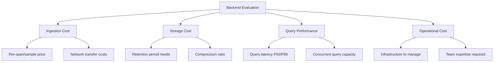
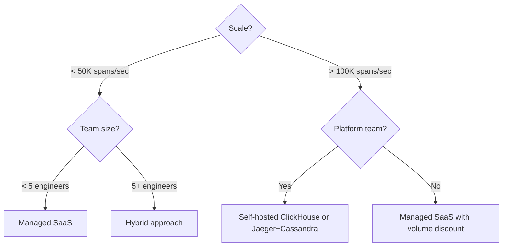

# How to Compare OpenTelemetry Backend Options for Cost and Performance

Author: [nawazdhandala](https://www.github.com/nawazdhandala)

Tags: OpenTelemetry, Backend Comparison, Cost Analysis, Performance, Observability, Storage

Description: A practical framework for evaluating OpenTelemetry backend options based on cost, query performance, scalability, and operational overhead.

---

Picking an OpenTelemetry backend is one of those decisions that is easy to get wrong and expensive to change later. The ecosystem has grown rapidly, and you can now choose from managed SaaS platforms, open-source self-hosted solutions, and hybrid approaches. Each option has different cost characteristics, performance profiles, and operational requirements.

This guide provides a framework for comparing backend options based on the factors that actually matter in production: cost at your scale, query performance for your use cases, operational overhead, and long-term flexibility.

## The Comparison Framework

Before diving into specific backends, you need to define what you are comparing. The four dimensions that matter most are ingestion cost, storage cost, query performance, and operational cost. Most teams fixate on the first two and ignore the last two, which is a mistake. A free open-source backend that requires two full-time engineers to operate is not actually cheaper than a managed service.



## Self-Hosted Open-Source Options

The open-source landscape for OpenTelemetry backends is rich. Here are the most common options with their cost and performance characteristics.

**Jaeger with Elasticsearch** is the classic trace backend. Elasticsearch handles full-text search well, which makes trace queries by attribute fast. But Elasticsearch is memory-hungry and needs careful tuning. At moderate scale (around 50,000 spans per second), you are looking at a cluster of 6 to 12 nodes with 64GB RAM each. Storage costs depend on retention, but expect roughly 500 bytes per span after indexing.

**Jaeger with Cassandra** trades query flexibility for write throughput. Cassandra handles high write volumes better than Elasticsearch, but trace search is more limited. You lose the ability to search by arbitrary span attributes unless you build secondary indexes. Cost-wise, Cassandra uses less memory per node but needs more nodes for the same query performance.

**ClickHouse** has become a popular choice for all three signal types. It uses columnar storage with aggressive compression, which means your storage costs can be 5 to 10 times lower than Elasticsearch for the same data. Query performance on aggregations is excellent, but point queries (finding a single trace by ID) are slower than in a purpose-built system. A ClickHouse cluster handling 100,000 spans per second typically needs 3 to 6 nodes with NVMe storage.

**Prometheus with Thanos or Cortex** covers the metrics side. Raw Prometheus is free but limited in retention and scalability. Adding Thanos pushes historical data to object storage (S3 or GCS), which costs roughly $0.02 per GB per month. Cortex adds multi-tenancy but has higher operational complexity.

Here is a rough cost comparison for self-hosted options processing 100,000 spans per second with 30-day retention.

```yaml
# Estimated monthly infrastructure costs for self-hosted backends
# Based on 100K spans/second, 30-day retention, AWS us-east-1 pricing
# These are approximate and vary significantly with configuration

# Jaeger + Elasticsearch
jaeger_elasticsearch:
  # 9 data nodes at i3.2xlarge (8 vCPU, 61GB RAM, 1.9TB NVMe)
  compute: "$9,396/month"
  # EBS storage for replicas and overhead
  storage: "$2,400/month"
  total: "$11,796/month"
  storage_per_span: "~500 bytes"
  query_latency_p50: "200ms"

# Jaeger + Cassandra
jaeger_cassandra:
  # 6 nodes at i3.xlarge (4 vCPU, 30.5GB RAM, 950GB NVMe)
  compute: "$3,132/month"
  storage: "$1,200/month"
  total: "$4,332/month"
  storage_per_span: "~350 bytes"
  query_latency_p50: "500ms"

# ClickHouse
clickhouse:
  # 3 nodes at m5.4xlarge (16 vCPU, 64GB RAM)
  compute: "$3,312/month"
  # gp3 EBS with high compression ratio
  storage: "$600/month"
  total: "$3,912/month"
  storage_per_span: "~80 bytes"
  query_latency_p50: "150ms for aggregations"
```

## Managed SaaS Options

Managed backends shift the operational cost to a vendor in exchange for a per-unit price that is typically higher than self-hosting at scale. The crossover point where self-hosting becomes cheaper varies, but it is usually around 50,000 to 100,000 spans per second for traces and 500,000 active series for metrics.

The main advantage of managed services is not just operations. It is the features that come built in: alerting, dashboards, anomaly detection, and correlation between signals. Building these yourself on top of open-source backends takes significant engineering effort.

When evaluating managed services, ask for pricing at your expected scale, not just the getting-started tier. Many vendors offer attractive entry pricing that scales poorly. Request a quote for your actual volume: the number of spans per second, active metric series, log volume in GB per day, and retention requirements.

## Building a Cost Model

To compare options fairly, build a cost model that accounts for all expenses. Here is a template.

```yaml
# Cost model template for backend comparison
# Fill in values for each backend option you are evaluating

backend_name: "Example Backend"

# Direct costs: what you pay for the infrastructure or service
direct_costs:
  # For self-hosted: compute, storage, network
  compute_monthly: 0
  storage_monthly: 0
  network_egress_monthly: 0
  # For managed: subscription or usage-based pricing
  subscription_monthly: 0
  per_span_cost: 0
  per_sample_cost: 0
  per_gb_log_cost: 0

# Operational costs: what it costs to run and maintain
operational_costs:
  # Hours per week spent on maintenance, upgrades, incidents
  engineering_hours_per_week: 0
  # Hourly cost of your engineering team (fully loaded)
  engineering_hourly_rate: 150
  # Monthly operational cost = hours * rate * 4.33 weeks
  monthly_operational: 0

# Opportunity costs: what you give up
opportunity_costs:
  # Features you need to build yourself (alerting, dashboards, etc.)
  custom_development_months: 0
  # Migration effort if you switch later
  estimated_migration_weeks: 0

# Total monthly cost
total_monthly: 0
# Cost per million spans (for normalization)
cost_per_million_spans: 0
```

The operational cost is where most comparisons fall apart. A team of two engineers spending 20% of their time operating a self-hosted backend at $200K fully-loaded salary each costs $6,667 per month. That needs to be added to the infrastructure cost for a fair comparison.

## Performance Benchmarking

Cost only tells half the story. You also need to benchmark query performance for your actual query patterns. Here are the queries you should test.

```bash
# Benchmark script for trace backend query performance
# Run each query 100 times and record P50, P95, P99 latency

# Query 1: Find traces by service name in the last hour
# This is the most common query pattern
# Target: < 500ms P95
time curl -s "http://backend:port/api/traces?service=payment-service&lookback=1h&limit=20"

# Query 2: Get a full trace by trace ID
# Used when investigating a specific request
# Target: < 200ms P95
time curl -s "http://backend:port/api/traces/abc123def456"

# Query 3: Find error traces with attribute filtering
# Used during incident investigation
# Target: < 2s P95
time curl -s "http://backend:port/api/traces?service=api-gateway&tags=error%3Dtrue&lookback=6h"

# Query 4: Aggregate latency statistics
# Used for dashboards and SLO tracking
# Target: < 3s P95
time curl -s "http://backend:port/api/metrics?operation=checkout&lookback=24h&step=5m"
```

Run these benchmarks at your expected data volume, not on an empty database. Backend performance often degrades as data accumulates, so load at least a week of realistic data before benchmarking.

## Decision Matrix

Here is a practical decision matrix that maps common scenarios to recommended approaches.

For teams with fewer than 5 engineers and moderate scale (under 50K spans per second), a managed SaaS backend is usually the right choice. The operational savings outweigh the higher per-unit cost.

For teams with a dedicated platform or SRE team and high scale (over 100K spans per second), self-hosted ClickHouse or a Jaeger plus Cassandra combination gives you the best cost efficiency. You have the team to operate it and the scale to justify the operational investment.

For teams in between, a hybrid approach works well. Use a managed service for traces and logs where query UX matters, and self-hosted Prometheus with Thanos for metrics where the tooling is mature and the operational burden is lower.



## Migration Considerations

Whichever backend you choose, plan for the possibility of switching later. The OpenTelemetry Collector is your best friend here. By routing all telemetry through a collector, your applications are decoupled from the backend. Changing backends becomes a collector configuration change, not an application code change.

During migration, run both backends in parallel using the multi-exporter pattern. Send data to both the old and new backends for at least two weeks. Compare query results, verify that dashboards and alerts produce the same results, and measure the performance difference with real data.

```yaml
# Migration collector config: dual-write to old and new backends
# Run this for 2+ weeks to validate the new backend
service:
  pipelines:
    traces:
      receivers: [otlp]
      processors: [batch]
      # Both exporters receive identical data
      exporters: [otlp/old-backend, otlp/new-backend]
```

## Wrapping Up

There is no universally best OpenTelemetry backend. The right choice depends on your scale, your team, and your priorities. Build a real cost model that includes operational overhead, benchmark with realistic data and query patterns, and use the collector to keep your options open. The most expensive mistake is not picking the wrong backend. It is picking one that you cannot change when your needs evolve.
