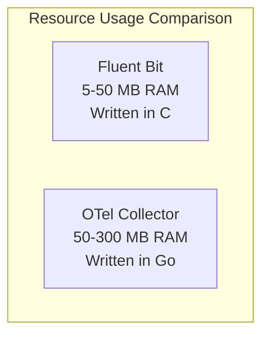
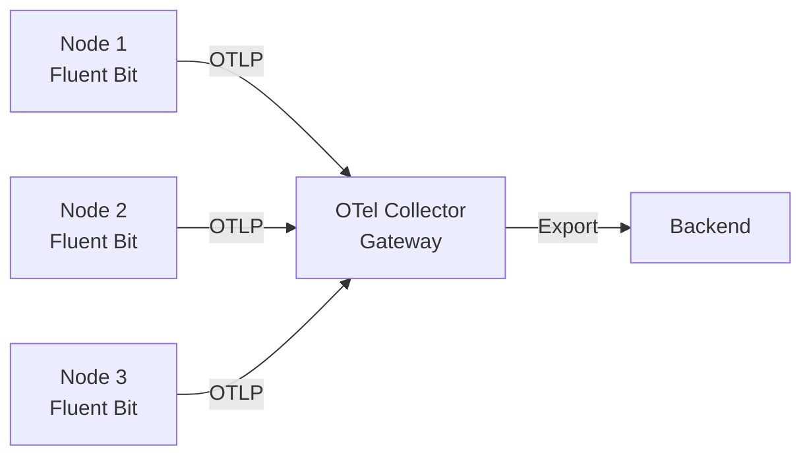

# How to Compare OpenTelemetry Collector vs Fluent Bit

Author: [nawazdhandala](https://www.github.com/nawazdhandala)

Tags: OpenTelemetry, Fluent Bit, Log Collection, Observability, Lightweight Agents

Description: A hands-on comparison of OpenTelemetry Collector and Fluent Bit for lightweight telemetry collection, with configuration examples and performance guidance.

---

When you need a lightweight telemetry agent that runs on every node in your cluster, both the OpenTelemetry Collector and Fluent Bit are strong contenders. Fluent Bit was designed specifically to be a high-performance, low-resource log forwarder. The OpenTelemetry Collector aims to be the universal telemetry pipeline. This guide compares them across the dimensions that matter most for day-to-day operations.

## What Makes Fluent Bit Different from Fluentd

Before diving in, it helps to clarify that Fluent Bit is not just a smaller version of Fluentd. Fluent Bit is written entirely in C, designed for embedded and containerized environments, and focuses on being extremely lightweight. It was built from scratch with performance as the primary goal. While it shares the Fluent ecosystem branding, its internals are completely different from Fluentd's Ruby-based architecture.

## Resource Footprint

This is where Fluent Bit really shines. A typical Fluent Bit instance uses 5-10 MB of memory at idle and can process thousands of log records per second with minimal CPU usage. It was literally designed to run on IoT devices and edge hardware.

The OpenTelemetry Collector is also efficient for a Go application, but it is a heavier process. A minimal OTel Collector instance starts at around 30-50 MB of memory. Under load, it typically uses 100-300 MB depending on the pipeline configuration.



If your primary concern is running a lightweight agent on resource-constrained nodes, Fluent Bit has a clear advantage.

## Configuration Approaches

Fluent Bit uses an INI-style configuration format (though YAML support was added in version 2.0):

```ini
# Fluent Bit configuration for collecting container logs
# Uses tail input to watch log files and forward output to send data
[INPUT]
    # Tail plugin reads from log files
    Name              tail
    Path              /var/log/containers/*.log
    Parser            docker
    Tag               kube.*
    Refresh_Interval  5
    Mem_Buf_Limit     10MB
    Skip_Long_Lines   On

[FILTER]
    # Kubernetes filter enriches logs with pod metadata
    Name              kubernetes
    Match             kube.*
    Kube_URL          https://kubernetes.default.svc:443
    Kube_CA_File      /var/run/secrets/kubernetes.io/serviceaccount/ca.crt
    Kube_Token_File   /var/run/secrets/kubernetes.io/serviceaccount/token
    Merge_Log         On

[OUTPUT]
    # Forward logs to a central collector using OpenTelemetry protocol
    Name              opentelemetry
    Match             *
    Host              otel-gateway.monitoring.svc
    Port              4318
    Traces_uri        /v1/traces
    Logs_uri          /v1/logs
```

The equivalent OpenTelemetry Collector configuration:

```yaml
# OTel Collector configuration for collecting container logs
# Uses filelog receiver and k8sattributes processor
receivers:
  filelog:
    include:
      - /var/log/containers/*.log
    operators:
      # Parse the Docker JSON log format
      - type: json_parser
        id: docker_parser

processors:
  # Enrich logs with Kubernetes metadata
  k8sattributes:
    extract:
      metadata:
        - k8s.pod.name
        - k8s.namespace.name
        - k8s.node.name
        - k8s.deployment.name
  batch:
    timeout: 5s

exporters:
  otlp:
    endpoint: "otel-gateway.monitoring.svc:4317"
    tls:
      insecure: true

service:
  pipelines:
    logs:
      receivers: [filelog]
      processors: [k8sattributes, batch]
      exporters: [otlp]
```

Both achieve the same outcome. Fluent Bit's configuration is more compact, while the OTel Collector's YAML is more structured and familiar to Kubernetes users.

## Signal Type Support

This is a key differentiator. Fluent Bit was originally a log processor and has expanded to support metrics and traces, but logs remain its core strength.

| Signal | Fluent Bit | OTel Collector |
|--------|-----------|----------------|
| Logs | Excellent, primary focus | Strong, full pipeline |
| Metrics | Basic support (Prometheus, node) | Comprehensive support |
| Traces | Basic OTLP forwarding | Full trace processing |
| Log parsing | Rich built-in parsers | Operator-based parsing |
| Metric processing | Limited transformations | Full OTTL support |
| Trace processing | Passthrough mainly | Sampling, tail-based |

If you need sophisticated trace processing like tail-based sampling, span-to-metrics conversion, or complex metric transformations, the OpenTelemetry Collector is the better fit. If your primary need is efficient log collection with basic metrics, Fluent Bit does the job with fewer resources.

## Parsing and Transformation

Fluent Bit includes a large number of built-in parsers for common log formats:

```ini
# Fluent Bit parser definitions for common log formats
# These parse structured data from raw log lines
[PARSER]
    Name        apache
    Format      regex
    Regex       ^(?<host>[^ ]*) [^ ]* (?<user>[^ ]*) \[(?<time>[^\]]*)\] "(?<method>\S+)(?: +(?<path>[^\"]*?)(?: +\S*)?)?" (?<code>[^ ]*) (?<size>[^ ]*)
    Time_Key    time
    Time_Format %d/%b/%Y:%H:%M:%S %z

[PARSER]
    Name        json
    Format      json
    Time_Key    time
    Time_Format %Y-%m-%dT%H:%M:%S.%L
```

The OpenTelemetry Collector uses stanza-based operators for log parsing:

```yaml
# OTel Collector filelog receiver with custom parsing operators
# Chains multiple operators for multi-stage log parsing
receivers:
  filelog:
    include:
      - /var/log/apache/access.log
    operators:
      # First, extract fields using regex
      - type: regex_parser
        regex: '^(?P<host>[^ ]*) [^ ]* (?P<user>[^ ]*) \[(?P<time>[^\]]*)\] "(?P<method>\S+)(?: +(?P<path>[^"]*?)(?: +\S*)?)?" (?P<code>[^ ]*) (?P<size>[^ ]*)'
        timestamp:
          parse_from: attributes.time
          layout: '%d/%b/%Y:%H:%M:%S %z'
      # Then, convert status code to integer for filtering
      - type: severity_parser
        parse_from: attributes.code
        mapping:
          error: 5xx
          warn: 4xx
          info: 2xx
```

Both are capable, but Fluent Bit's parser library covers more formats out of the box. The OTel Collector's operator chain is more flexible for building custom parsing logic.

## Kubernetes Integration

Both tools have mature Kubernetes deployments. Fluent Bit is the default log shipper in many Kubernetes distributions and managed services. AWS EKS, for example, uses Fluent Bit as its recommended log forwarding solution.

```yaml
# Kubernetes DaemonSet for Fluent Bit with minimal resource requests
# Designed for efficient per-node log collection
apiVersion: apps/v1
kind: DaemonSet
metadata:
  name: fluent-bit
  namespace: monitoring
spec:
  selector:
    matchLabels:
      app: fluent-bit
  template:
    spec:
      containers:
        - name: fluent-bit
          image: fluent/fluent-bit:3.0
          resources:
            requests:
              # Fluent Bit needs very little memory
              memory: "32Mi"
              cpu: "50m"
            limits:
              memory: "128Mi"
              cpu: "200m"
```

The OpenTelemetry Collector has its own operator for Kubernetes that provides auto-discovery and automatic configuration, which is more sophisticated but also more complex to set up.

## Output and Export Options

Fluent Bit supports over 30 output plugins, including direct support for most major cloud logging services (CloudWatch, Stackdriver, Azure Log Analytics), databases (Elasticsearch, InfluxDB), and message queues (Kafka, NATS). It also supports OTLP export, which means you can use Fluent Bit as a lightweight collection agent that forwards to an OTel Collector gateway.

The OpenTelemetry Collector's contrib repository has exporters for most major backends, and OTLP is its native protocol. The exporter ecosystem is large and growing.

## A Common Hybrid Pattern

Many production environments use both tools together:



Fluent Bit runs as a DaemonSet on every node, collecting logs with minimal overhead. It forwards everything via OTLP to an OpenTelemetry Collector gateway, which handles heavy processing like sampling, enrichment, and routing to multiple backends.

This gives you the best of both worlds: Fluent Bit's lightweight collection and the OTel Collector's powerful processing capabilities.

## Decision Framework

Choose Fluent Bit when:

- Minimal resource usage per node is critical
- Log collection is your primary use case
- You are running on resource-constrained environments
- You need built-in parsers for many log formats
- You want the simplest possible agent on each node

Choose the OpenTelemetry Collector when:

- You need a single agent for traces, metrics, and logs
- Complex telemetry processing is required (sampling, OTTL transforms)
- Vendor neutrality is a priority
- You want consistent configuration across all signal types

## Conclusion

Fluent Bit and the OpenTelemetry Collector are both excellent tools that solve overlapping but distinct problems. Fluent Bit is the lightweight specialist for log collection. The OTel Collector is the generalist that handles all telemetry types. In practice, using them together often gives you the best results, with Fluent Bit doing the light lifting at the edge and the OTel Collector doing the heavy processing centrally.
