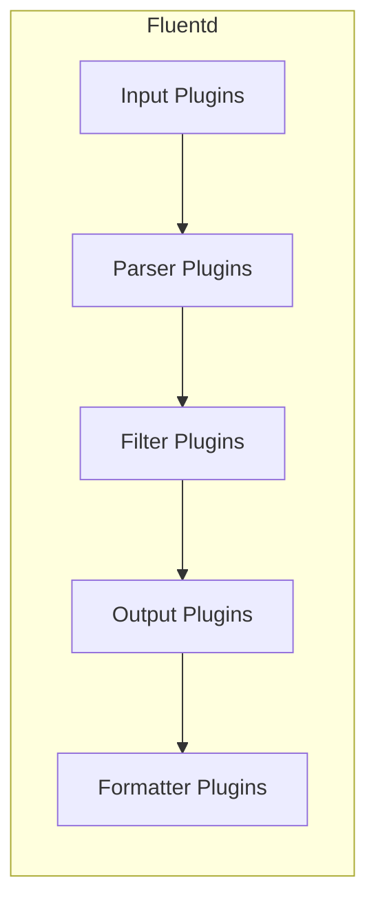
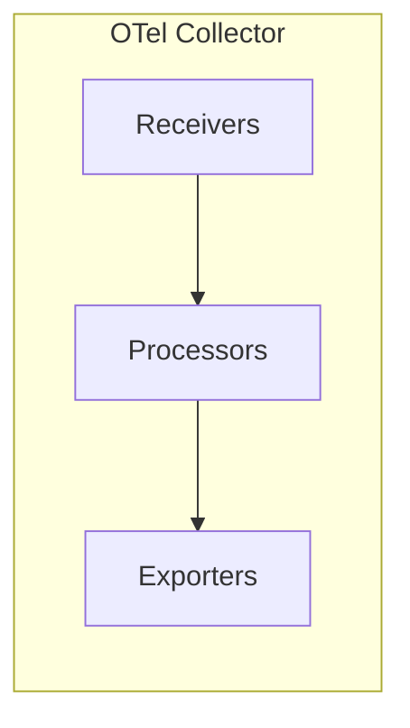

# How to Compare OpenTelemetry Collector vs Fluentd for Log Collection

Author: [nawazdhandala](https://www.github.com/nawazdhandala)

Tags: OpenTelemetry, Fluentd, Log Collection, Observability, Logging

Description: A detailed comparison of OpenTelemetry Collector and Fluentd for log collection, covering architecture, plugins, performance, and migration paths.

---

Log collection is foundational to any observability strategy. Two tools that frequently come up in this space are the OpenTelemetry Collector and Fluentd. Fluentd has been a CNCF graduated project since 2019 and has a massive ecosystem. The OpenTelemetry Collector is newer to the logging game but brings a unified approach to all telemetry signals. This article breaks down how they compare for log collection specifically.

## Origins and Philosophy

Fluentd was created in 2011 as a unified logging layer. Its core idea was simple: decouple log sources from log destinations. It introduced the concept of a "unified logging layer" that could sit between any input and any output, transforming data along the way. Fluentd is written in Ruby with performance-critical parts in C.

The OpenTelemetry Collector started as a tracing pipeline and expanded to cover metrics and logs. Its logging support matured significantly in 2023-2024, and it now provides a full-featured log collection and processing pipeline. The collector is written entirely in Go.

## Architecture Differences

Fluentd uses a plugin-based architecture with inputs, parsers, filters, outputs, and formatters:



The OpenTelemetry Collector uses its standard receiver-processor-exporter model:



Both architectures achieve similar results, but Fluentd's model has more stages, which gives finer-grained control over log parsing and formatting. The OTel Collector handles parsing within receivers and relies on processors for transformation.

## Configuration Comparison

Here is how you would configure file log collection in each tool.

Fluentd configuration:

```xml
<!-- Fluentd configuration for tailing application logs -->
<!-- Uses the tail input plugin to watch log files -->
<source>
  @type tail
  path /var/log/app/*.log
  pos_file /var/log/fluentd/app.log.pos
  tag app.logs
  <parse>
    <!-- Parse JSON-formatted log lines -->
    @type json
    time_key timestamp
    time_format %Y-%m-%dT%H:%M:%S.%NZ
  </parse>
</source>

<!-- Filter to add Kubernetes metadata -->
<filter app.logs>
  @type kubernetes_metadata
</filter>

<!-- Send logs to Elasticsearch -->
<match app.logs>
  @type elasticsearch
  host elasticsearch.example.com
  port 9200
  index_name app-logs
  <buffer>
    <!-- Buffer configuration for reliable delivery -->
    @type file
    path /var/log/fluentd/buffer
    flush_interval 5s
    chunk_limit_size 8m
    retry_max_interval 30s
  </buffer>
</match>
```

OpenTelemetry Collector configuration for the same task:

```yaml
# OTel Collector configuration for tailing application logs
# Uses the filelog receiver to watch and parse log files
receivers:
  filelog:
    include:
      - /var/log/app/*.log
    start_at: end
    operators:
      # Parse JSON log lines into structured log records
      - type: json_parser
        timestamp:
          parse_from: attributes.timestamp
          layout: '%Y-%m-%dT%H:%M:%S.%LZ'

processors:
  # Add Kubernetes metadata using the k8sattributes processor
  k8sattributes:
    extract:
      metadata:
        - k8s.pod.name
        - k8s.namespace.name
        - k8s.deployment.name
  # Batch logs before export
  batch:
    timeout: 5s
    send_batch_size: 1000

exporters:
  elasticsearch:
    endpoints:
      - "https://elasticsearch.example.com:9200"
    logs_index: app-logs

service:
  pipelines:
    logs:
      receivers: [filelog]
      processors: [k8sattributes, batch]
      exporters: [elasticsearch]
```

Both configurations achieve the same result. The Fluentd configuration uses XML-like syntax that can feel verbose but is well documented. The OTel Collector uses YAML, which most DevOps teams are already comfortable with.

## Plugin and Component Ecosystem

Fluentd's biggest strength is its plugin ecosystem. There are over 800 community plugins covering nearly every log source and destination you can think of. Need to read logs from a specific database? There is probably a Fluentd plugin for it. This maturity is hard to overstate.

The OpenTelemetry Collector's contrib repository has grown rapidly, but its log-specific components are fewer in number. The filelog receiver is powerful and handles most file-based collection needs. For specialized log sources, you might find that Fluentd still has better coverage.

| Capability | Fluentd | OTel Collector |
|-----------|---------|----------------|
| File tailing | Mature, battle-tested | Solid, actively improved |
| Syslog collection | Native plugin | Syslog receiver |
| Windows Event Log | Plugin available | Receiver available |
| Docker/Container logs | Native plugin | Container log receiver |
| Custom parsing | Regexp, JSON, CSV, etc. | Operator-based parsing |
| Community plugins | 800+ | Growing, fewer log-specific |

## Log Processing Capabilities

Fluentd provides rich log processing through its filter plugins. You can modify records, add fields, remove sensitive data, and route logs based on content.

```xml
<!-- Fluentd filter to mask sensitive data in logs -->
<filter app.logs>
  @type record_transformer
  <record>
    <!-- Remove sensitive fields before forwarding -->
    password ${record["password"] ? "***REDACTED***" : nil}
    credit_card ${record["credit_card"] ? "***REDACTED***" : nil}
  </record>
</filter>
```

The OTel Collector handles similar transformations through its transform processor:

```yaml
# OTel Collector transform processor for log manipulation
# Uses OTTL (OpenTelemetry Transformation Language) statements
processors:
  transform:
    log_statements:
      - context: log
        statements:
          # Replace sensitive field values with redacted placeholder
          - replace_pattern(attributes["password"], ".*", "***REDACTED***")
          - replace_pattern(attributes["credit_card"], ".*", "***REDACTED***")
```

The OTel Collector's OTTL (OpenTelemetry Transformation Language) is powerful but has a learning curve. Fluentd's approach with Ruby expressions in record_transformer is more flexible for complex transformations, though it comes with the overhead of Ruby evaluation.

## Performance and Resource Usage

Fluentd is written in Ruby with CRuby extensions for hot paths. Its memory usage can be unpredictable under heavy load, especially when using complex Ruby-based filters. A typical Fluentd instance processing 10,000 logs per second uses around 200-400 MB of memory.

The OpenTelemetry Collector, written in Go, generally uses less memory and CPU for equivalent workloads. The same 10,000 logs per second typically requires 100-200 MB. Go's garbage collector is also more predictable than Ruby's, which means fewer latency spikes.

For high-throughput scenarios, the OTel Collector has a clear advantage in resource efficiency. This matters when you are running collection agents on every node in a large cluster.

## Reliability and Buffering

Fluentd has a mature buffering system with file-based buffers, retry logic, and secondary outputs for failed deliveries. This system has been battle-tested for over a decade.

```xml
<!-- Fluentd buffer configuration with file-based persistence -->
<buffer>
  @type file
  path /var/log/fluentd/buffer
  flush_interval 5s
  chunk_limit_size 8m
  total_limit_size 2g
  retry_forever true
  retry_max_interval 60s
</buffer>
```

The OTel Collector has an exporter helper with retry logic and a persistent queue option:

```yaml
# OTel Collector exporter with persistent queue for reliability
exporters:
  otlp:
    endpoint: "backend.example.com:4317"
    retry_on_failure:
      enabled: true
      initial_interval: 5s
      max_interval: 30s
    sending_queue:
      enabled: true
      # Use file-based storage for persistence across restarts
      storage: file_storage
      queue_size: 10000

extensions:
  file_storage:
    directory: /var/lib/otelcol/queue
```

Both approaches work, but Fluentd's buffering system is more mature and offers more granular control over buffer behavior.

## Migration Path

If you are currently running Fluentd and considering a move to the OpenTelemetry Collector, you do not need to do it all at once. The OTel Collector has a Fluentd receiver that can accept Forward protocol messages, allowing you to migrate incrementally.

```yaml
# OTel Collector receiving logs from existing Fluentd instances
# Uses the fluentforward receiver to accept Forward protocol
receivers:
  fluentforward:
    endpoint: 0.0.0.0:24224

exporters:
  otlp:
    endpoint: "backend.example.com:4317"

service:
  pipelines:
    logs:
      receivers: [fluentforward]
      processors: [batch]
      exporters: [otlp]
```

This lets you keep your existing Fluentd agents running while gradually shifting log processing to the OTel Collector.

## When to Choose Each

Choose Fluentd when:

- You need access to the massive plugin ecosystem
- Your team has deep Fluentd expertise
- You need complex Ruby-based log transformations
- Log collection is your primary concern, not traces or metrics

Choose the OpenTelemetry Collector when:

- You want a single agent for traces, metrics, and logs
- Resource efficiency on nodes is a priority
- You are building a vendor-neutral observability stack
- You want OTLP as your standard protocol across all signals

## Conclusion

Fluentd remains an excellent choice for log collection, backed by years of production experience and a huge ecosystem. The OpenTelemetry Collector is the better option if you want unified telemetry collection and are willing to trade some log-specific features for a more integrated approach. For many teams, the migration from Fluentd to OTel Collector happens gradually, and the two tools can coexist during the transition.
