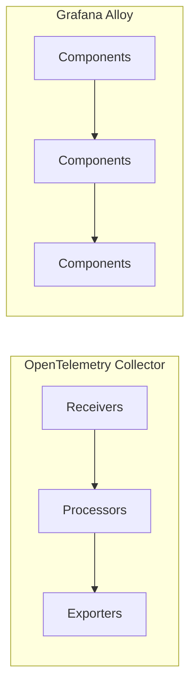
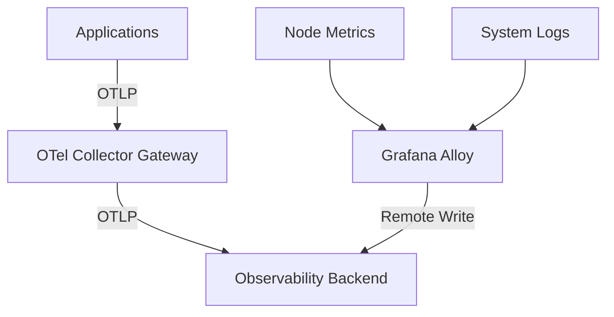

# How to Compare OpenTelemetry Collector vs Grafana Alloy

Author: [nawazdhandala](https://www.github.com/nawazdhandala)

Tags: OpenTelemetry, Grafana Alloy, Collector, Observability, Telemetry Pipelines

Description: A practical comparison of OpenTelemetry Collector and Grafana Alloy for building telemetry pipelines, covering architecture, configuration, and use cases.

---

Choosing the right telemetry pipeline agent is one of those decisions that shapes your entire observability stack. Two popular options in this space are the OpenTelemetry Collector and Grafana Alloy (the successor to Grafana Agent). Both can collect, process, and export telemetry data, but they approach the problem differently. This guide walks through the key differences so you can make an informed decision.

## Background and Lineage

The OpenTelemetry Collector is the reference implementation from the CNCF OpenTelemetry project. It was designed from the ground up to be a vendor-neutral pipeline for traces, metrics, and logs. The project has a massive contributor base and enjoys broad industry support.

Grafana Alloy emerged from the Grafana Agent project, which Grafana Labs rebuilt using a programmable configuration language called River (now called Alloy configuration syntax). Alloy is deeply integrated with the Grafana ecosystem, including Loki, Mimir, Tempo, and Pyroscope.

## Architecture Comparison

Both tools follow a pipeline model, but their internal designs differ significantly.



The OpenTelemetry Collector uses a linear pipeline model with receivers, processors, and exporters. Each pipeline handles one signal type (traces, metrics, or logs), and you can define multiple pipelines in a single collector instance.

Grafana Alloy uses a component-based directed acyclic graph (DAG). Components connect to each other through expressions, and data flows through the graph based on these connections. This gives you more flexibility in how you wire things together, but it also means a steeper learning curve.

## Configuration Styles

The configuration syntax is one of the biggest practical differences between the two.

The OpenTelemetry Collector uses YAML:

```yaml
# OpenTelemetry Collector configuration
# Defines a simple traces pipeline with OTLP receiver and exporter
receivers:
  otlp:
    protocols:
      grpc:
        endpoint: 0.0.0.0:4317
      http:
        endpoint: 0.0.0.0:4318

processors:
  # Batch processor groups spans before export
  batch:
    timeout: 5s
    send_batch_size: 1000

exporters:
  otlp:
    endpoint: "backend.example.com:4317"
    tls:
      insecure: false

service:
  pipelines:
    traces:
      receivers: [otlp]
      processors: [batch]
      exporters: [otlp]
```

This YAML approach is straightforward. You declare your components and wire them together in the service section.

Grafana Alloy uses its own configuration language:

```hcl
// Grafana Alloy configuration
// Uses component-based syntax with explicit data flow connections
otelcol.receiver.otlp "default" {
  grpc {
    endpoint = "0.0.0.0:4317"
  }
  http {
    endpoint = "0.0.0.0:4318"
  }

  // Output connects directly to the next component
  output {
    traces = [otelcol.processor.batch.default.input]
  }
}

otelcol.processor.batch "default" {
  timeout = "5s"
  send_batch_size = 1000

  output {
    traces = [otelcol.exporter.otlp.default.input]
  }
}

otelcol.exporter.otlp "default" {
  client {
    endpoint = "backend.example.com:4317"
  }
}
```

The Alloy syntax is more verbose but also more explicit about data flow. You can see exactly where each component sends its output. The language also supports variables, conditional logic, and dynamic configuration.

## Signal Coverage

Both tools handle traces, metrics, and logs. However, they differ in how they handle Grafana-specific signal types.

| Signal Type | OTel Collector | Grafana Alloy |
|-------------|---------------|---------------|
| Traces | Full support | Full support |
| Metrics | Full support | Full support |
| Logs | Full support | Full support |
| Profiles | Limited | Native (Pyroscope) |
| Prometheus scraping | Via receiver | Native component |
| Loki log shipping | Via exporter | Native component |

Grafana Alloy has a clear advantage if you are already using the Grafana stack. Its native support for Prometheus remote write, Loki push, and Pyroscope profiling is tightly integrated and well tested.

The OpenTelemetry Collector handles these through contrib receivers and exporters, which work well but sometimes lag behind in feature parity with native tools.

## Ecosystem and Extensibility

The OpenTelemetry Collector has a contrib repository with hundreds of receivers, processors, and exporters. The community contribution rate is high, and most observability vendors ship their own exporter or receiver components. If you need to connect to a specific system, there is probably already a component for it.

Grafana Alloy wraps many of the same OpenTelemetry Collector components internally (using the `otelcol.*` namespace), but it also has its own native components for Grafana stack integration. The total number of available components is smaller than the OTel Collector contrib ecosystem, but the Grafana-specific ones are often more polished.

## Deployment Patterns

Both tools support similar deployment models:

```yaml
# Kubernetes DaemonSet deployment for OTel Collector
# Runs one collector pod on each node for local telemetry collection
apiVersion: apps/v1
kind: DaemonSet
metadata:
  name: otel-collector-agent
spec:
  selector:
    matchLabels:
      app: otel-collector
  template:
    metadata:
      labels:
        app: otel-collector
    spec:
      containers:
        - name: collector
          image: otel/opentelemetry-collector-contrib:0.96.0
          ports:
            - containerPort: 4317
            - containerPort: 4318
          volumeMounts:
            - name: config
              mountPath: /etc/otelcol-contrib
      volumes:
        - name: config
          configMap:
            name: otel-collector-config
```

For Grafana Alloy, Grafana Labs provides a Helm chart that handles DaemonSet, Deployment, and StatefulSet modes out of the box. The OpenTelemetry project also has an operator and Helm charts, but you typically need to choose between the core and contrib distributions yourself.

## Performance Characteristics

In benchmark tests, both tools perform well for typical workloads. The OpenTelemetry Collector has been heavily optimized over the past two years, and its memory usage is predictable when you configure the memory limiter processor correctly.

```yaml
# Memory limiter configuration for OTel Collector
# Prevents the collector from consuming too much memory under load
processors:
  memory_limiter:
    # Start applying back pressure at 80% of the limit
    check_interval: 1s
    limit_percentage: 80
    spike_limit_percentage: 25
```

Grafana Alloy inherits some of this performance since it wraps OTel Collector components, but its DAG evaluation adds a small overhead. For most real-world deployments, this difference is negligible.

## Vendor Lock-in Considerations

This is where the philosophical difference matters most. The OpenTelemetry Collector is vendor-neutral by design. You can swap backends by changing an exporter configuration. Your instrumentation, your pipeline configuration patterns, and your operational knowledge transfer across vendors.

Grafana Alloy is open source (Apache 2.0 license), so there is no license lock-in. But the configuration language is unique to Alloy, and some native components only work with Grafana backends. If you ever move away from the Grafana stack, you will need to rewrite your pipeline configurations.

## When to Choose Each

Choose the OpenTelemetry Collector when:

- You need vendor neutrality and want to avoid any ecosystem coupling
- Your team already knows the OTel Collector configuration model
- You need components from the large contrib ecosystem
- You are building a multi-vendor observability strategy

Choose Grafana Alloy when:

- You are already running Grafana, Loki, Mimir, and Tempo
- You want native Prometheus scraping with service discovery
- You need continuous profiling with Pyroscope
- You prefer a programmable configuration language over static YAML

## Running Them Together

It is worth noting that these tools are not mutually exclusive. A common pattern is to use the OpenTelemetry Collector as a gateway that receives OTLP data from applications, while Grafana Alloy handles infrastructure metric scraping and log collection from the host level.



This hybrid approach lets you use each tool where it excels without forcing a single choice across your entire stack.

## Final Thoughts

Both the OpenTelemetry Collector and Grafana Alloy are production-ready tools backed by active communities. The right choice depends on your existing stack, your team's preferences, and how much you value vendor neutrality versus deep ecosystem integration. If you are starting fresh with no strong opinions about backends, the OpenTelemetry Collector gives you the most flexibility. If you are already invested in the Grafana ecosystem, Alloy will feel like a natural fit.
