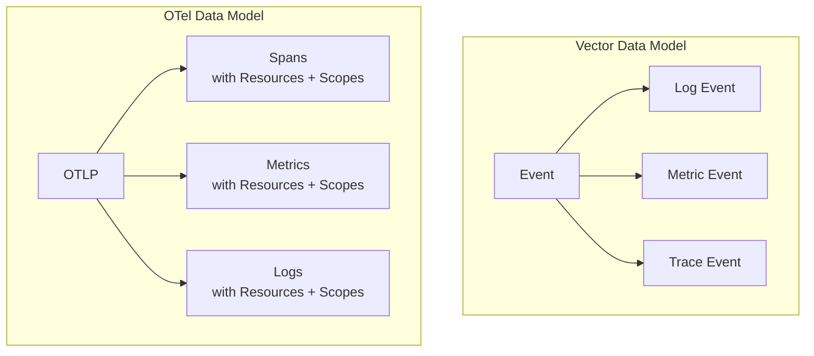

# How to Compare OpenTelemetry Collector vs Vector for Data Pipelines

Author: [nawazdhandala](https://www.github.com/nawazdhandala)

Tags: OpenTelemetry, Vector, Data Pipelines, Observability, Telemetry Processing

Description: A practical comparison of OpenTelemetry Collector and Vector for building observability data pipelines, covering configuration, transforms, and routing.

---

Building a reliable telemetry data pipeline requires choosing the right tool for moving, transforming, and routing your observability data. The OpenTelemetry Collector and Datadog's Vector are two prominent options in this space. Both are written in memory-safe languages, both handle multiple signal types, and both are open source. But their design philosophies and sweet spots differ in meaningful ways. Let's walk through the comparison.

## Background

Vector was created by Timber (later acquired by Datadog) as a high-performance observability data pipeline. It is written in Rust, which gives it excellent memory safety and performance characteristics. Vector treats all data as events with a unified data model.

The OpenTelemetry Collector is the CNCF's standard telemetry pipeline. It is written in Go and uses a strongly typed data model based on the OTLP specification. Each signal type (traces, metrics, logs) has its own well-defined schema.

## Data Model Differences

This is the most fundamental difference between the two tools.

Vector uses a unified event model. Everything is either a log event, a metric event, or a trace event. These events are essentially JSON-like documents that you can manipulate freely.

The OpenTelemetry Collector uses the OTLP data model, which has specific structures for spans, metric data points, and log records. Each structure includes resource attributes, scope information, and signal-specific fields.



Vector's flexible model makes ad-hoc transformations easier. The OTel Collector's structured model enforces semantic conventions, which helps maintain data consistency across your organization.

## Configuration Comparison

Vector uses TOML (or YAML) configuration with a sources-transforms-sinks model:

```toml
# Vector configuration for collecting and routing logs
# Sources define where data comes from
[sources.app_logs]
type = "file"
include = ["/var/log/app/*.log"]

# Transforms modify data in transit
[transforms.parse_json]
type = "remap"
inputs = ["app_logs"]
# VRL (Vector Remap Language) for parsing and transforming
# Parse the raw log message as JSON
source = '''
. = parse_json!(.message)
.environment = get_env_var("ENV") ?? "unknown"
.processed_at = now()
'''

[transforms.filter_errors]
type = "filter"
inputs = ["parse_json"]
# Only keep log events with error-level severity
condition = '.level == "error" || .level == "fatal"'

# Sinks define where data goes
[sinks.all_logs]
type = "elasticsearch"
inputs = ["parse_json"]
endpoints = ["https://elasticsearch.example.com:9200"]
bulk.index = "app-logs-%Y-%m-%d"

[sinks.error_alerts]
type = "http"
inputs = ["filter_errors"]
uri = "https://alerts.example.com/webhook"
encoding.codec = "json"
```

The equivalent OpenTelemetry Collector configuration:

```yaml
# OTel Collector configuration for similar log processing
# Uses filelog receiver with transform processor
receivers:
  filelog:
    include:
      - /var/log/app/*.log
    operators:
      # Parse JSON from the raw log body
      - type: json_parser

processors:
  # Transform processor uses OTTL for data manipulation
  transform:
    log_statements:
      - context: log
        statements:
          - set(attributes["processed_at"], Now())

  # Filter processor to route error logs
  filter/errors:
    logs:
      log_record:
        - 'severity_text == "error" or severity_text == "fatal"'

  batch:
    timeout: 5s

exporters:
  elasticsearch/all:
    endpoints:
      - "https://elasticsearch.example.com:9200"
    logs_index: "app-logs"

  otlphttp/alerts:
    endpoint: "https://alerts.example.com"

service:
  pipelines:
    logs/all:
      receivers: [filelog]
      processors: [transform, batch]
      exporters: [elasticsearch/all]
    logs/errors:
      receivers: [filelog]
      processors: [transform, filter/errors, batch]
      exporters: [otlphttp/alerts]
```

Notice how Vector handles routing through its inputs references, while the OTel Collector uses multiple named pipelines. Vector's approach is more intuitive for complex routing topologies.

## Transformation Language

This is where Vector truly stands out. VRL (Vector Remap Language) is a purpose-built, type-safe language for transforming observability data:

```toml
# Vector VRL transform example showing advanced capabilities
[transforms.enrich]
type = "remap"
inputs = ["raw_logs"]
source = '''
# Parse structured log data
parsed = parse_json!(.message)

# Extract and normalize fields
.timestamp = parse_timestamp!(parsed.ts, format: "%+")
.severity = downcase(parsed.level)
.service = parsed.service_name

# GeoIP enrichment from IP address
.geo = get_enrichment_table_record("geoip", {"ip": parsed.client_ip}) ?? {}

# Redact sensitive patterns
.message = redact(.message, filters: ["pattern"], patterns: [r'\d{4}-\d{4}-\d{4}-\d{4}'])

# Calculate request duration in milliseconds
.duration_ms = to_float(parsed.duration) * 1000.0

# Add routing metadata based on content
if .severity == "error" {
    .routing_key = "high_priority"
} else {
    .routing_key = "standard"
}
'''
```

The OpenTelemetry Collector's OTTL is more limited but improving:

```yaml
# OTel Collector OTTL transform for comparison
processors:
  transform:
    log_statements:
      - context: log
        statements:
          # Set attributes from parsed fields
          - set(attributes["service"], attributes["service_name"])
          - set(severity_text, attributes["level"])
          # OTTL has fewer built-in functions than VRL
          # Complex transforms may need a custom processor
```

VRL is a full programming language with conditionals, loops, error handling, and a rich standard library. OTTL is a domain-specific expression language that handles common cases well but lacks VRL's flexibility.

## Performance Benchmarks

Both tools are high-performance, but they achieve it differently.

Vector's Rust implementation gives it excellent throughput with predictable memory usage. There is no garbage collector, so latency is consistently low. Vector regularly publishes benchmark results showing throughput of 10+ million events per second in simple forwarding scenarios.

The OpenTelemetry Collector in Go also performs well but has garbage collection pauses. For most production workloads, these pauses are measured in microseconds and are not noticeable. The collector's memory limiter processor helps prevent runaway memory usage.

In practical terms, both tools handle production workloads without breaking a sweat. The performance difference only becomes relevant at extreme scale or in latency-sensitive environments.

## Routing and Fan-out

Vector makes complex routing straightforward through its DAG-based topology:

```toml
# Vector routing example with conditional fan-out
# Routes logs to different sinks based on content
[transforms.route_by_service]
type = "route"
inputs = ["parsed_logs"]

# Each route is a named condition
[transforms.route_by_service.route.frontend]
condition = '.service == "frontend"'

[transforms.route_by_service.route.backend]
condition = '.service == "backend"'

[transforms.route_by_service.route._unmatched]
# Catches anything that does not match above routes

[sinks.frontend_store]
type = "loki"
inputs = ["route_by_service.frontend"]
endpoint = "http://loki-frontend:3100"

[sinks.backend_store]
type = "elasticsearch"
inputs = ["route_by_service.backend"]
endpoints = ["https://es-backend:9200"]
```

The OTel Collector handles routing through the connector mechanism and multiple pipelines, which works but is less intuitive for complex topologies.

## Ecosystem and Community

The OpenTelemetry Collector benefits from the CNCF ecosystem and broad vendor support. Most observability vendors contribute exporters and receivers. The community is massive and diverse.

Vector has strong backing from Datadog, an active community, and good documentation. Its source and sink library covers most major platforms, though it is smaller than the OTel Collector's contrib ecosystem.

## When to Choose Each

Choose Vector when:

- Complex data transformation is a core requirement
- You need VRL's powerful programming capabilities
- Routing topology is complex with many conditional paths
- You want predictable latency without GC pauses
- Log processing is the primary workload

Choose the OpenTelemetry Collector when:

- Vendor neutrality and OTLP compliance matter
- You want a single standard across your organization
- Your applications already emit OTLP data
- You need the large contrib component ecosystem
- Trace processing (sampling, span manipulation) is important

## Conclusion

Vector and the OpenTelemetry Collector are both excellent tools for building observability data pipelines. Vector's strength lies in its transformation capabilities and routing flexibility. The OTel Collector's strength is its standards-based approach and broad ecosystem. For teams that need heavy data transformation, Vector is hard to beat. For teams building around OpenTelemetry standards, the collector is the natural choice.
