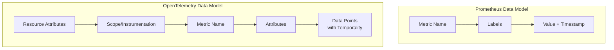
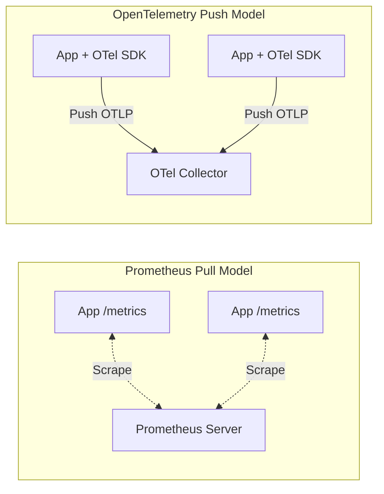

# How to Compare OpenTelemetry Metrics vs Prometheus Native Metrics

Author: [nawazdhandala](https://www.github.com/nawazdhandala)

Tags: OpenTelemetry, Prometheus, Metrics, Monitoring, Observability

Description: A technical comparison of OpenTelemetry metrics and Prometheus native metrics, covering data models, instrumentation, collection patterns, and migration strategies.

---

Prometheus has been the standard for metrics in the cloud-native ecosystem for years. OpenTelemetry now provides its own metrics specification and SDK. Understanding how these two metrics systems compare is essential if you are planning a metrics strategy or considering a migration. The good news is that they interoperate well, but there are important differences in their data models and philosophies.

## Data Model Differences

Prometheus uses a pull-based model with a simple data model: every metric is a time series identified by a metric name and a set of labels. There are four core metric types: counter, gauge, histogram, and summary.

OpenTelemetry uses a push-based model (though pull is supported) with a richer data model. Metrics carry resource attributes, scope information, and more instrument types including UpDownCounter and exponential histograms.



The most significant conceptual difference is temporality. Prometheus always uses cumulative metrics (counters go up from process start). OpenTelemetry supports both cumulative and delta temporality. Delta temporality reports only the change since the last collection, which can be more efficient for certain backends.

## Instrumentation Comparison

Here is how you create and use metrics in each system.

Prometheus instrumentation in Go:

```go
// Prometheus native metrics in Go
// Uses the prometheus/client_golang package
package main

import (
    "net/http"
    "github.com/prometheus/client_golang/prometheus"
    "github.com/prometheus/client_golang/prometheus/promauto"
    "github.com/prometheus/client_golang/prometheus/promhttp"
)

var (
    // Counter for total HTTP requests received
    httpRequestsTotal = promauto.NewCounterVec(
        prometheus.CounterOpts{
            Name: "http_requests_total",
            Help: "Total number of HTTP requests",
        },
        []string{"method", "path", "status"},
    )

    // Histogram for request duration
    httpRequestDuration = promauto.NewHistogramVec(
        prometheus.HistogramOpts{
            Name:    "http_request_duration_seconds",
            Help:    "HTTP request duration in seconds",
            // Fixed bucket boundaries for histograms
            Buckets: []float64{0.001, 0.005, 0.01, 0.05, 0.1, 0.5, 1, 5},
        },
        []string{"method", "path"},
    )
)

func handler(w http.ResponseWriter, r *http.Request) {
    timer := prometheus.NewTimer(httpRequestDuration.WithLabelValues(r.Method, r.URL.Path))
    defer timer.ObserveDuration()

    // Handle request...
    w.WriteHeader(http.StatusOK)

    httpRequestsTotal.WithLabelValues(r.Method, r.URL.Path, "200").Inc()
}

func main() {
    http.Handle("/metrics", promhttp.Handler())
    http.HandleFunc("/", handler)
    http.ListenAndServe(":8080", nil)
}
```

The equivalent using OpenTelemetry:

```go
// OpenTelemetry metrics in Go
// Uses the go.opentelemetry.io/otel/metric package
package main

import (
    "context"
    "net/http"
    "time"

    "go.opentelemetry.io/otel"
    "go.opentelemetry.io/otel/attribute"
    "go.opentelemetry.io/otel/metric"
    sdkmetric "go.opentelemetry.io/otel/sdk/metric"
    "go.opentelemetry.io/otel/exporters/otlp/otlpmetric/otlpmetricgrpc"
)

func initMetrics() func() {
    exporter, _ := otlpmetricgrpc.New(context.Background())
    provider := sdkmetric.NewMeterProvider(
        sdkmetric.WithReader(
            sdkmetric.NewPeriodicReader(exporter,
                sdkmetric.WithInterval(15*time.Second)),
        ),
    )
    otel.SetMeterProvider(provider)
    return func() { provider.Shutdown(context.Background()) }
}

func main() {
    cleanup := initMetrics()
    defer cleanup()

    meter := otel.Meter("my-service")

    // Counter for total HTTP requests
    requestCounter, _ := meter.Int64Counter(
        "http.server.request.count",
        metric.WithDescription("Total number of HTTP requests"),
    )

    // Histogram for request duration
    requestDuration, _ := meter.Float64Histogram(
        "http.server.request.duration",
        metric.WithDescription("HTTP request duration in seconds"),
        metric.WithUnit("s"),
    )

    http.HandleFunc("/", func(w http.ResponseWriter, r *http.Request) {
        start := time.Now()

        // Handle request...
        w.WriteHeader(http.StatusOK)

        duration := time.Since(start).Seconds()
        attrs := []attribute.KeyValue{
            attribute.String("http.method", r.Method),
            attribute.String("http.route", r.URL.Path),
            attribute.Int("http.status_code", 200),
        }
        requestCounter.Add(r.Context(), 1, metric.WithAttributes(attrs...))
        requestDuration.Record(r.Context(), duration, metric.WithAttributes(attrs...))
    })

    http.ListenAndServe(":8080", nil)
}
```

The OpenTelemetry version is slightly more verbose but follows the same patterns. The key difference is that OpenTelemetry pushes metrics to a collector or backend, while Prometheus exposes a `/metrics` endpoint that gets scraped.

## Collection Models



Prometheus scrapes targets on a configured interval. This means your applications need to expose an HTTP endpoint, and Prometheus needs to know where all your targets are (through service discovery or static configuration).

OpenTelemetry pushes metrics from the application. This simplifies networking (no inbound connections needed) and works naturally behind firewalls, in serverless environments, and across network boundaries.

However, the OpenTelemetry Collector can also scrape Prometheus endpoints:

```yaml
# OTel Collector scraping Prometheus endpoints
# Bridges Prometheus instrumentation into the OTel pipeline
receivers:
  prometheus:
    config:
      scrape_configs:
        # Scrape targets that expose Prometheus metrics
        - job_name: 'kubernetes-pods'
          kubernetes_sd_configs:
            - role: pod
          relabel_configs:
            # Only scrape pods with the prometheus.io/scrape annotation
            - source_labels: [__meta_kubernetes_pod_annotation_prometheus_io_scrape]
              action: keep
              regex: true
            - source_labels: [__meta_kubernetes_pod_annotation_prometheus_io_port]
              action: replace
              target_label: __address__
              regex: (.+)
              replacement: $1

exporters:
  prometheusremotewrite:
    endpoint: "http://prometheus:9090/api/v1/write"

service:
  pipelines:
    metrics:
      receivers: [prometheus]
      processors: [batch]
      exporters: [prometheusremotewrite]
```

This is a common bridge pattern that lets you use OpenTelemetry Collector as a drop-in replacement for Prometheus scraping while gaining access to the OTel processing pipeline.

## Histogram Implementation

This is one of the most significant technical differences.

Prometheus histograms use fixed bucket boundaries that you define at instrumentation time. If your bucket boundaries do not match your actual latency distribution, you lose resolution.

```go
// Prometheus histogram with fixed buckets
// You must choose boundaries upfront
histogram := prometheus.NewHistogram(prometheus.HistogramOpts{
    Name:    "request_duration_seconds",
    // These fixed buckets cannot adapt to actual data distribution
    Buckets: []float64{0.001, 0.005, 0.01, 0.025, 0.05, 0.1, 0.25, 0.5, 1, 2.5, 5, 10},
})
```

OpenTelemetry supports exponential histograms (also called base-2 exponential histograms), which automatically adapt their bucket boundaries to the observed data:

```go
// OpenTelemetry exponential histogram
// Bucket boundaries adapt automatically to the data distribution
histogram, _ := meter.Float64Histogram(
    "request_duration_seconds",
    metric.WithDescription("Request duration"),
    // Exponential histogram is the default in many SDKs
    // No need to specify bucket boundaries
)
```

Exponential histograms provide better resolution across the full range of values with predictable memory usage. Prometheus has added support for native histograms (their version of exponential histograms), but the feature is still evolving.

## Naming Conventions

Prometheus follows specific naming conventions:

```
# Prometheus naming conventions
http_requests_total          # Counter (must end with _total)
http_request_duration_seconds  # Histogram (should include unit)
process_resident_memory_bytes  # Gauge (should include unit)
```

OpenTelemetry uses semantic conventions with dot-separated namespaces:

```
# OpenTelemetry semantic conventions
http.server.request.count      # Counter
http.server.request.duration   # Histogram (unit specified separately)
process.runtime.memory.usage   # Gauge (unit specified separately)
```

When OpenTelemetry metrics are exported to Prometheus, the names are automatically converted. Dots become underscores, units are appended as suffixes, and `_total` is added to counters.

## PromQL Compatibility

If you use PromQL for alerting and dashboards, you can still query OpenTelemetry metrics that have been exported to a Prometheus-compatible backend. The metric names will be translated as described above.

```promql
# PromQL query works the same regardless of instrumentation source
# This query works for both native Prometheus and OTel-originated metrics
rate(http_server_request_count_total{service="order-service"}[5m])
```

The OpenTelemetry Collector's Prometheus remote write exporter ensures that metrics land in a format that PromQL can query.

## Migration Strategy

If you are moving from Prometheus instrumentation to OpenTelemetry, you do not need to do it all at once:

1. Deploy the OTel Collector with a Prometheus receiver to scrape existing metrics
2. Start new services with OpenTelemetry metrics SDKs
3. Gradually update existing services, replacing Prometheus client libraries with OTel SDKs
4. Keep both instrumentation libraries during the transition period

Both can coexist in the same application if needed, though running two metrics libraries adds some overhead.

## When to Choose Each

Stick with Prometheus native metrics when:

- Your entire stack is Prometheus-centric and working well
- Your team has deep PromQL expertise
- You do not need push-based metrics collection
- You are not planning to add traces or logs to the same pipeline

Use OpenTelemetry metrics when:

- You want a unified instrumentation library for traces, metrics, and logs
- You need push-based metrics for serverless or edge environments
- You want vendor-neutral instrumentation that works with multiple backends
- Exponential histograms matter for your use case

## Conclusion

Prometheus metrics and OpenTelemetry metrics are converging more every year. The interoperability is excellent, and you can mix them in a single infrastructure. For new projects, OpenTelemetry metrics provide a more future-proof foundation. For existing Prometheus-based setups, there is no urgency to migrate since the OTel Collector bridges the gap nicely.
