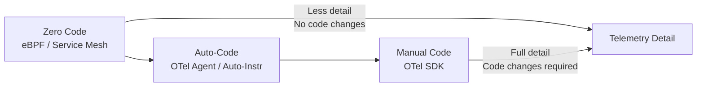
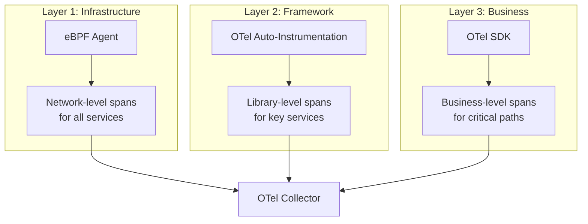

# How to Compare OpenTelemetry SDK vs Zero-Code Instrumentation Approaches

Author: [nawazdhandala](https://www.github.com/nawazdhandala)

Tags: OpenTelemetry, SDK, Zero-Code Instrumentation, Auto-Instrumentation, eBPF, Observability

Description: A comparison of OpenTelemetry SDK instrumentation and zero-code instrumentation approaches including auto-instrumentation agents, eBPF, and service meshes.

---

Getting telemetry out of your applications does not always require changing application code. There is a spectrum of instrumentation approaches, from fully manual SDK integration to completely code-free methods. This article compares the OpenTelemetry SDK approach with various zero-code alternatives and helps you understand what each approach can and cannot do.

## The Instrumentation Spectrum



At one end, you have zero-code approaches that require no changes to your application whatsoever. At the other end, you have full SDK integration where you manually create spans, set attributes, and record metrics throughout your codebase. Most real-world setups use something in between.

## Zero-Code: eBPF-Based Instrumentation

eBPF (extended Berkeley Packet Filter) lets you attach programs to kernel and user-space events without modifying the target application. Several projects use eBPF for telemetry collection.

```yaml
# Example: Deploying an eBPF-based instrumentation agent
# This runs as a DaemonSet and instruments all pods on the node
apiVersion: apps/v1
kind: DaemonSet
metadata:
  name: ebpf-instrumentor
  namespace: monitoring
spec:
  selector:
    matchLabels:
      app: ebpf-instrumentor
  template:
    spec:
      # eBPF requires privileged access to the host
      hostPID: true
      hostNetwork: true
      containers:
        - name: instrumentor
          image: grafana/beyla:latest
          securityContext:
            # eBPF needs elevated privileges
            privileged: true
          env:
            - name: BEYLA_OPEN_PORT
              value: "8080"
            - name: OTEL_EXPORTER_OTLP_ENDPOINT
              value: "http://otel-collector:4318"
          volumeMounts:
            - name: proc
              mountPath: /proc
      volumes:
        - name: proc
          hostPath:
            path: /proc
```

eBPF-based tools like Grafana Beyla, Pixie, and Odigos can detect HTTP, gRPC, and database calls by observing system calls and network traffic at the kernel level. They work with any programming language because they operate below the application runtime.

What eBPF captures:

```
# eBPF can observe these at the kernel/syscall level
- HTTP request/response (method, path, status, duration)
- gRPC calls (service, method, status)
- DNS queries
- TCP connections (source, destination, bytes, latency)
- Database protocol messages (for protocols it understands)
```

What eBPF cannot capture:

```
# eBPF cannot see inside application logic
- Business-specific attributes (order ID, user tier, etc.)
- Custom span names for internal operations
- Application-level context propagation
- Semantic meaning of operations
```

## Zero-Code: Service Mesh

Service meshes like Istio and Linkerd provide telemetry through sidecar proxies. Every network call between services gets traced automatically.

```yaml
# Istio service mesh configuration for telemetry
# Sidecar proxies generate spans for all inter-service traffic
apiVersion: install.istio.io/v1alpha1
kind: IstioOperator
spec:
  meshConfig:
    # Enable distributed tracing
    enableTracing: true
    defaultConfig:
      tracing:
        # Sample 100% of traces (adjust for production)
        sampling: 100
        # Export using OpenTelemetry protocol
        openCensusAgent:
          address: otel-collector.monitoring:55678
    extensionProviders:
      - name: otel-tracing
        opentelemetry:
          service: otel-collector.monitoring
          port: 4317
```

The service mesh approach gives you:

- Span for every inter-service HTTP/gRPC call
- Automatic context propagation between proxies
- mTLS and connection-level metrics
- No changes to application code or container images

The limitations are similar to eBPF: you see the network boundaries but not the application internals.

## Zero-Code: OpenTelemetry Auto-Instrumentation

OpenTelemetry's auto-instrumentation sits between true zero-code and SDK integration. For some languages, you can add instrumentation without touching application code, but the mechanism varies.

```yaml
# Kubernetes: OTel Operator auto-instrumentation injection
# Automatically adds instrumentation to pods based on annotations
apiVersion: opentelemetry.io/v1alpha1
kind: Instrumentation
metadata:
  name: auto-instrumentation
  namespace: monitoring
spec:
  exporter:
    endpoint: http://otel-collector:4317
  propagators:
    - tracecontext
    - baggage
  sampler:
    type: parentbased_traceidratio
    argument: "0.25"
  java:
    image: ghcr.io/open-telemetry/opentelemetry-operator/autoinstrumentation-java:latest
  python:
    image: ghcr.io/open-telemetry/opentelemetry-operator/autoinstrumentation-python:latest
  nodejs:
    image: ghcr.io/open-telemetry/opentelemetry-operator/autoinstrumentation-nodejs:latest
  dotnet:
    image: ghcr.io/open-telemetry/opentelemetry-operator/autoinstrumentation-dotnet:latest

---
# Annotate a deployment to enable auto-instrumentation
apiVersion: apps/v1
kind: Deployment
metadata:
  name: order-service
spec:
  template:
    metadata:
      annotations:
        # This annotation triggers automatic Java agent injection
        instrumentation.opentelemetry.io/inject-java: "true"
    spec:
      containers:
        - name: order-service
          image: my-registry/order-service:latest
```

This OTel Operator approach is zero-code in the sense that you do not change your application code. But it works by injecting a language-specific agent into the container, which is fundamentally different from eBPF. The agent understands the application runtime and can capture library-level calls (database queries, HTTP clients, message queue operations) with full semantic context.

## SDK Integration: Full Control

The OpenTelemetry SDK gives you complete control over instrumentation:

```python
# Full SDK integration with custom business telemetry
# Maximum flexibility but requires code changes
from opentelemetry import trace, metrics
from opentelemetry.sdk.trace import TracerProvider
from opentelemetry.sdk.metrics import MeterProvider

# Initialize providers (setup code omitted for brevity)
tracer = trace.get_tracer("payment-service", "1.0.0")
meter = metrics.get_meter("payment-service", "1.0.0")

# Custom metrics for business KPIs
payment_counter = meter.create_counter(
    "payments.processed",
    description="Total payments processed",
    unit="1",
)

payment_amount = meter.create_histogram(
    "payments.amount",
    description="Payment amount distribution",
    unit="USD",
)

def process_payment(payment):
    # Custom span with business attributes
    with tracer.start_as_current_span("process-payment") as span:
        span.set_attribute("payment.method", payment.method)
        span.set_attribute("payment.currency", payment.currency)
        span.set_attribute("customer.tier", payment.customer.tier)

        # Validate payment
        with tracer.start_as_current_span("validate-payment"):
            validation = validate(payment)
            if not validation.success:
                span.set_status(trace.StatusCode.ERROR, validation.message)
                # Record a span event for the failure
                span.add_event("payment_validation_failed", {
                    "reason": validation.message,
                    "error_code": validation.code,
                })
                return

        # Charge the payment
        with tracer.start_as_current_span("charge-payment") as charge_span:
            result = payment_gateway.charge(payment)
            charge_span.set_attribute("gateway.response_code", result.code)
            charge_span.set_attribute("gateway.transaction_id", result.txn_id)

        # Record business metrics
        payment_counter.add(1, {
            "method": payment.method,
            "currency": payment.currency,
            "status": "success",
        })
        payment_amount.record(float(payment.amount), {
            "method": payment.method,
            "currency": payment.currency,
        })
```

This level of detail is impossible with any zero-code approach. You get business-specific attributes, custom metrics, span events, and precise control over what gets traced.

## Comparison Table

| Capability | eBPF | Service Mesh | OTel Auto-Instr | OTel SDK |
|-----------|------|-------------|-----------------|----------|
| Code changes | None | None | None (annotation) | Yes |
| HTTP spans | Yes | Yes | Yes | Yes |
| Database spans | Limited | No | Yes | Yes |
| Queue spans | No | No | Yes | Yes |
| Business attributes | No | No | No | Yes |
| Custom spans | No | No | No | Yes |
| Custom metrics | No | Limited | Limited | Yes |
| Language support | All | All | Java, Python, .NET, Node.js | All with SDK |
| Context propagation | Limited | Proxy-level | Full | Full |
| Performance overhead | Very low | Low-medium | Low-medium | Controlled |
| Setup complexity | Medium | High | Low | Medium |

## Layered Instrumentation Strategy

The most effective approach layers these methods:



Layer 1 gives you baseline visibility across everything. Layer 2 adds library-level detail for services where you need it. Layer 3 adds business context for your most critical flows.

This way, every service has at least basic telemetry (from eBPF or service mesh), important services have library-level detail (from auto-instrumentation), and critical services have full business observability (from SDK integration).

## Cost of Each Approach

Beyond technical capabilities, consider the ongoing cost:

- **eBPF**: Low maintenance, but debugging issues is hard when you do not control the instrumentation
- **Service mesh**: High operational complexity for the mesh itself, but telemetry comes for free
- **Auto-instrumentation**: Low maintenance, automatic updates with agent versions
- **SDK**: Ongoing developer time for maintaining instrumentation code

## Conclusion

There is no single best approach. Zero-code methods excel at providing broad baseline coverage without developer involvement. The OpenTelemetry SDK excels at providing deep, business-relevant telemetry for critical services. The right strategy uses the appropriate level of instrumentation for each service based on its criticality and the questions you need to answer about it. Start with zero-code for breadth, then add SDK instrumentation for depth where it matters most.
