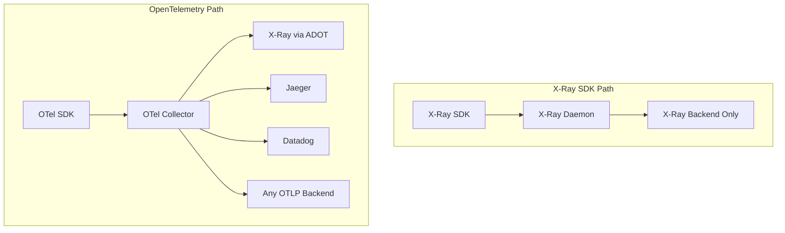

# How to Compare OpenTelemetry vs AWS X-Ray for Distributed Tracing

Author: [nawazdhandala](https://www.github.com/nawazdhandala)

Tags: OpenTelemetry, AWS X-Ray, Distributed Tracing, AWS, Observability

Description: A thorough comparison of OpenTelemetry and AWS X-Ray for distributed tracing, including instrumentation examples, data models, and integration patterns.

---

If you are running workloads on AWS, you have likely encountered AWS X-Ray as the native distributed tracing service. At the same time, OpenTelemetry has become the industry standard for instrumentation. Understanding how these two relate to each other and where they differ will help you make a better tracing strategy for your AWS workloads.

## How They Relate

First, it is important to understand that OpenTelemetry and AWS X-Ray are not entirely competing products. OpenTelemetry is an instrumentation and data collection framework. AWS X-Ray is a tracing backend and analysis service. You can use OpenTelemetry to send traces to X-Ray. In fact, AWS actively contributes to OpenTelemetry and maintains the AWS Distro for OpenTelemetry (ADOT).

That said, X-Ray also has its own SDK and daemon for instrumentation, which is the alternative approach. The real comparison is between using the X-Ray SDK versus using OpenTelemetry SDKs, and between the X-Ray backend versus other backends.

## Instrumentation Comparison

The X-Ray SDK provides instrumentation specifically designed for AWS services:

```python
# AWS X-Ray SDK instrumentation for a Python application
# Patches AWS SDK and HTTP libraries automatically
from aws_xray_sdk.core import xray_recorder
from aws_xray_sdk.core import patch_all

# Patch all supported libraries (boto3, requests, etc.)
patch_all()

# Configure the X-Ray recorder
xray_recorder.configure(
    service='order-service',
    # Sampling rules control trace volume
    sampling=True,
    # X-Ray daemon endpoint for sending trace segments
    daemon_address='127.0.0.1:2000'
)

# Manual segment creation for custom business logic
@xray_recorder.capture('process_order')
def process_order(order_id):
    # Create a subsegment for the database query
    subsegment = xray_recorder.begin_subsegment('db_lookup')
    subsegment.put_annotation('order_id', order_id)

    order = database.get_order(order_id)

    # Add metadata for debugging
    subsegment.put_metadata('order_details', order, 'orders')
    xray_recorder.end_subsegment()

    return order
```

The equivalent using OpenTelemetry:

```python
# OpenTelemetry instrumentation for the same Python application
# Uses standard OTel APIs with OTLP export
from opentelemetry import trace
from opentelemetry.sdk.trace import TracerProvider
from opentelemetry.sdk.trace.export import BatchSpanProcessor
from opentelemetry.exporter.otlp.proto.grpc.trace_exporter import OTLPSpanExporter
from opentelemetry.instrumentation.boto3 import Boto3Instrumentor
from opentelemetry.instrumentation.requests import RequestsInstrumentor

# Set up the tracer provider with OTLP export
provider = TracerProvider()
# Export to ADOT collector or any OTLP-compatible endpoint
processor = BatchSpanProcessor(
    OTLPSpanExporter(endpoint="http://localhost:4317")
)
provider.add_span_processor(processor)
trace.set_tracer_provider(provider)

# Instrument AWS SDK and HTTP libraries
Boto3Instrumentor().instrument()
RequestsInstrumentor().instrument()

# Get a tracer for manual instrumentation
tracer = trace.get_tracer("order-service")

def process_order(order_id):
    # Create a span for the business logic
    with tracer.start_as_current_span("process_order") as span:
        span.set_attribute("order.id", order_id)

        with tracer.start_as_current_span("db_lookup"):
            order = database.get_order(order_id)

        return order
```

Both approaches achieve the same result. The X-Ray SDK is simpler for pure AWS environments, while OpenTelemetry uses standard APIs that work with any backend.

## Data Model Differences

X-Ray and OpenTelemetry use different terminology and slightly different data models:

| Concept | X-Ray | OpenTelemetry |
|---------|-------|---------------|
| Top-level unit | Segment | Span (root) |
| Child unit | Subsegment | Span (child) |
| Metadata | Annotations + Metadata | Attributes |
| Searchable fields | Annotations (key-value) | All attributes |
| Context propagation | X-Ray header format | W3C TraceContext |
| Trace ID format | 1-{timestamp}-{random} | 128-bit hex |

The trace ID format difference is noteworthy. X-Ray trace IDs include a timestamp component, which X-Ray uses for data retention. When using OpenTelemetry with X-Ray as a backend, the ADOT collector or X-Ray exporter handles the ID format conversion automatically.

## Context Propagation

X-Ray uses its own header format for propagating trace context across services:

```
# X-Ray trace header format
X-Amzn-Trace-Id: Root=1-67891233-abcdef012345678912345678;Parent=53995c3f42cd8ad8;Sampled=1
```

OpenTelemetry uses the W3C TraceContext standard:

```
# W3C TraceContext format used by OpenTelemetry
traceparent: 00-0af7651916cd43dd8448eb211c80319c-b7ad6b7169203331-01
tracestate: vendor1=value1,vendor2=value2
```

If you use OpenTelemetry with X-Ray as the backend, you can configure the propagator to use both formats simultaneously:

```python
# Configure OpenTelemetry to propagate both X-Ray and W3C formats
# This enables interoperability during migration periods
from opentelemetry.propagators.aws import AwsXRayPropagator
from opentelemetry.propagate import set_global_textmap
from opentelemetry.propagators.composite import CompositePropagator
from opentelemetry.trace.propagation import TraceContextTextMapPropagator

# Support both propagation formats for mixed environments
propagator = CompositePropagator([
    TraceContextTextMapPropagator(),
    AwsXRayPropagator()
])
set_global_textmap(propagator)
```

This is particularly useful during migration periods when some services use the X-Ray SDK and others use OpenTelemetry.

## AWS Service Integration

X-Ray has native integration with many AWS services. Lambda, API Gateway, ECS, EKS, App Runner, and others can generate X-Ray traces without any code changes. You simply enable X-Ray tracing in the service configuration.

```yaml
# AWS SAM template enabling X-Ray tracing on Lambda
# No code changes needed in the Lambda function
Resources:
  OrderFunction:
    Type: AWS::Serverless::Function
    Properties:
      Handler: app.handler
      Runtime: python3.12
      Tracing: Active
      Policies:
        # X-Ray requires specific IAM permissions
        - AWSXRayDaemonWriteAccess
```

OpenTelemetry can also instrument Lambda functions through the ADOT Lambda layer:

```yaml
# AWS SAM template using ADOT Lambda layer for OpenTelemetry
# Provides OTel instrumentation through a Lambda extension
Resources:
  OrderFunction:
    Type: AWS::Serverless::Function
    Properties:
      Handler: app.handler
      Runtime: python3.12
      Layers:
        # ADOT Lambda layer provides auto-instrumentation
        - arn:aws:lambda:us-east-1:901920570463:layer:aws-otel-python-amd64-ver-1-25-0:1
      Environment:
        Variables:
          # Configure the OTLP endpoint for trace export
          OTEL_SERVICE_NAME: order-service
          OTEL_EXPORTER_OTLP_ENDPOINT: "http://localhost:4317"
          AWS_LAMBDA_EXEC_WRAPPER: /opt/otel-instrument
```

The X-Ray approach is simpler for AWS-native services, while OpenTelemetry provides more flexibility in where you send the data.

## Sampling Strategies

X-Ray provides centralized sampling rules that you manage through the AWS console or API:

```json
{
  "SamplingRule": {
    "RuleName": "order-service-errors",
    "Priority": 100,
    "FixedRate": 1.0,
    "ReservoirSize": 10,
    "ServiceName": "order-service",
    "ServiceType": "*",
    "Host": "*",
    "HTTPMethod": "*",
    "URLPath": "/orders/*",
    "ResourceARN": "*",
    "Version": 1
  }
}
```

OpenTelemetry offers both head-based and tail-based sampling through the collector:

```yaml
# OTel Collector with tail-based sampling
# Samples based on complete trace attributes, not just at trace start
processors:
  tail_sampling:
    decision_wait: 10s
    policies:
      # Always keep error traces
      - name: error-traces
        type: status_code
        status_code:
          status_codes:
            - ERROR
      # Sample 10% of successful traces
      - name: success-sampling
        type: probabilistic
        probabilistic:
          sampling_percentage: 10
      # Always keep slow traces
      - name: latency-based
        type: latency
        latency:
          threshold_ms: 2000
```

Tail-based sampling is a significant advantage for OpenTelemetry. X-Ray only supports head-based sampling, which means the decision to trace is made at the start of the request before you know whether it will be interesting.

## Vendor Lock-in Analysis

Using the X-Ray SDK ties your instrumentation code to AWS. If you ever need to run the same services outside AWS or switch to a different tracing backend, you would need to re-instrument your code.

OpenTelemetry instrumentation is portable. You can switch from X-Ray to Jaeger, Zipkin, or any commercial APM tool by changing exporter configuration. Your instrumentation code stays the same.



## Cost Considerations

X-Ray pricing is based on traces recorded and traces scanned. As of 2026, it costs $5.00 per million traces recorded and $0.50 per million traces scanned. There are no infrastructure costs since X-Ray is a managed service.

With OpenTelemetry, you need to run and manage the collector infrastructure (or use ADOT as a managed option). However, you can send traces to any backend, including self-hosted options like Jaeger or Tempo that have no per-trace cost.

For small to medium workloads on AWS, X-Ray's managed service is often cheaper when you factor in operational overhead. For large-scale deployments, self-hosted backends with OpenTelemetry can be significantly more cost-effective.

## Recommendation

If you are running entirely on AWS and want the simplest possible setup, using ADOT (the AWS distribution of OpenTelemetry) gives you the best of both worlds. You get standard OpenTelemetry instrumentation with native X-Ray backend integration.

If you are multi-cloud or hybrid, OpenTelemetry with a vendor-neutral backend is the clear choice. Avoid the X-Ray SDK for new projects since OpenTelemetry provides better portability without sacrificing AWS integration.
