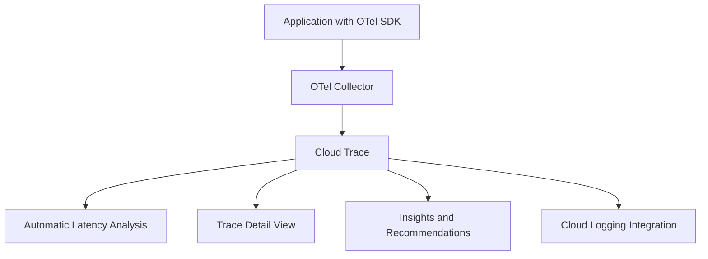

# How to Compare OpenTelemetry vs Google Cloud Trace

Author: [nawazdhandala](https://www.github.com/nawazdhandala)

Tags: OpenTelemetry, Google Cloud Trace, GCP, Distributed Tracing, Cloud Observability

Description: A hands-on comparison of OpenTelemetry and Google Cloud Trace for distributed tracing on GCP, with instrumentation examples and architecture guidance.

---

Google Cloud Trace (formerly Stackdriver Trace) is GCP's managed distributed tracing service. Google has a deep history with tracing, having published the Dapper paper that inspired most modern tracing systems. Google is also a founding contributor to OpenTelemetry, which grew partly from Google's OpenCensus project. This background makes the relationship between Cloud Trace and OpenTelemetry particularly interesting.

## Historical Context

OpenCensus was Google's open source instrumentation library. When it merged with OpenTracing to form OpenTelemetry, Google committed to making OpenTelemetry the primary instrumentation path for Cloud Trace. Today, Google recommends OpenTelemetry as the preferred way to instrument applications that send traces to Cloud Trace.

This means unlike AWS X-Ray, there is less of a "native SDK vs OpenTelemetry" debate. The OpenTelemetry path is the native path for Cloud Trace.

## Instrumentation with OpenTelemetry for Cloud Trace

Here is how you instrument a Go application to send traces to Cloud Trace:

```go
// Go application instrumented with OpenTelemetry
// Exports traces to Google Cloud Trace using the GCP exporter
package main

import (
    "context"
    "log"

    "go.opentelemetry.io/otel"
    "go.opentelemetry.io/otel/sdk/trace"
    // Google Cloud Trace exporter for OpenTelemetry
    cloudtrace "github.com/GoogleCloudPlatform/opentelemetry-operations-go/exporter/trace"
)

func initTracer() func() {
    // Create the Cloud Trace exporter
    // Uses Application Default Credentials for authentication
    exporter, err := cloudtrace.New(
        cloudtrace.WithProjectID("my-gcp-project"),
    )
    if err != nil {
        log.Fatalf("Failed to create Cloud Trace exporter: %v", err)
    }

    // Create a tracer provider with the Cloud Trace exporter
    tp := trace.NewTracerProvider(
        trace.WithBatcher(exporter),
        // Sample 100% of traces in development
        trace.WithSampler(trace.AlwaysSample()),
    )
    otel.SetTracerProvider(tp)

    return func() {
        // Flush remaining spans on shutdown
        tp.Shutdown(context.Background())
    }
}

func main() {
    cleanup := initTracer()
    defer cleanup()

    tracer := otel.Tracer("my-service")

    ctx, span := tracer.Start(context.Background(), "handle-request")
    defer span.End()

    // Your application logic here
    processRequest(ctx)
}
```

For Python applications:

```python
# Python application sending traces to Google Cloud Trace
# Uses the opentelemetry-exporter-gcp-trace package
from opentelemetry import trace
from opentelemetry.sdk.trace import TracerProvider
from opentelemetry.sdk.trace.export import BatchSpanProcessor
from opentelemetry.exporter.cloud_trace import CloudTraceSpanExporter

# Create the Cloud Trace exporter
# Automatically uses Application Default Credentials
exporter = CloudTraceSpanExporter(project_id="my-gcp-project")

# Set up the tracer provider
provider = TracerProvider()
provider.add_span_processor(BatchSpanProcessor(exporter))
trace.set_tracer_provider(provider)

tracer = trace.get_tracer("my-service")

def handle_request(request):
    with tracer.start_as_current_span("handle-request") as span:
        span.set_attribute("http.method", request.method)
        span.set_attribute("http.url", request.url)
        return process(request)
```

Notice that both examples use standard OpenTelemetry APIs. The only GCP-specific part is the exporter.

## Using the OTel Collector with Cloud Trace

Instead of exporting directly from your application, you can route traces through an OpenTelemetry Collector:

```yaml
# OTel Collector configuration for exporting to Cloud Trace
# The collector handles batching, retry, and authentication
receivers:
  otlp:
    protocols:
      grpc:
        endpoint: 0.0.0.0:4317
      http:
        endpoint: 0.0.0.0:4318

processors:
  batch:
    timeout: 5s
    send_batch_size: 200

  # Resource detection adds GCP-specific attributes automatically
  resourcedetection:
    detectors:
      - gcp
    timeout: 5s

exporters:
  googlecloud:
    project: my-gcp-project
    trace:
      # Configure attribute mapping to Cloud Trace labels
      attribute_mappings:
        - key: service.name
          replacement: /service/name
        - key: deployment.environment
          replacement: /environment

service:
  pipelines:
    traces:
      receivers: [otlp]
      processors: [resourcedetection, batch]
      exporters: [googlecloud]
```

The `resourcedetection` processor automatically adds GCP metadata like project ID, zone, and instance ID to your spans.

## Cloud Trace Native Features

Cloud Trace offers several features that work with OpenTelemetry data:



**Automatic Latency Analysis**: Cloud Trace automatically builds latency distributions for your traced operations and highlights regressions. This works with any span data, regardless of how it was collected.

**Cloud Logging Correlation**: When you use both Cloud Trace and Cloud Logging, trace IDs are automatically correlated with log entries. Clicking on a trace shows related logs.

```python
# Python logging with trace context for Cloud Logging correlation
# Log entries automatically link to their associated traces
import logging
from opentelemetry import trace

logger = logging.getLogger(__name__)

def process_order(order_id):
    tracer = trace.get_tracer("order-service")
    with tracer.start_as_current_span("process-order") as span:
        # Cloud Logging agent automatically picks up trace context
        # from the current span when structured logging is used
        logger.info(
            "Processing order",
            extra={
                "order_id": order_id,
                # These fields enable log-trace correlation
                "logging.googleapis.com/trace": span.get_span_context().trace_id,
                "logging.googleapis.com/spanId": span.get_span_context().span_id,
            }
        )
```

## Sampling in Cloud Trace

Cloud Trace supports the traces it receives but does not provide centralized sampling rules like AWS X-Ray does. Sampling decisions happen in the OpenTelemetry SDK or Collector.

```yaml
# OTel Collector with sampling before Cloud Trace export
# Reduces costs by sampling traces intelligently
processors:
  # Probabilistic sampling at the collector level
  probabilistic_sampler:
    sampling_percentage: 25

  # Tail-based sampling for more intelligent decisions
  tail_sampling:
    decision_wait: 10s
    policies:
      # Keep all error traces
      - name: errors
        type: status_code
        status_code:
          status_codes: [ERROR]
      # Keep all slow traces
      - name: slow-requests
        type: latency
        latency:
          threshold_ms: 5000
      # Sample 10% of normal traces
      - name: normal
        type: probabilistic
        probabilistic:
          sampling_percentage: 10

service:
  pipelines:
    traces:
      receivers: [otlp]
      processors: [tail_sampling, batch]
      exporters: [googlecloud]
```

This sampling flexibility is a significant advantage of using the OpenTelemetry Collector over direct SDK export.

## GKE Integration

On Google Kubernetes Engine, Cloud Trace integration is particularly smooth. GKE clusters can run the OTel Collector as a managed component:

```yaml
# GKE workload with OTel auto-instrumentation
# Uses the GKE OpenTelemetry add-on for managed collection
apiVersion: apps/v1
kind: Deployment
metadata:
  name: order-service
spec:
  template:
    metadata:
      annotations:
        # Enable automatic instrumentation via GKE OTel operator
        instrumentation.opentelemetry.io/inject-python: "true"
    spec:
      containers:
        - name: order-service
          image: gcr.io/my-project/order-service:latest
          env:
            - name: OTEL_SERVICE_NAME
              value: "order-service"
            # GKE collector endpoint is available in-cluster
            - name: OTEL_EXPORTER_OTLP_ENDPOINT
              value: "http://opentelemetry-collector.monitoring:4317"
```

## Cost Considerations

Cloud Trace pricing is based on the number of trace spans ingested and stored. As of 2026, the first 2.5 million spans per month are free. Beyond that, pricing is $0.20 per million spans ingested.

For high-volume services, this can add up. Using the OTel Collector for sampling before export is the most effective way to control costs without losing visibility into important traces.

## Comparison with Direct OpenTelemetry Backend

If you want to avoid Cloud Trace entirely, you can run your own tracing backend on GKE:

| Aspect | Cloud Trace | Self-Hosted (Tempo/Jaeger) |
|--------|------------|---------------------------|
| Setup effort | Minimal | Significant |
| Operational burden | None (managed) | High |
| Cost at scale | Per-span pricing | Infrastructure cost only |
| Cloud Logging integration | Native | Manual correlation |
| Retention | 30 days | Configurable |
| Query language | GCP Trace Explorer | TraceQL / Jaeger UI |

## Recommendation

For teams running on GCP, the recommended approach is to use OpenTelemetry SDKs with the OTel Collector and the Cloud Trace exporter. This gives you standard instrumentation, flexible processing, and the managed Cloud Trace experience. If you need longer retention or lower costs at scale, you can add a second exporter to a self-hosted backend and use the OTel Collector to route data to both destinations.

The key takeaway is that on GCP, OpenTelemetry is not an alternative to Cloud Trace. It is the way you use Cloud Trace.
