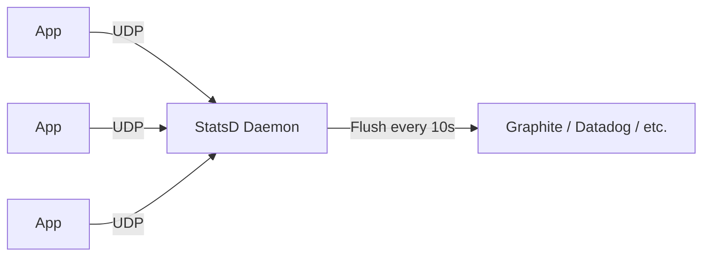
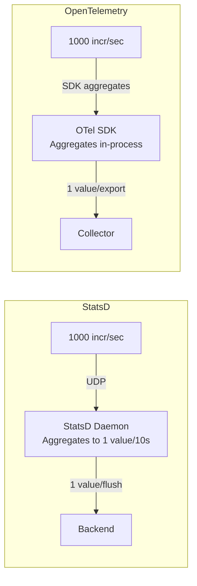

# How to Compare OpenTelemetry vs StatsD for Metrics Collection

Author: [nawazdhandala](https://www.github.com/nawazdhandala)

Tags: OpenTelemetry, StatsD, Metrics, Monitoring, Observability

Description: A practical comparison of OpenTelemetry and StatsD for application metrics collection, covering protocols, aggregation, and migration strategies.

---

StatsD has been around since 2011 when Etsy open-sourced their simple metrics daemon. Its UDP-based fire-and-forget protocol made it incredibly easy to add metrics to any application. OpenTelemetry provides a more modern and comprehensive approach to metrics. This article compares the two, looking at where StatsD still makes sense and where OpenTelemetry is the better choice.

## How StatsD Works

StatsD is beautifully simple. Your application sends metric data as UDP packets to a StatsD daemon. The daemon aggregates the metrics over a flush interval and forwards them to a backend like Graphite, Datadog, or InfluxDB.



The protocol is text-based and trivially simple:

```
metric.name:value|type|@sample_rate|#tag1:value1,tag2:value2
```

Here are some examples:

```python
# StatsD metrics examples
# Counter: increment a counter
"orders.processed:1|c"

# Timer: record a duration in milliseconds
"api.request.duration:145|ms"

# Gauge: set a value
"queue.depth:42|g"

# Histogram: record a value for distribution
"payment.amount:99.95|h"

# Counter with sample rate (only 10% of calls actually send)
"page.views:1|c|@0.1"

# Counter with tags (DogStatsD extension)
"orders.processed:1|c|#service:order-service,env:prod"
```

## Sending StatsD Metrics

The code to send StatsD metrics is minimal:

```python
# Python StatsD client example
# The simplest possible metrics instrumentation
import statsd

# Create a StatsD client
client = statsd.StatsClient('localhost', 8125, prefix='myapp')

def process_order(order):
    # Increment a counter
    client.incr('orders.received')

    # Time an operation using a context manager
    with client.timer('order.processing_time'):
        result = do_processing(order)

    if result.success:
        client.incr('orders.success')
        # Record the order amount as a histogram
        client.timing('order.amount', order.total_cents)
    else:
        client.incr('orders.failure')

    # Set a gauge value
    client.gauge('orders.queue_depth', get_queue_depth())
```

```java
// Java StatsD client example
// Using the java-dogstatsd-client
import com.timgroup.statsd.NonBlockingStatsDClient;
import com.timgroup.statsd.StatsDClient;

public class OrderService {
    // StatsD client sends UDP packets to the daemon
    private static final StatsDClient statsd = new NonBlockingStatsDClient(
            "myapp",    // prefix
            "localhost", // host
            8125         // port
    );

    public void processOrder(Order order) {
        statsd.incrementCounter("orders.received");

        long start = System.currentTimeMillis();
        try {
            doProcessing(order);
            statsd.incrementCounter("orders.success");
        } catch (Exception e) {
            statsd.incrementCounter("orders.failure");
        } finally {
            long duration = System.currentTimeMillis() - start;
            statsd.recordExecutionTime("order.processing_time", duration);
        }
    }
}
```

## The Same Metrics with OpenTelemetry

```python
# OpenTelemetry metrics for the same use case
# More setup, but richer data model and multi-signal support
from opentelemetry import metrics
from opentelemetry.sdk.metrics import MeterProvider
from opentelemetry.sdk.metrics.export import PeriodicExportingMetricReader
from opentelemetry.exporter.otlp.proto.grpc.metric_exporter import OTLPMetricExporter

# Setup (typically done once at application startup)
exporter = OTLPMetricExporter(endpoint="http://collector:4317")
reader = PeriodicExportingMetricReader(exporter, export_interval_millis=10000)
provider = MeterProvider(metric_readers=[reader])
metrics.set_meter_provider(provider)

meter = metrics.get_meter("myapp", "1.0.0")

# Create instruments
orders_received = meter.create_counter(
    "orders.received",
    description="Total orders received",
    unit="1",
)
orders_success = meter.create_counter("orders.success", unit="1")
orders_failure = meter.create_counter("orders.failure", unit="1")
processing_time = meter.create_histogram(
    "order.processing_time",
    description="Order processing duration",
    unit="ms",
)
queue_depth = meter.create_up_down_counter(
    "orders.queue_depth",
    description="Current order queue depth",
    unit="1",
)

def process_order(order):
    attrs = {"service": "order-service", "env": "prod"}
    orders_received.add(1, attrs)

    start = time.time()
    try:
        result = do_processing(order)
        orders_success.add(1, attrs)
    except Exception:
        orders_failure.add(1, attrs)
        raise
    finally:
        duration_ms = (time.time() - start) * 1000
        processing_time.record(duration_ms, attrs)
```

OpenTelemetry requires more setup code, but the instrumentation code itself is similarly straightforward.

## Key Differences

### Protocol and Transport

StatsD uses UDP by default. This is a fire-and-forget protocol, which means:

- Sending metrics never blocks your application
- Metrics can be lost if the network is congested or the daemon is down
- No back-pressure mechanism
- Extremely low overhead

OpenTelemetry uses TCP-based protocols (gRPC or HTTP). This means:

- Reliable delivery with retries
- Back-pressure when the collector is overloaded
- Slightly higher overhead per metric
- Connection management needed

### Aggregation Location

StatsD aggregates metrics in the daemon before sending to the backend. This means:



StatsD's daemon-side aggregation offloads the work from your application but adds a network hop for every metric. OpenTelemetry aggregates in the SDK within your application process, which is more efficient but uses application memory.

### Dimensionality and Labels

Original StatsD has no concept of tags or labels. Each unique metric name is a separate time series:

```
# Without tags, you create separate metric names
orders.processed.us_east:1|c
orders.processed.eu_west:1|c
orders.processed.ap_south:1|c
```

DogStatsD (Datadog's extension) added tag support:

```
# DogStatsD adds tag support
orders.processed:1|c|#region:us_east,service:orders
```

OpenTelemetry has first-class support for attributes (dimensions):

```python
# OTel attributes are a core concept
orders_counter.add(1, {
    "region": "us-east",
    "service": "orders",
    "payment.method": "credit_card",
})
```

### Data Types

| Type | StatsD | OpenTelemetry |
|------|--------|---------------|
| Counter | Yes | Yes (Counter, UpDownCounter) |
| Gauge | Yes | Yes (via callbacks) |
| Timer/Histogram | Yes | Yes (Histogram) |
| Summary | No (backend-side) | Yes (in some SDKs) |
| Exponential Histogram | No | Yes |
| Sets | Yes (unique values) | No direct equivalent |

OpenTelemetry's exponential histogram is a significant advantage for capturing latency distributions without predefined bucket boundaries.

## Bridging StatsD to OpenTelemetry

If you have existing StatsD instrumentation, you can bridge it to OpenTelemetry using the collector's StatsD receiver:

```yaml
# OTel Collector receiving StatsD metrics
# Bridges existing StatsD instrumentation into the OTel pipeline
receivers:
  statsd:
    endpoint: 0.0.0.0:8125
    # Configure aggregation interval
    aggregation_interval: 60s
    # Enable timer histogram conversion
    enable_metric_type: true
    # Map StatsD tags to OTel attributes
    is_monotonic_counter: true

processors:
  batch:
    timeout: 10s

exporters:
  otlp:
    endpoint: "backend.example.com:4317"

service:
  pipelines:
    metrics:
      receivers: [statsd]
      processors: [batch]
      exporters: [otlp]
```

This lets you keep existing StatsD instrumentation running while adding new instrumentation with OpenTelemetry. Over time, you can migrate services one by one.

## Performance Overhead

StatsD's UDP protocol has near-zero overhead. A single `incr` call takes microseconds and never blocks. If the daemon is unreachable, the packet is simply lost.

OpenTelemetry's overhead is higher but still low. The SDK batches and aggregates metrics in memory, then exports on a schedule. The export itself happens in a background thread and does not block application code. Typical overhead is a few additional milliseconds of CPU time per export interval.

For most applications, the performance difference is negligible. For ultra-high-frequency metrics in latency-sensitive code paths, StatsD's UDP approach still has an edge.

## When to Choose Each

Use StatsD when:

- You have existing StatsD infrastructure and instrumentation
- Ultra-low overhead per metric is critical
- You need the simplest possible instrumentation
- You only need basic counters, gauges, and timers

Use OpenTelemetry when:

- You want metrics, traces, and logs from a single SDK
- Reliable metric delivery matters (no UDP packet loss)
- You need rich attributes and semantic conventions
- Exponential histograms would improve your latency monitoring
- Vendor-neutral instrumentation is a priority

## Migration Path

The cleanest migration path from StatsD to OpenTelemetry is:

1. Deploy the OTel Collector with the StatsD receiver alongside your existing StatsD daemon
2. Point new services at the OTel Collector using OpenTelemetry SDKs
3. Gradually update existing services to replace StatsD clients with OTel SDKs
4. Decommission the StatsD daemon when all services have migrated

The OTel Collector's StatsD receiver ensures you never lose metrics during the transition.

## Conclusion

StatsD's simplicity is its greatest strength. If all you need is basic counters and timers with minimal overhead, it still does the job well. OpenTelemetry provides a more capable and future-proof foundation that unifies metrics with traces and logs. For new projects, OpenTelemetry is the clear choice. For existing StatsD deployments, the migration can happen gradually with the OTel Collector serving as a bridge.
