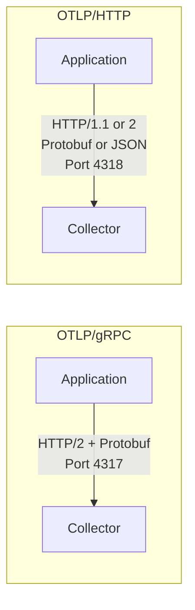
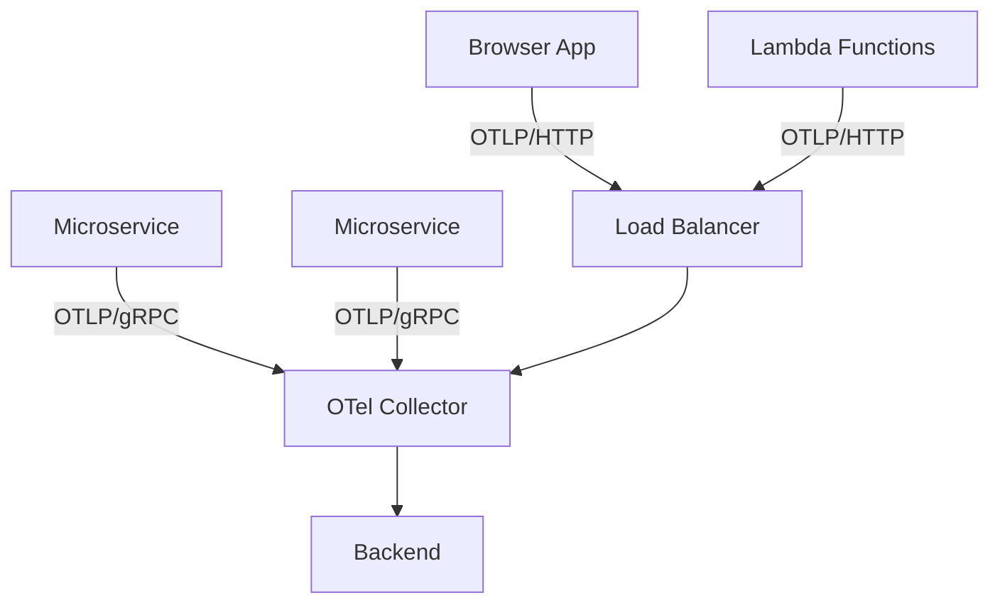

# How to Compare OTLP/gRPC vs OTLP/HTTP for Telemetry Export

Author: [nawazdhandala](https://www.github.com/nawazdhandala)

Tags: OpenTelemetry, OTLP, gRPC, HTTP, Telemetry Export, Protocols

Description: A practical comparison of OTLP/gRPC and OTLP/HTTP transport protocols for telemetry export, covering performance, compatibility, and deployment scenarios.

---

OpenTelemetry defines OTLP (OpenTelemetry Protocol) as the standard wire protocol for telemetry data. OTLP can run over two transports: gRPC and HTTP. Both carry the same data using the same protobuf schema, but the transport layer differences affect performance, compatibility, and operational complexity. This guide helps you choose the right one for your environment.

## Protocol Fundamentals

OTLP/gRPC uses HTTP/2 with protocol buffers serialization over a persistent bidirectional connection. The default port is 4317.

OTLP/HTTP uses HTTP/1.1 or HTTP/2 with either protobuf or JSON serialization. The default port is 4318. Requests go to specific paths: `/v1/traces`, `/v1/metrics`, and `/v1/logs`.



## Configuration Examples

Setting up a collector to receive both protocols:

```yaml
# OTel Collector receiver configuration accepting both transports
# Most deployments enable both for maximum compatibility
receivers:
  otlp:
    protocols:
      grpc:
        # gRPC endpoint on the standard port
        endpoint: 0.0.0.0:4317
        # Maximum message size for large batches
        max_recv_msg_size_mib: 16
        # Keep-alive settings for persistent connections
        keepalive:
          server_parameters:
            max_connection_idle: 60s
            max_connection_age: 300s
      http:
        # HTTP endpoint on the standard port
        endpoint: 0.0.0.0:4318
        # CORS settings for browser-based clients
        cors:
          allowed_origins:
            - "https://app.example.com"
          allowed_headers:
            - "Content-Type"

service:
  pipelines:
    traces:
      receivers: [otlp]
      processors: [batch]
      exporters: [otlp]
```

Configuring an SDK exporter for each protocol:

```python
# Python SDK configuration for OTLP/gRPC export
from opentelemetry.exporter.otlp.proto.grpc.trace_exporter import OTLPSpanExporter

# gRPC exporter with compression enabled
grpc_exporter = OTLPSpanExporter(
    endpoint="collector.example.com:4317",
    # gRPC supports native compression
    compression=Compression.Gzip,
    # Headers for authentication
    headers={"Authorization": "Bearer token123"},
    # Timeout for each export call
    timeout=10,
)
```

```python
# Python SDK configuration for OTLP/HTTP export
from opentelemetry.exporter.otlp.proto.http.trace_exporter import OTLPSpanExporter

# HTTP exporter with protobuf encoding (default)
http_exporter = OTLPSpanExporter(
    endpoint="https://collector.example.com:4318",
    # HTTP also supports gzip compression
    compression=Compression.Gzip,
    headers={"Authorization": "Bearer token123"},
    timeout=10,
)
```

## Performance Comparison

gRPC has several performance advantages due to HTTP/2:

**Connection multiplexing**: gRPC maintains a single persistent connection and multiplexes multiple requests over it. This reduces connection setup overhead and TCP handshake costs.

**Binary framing**: HTTP/2's binary framing is more efficient than HTTP/1.1's text-based protocol.

**Header compression**: HTTP/2 uses HPACK header compression, which significantly reduces header overhead for repeated requests with similar headers.

Here are rough throughput numbers from a controlled benchmark:

| Metric | OTLP/gRPC | OTLP/HTTP (protobuf) | OTLP/HTTP (JSON) |
|--------|-----------|---------------------|-------------------|
| Spans/second (single connection) | ~50,000 | ~30,000 | ~15,000 |
| CPU usage (normalized) | 1.0x | 1.2x | 2.5x |
| Bandwidth (1000 spans) | ~45 KB | ~50 KB | ~120 KB |
| Connection overhead | Low (persistent) | Medium (keep-alive) | Higher (per-request possible) |

These numbers will vary based on span complexity, network conditions, and hardware. The key takeaway is that gRPC is consistently more efficient, especially at high throughput.

## Serialization Options

OTLP/gRPC always uses protobuf serialization. There is no choice to make.

OTLP/HTTP supports two serialization formats:

```python
# OTLP/HTTP with protobuf serialization (recommended)
# Set via Content-Type: application/x-protobuf
http_exporter_proto = OTLPSpanExporter(
    endpoint="https://collector:4318",
    # Protobuf is the default and recommended format
)

# OTLP/HTTP with JSON serialization
# Set via Content-Type: application/json
# Useful for debugging but significantly less efficient
http_exporter_json = OTLPSpanExporter(
    endpoint="https://collector:4318",
    # Some SDKs support JSON via configuration
)
```

Protobuf serialization is always preferred for production. JSON is useful for debugging because you can read the payload, but it uses 2-3x more bandwidth and CPU.

## Network and Infrastructure Compatibility

This is where OTLP/HTTP has significant advantages.

**Load balancers**: Many load balancers (especially older ones or L7 proxies) handle HTTP/1.1 traffic better than gRPC. AWS ALB, Nginx, and HAProxy all support gRPC now, but configuration is more involved.

```nginx
# Nginx configuration for proxying OTLP/gRPC
# Requires explicit HTTP/2 configuration
upstream otel_grpc {
    server collector:4317;
}

server {
    listen 4317 http2;

    location / {
        # gRPC requires specific proxy settings
        grpc_pass grpc://otel_grpc;
        grpc_set_header X-Real-IP $remote_addr;
    }
}
```

```nginx
# Nginx configuration for proxying OTLP/HTTP
# Standard HTTP proxy configuration works
upstream otel_http {
    server collector:4318;
}

server {
    listen 4318;

    location / {
        # Standard HTTP proxy settings work fine
        proxy_pass http://otel_http;
        proxy_set_header Host $host;
        proxy_set_header X-Real-IP $remote_addr;
    }
}
```

**Firewalls and proxies**: Corporate firewalls and forward proxies often block non-standard protocols. HTTP traffic on standard ports passes through more easily than gRPC.

**Browser environments**: Browser-based telemetry (from the OTel Web SDK) cannot use gRPC natively. OTLP/HTTP is the only option for browser instrumentation.

```javascript
// Browser-based telemetry must use OTLP/HTTP
// gRPC is not available in browser environments
import { OTLPTraceExporter } from '@opentelemetry/exporter-trace-otlp-http';

const exporter = new OTLPTraceExporter({
    // OTLP/HTTP works from browsers
    url: 'https://collector.example.com:4318/v1/traces',
    headers: {
        'Authorization': 'Bearer token123',
    },
});
```

**Serverless environments**: Short-lived functions (Lambda, Cloud Functions) benefit from OTLP/HTTP because each request is independent. gRPC's connection setup overhead is wasted when the function dies after one invocation.

## TLS and Security

Both protocols support TLS, but the configuration differs slightly:

```yaml
# OTel Collector with TLS for both protocols
receivers:
  otlp:
    protocols:
      grpc:
        endpoint: 0.0.0.0:4317
        tls:
          # gRPC TLS configuration
          cert_file: /certs/server.crt
          key_file: /certs/server.key
          client_ca_file: /certs/ca.crt
      http:
        endpoint: 0.0.0.0:4318
        tls:
          # HTTP TLS configuration (same structure)
          cert_file: /certs/server.crt
          key_file: /certs/server.key
```

In Kubernetes with service mesh (Istio, Linkerd), mTLS is often handled at the mesh level, making the transport choice less relevant for security.

## Retry and Error Handling

gRPC provides rich error codes (UNAVAILABLE, DEADLINE_EXCEEDED, RESOURCE_EXHAUSTED) that OpenTelemetry SDKs use for intelligent retry logic. The SDK knows exactly what happened and can decide whether to retry.

HTTP uses standard status codes (429 Too Many Requests, 503 Service Unavailable). The retry logic works but has less granularity in understanding the failure mode.

```python
# gRPC retry behavior is more granular
# The SDK handles these automatically
# - UNAVAILABLE: retry with backoff
# - DEADLINE_EXCEEDED: retry with backoff
# - RESOURCE_EXHAUSTED: retry with longer backoff
# - INVALID_ARGUMENT: do not retry (data issue)

# HTTP retry behavior maps status codes
# - 429: retry with Retry-After header if present
# - 502, 503, 504: retry with backoff
# - 400: do not retry (data issue)
```

## Decision Guide

Choose OTLP/gRPC when:

- High throughput is critical (more than 10,000 spans/second per connection)
- Your infrastructure supports HTTP/2 end-to-end
- You are running in Kubernetes with gRPC-aware load balancing
- Long-running services with persistent connections

Choose OTLP/HTTP when:

- Browser-based instrumentation is needed
- Your network has proxies or firewalls that do not support gRPC
- Serverless or short-lived environments
- Simpler infrastructure requirements
- Debugging is easier with JSON support

For most Kubernetes-based microservice deployments, gRPC is the better default. For mixed environments or when you need maximum compatibility, HTTP with protobuf serialization gives you nearly the same performance with better infrastructure support.

## Running Both

Many production setups accept both protocols. Internal services use gRPC for efficiency, while edge services and browsers use HTTP:



This is a pragmatic approach that uses each protocol where it works best.
