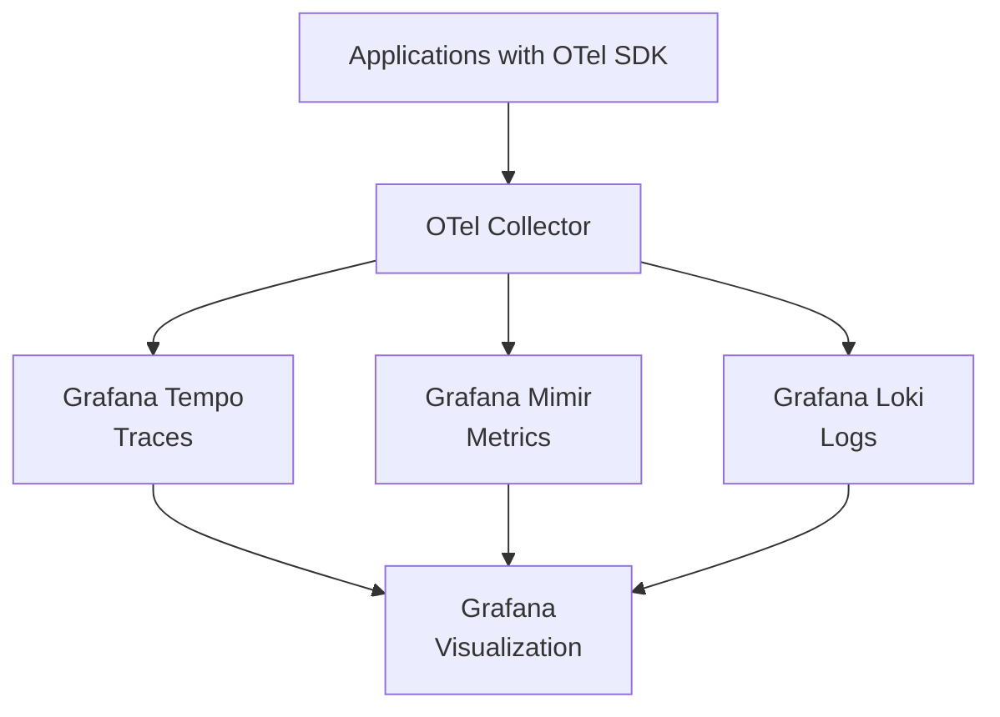
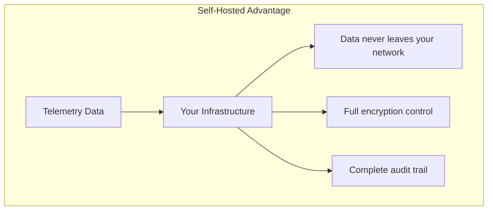

# How to Compare Self-Hosted OpenTelemetry Backends vs SaaS Vendors

Author: [nawazdhandala](https://www.github.com/nawazdhandala)

Tags: OpenTelemetry, Self-Hosted, SaaS, Observability, Backend Comparison

Description: A thorough comparison of self-hosted OpenTelemetry backends and SaaS observability vendors, covering cost, operations, features, and decision criteria.

---

Once you have instrumented your applications with OpenTelemetry, you need somewhere to send the data. The beauty of OpenTelemetry is that it decouples instrumentation from the backend, giving you a genuine choice between running your own infrastructure or paying a SaaS vendor. This article walks through the real trade-offs of each approach.

## The Self-Hosted Stack

A typical self-hosted OpenTelemetry backend uses specialized storage systems for each signal type:



Here is a minimal Kubernetes deployment for a self-hosted stack:

```yaml
# OTel Collector deployment that routes to self-hosted backends
# Central gateway that receives OTLP and fans out to storage
receivers:
  otlp:
    protocols:
      grpc:
        endpoint: 0.0.0.0:4317
      http:
        endpoint: 0.0.0.0:4318

processors:
  batch:
    timeout: 5s
    send_batch_size: 2000
  memory_limiter:
    check_interval: 1s
    limit_percentage: 80
    spike_limit_percentage: 25

exporters:
  # Traces to Grafana Tempo
  otlp/tempo:
    endpoint: "tempo-distributor.monitoring:4317"
    tls:
      insecure: true

  # Metrics to Grafana Mimir via Prometheus remote write
  prometheusremotewrite:
    endpoint: "http://mimir-distributor.monitoring:8080/api/v1/push"

  # Logs to Grafana Loki
  loki:
    endpoint: "http://loki-distributor.monitoring:3100/loki/api/v1/push"

service:
  pipelines:
    traces:
      receivers: [otlp]
      processors: [memory_limiter, batch]
      exporters: [otlp/tempo]
    metrics:
      receivers: [otlp]
      processors: [memory_limiter, batch]
      exporters: [prometheusremotewrite]
    logs:
      receivers: [otlp]
      processors: [memory_limiter, batch]
      exporters: [loki]
```

Alternative self-hosted options include:

- **Traces**: Jaeger, Zipkin, SigNoz, ClickHouse
- **Metrics**: Prometheus, VictoriaMetrics, Thanos, ClickHouse
- **Logs**: Elasticsearch, ClickHouse, Loki

## The SaaS Approach

With a SaaS vendor, the same OTel Collector configuration becomes much simpler:

```yaml
# OTel Collector exporting to a SaaS vendor
# No backend infrastructure to manage
receivers:
  otlp:
    protocols:
      grpc:
        endpoint: 0.0.0.0:4317

processors:
  batch:
    timeout: 5s

exporters:
  otlp:
    endpoint: "ingest.saas-vendor.com:443"
    headers:
      # Authentication via API key
      "x-api-key": "${API_KEY}"

service:
  pipelines:
    traces:
      receivers: [otlp]
      processors: [batch]
      exporters: [otlp]
    metrics:
      receivers: [otlp]
      processors: [batch]
      exporters: [otlp]
    logs:
      receivers: [otlp]
      processors: [batch]
      exporters: [otlp]
```

SaaS vendors that accept OTLP natively include Datadog, New Relic, Honeycomb, Grafana Cloud, Dynatrace, Lightstep (now ServiceNow Cloud Observability), OneUptime, and many others.

## Cost Comparison

This is usually the biggest factor in the decision. Let's work through a realistic example.

Assume a medium-sized deployment:
- 50 microservices
- 500 million spans per month
- 10 million active metric time series
- 500 GB of logs per month

### Self-Hosted Costs

```
# Self-hosted infrastructure cost estimate
# Running on Kubernetes with cloud VMs

Compute (Kubernetes nodes):
  - 3 nodes for Tempo (traces): 3 x $200/mo = $600
  - 3 nodes for Mimir (metrics): 3 x $200/mo = $600
  - 3 nodes for Loki (logs): 3 x $200/mo = $600
  - 2 nodes for Grafana + misc: 2 x $200/mo = $400

Object Storage (S3/GCS):
  - Trace storage: ~2 TB = $50/mo
  - Metric storage: ~500 GB = $15/mo
  - Log storage: ~1 TB = $25/mo

Subtotal infrastructure: ~$2,290/mo

Engineering time:
  - 0.5 FTE for maintenance and operations
  - At $150k/yr fully loaded = $6,250/mo

Total self-hosted: ~$8,540/mo
```

### SaaS Vendor Costs

```
# SaaS vendor cost estimate (ranges vary by vendor)

Traces:
  - 500M spans x $1-3 per million = $500 - $1,500/mo

Metrics:
  - 10M time series at $5-15 per 1000 = $50,000 - $150,000/mo
  (This is where SaaS gets expensive)

Logs:
  - 500 GB x $1-3 per GB = $500 - $1,500/mo

Total SaaS: $51,000 - $153,000/mo
```

The numbers above are rough and vary widely by vendor, but they illustrate the pattern. SaaS pricing for metrics at scale is often the biggest cost driver, primarily because of per-time-series pricing models.

At small scale (a few services, low volume), SaaS is cheaper because you avoid the engineering overhead. At medium to large scale, self-hosted becomes significantly more cost-effective.

## Operational Burden

Self-hosting means you own the infrastructure:

```yaml
# Things you need to manage with self-hosted backends
Operations checklist:
  Daily:
    - Monitor backend health and performance
    - Check storage utilization trends
    - Review ingestion pipeline for errors

  Weekly:
    - Review and tune resource allocations
    - Check for software updates and CVEs
    - Validate backup and recovery procedures

  Monthly:
    - Capacity planning based on growth trends
    - Performance tuning for query latency
    - Cost optimization of cloud resources

  Quarterly:
    - Major version upgrades
    - Architecture review
    - Disaster recovery testing
```

With SaaS, these operational tasks disappear. The vendor handles scaling, upgrades, storage, and availability. Your team focuses on using the data rather than managing the infrastructure.

## Feature Comparison

| Feature | Self-Hosted | SaaS Vendors |
|---------|-----------|-------------|
| Trace visualization | Grafana, Jaeger UI | Vendor-specific (often richer) |
| Alerting | Grafana Alerting, Alertmanager | Built-in, often ML-powered |
| Dashboards | Grafana (excellent) | Vendor-specific |
| Log correlation | Manual setup | Often automatic |
| APM features | Build yourself | Built-in (service maps, etc.) |
| AI/ML analysis | Not included | Many vendors offer this |
| SSO/RBAC | Configure yourself | Built-in |
| Compliance (SOC2, etc.) | Your responsibility | Vendor certified |
| Data residency | Full control | Depends on vendor regions |
| Custom retention | Full control | Vendor plan limits |

SaaS vendors generally offer richer out-of-the-box features, especially around AI-powered analysis, anomaly detection, and correlated views across signals. Self-hosted gives you more control and customization.

## Data Sovereignty and Security

For some organizations, data sovereignty is a hard requirement:



If your telemetry data contains sensitive information (PII in logs, business-critical metrics), keeping it on infrastructure you control eliminates third-party data handling concerns. This matters for regulated industries like healthcare, finance, and government.

With SaaS vendors, you need to evaluate their security posture, data handling practices, and compliance certifications. Most major vendors have SOC 2 Type II and handle data responsibly, but the due diligence is still required.

## The Hybrid Approach

Many organizations use a hybrid model:

```yaml
# OTel Collector with dual export for hybrid approach
# High-value data goes to SaaS, bulk data stays self-hosted
exporters:
  # Self-hosted backend for high-volume, lower-priority data
  otlp/self-hosted:
    endpoint: "tempo.internal:4317"
    tls:
      insecure: true

  # SaaS vendor for high-value data with rich analysis
  otlp/saas:
    endpoint: "ingest.vendor.com:443"
    headers:
      "x-api-key": "${API_KEY}"

processors:
  # Filter to identify high-value traces
  filter/critical:
    traces:
      span:
        - 'attributes["app.tier"] == "critical"'

service:
  pipelines:
    # All traces go to self-hosted for storage
    traces/all:
      receivers: [otlp]
      processors: [batch]
      exporters: [otlp/self-hosted]
    # Critical traces also go to SaaS for analysis
    traces/critical:
      receivers: [otlp]
      processors: [filter/critical, batch]
      exporters: [otlp/saas]
```

This gives you the cost efficiency of self-hosted storage for bulk data and the rich features of a SaaS vendor for the data that matters most.

## Decision Framework

Choose self-hosted when:

- You have a platform engineering team with observability experience
- Cost optimization at scale is a priority
- Data sovereignty requirements prevent using third-party services
- You need custom retention policies or data processing
- Your organization already runs Kubernetes and related infrastructure

Choose SaaS when:

- Your team is small and engineering time is better spent on product
- You need advanced features like AI-powered analysis
- Compliance certifications are easier to get from a vendor
- You want to get started quickly without infrastructure setup
- Your telemetry volume is moderate (SaaS is cost-effective at smaller scale)

Choose hybrid when:

- You want cost optimization for bulk data but rich features for critical data
- You are migrating between approaches and need a transition period
- Different teams have different needs and budgets

## Conclusion

The self-hosted vs SaaS decision is fundamentally about where you want to spend your resources. Self-hosted trades money for engineering time. SaaS trades engineering time for money. At small scale, SaaS usually wins. At large scale, self-hosted usually wins. And with OpenTelemetry's vendor-neutral instrumentation, you can start with one approach and switch to the other without re-instrumenting your applications. That flexibility is one of OpenTelemetry's most valuable properties.
