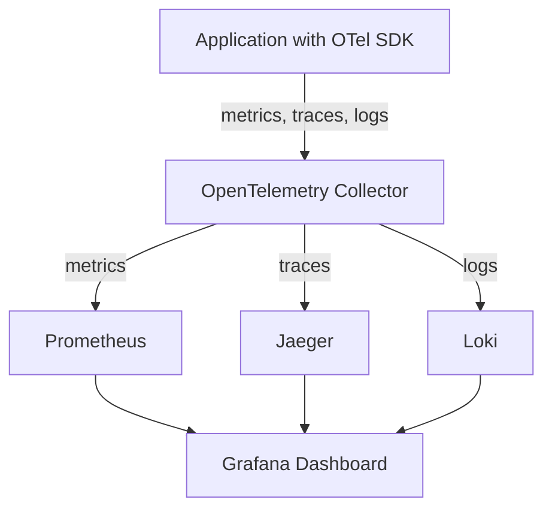

# How to Set Up a Complete Observability Stack with OpenTelemetry and Open-Source Tools

Author: [nawazdhandala](https://www.github.com/nawazdhandala)

Tags: OpenTelemetry, Observability Stack, Open Source, Grafana, Prometheus, Jaeger

Description: Build a production-ready observability stack using OpenTelemetry with Prometheus, Grafana, Jaeger, and other open-source tools for complete system visibility.

Building observability into your applications shouldn't require expensive proprietary platforms. With OpenTelemetry and a carefully selected set of open-source tools, you can create a comprehensive monitoring solution that rivals commercial offerings.

This guide walks through setting up a complete observability stack that handles metrics, traces, and logs using battle-tested open-source components.

## Architecture Overview

Our stack combines several specialized tools, each handling a specific aspect of observability:



The OpenTelemetry Collector sits between your applications and observability backends, providing a unified ingestion point. Prometheus stores and queries metrics, Jaeger handles distributed tracing, Loki aggregates logs, and Grafana provides a unified visualization layer.

## Prerequisites and Planning

Before deploying components, plan your infrastructure:

**Storage requirements:** Metrics, traces, and logs consume significant disk space. For a moderate-scale deployment (10 services, 100 req/s), budget at least 100GB for retention policies spanning 15 days.

**Network topology:** Decide whether to run collectors as sidecars, daemonsets, or centralized gateways. Sidecars reduce network hops but increase resource usage. Centralized collectors simplify management but become potential bottlenecks.

**Retention policies:** Balance storage costs with troubleshooting needs. Keep high-resolution metrics for 7 days, downsampled metrics for 90 days, and sample traces for 7-14 days.

## Installing the OpenTelemetry Collector

Start with a Docker Compose setup for local development and testing:

```yaml
# docker-compose.yml
version: '3.8'

services:
  otel-collector:
    image: otel/opentelemetry-collector-contrib:0.92.0
    container_name: otel-collector
    command: ["--config=/etc/otel-collector-config.yml"]
    volumes:
      - ./otel-collector-config.yml:/etc/otel-collector-config.yml
    ports:
      - "4317:4317"   # OTLP gRPC receiver
      - "4318:4318"   # OTLP HTTP receiver
      - "8888:8888"   # Metrics endpoint for collector itself
      - "8889:8889"   # Prometheus exporter
      - "13133:13133" # Health check endpoint
    networks:
      - observability

networks:
  observability:
    driver: bridge
```

Create the collector configuration file:

```yaml
# otel-collector-config.yml
receivers:
  # OTLP receiver accepts traces, metrics, and logs
  otlp:
    protocols:
      grpc:
        endpoint: 0.0.0.0:4317
      http:
        endpoint: 0.0.0.0:4318
        cors:
          allowed_origins:
            - "http://*"
            - "https://*"

  # Prometheus receiver scrapes metrics from applications
  prometheus:
    config:
      scrape_configs:
        - job_name: 'otel-collector'
          scrape_interval: 10s
          static_configs:
            - targets: ['localhost:8888']

processors:
  # Batch processor reduces network overhead
  batch:
    timeout: 10s
    send_batch_size: 1024

  # Memory limiter prevents out-of-memory crashes
  memory_limiter:
    check_interval: 1s
    limit_mib: 512
    spike_limit_mib: 128

  # Resource detection adds environment context
  resourcedetection:
    detectors: [env, system, docker]
    timeout: 5s

exporters:
  # Export to Prometheus for metrics
  prometheus:
    endpoint: "0.0.0.0:8889"
    namespace: otel

  # Export traces to Jaeger
  otlp/jaeger:
    endpoint: jaeger:4317
    tls:
      insecure: true

  # Export logs to Loki
  loki:
    endpoint: http://loki:3100/loki/api/v1/push

  # Debug exporter for troubleshooting
  logging:
    loglevel: info

service:
  pipelines:
    traces:
      receivers: [otlp]
      processors: [memory_limiter, resourcedetection, batch]
      exporters: [otlp/jaeger, logging]

    metrics:
      receivers: [otlp, prometheus]
      processors: [memory_limiter, resourcedetection, batch]
      exporters: [prometheus, logging]

    logs:
      receivers: [otlp]
      processors: [memory_limiter, resourcedetection, batch]
      exporters: [loki, logging]

  telemetry:
    logs:
      level: info
    metrics:
      address: 0.0.0.0:8888
```

This configuration sets up receivers for OTLP and Prometheus, processes data through batching and resource detection, and exports to appropriate backends.

## Deploying Prometheus

Prometheus stores and queries metrics. Add it to your Docker Compose stack:

```yaml
# Add to docker-compose.yml
  prometheus:
    image: prom/prometheus:v2.48.0
    container_name: prometheus
    volumes:
      - ./prometheus.yml:/etc/prometheus/prometheus.yml
      - prometheus-data:/prometheus
    command:
      - '--config.file=/etc/prometheus/prometheus.yml'
      - '--storage.tsdb.path=/prometheus'
      - '--storage.tsdb.retention.time=15d'
      - '--web.enable-lifecycle'
    ports:
      - "9090:9090"
    networks:
      - observability

volumes:
  prometheus-data:
```

Configure Prometheus to scrape the collector's metrics endpoint:

```yaml
# prometheus.yml
global:
  scrape_interval: 15s
  evaluation_interval: 15s
  external_labels:
    cluster: 'local-dev'
    environment: 'development'

scrape_configs:
  # Scrape metrics from OpenTelemetry Collector
  - job_name: 'otel-collector'
    static_configs:
      - targets: ['otel-collector:8889']

  # Scrape Prometheus itself
  - job_name: 'prometheus'
    static_configs:
      - targets: ['localhost:9090']

  # Add your application endpoints
  - job_name: 'applications'
    static_configs:
      - targets: ['app:8080']
```

Prometheus scrapes the collector's Prometheus exporter endpoint, pulling metrics that applications sent via OTLP.

## Deploying Jaeger for Tracing

Jaeger provides distributed tracing capabilities. Add all-in-one deployment for development:

```yaml
# Add to docker-compose.yml
  jaeger:
    image: jaegertracing/all-in-one:1.53
    container_name: jaeger
    environment:
      - COLLECTOR_OTLP_ENABLED=true
    ports:
      - "16686:16686" # Jaeger UI
      - "4317:4317"   # OTLP gRPC
      - "4318:4318"   # OTLP HTTP
    networks:
      - observability
```

The all-in-one image includes the collector, query service, and UI. For production, deploy these components separately with persistent storage.

## Deploying Loki for Logs

Loki stores and queries logs with a Prometheus-like query language:

```yaml
# Add to docker-compose.yml
  loki:
    image: grafana/loki:2.9.3
    container_name: loki
    ports:
      - "3100:3100"
    volumes:
      - ./loki-config.yml:/etc/loki/local-config.yaml
      - loki-data:/loki
    command: -config.file=/etc/loki/local-config.yaml
    networks:
      - observability

volumes:
  loki-data:
```

Configure Loki with appropriate retention and storage settings:

```yaml
# loki-config.yml
auth_enabled: false

server:
  http_listen_port: 3100

ingester:
  lifecycler:
    ring:
      kvstore:
        store: inmemory
      replication_factor: 1
  chunk_idle_period: 15m
  chunk_retain_period: 30s
  max_chunk_age: 1h
  chunk_target_size: 1048576

schema_config:
  configs:
    - from: 2024-01-01
      store: boltdb-shipper
      object_store: filesystem
      schema: v11
      index:
        prefix: index_
        period: 24h

storage_config:
  boltdb_shipper:
    active_index_directory: /loki/index
    cache_location: /loki/cache
    shared_store: filesystem
  filesystem:
    directory: /loki/chunks

limits_config:
  retention_period: 168h # 7 days
  enforce_metric_name: false
  reject_old_samples: true
  reject_old_samples_max_age: 168h

chunk_store_config:
  max_look_back_period: 0s

table_manager:
  retention_deletes_enabled: true
  retention_period: 168h
```

This configuration retains logs for 7 days with filesystem storage, suitable for development and small deployments.

## Setting Up Grafana

Grafana provides unified dashboards for metrics, traces, and logs:

```yaml
# Add to docker-compose.yml
  grafana:
    image: grafana/grafana:10.2.3
    container_name: grafana
    ports:
      - "3000:3000"
    environment:
      - GF_SECURITY_ADMIN_PASSWORD=admin
      - GF_USERS_ALLOW_SIGN_UP=false
    volumes:
      - grafana-data:/var/lib/grafana
      - ./grafana-datasources.yml:/etc/grafana/provisioning/datasources/datasources.yml
    networks:
      - observability

volumes:
  grafana-data:
```

Provision data sources automatically:

```yaml
# grafana-datasources.yml
apiVersion: 1

datasources:
  # Prometheus data source for metrics
  - name: Prometheus
    type: prometheus
    access: proxy
    url: http://prometheus:9090
    isDefault: true
    editable: true

  # Jaeger data source for traces
  - name: Jaeger
    type: jaeger
    access: proxy
    url: http://jaeger:16686
    editable: true

  # Loki data source for logs
  - name: Loki
    type: loki
    access: proxy
    url: http://loki:3100
    editable: true
    jsonData:
      derivedFields:
        - datasourceUid: Jaeger
          matcherRegex: "traceID=(\\w+)"
          name: TraceID
          url: "$${__value.raw}"
```

The `derivedFields` configuration links log entries to traces automatically when logs include trace IDs.

## Starting the Complete Stack

Launch all components with Docker Compose:

```bash
# Start all services
docker-compose up -d

# Verify all containers are running
docker-compose ps

# Check collector logs
docker-compose logs -f otel-collector
```

Access the services:
- Grafana: http://localhost:3000 (admin/admin)
- Prometheus: http://localhost:9090
- Jaeger UI: http://localhost:16686
- Loki: http://localhost:3100/ready

## Instrumenting Your First Application

With infrastructure running, instrument a sample application. Here's a Node.js example:

```javascript
// app.js - Sample instrumented application
const express = require('express');
const { metrics, trace } = require('@opentelemetry/api');
const { NodeSDK } = require('@opentelemetry/sdk-node');
const { OTLPTraceExporter } = require('@opentelemetry/exporter-trace-otlp-http');
const { OTLPMetricExporter } = require('@opentelemetry/exporter-metrics-otlp-http');
const { getNodeAutoInstrumentations } = require('@opentelemetry/auto-instrumentations-node');

// Initialize OpenTelemetry SDK
const sdk = new NodeSDK({
  serviceName: 'demo-app',
  traceExporter: new OTLPTraceExporter({
    url: 'http://localhost:4318/v1/traces',
  }),
  metricReader: new PeriodicExportingMetricReader({
    exporter: new OTLPMetricExporter({
      url: 'http://localhost:4318/v1/metrics',
    }),
    exportIntervalMillis: 10000,
  }),
  instrumentations: [getNodeAutoInstrumentations()],
});

sdk.start();

const app = express();
const meter = metrics.getMeter('demo-app');
const requestCounter = meter.createCounter('http_requests_total');

app.get('/api/hello', (req, res) => {
  requestCounter.add(1, { method: 'GET', endpoint: '/api/hello' });
  res.json({ message: 'Hello from instrumented app!' });
});

app.listen(8080, () => {
  console.log('App running on port 8080');
});
```

Add this to your Docker Compose:

```yaml
  demo-app:
    build: ./demo-app
    container_name: demo-app
    ports:
      - "8080:8080"
    environment:
      - OTEL_EXPORTER_OTLP_ENDPOINT=http://otel-collector:4318
    networks:
      - observability
```

Make requests to generate telemetry:

```bash
# Generate some traffic
for i in {1..100}; do
  curl http://localhost:8080/api/hello
  sleep 0.1
done
```

## Creating Grafana Dashboards

Build dashboards that combine metrics, traces, and logs.

Create a dashboard in Grafana for application metrics:

1. Navigate to Dashboards > New Dashboard
2. Add a new panel
3. Select Prometheus as the data source
4. Query: `rate(http_requests_total[5m])`
5. Set visualization type to Time series
6. Add another panel for error rates, latency percentiles, etc.

Create alerts based on metrics:

```yaml
# Add alert rules in Grafana or via Prometheus
groups:
  - name: application_alerts
    interval: 30s
    rules:
      - alert: HighErrorRate
        expr: rate(http_requests_total{status="500"}[5m]) > 0.05
        for: 5m
        labels:
          severity: warning
        annotations:
          summary: "High error rate detected"
          description: "Error rate is {{ $value }} for {{ $labels.service }}"
```

## Production Deployment Considerations

Development setup uses all-in-one containers and local storage. Production requires different architecture.

**High availability:** Deploy multiple collector instances behind a load balancer. Use Kubernetes DaemonSets or StatefulSets.

**Persistent storage:** Use object storage (S3, GCS) for Loki chunks. Deploy Prometheus with persistent volumes or use Thanos for long-term storage. Run Jaeger with Cassandra or Elasticsearch backend.

**Security:** Enable TLS for all communication. Add authentication to collector endpoints. Use mutual TLS for backend connections.

**Resource limits:** Set memory and CPU limits on collectors to prevent resource exhaustion. Use the memory_limiter processor.

**Monitoring the monitors:** Instrument your observability infrastructure. Track collector metrics, storage growth, query performance.

## Kubernetes Deployment

For production Kubernetes deployment, use Helm charts:

```bash
# Add Helm repositories
helm repo add open-telemetry https://open-telemetry.github.io/opentelemetry-helm-charts
helm repo add prometheus-community https://prometheus-community.github.io/helm-charts
helm repo add grafana https://grafana.github.io/helm-charts
helm repo add jaegertracing https://jaegertracing.github.io/helm-charts
helm repo update

# Install OpenTelemetry Collector
helm install otel-collector open-telemetry/opentelemetry-collector \
  --set mode=deployment \
  --set config.exporters.prometheus.endpoint="0.0.0.0:8889"

# Install Prometheus
helm install prometheus prometheus-community/kube-prometheus-stack

# Install Jaeger
helm install jaeger jaegertracing/jaeger

# Install Loki
helm install loki grafana/loki-stack

# Install Grafana (if not included in kube-prometheus-stack)
helm install grafana grafana/grafana
```

Customize values files for your specific requirements.

## Cost Optimization

Observability infrastructure can become expensive. Optimize costs:

**Sampling:** Don't trace every request. Use head-based or tail-based sampling in the collector.

**Downsampling:** Keep high-resolution metrics for short periods, downsample for long-term retention.

**Tiered storage:** Use cheaper storage for older data. Compress logs aggressively.

**Query optimization:** Expensive queries can overload backends. Set query limits and timeouts.

**Cardinality management:** High-cardinality labels explode metric series. Drop or aggregate high-cardinality dimensions.

## Troubleshooting Common Issues

**Collector not receiving data:** Check network connectivity, firewall rules, and endpoint configurations. Verify applications are sending to the correct collector address.

**Missing traces in Jaeger:** Check collector logs for export errors. Verify Jaeger backend connectivity. Look for sampling configuration that may be dropping traces.

**Metrics not appearing in Prometheus:** Ensure the Prometheus exporter is enabled in the collector. Check that Prometheus is scraping the correct endpoint. Verify metric names follow Prometheus naming conventions.

**High memory usage:** Enable the memory_limiter processor. Reduce batch sizes. Check for metric cardinality explosions.

**Slow queries:** Optimize data retention periods. Add appropriate indexes. Consider using recording rules for frequently queried metrics.

This complete stack provides production-grade observability using entirely open-source components. You control your data, avoid vendor lock-in, and can customize every aspect of the pipeline. Start with this foundation and adapt it as your needs evolve.
