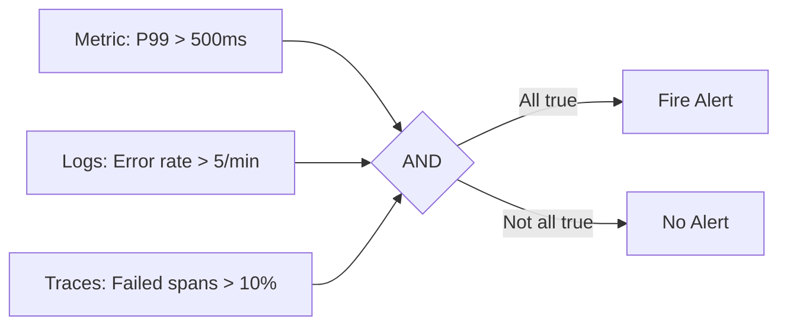

# How to Build Composite Alerts That Combine Multiple OpenTelemetry Signals (Traces + Metrics + Logs)

Author: [nawazdhandala](https://www.github.com/nawazdhandala)

Tags: OpenTelemetry, Composite Alerts, Traces, Metrics, Logs

Description: Build composite alert rules that correlate traces, metrics, and logs from OpenTelemetry to reduce false positives.

Single-signal alerts are noisy. A latency spike in your metrics might be a momentary blip, but a latency spike combined with error logs and failed trace spans is a real incident. Composite alerts evaluate multiple OpenTelemetry signals together, producing higher-confidence notifications that reduce false positives and give on-call engineers better context.

This post covers how to build alert rules that combine metrics, traces, and logs from OpenTelemetry into composite conditions.

## The Problem with Single-Signal Alerts

A metric-only alert like "P99 latency > 500ms" can fire for many benign reasons: a large batch job, a single slow query, or a cache cold start. Similarly, a log-based alert on "error" messages catches expected errors like validation failures alongside real problems.

Composite alerts require multiple conditions to be true simultaneously:



## Step 1: Collect All Three Signals Through One Collector

Your OpenTelemetry Collector needs to receive traces, metrics, and logs on the same pipeline. This configuration exports all three to backends that support cross-signal queries.

Here is a Collector config that routes all three signal types:

```yaml
# otel-collector-config.yaml
receivers:
  otlp:
    protocols:
      grpc:
        endpoint: "0.0.0.0:4317"
      http:
        endpoint: "0.0.0.0:4318"

processors:
  batch:
    timeout: 10s
  # Add resource detection for consistent labeling across signals
  resourcedetection:
    detectors: [env, system]
    timeout: 5s

exporters:
  # Metrics to Prometheus for alerting
  prometheus:
    endpoint: "0.0.0.0:8889"
    resource_to_telemetry_conversion:
      enabled: true

  # Traces to Tempo for trace-based queries
  otlp/tempo:
    endpoint: "tempo:4317"
    tls:
      insecure: true

  # Logs to Loki for log-based conditions
  loki:
    endpoint: "http://loki:3100/loki/api/v1/push"
    default_labels_enabled:
      exporter: false
      job: true

service:
  pipelines:
    metrics:
      receivers: [otlp]
      processors: [resourcedetection, batch]
      exporters: [prometheus]
    traces:
      receivers: [otlp]
      processors: [resourcedetection, batch]
      exporters: [otlp/tempo]
    logs:
      receivers: [otlp]
      processors: [resourcedetection, batch]
      exporters: [loki]
```

## Step 2: Generate Metrics from Traces Using the Span Metrics Connector

The span metrics connector in the OpenTelemetry Collector derives metrics directly from trace data. This is the key to including trace conditions in Prometheus alert rules without querying a trace backend at alert evaluation time.

Add the spanmetrics connector to generate RED (Rate, Error, Duration) metrics from spans:

```yaml
# Add to otel-collector-config.yaml
connectors:
  spanmetrics:
    histogram:
      explicit:
        buckets: [5ms, 10ms, 25ms, 50ms, 100ms, 250ms, 500ms, 1s, 2.5s, 5s, 10s]
    dimensions:
      - name: http.method
      - name: http.status_code
      - name: service.name
    exemplars:
      enabled: true

service:
  pipelines:
    traces:
      receivers: [otlp]
      processors: [resourcedetection, batch]
      exporters: [otlp/tempo, spanmetrics]  # feed traces into connector
    metrics/spanmetrics:
      receivers: [spanmetrics]               # connector outputs metrics
      exporters: [prometheus]
```

This produces metrics like `traces_spanmetrics_calls_total` and `traces_spanmetrics_latency_bucket` that represent trace-derived data as Prometheus metrics.

## Step 3: Generate Metrics from Logs

Similarly, you can derive metrics from log data using the Collector's count connector or by using Loki's recording rules.

This Loki recording rule creates a metric from log error counts:

```yaml
# loki-recording-rules.yaml
groups:
  - name: log_derived_metrics
    interval: 30s
    rules:
      # Count error-level logs per service per minute
      - record: log:error_count:1m
        expr: |
          sum by (service_name) (
            count_over_time({level="error"}[1m])
          )

      # Count logs containing exception stack traces
      - record: log:exception_count:5m
        expr: |
          sum by (service_name) (
            count_over_time({level="error"} |= "Exception" [5m])
          )
```

Push these derived metrics to Prometheus using Loki's ruler or the Collector's metrics pipeline.

## Step 4: Build the Composite Alert Rule

Now that all three signals exist as Prometheus metrics, you can write a composite alert rule that requires multiple conditions to be true.

This alert fires only when latency is high AND error spans are elevated AND error logs are increasing:

```yaml
# prometheus-composite-alerts.yaml
groups:
  - name: composite_alerts
    rules:
      # Composite: high latency + trace errors + log errors
      - alert: ServiceDegradation_Composite
        expr: |
          (
            # Condition 1: P99 latency from OTel metrics above 500ms
            histogram_quantile(0.99,
              sum by (service_name, le) (
                rate(otel_http_server_request_duration_seconds_bucket[5m])
              )
            ) > 0.5
          )
          # Condition 2: Error span rate from trace-derived metrics above 5%
          and on (service_name) (
            sum by (service_name) (
              rate(traces_spanmetrics_calls_total{status_code="STATUS_CODE_ERROR"}[5m])
            )
            /
            sum by (service_name) (
              rate(traces_spanmetrics_calls_total[5m])
            ) > 0.05
          )
          # Condition 3: Error log count from log-derived metrics above threshold
          and on (service_name) (
            log:error_count:1m > 10
          )
        for: 3m
        labels:
          severity: critical
          alert_type: composite
        annotations:
          summary: "Service {{ $labels.service_name }} degraded across all signals"
          description: "High latency, error traces, and error logs detected simultaneously"
          runbook: "https://wiki.example.com/runbooks/service-degradation"
```

## Step 5: Add Partial-Match Alerts for Flexibility

A strict AND across all three signals might miss real incidents where one signal is delayed. Add partial-match alerts at lower severity:

```yaml
      # Fires when 2 out of 3 signals are bad
      - alert: ServiceDegradation_Partial
        expr: |
          (
            # Score each condition as 1 or 0, sum them
            (
              histogram_quantile(0.99,
                sum by (service_name, le) (
                  rate(otel_http_server_request_duration_seconds_bucket[5m])
                )
              ) > 0.5
            ) + on (service_name) (
              sum by (service_name) (
                rate(traces_spanmetrics_calls_total{status_code="STATUS_CODE_ERROR"}[5m])
              )
              /
              sum by (service_name) (
                rate(traces_spanmetrics_calls_total[5m])
              ) > 0.05
            ) + on (service_name) (
              log:error_count:1m > 10
            )
          ) >= 2  # At least 2 out of 3 conditions true
        for: 5m
        labels:
          severity: warning
          alert_type: composite_partial
```

## Correlation Through Shared Labels

The `and on (service_name)` clause in PromQL is what ties the three signals together. This only works if all three metric sources use the same `service_name` label value. The OpenTelemetry resource attribute `service.name` must be consistent across your traces, metrics, and logs SDKs. If your services report different names across signals, the composite join will silently produce empty results.

Validate label consistency by querying each metric source independently and confirming the `service_name` values match before building composite rules.
