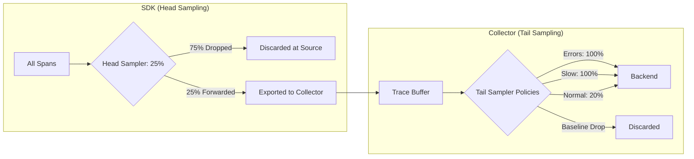

# How to Set Up Composite Sampling (Head + Tail) for Cost Optimization

Author: [nawazdhandala](https://www.github.com/nawazdhandala)

Tags: OpenTelemetry, Sampling, Cost Optimization, Tracing, Collector, Observability

Description: Learn how to combine head sampling in the SDK with tail sampling in the Collector to minimize costs while retaining high-value traces.

---

Sampling is one of the most effective levers for controlling observability costs. But choosing between head sampling and tail sampling often feels like a tradeoff between cost savings and data quality. Head sampling is cheap but blind. Tail sampling is smart but expensive. The best strategy is to use both together.

This guide walks through building a composite sampling pipeline where the SDK performs lightweight head sampling to reduce volume at the source, and the Collector applies tail sampling to make intelligent decisions on the traces that survive.

---

## Why Neither Approach Works Alone

Head sampling makes its decision at span creation time, before you know anything about how the request will end. You cannot check for errors, measure latency, or inspect downstream spans. It is fast and low-overhead, but it throws away interesting traces just as readily as boring ones.

Tail sampling waits until the entire trace is assembled, then decides. This means you can keep every error, every slow request, and every trace with unusual attributes. The problem is that tail sampling requires buffering complete traces in memory on the Collector, which gets expensive when you have millions of spans per second.

The composite approach solves this. Use head sampling to filter out a large percentage of traffic before it reaches the Collector, then use tail sampling on the remaining traces to ensure you keep what matters.



---

## Step 1: Configure Head Sampling in the SDK

The SDK-level sampler should be generous enough to pass through a meaningful sample, but aggressive enough to cut the bulk. A `ParentBasedSampler` with a `TraceIdRatioBasedSampler` at the root works well.

```typescript
// tracing.ts - SDK initialization with head sampling
import { NodeSDK } from '@opentelemetry/sdk-node';
import { OTLPTraceExporter } from '@opentelemetry/exporter-trace-otlp-http';
import {
  ParentBasedSampler,
  TraceIdRatioBasedSampler,
  AlwaysOnSampler,
} from '@opentelemetry/sdk-trace-base';
import { getNodeAutoInstrumentations } from '@opentelemetry/auto-instrumentations-node';
import { Resource } from '@opentelemetry/resources';

// Head sampler: keep 25% of root spans
// Child spans inherit the parent decision automatically
const headSampler = new ParentBasedSampler({
  // Root spans get 25% probability sampling
  root: new TraceIdRatioBasedSampler(0.25),
  // If a remote parent was sampled, continue sampling
  remoteParentSampled: new AlwaysOnSampler(),
  // If a remote parent was not sampled, respect that decision
  remoteParentNotSampled: new TraceIdRatioBasedSampler(0),
  // Local parent decisions propagate automatically
  localParentSampled: new AlwaysOnSampler(),
  localParentNotSampled: new TraceIdRatioBasedSampler(0),
});

const sdk = new NodeSDK({
  resource: new Resource({
    'service.name': 'order-service',
    'service.version': '3.2.1',
  }),
  traceExporter: new OTLPTraceExporter({
    url: 'http://otel-collector:4318/v1/traces',
  }),
  sampler: headSampler,
  instrumentations: [getNodeAutoInstrumentations()],
});

sdk.start();
```

The key setting here is `TraceIdRatioBasedSampler(0.25)`. This passes 25% of root traces through to the Collector. That 75% reduction happens at the source, saving network bandwidth and Collector memory. The `ParentBasedSampler` wrapper ensures child spans follow the parent decision, so you never end up with orphaned spans.

---

## Step 2: Configure Tail Sampling in the Collector

The Collector receives the 25% of traces that survived head sampling. Now you apply intelligent policies to decide which of those traces to keep.

```yaml
# otel-collector-config.yaml
receivers:
  otlp:
    protocols:
      grpc:
        endpoint: 0.0.0.0:4317
      http:
        endpoint: 0.0.0.0:4318

processors:
  # Tail sampling evaluates complete traces
  tail_sampling:
    # Wait 30 seconds for all spans in a trace to arrive
    decision_wait: 30s
    # Maximum number of traces held in memory
    num_traces: 50000
    # Expected rate helps with memory pre-allocation
    expected_new_traces_per_sec: 500

    policies:
      # Policy 1: Always keep traces with errors
      - name: keep-errors
        type: status_code
        status_code:
          status_codes: [ERROR]

      # Policy 2: Always keep slow traces (over 2 seconds)
      - name: keep-slow-traces
        type: latency
        latency:
          threshold_ms: 2000

      # Policy 3: Keep traces from critical endpoints
      - name: keep-critical-routes
        type: string_attribute
        string_attribute:
          key: http.route
          values:
            - /api/v1/checkout
            - /api/v1/payment
            - /api/v1/order

      # Policy 4: Sample 20% of remaining traces as baseline
      - name: probabilistic-baseline
        type: probabilistic
        probabilistic:
          sampling_percentage: 20

  # Batch processor runs after tail sampling
  batch:
    timeout: 5s
    send_batch_size: 512
    send_batch_max_size: 1024

exporters:
  otlp:
    endpoint: https://oneuptime.com/otlp
    headers:
      x-oneuptime-token: "${ONEUPTIME_TOKEN}"

service:
  pipelines:
    traces:
      receivers: [otlp]
      processors: [tail_sampling, batch]
      exporters: [otlp]
```

The tail sampling processor evaluates each complete trace against the policies in order. If any policy matches, the trace is kept. The `decision_wait` of 30 seconds gives enough time for late-arriving spans to be included before the decision is made.

---

## Calculating the Effective Sample Rate

With this composite setup, the math works like this:

| Trace Type | Head Sample Rate | Tail Sample Rate | Effective Rate |
|------------|-----------------|------------------|----------------|
| Errors | 25% | 100% | 25% of errors |
| Slow requests | 25% | 100% | 25% of slow |
| Critical routes | 25% | 100% | 25% of critical |
| Normal traffic | 25% | 20% | 5% of normal |

Normal traffic goes from 100% down to 5%. Error traces still get 25% coverage, which is a much better ratio than the 5% you would get without tail sampling.

If you need 100% of errors, you will need to adjust the head sampler. One approach is to use a custom head sampler that always passes through spans with error indicators.

---

## Step 3: Error-Aware Head Sampling

To avoid dropping errors at the head, add a custom sampler that checks for known error signals before the ratio sampler kicks in.

```typescript
// error-aware-sampler.ts
import {
  Sampler,
  SamplingResult,
  SamplingDecision,
  Context,
  SpanKind,
  Attributes,
  Link,
} from '@opentelemetry/api';
import { TraceIdRatioBasedSampler } from '@opentelemetry/sdk-trace-base';

class ErrorAwareHeadSampler implements Sampler {
  private ratioSampler: TraceIdRatioBasedSampler;

  constructor(baseRate: number) {
    // Base probabilistic rate for non-error spans
    this.ratioSampler = new TraceIdRatioBasedSampler(baseRate);
  }

  shouldSample(
    context: Context,
    traceId: string,
    spanName: string,
    spanKind: SpanKind,
    attributes: Attributes,
    links: Link[]
  ): SamplingResult {
    // Check if the span has error indicators at creation time
    // Note: not all errors are known at span start
    const statusCode = attributes['http.status_code'];
    if (typeof statusCode === 'number' && statusCode >= 500) {
      return {
        decision: SamplingDecision.RECORD_AND_SAMPLE,
        attributes: { 'sampling.reason': 'error_head' },
      };
    }

    // Fall back to ratio sampling for everything else
    return this.ratioSampler.shouldSample(
      context, traceId, spanName, spanKind, attributes, links
    );
  }

  toString(): string {
    return `ErrorAwareHeadSampler{ratio=${this.ratioSampler}}`;
  }
}
```

This helps catch server errors that are visible at span creation time (like known 5xx routes), but it cannot catch errors that happen mid-request. That is exactly where tail sampling fills the gap.

---

## Step 4: Monitoring Your Sampling Pipeline

You need to verify that the composite pipeline is working correctly. Add metrics to track sampling decisions at both layers.

```yaml
# Add telemetry to the Collector itself
service:
  telemetry:
    metrics:
      # Expose Collector internal metrics
      address: 0.0.0.0:8888
      level: detailed

  pipelines:
    traces:
      receivers: [otlp]
      processors: [tail_sampling, batch]
      exporters: [otlp]
```

Key metrics to watch:

- `otelcol_processor_tail_sampling_count_traces_sampled`: how many traces the tail sampler kept
- `otelcol_processor_tail_sampling_count_traces_dropped`: how many traces the tail sampler dropped
- `otelcol_processor_tail_sampling_sampling_trace_dropped_too_early`: traces that were evicted before all spans arrived (increase `decision_wait` or `num_traces` if this happens)
- `otelcol_receiver_accepted_spans`: total spans arriving at the Collector (this reflects the head sampling rate)

If `sampling_trace_dropped_too_early` is high, your `decision_wait` is too short or `num_traces` is too low for your traffic volume.

---

## Tuning the Balance

The right head/tail split depends on your traffic volume and Collector capacity. Here are some starting points.

For low-volume services (under 1000 spans/second):
- Head: 100% (no head sampling)
- Tail: Apply policies directly

For medium-volume services (1000 to 50,000 spans/second):
- Head: 25% to 50%
- Tail: Error/latency policies + 10-20% baseline

For high-volume services (over 50,000 spans/second):
- Head: 5% to 10%
- Tail: Error/latency policies + 5% baseline

The goal is to keep the Collector's `num_traces` buffer within memory limits while still passing enough traffic for tail sampling to find interesting traces.

---

## Common Pitfalls

**Setting head sampling too aggressively.** If you head-sample at 1%, you lose 99% of errors before the Collector can save them. Keep the head rate high enough that tail sampling has material to work with.

**Forgetting `decision_wait`.** If spans from different services arrive at different times, a short wait means incomplete traces. Set it to at least 2x your expected end-to-end trace duration.

**Ignoring Collector memory.** Each buffered trace consumes memory. Monitor heap usage and adjust `num_traces` accordingly. The formula is roughly: `num_traces = expected_new_traces_per_sec * decision_wait_seconds`.

**Not using `ParentBasedSampler`.** Without it, child spans might be sampled differently from their parent, resulting in fragmented traces.

---

## Key Takeaways

1. Head sampling reduces volume at the source, cutting network and Collector costs
2. Tail sampling makes intelligent decisions on the surviving traces, keeping errors and slow requests
3. The composite approach gives you both cost control and data quality
4. Use `ParentBasedSampler` in the SDK to maintain trace consistency
5. Monitor `dropped_too_early` metrics to ensure your Collector buffer is large enough
6. Start with a generous head rate and tighten it as you understand your traffic patterns

The combination of head and tail sampling is the most cost-effective way to run observability at scale. You get the cheap filtering of head sampling with the intelligence of tail sampling, without paying for either approach alone.
