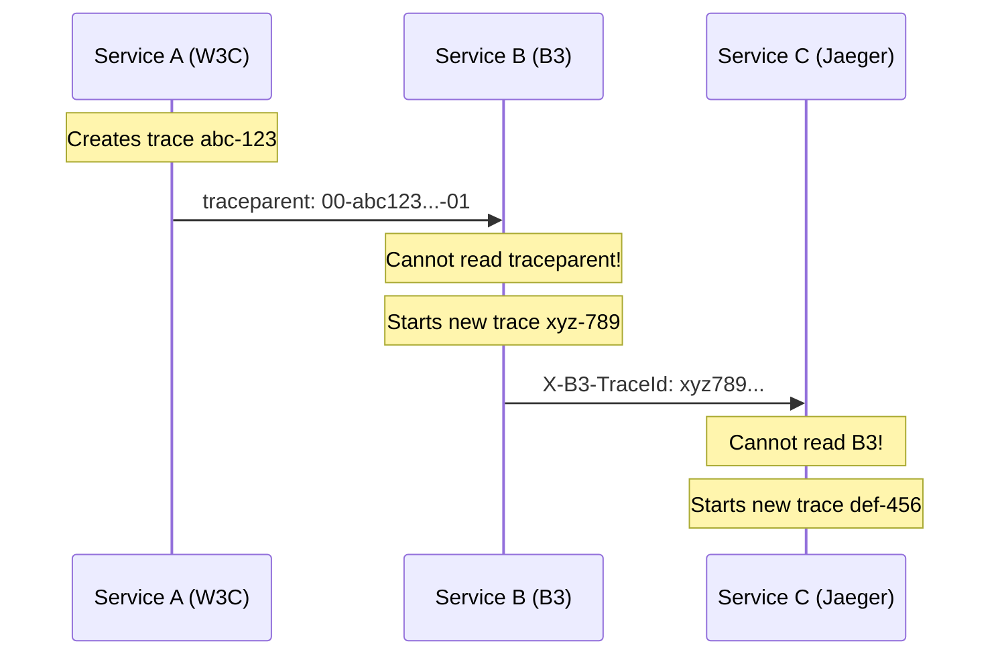
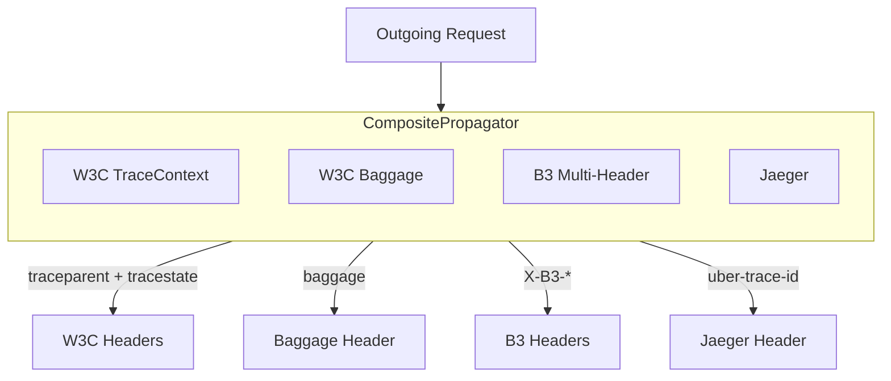

# How to Configure Composite Propagators for Multi-Format Support

Author: [nawazdhandala](https://www.github.com/nawazdhandala)

Tags: OpenTelemetry, Composite Propagators, Context Propagation, Distributed Tracing, W3C Trace Context, B3, Jaeger

Description: Learn how to configure composite propagators in OpenTelemetry to support multiple trace context formats simultaneously across heterogeneous systems.

---

In a real production environment, you rarely have the luxury of every service using the same tracing format. Maybe your API gateway uses Jaeger propagation, your core services run OpenTelemetry with W3C Trace Context, and some legacy microservices still speak Zipkin B3. If you configure only a single propagator, traces will break at every format boundary. Composite propagators solve this by letting you inject and extract multiple context formats at once. This post walks through how they work, how to configure them, and how to handle the edge cases that come up in practice.

## The Problem: Format Fragmentation

When a service sends a request, it injects trace context into HTTP headers using whatever format its propagator understands. When the receiving service extracts that context, it looks for headers matching its own propagator format. If the formats do not match, the receiver sees no context and starts a new trace.



Three services, three different formats, three disconnected traces. This is what happens without composite propagators. The trace context is lost at every boundary, making distributed tracing useless.

## How Composite Propagators Work

A composite propagator wraps multiple individual propagators and delegates to all of them. During injection, it calls every propagator's `inject` method, so the outgoing request carries headers for all formats. During extraction, it calls every propagator's `extract` method and merges the results.



The outgoing request ends up with headers for all four formats, all representing the same trace context. Any downstream service can read whichever format it understands.

## Basic Configuration in Python

Let us start with a straightforward composite propagator setup in Python that supports W3C, B3, and Jaeger formats.

```python
from opentelemetry import trace
from opentelemetry.sdk.trace import TracerProvider
from opentelemetry.sdk.trace.export import ConsoleSpanExporter, SimpleSpanProcessor
from opentelemetry.propagate import set_global_textmap, inject

# Import all the propagators we need
from opentelemetry.propagators.composite import CompositePropagator
from opentelemetry.trace.propagation import TraceContextTextMapPropagator
from opentelemetry.baggage.propagation import W3CBaggagePropagator
from opentelemetry.propagators.b3 import B3MultiFormat
from opentelemetry.propagators.jaeger import JaegerPropagator

# Set up tracing
provider = TracerProvider()
provider.add_span_processor(SimpleSpanProcessor(ConsoleSpanExporter()))
trace.set_tracer_provider(provider)

# Build the composite propagator with all required formats
propagator = CompositePropagator([
    TraceContextTextMapPropagator(),  # W3C traceparent + tracestate
    W3CBaggagePropagator(),           # W3C baggage header
    B3MultiFormat(),                  # Zipkin B3 multi-header
    JaegerPropagator(),               # Jaeger uber-trace-id
])

# Set it as the global propagator
set_global_textmap(propagator)

# Now every inject call produces all header formats
tracer = trace.get_tracer("composite-demo")
with tracer.start_as_current_span("test-operation"):
    headers = {}
    inject(headers)

    print("All propagated headers:")
    for key, value in sorted(headers.items()):
        print(f"  {key}: {value}")
```

When you run this, you will see headers for every format in the output. The `traceparent` header for W3C, `X-B3-TraceId` and friends for Zipkin, and `uber-trace-id` for Jaeger. All of them carry the same trace ID and span ID.

## Configuration via Environment Variables

For production deployments, especially in containerized environments, configuring propagators through environment variables is often preferable to code changes.

```bash
# Configure multiple propagators via environment variable
export OTEL_PROPAGATORS=tracecontext,baggage,b3multi,jaeger
```

Each value maps to a specific propagator:

| Value | Propagator | Headers |
|-------|-----------|---------|
| `tracecontext` | W3C Trace Context | `traceparent`, `tracestate` |
| `baggage` | W3C Baggage | `baggage` |
| `b3multi` | B3 Multi-Header | `X-B3-TraceId`, `X-B3-SpanId`, `X-B3-Sampled`, `X-B3-ParentSpanId` |
| `b3` | B3 Single-Header | `b3` |
| `jaeger` | Jaeger | `uber-trace-id` |

```yaml
# Kubernetes deployment with composite propagators
apiVersion: apps/v1
kind: Deployment
metadata:
  name: api-gateway
spec:
  template:
    spec:
      containers:
        - name: api-gateway
          image: api-gateway:latest
          env:
            - name: OTEL_PROPAGATORS
              value: "tracecontext,baggage,b3multi,jaeger"
            - name: OTEL_EXPORTER_OTLP_ENDPOINT
              value: "http://otel-collector:4317"
```

When you use auto-instrumentation (the `opentelemetry-instrument` command or equivalent), the SDK reads the `OTEL_PROPAGATORS` environment variable and builds the composite propagator automatically. No code changes required.

## Extraction Priority and Conflict Resolution

When a composite propagator extracts context from incoming headers, it processes each child propagator in order. If multiple formats are present in the same request, the last propagator that successfully extracts a context wins. This means the order of propagators in your list matters.

```python
from opentelemetry.propagate import extract
from opentelemetry import trace

# Simulate a request with both W3C and B3 headers
# but with DIFFERENT trace IDs (a misconfiguration scenario)
incoming_headers = {
    "traceparent": "00-aaaaaaaaaaaaaaaaaaaaaaaaaaaaaaaa-bbbbbbbbbbbbbbbb-01",
    "X-B3-TraceId": "cccccccccccccccccccccccccccccccc",
    "X-B3-SpanId": "dddddddddddddddd",
    "X-B3-Sampled": "1",
}

# With propagator order [W3C, B3], B3 is processed last
# So the B3 trace ID (cccc...) would be used
ctx = extract(incoming_headers)
span = trace.get_current_span(ctx)
span_ctx = span.get_span_context()
print(f"Trace ID: {format(span_ctx.trace_id, '032x')}")
```

In practice, conflicting trace IDs in the same request are rare and indicate a configuration problem. But understanding the precedence behavior helps when debugging. If you want W3C to take priority, put it last in the list. If you want B3 to take priority (perhaps during a migration where Zipkin is still the source of truth), put B3 last.

```python
# W3C takes priority (processed last)
propagator_w3c_priority = CompositePropagator([
    B3MultiFormat(),                  # Processed first
    JaegerPropagator(),               # Processed second
    TraceContextTextMapPropagator(),  # Processed last, wins on conflict
    W3CBaggagePropagator(),           # Baggage is independent, order doesn't matter
])

# B3 takes priority (processed last among trace propagators)
propagator_b3_priority = CompositePropagator([
    TraceContextTextMapPropagator(),  # Processed first
    JaegerPropagator(),               # Processed second
    B3MultiFormat(),                  # Processed last, wins on conflict
    W3CBaggagePropagator(),           # Baggage is independent
])
```

For most migrations, putting the newer format (W3C) last makes sense because it means any service that has already been migrated to W3C will have its context respected.

## Node.js Configuration

The same concepts apply in JavaScript/TypeScript. Here is the equivalent setup for a Node.js service.

```javascript
const { NodeTracerProvider } = require('@opentelemetry/sdk-trace-node');
const { SimpleSpanProcessor, ConsoleSpanExporter } = require('@opentelemetry/sdk-trace-base');
const { CompositePropagator, W3CTraceContextPropagator, W3CBaggagePropagator } = require('@opentelemetry/core');
const { B3Propagator, B3InjectEncoding } = require('@opentelemetry/propagator-b3');
const { JaegerPropagator } = require('@opentelemetry/propagator-jaeger');
const { propagation } = require('@opentelemetry/api');

// Set up the tracer provider
const provider = new NodeTracerProvider();
provider.addSpanProcessor(new SimpleSpanProcessor(new ConsoleSpanExporter()));
provider.register();

// Build the composite propagator
const compositePropagator = new CompositePropagator({
  propagators: [
    // W3C Trace Context for modern OpenTelemetry services
    new W3CTraceContextPropagator(),
    // W3C Baggage for cross-service key-value propagation
    new W3CBaggagePropagator(),
    // B3 multi-header for Zipkin compatibility
    new B3Propagator({ injectEncoding: B3InjectEncoding.MULTI_HEADER }),
    // Jaeger propagation for Jaeger-instrumented services
    new JaegerPropagator(),
  ],
});

// Register the composite propagator globally
propagation.setGlobalPropagator(compositePropagator);

// Now all HTTP instrumentation will use all formats
const tracer = provider.getTracer('composite-demo');
const span = tracer.startSpan('test-operation');

// Inject headers
const headers = {};
const { context, trace } = require('@opentelemetry/api');
const ctx = trace.setSpan(context.active(), span);
propagation.inject(ctx, headers);

console.log('Propagated headers:');
Object.entries(headers).sort().forEach(([key, value]) => {
  console.log(`  ${key}: ${value}`);
});

span.end();
```

The pattern is identical across languages. Create individual propagators, wrap them in a composite, and register the composite globally.

## Collector-Level Propagation

If you use the OpenTelemetry Collector as a gateway, you might want to handle format translation at the collector level rather than in each service. The collector's receiver configuration determines which formats it accepts, and you can configure it to accept multiple formats.

```yaml
# OpenTelemetry Collector configuration
receivers:
  otlp:
    protocols:
      grpc:
        endpoint: 0.0.0.0:4317
      http:
        endpoint: 0.0.0.0:4318

  # Zipkin receiver for B3-format traces
  zipkin:
    endpoint: 0.0.0.0:9411

  # Jaeger receiver for Jaeger-format traces
  jaeger:
    protocols:
      thrift_http:
        endpoint: 0.0.0.0:14268
      grpc:
        endpoint: 0.0.0.0:14250

processors:
  batch:
    timeout: 5s
    send_batch_size: 256

exporters:
  otlp:
    endpoint: backend.example.com:4317

service:
  pipelines:
    traces:
      # Accept traces from all formats
      receivers: [otlp, zipkin, jaeger]
      processors: [batch]
      exporters: [otlp]
```

This collector configuration accepts traces in OTLP, Zipkin, and Jaeger formats and exports them all as OTLP. The collector handles format conversion internally, so your backend only needs to understand one format.

## Testing Composite Propagators

A good test suite for composite propagation should verify that each format works individually and that the round-trip through inject and extract preserves trace identity.

```python
import pytest
from opentelemetry import trace
from opentelemetry.sdk.trace import TracerProvider
from opentelemetry.propagate import inject, extract, set_global_textmap
from opentelemetry.propagators.composite import CompositePropagator
from opentelemetry.trace.propagation import TraceContextTextMapPropagator
from opentelemetry.propagators.b3 import B3MultiFormat

# Setup for all tests
provider = TracerProvider()
trace.set_tracer_provider(provider)

composite = CompositePropagator([
    TraceContextTextMapPropagator(),
    B3MultiFormat(),
])
set_global_textmap(composite)

tracer = trace.get_tracer("test")

def test_w3c_extraction():
    """Verify that W3C headers are correctly extracted."""
    headers = {
        "traceparent": "00-4bf92f3577b34da6a3ce929d0e0e4736-00f067aa0ba902b7-01"
    }
    ctx = extract(headers)
    span_ctx = trace.get_current_span(ctx).get_span_context()
    assert format(span_ctx.trace_id, '032x') == "4bf92f3577b34da6a3ce929d0e0e4736"

def test_b3_extraction():
    """Verify that B3 headers are correctly extracted."""
    headers = {
        "X-B3-TraceId": "4bf92f3577b34da6a3ce929d0e0e4736",
        "X-B3-SpanId": "00f067aa0ba902b7",
        "X-B3-Sampled": "1",
    }
    ctx = extract(headers)
    span_ctx = trace.get_current_span(ctx).get_span_context()
    assert format(span_ctx.trace_id, '032x') == "4bf92f3577b34da6a3ce929d0e0e4736"

def test_round_trip_preserves_trace_id():
    """Verify that inject then extract preserves the trace identity."""
    with tracer.start_as_current_span("test-span") as span:
        original_trace_id = span.get_span_context().trace_id

        # Inject into headers
        headers = {}
        inject(headers)

        # Both formats should be present
        assert "traceparent" in headers
        assert "X-B3-TraceId" in headers

        # Extract from headers
        ctx = extract(headers)
        extracted_trace_id = trace.get_current_span(ctx).get_span_context().trace_id

        assert original_trace_id == extracted_trace_id
```

These tests cover three scenarios: extracting W3C-only headers, extracting B3-only headers, and a full round trip. Run them as part of your CI pipeline to catch propagation regressions early.

## Performance Considerations

Each propagator in a composite adds a small amount of overhead for both injection and extraction. For injection, the overhead is the time to serialize the context into additional headers. For extraction, it is the time to parse headers that might not be present.

In practice, this overhead is negligible. Header serialization and parsing takes microseconds, while a typical HTTP request takes milliseconds. The bandwidth cost of extra headers is also minimal, typically under 200 bytes per additional format.

That said, do not add propagators you do not need. If no services in your system use Jaeger propagation, there is no reason to include the Jaeger propagator. Keep the list to only the formats that are actually in use.

## Wrapping Up

Composite propagators are the key to running multiple trace context formats in the same system. They let you inject and extract all formats simultaneously, so traces stay connected regardless of which propagation standard each service uses. Configure them through code or environment variables, pay attention to extraction order when conflicting headers are possible, and remove unused propagators once migrations are complete. With this setup, format differences become transparent, and your distributed traces stay intact across your entire system.
