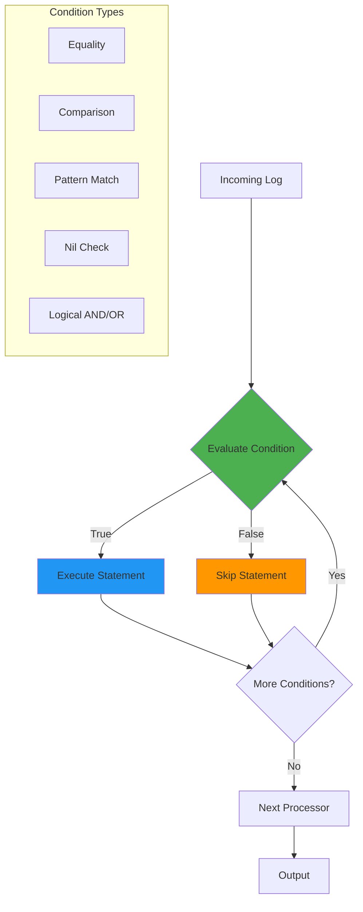

# How to Use Conditional Logic in OTTL for the OpenTelemetry Collector

Author: [nawazdhandala](https://www.github.com/nawazdhandala)

Tags: OpenTelemetry, Collector, OTTL, Conditional Logic, Transform Processor, Filtering

Description: Master conditional logic in OTTL to apply selective transformations, route telemetry, and implement complex processing rules in the OpenTelemetry Collector.

Conditional logic is one of the most powerful features of the OpenTelemetry Transformation Language (OTTL). It allows you to apply transformations selectively based on the content, context, or metadata of your telemetry data. This capability is essential for handling diverse data sources, implementing business rules, and optimizing your observability pipeline.

## Understanding Conditional Logic in OTTL

OTTL supports conditional logic through the `where` clause, which allows you to specify conditions under which a transformation should be applied. Conditions evaluate to boolean values (true or false), and transformations only execute when the condition is true.

The basic syntax is:

```
- statement where condition
```

If the condition evaluates to true, the statement executes. If false, it's skipped.

## Basic Conditional Statements

### Simple Equality Checks

The most basic conditional checks test for equality:

```yaml
# Basic equality checks
processors:
  transform:
    log_statements:
      - context: log
        statements:
          # Apply transformation only for error logs
          - set(attributes["priority"], "high") where severity_text == "error"

          # Modify only production logs
          - set(attributes["alert_enabled"], true) where attributes["environment"] == "production"

          # Transform based on service name
          - set(attributes["team"], "platform") where resource.attributes["service.name"] == "api-gateway"
```

### Inequality and Comparison Operators

OTTL supports standard comparison operators:

```yaml
# Comparison operators
processors:
  transform:
    log_statements:
      - context: log
        statements:
          # Only process high-severity logs
          - set(attributes["requires_attention"], true) where severity_number >= 17

          # Flag slow requests
          - set(attributes["slow_request"], true) where Int(attributes["duration_ms"]) > 1000

          # Categorize HTTP errors
          - set(attributes["is_client_error"], true) where Int(attributes["http.status_code"]) >= 400 and Int(attributes["http.status_code"]) < 500
          - set(attributes["is_server_error"], true) where Int(attributes["http.status_code"]) >= 500

          # Flag recent logs (within last hour)
          - set(attributes["recent"], true) where time_now() - observed_time_unix_nano < 3600000000000
```

### Nil Checks

Checking for the presence or absence of values is crucial:

```yaml
# Nil checks for safe attribute access
processors:
  transform:
    log_statements:
      - context: log
        statements:
          # Only set if user_id exists
          - set(attributes["has_user_context"], true) where attributes["user_id"] != nil

          # Set default only if value is missing
          - set(attributes["region"], "us-east-1") where attributes["region"] == nil

          # Extract nested field only if parent exists
          - set(attributes["error_code"], body["error"]["code"]) where body["error"] != nil

          # Process trace-enabled logs differently
          - set(attributes["trace_enabled"], true) where trace_id != nil
          - set(attributes["trace_enabled"], false) where trace_id == nil
```

## Logical Operators

Combine multiple conditions using logical operators:

### AND Operator

Both conditions must be true:

```yaml
# AND operator (both conditions must be true)
processors:
  transform:
    log_statements:
      - context: log
        statements:
          # Flag critical production errors
          - set(attributes["critical"], true) where severity_number >= 17 and attributes["environment"] == "production"

          # Process authenticated API requests
          - set(attributes["authenticated_api_call"], true) where attributes["http.method"] != nil and attributes["user_id"] != nil

          # Identify slow database queries in production
          - set(attributes["slow_prod_query"], true) where Int(attributes["duration_ms"]) > 500 and resource.attributes["service.name"] == "database" and attributes["environment"] == "production"
```

### OR Operator

At least one condition must be true:

```yaml
# OR operator (at least one condition must be true)
processors:
  transform:
    log_statements:
      - context: log
        statements:
          # Flag any error or warning
          - set(attributes["needs_review"], true) where severity_text == "error" or severity_text == "warn"

          # Identify development or staging environments
          - set(attributes["non_production"], true) where attributes["environment"] == "development" or attributes["environment"] == "staging"

          # Flag requests from multiple high-priority services
          - set(attributes["high_priority_service"], true) where resource.attributes["service.name"] == "payment" or resource.attributes["service.name"] == "authentication" or resource.attributes["service.name"] == "checkout"
```

### NOT Operator

Negate a condition:

```yaml
# NOT operator for negation
processors:
  transform:
    log_statements:
      - context: log
        statements:
          # Process all non-debug logs
          - set(attributes["keep"], true) where not (severity_text == "debug")

          # Flag requests that are not successful
          - set(attributes["failed"], true) where not (Int(attributes["http.status_code"]) >= 200 and Int(attributes["http.status_code"]) < 300)

          # Identify logs without trace context
          - set(attributes["missing_trace"], true) where not (trace_id != nil)
```

### Complex Compound Conditions

Combine multiple logical operators:

```yaml
# Complex compound conditions
processors:
  transform:
    log_statements:
      - context: log
        statements:
          # Critical production errors or any error from payment service
          - set(attributes["alert"], true) where (severity_number >= 17 and attributes["environment"] == "production") or (resource.attributes["service.name"] == "payment" and severity_number >= 9)

          # Slow requests in production, but exclude health checks
          - set(attributes["performance_issue"], true) where Int(attributes["duration_ms"]) > 1000 and attributes["environment"] == "production" and not IsMatch(attributes["http.url"], "/health")

          # High-value customer transactions with errors
          - set(attributes["urgent_customer_issue"], true) where (attributes["customer_tier"] == "premium" or attributes["customer_tier"] == "enterprise") and Int(attributes["http.status_code"]) >= 400 and attributes["transaction_value"] != nil
```

## Pattern Matching with Conditions

Use pattern matching functions in conditions:

```yaml
# Pattern matching in conditions
processors:
  transform:
    log_statements:
      - context: log
        statements:
          # Process logs containing error keywords
          - set(attributes["contains_error"], true) where IsMatch(body, "(?i)error|exception|failed")

          # Identify API endpoints
          - set(attributes["is_api_call"], true) where IsMatch(attributes["http.url"], "^/api/")

          # Flag logs from specific service patterns
          - set(attributes["microservice"], true) where IsMatch(resource.attributes["service.name"], "-service$")

          # Detect sensitive data patterns
          - set(attributes["may_contain_pii"], true) where IsMatch(body, "\\b[A-Za-z0-9._%+-]+@[A-Za-z0-9.-]+\\.[A-Z|a-z]{2,}\\b")

          # Identify specific log formats
          - set(attributes["is_json"], true) where IsMatch(body, "^\\{.*\\}$")
```

## Conditional Transformations by Context

### Service-Specific Transformations

Apply different transformations based on the service:

```yaml
# Service-specific conditional transformations
processors:
  transform:
    log_statements:
      - context: log
        statements:
          # Payment service transformations
          - set(attributes["transaction_type"], ExtractPatterns(body, "type=([a-z]+)")) where resource.attributes["service.name"] == "payment"
          - set(attributes["team"], "payments") where resource.attributes["service.name"] == "payment"

          # Auth service transformations
          - set(attributes["auth_method"], ExtractPatterns(body, "method=([a-z]+)")) where resource.attributes["service.name"] == "auth"
          - set(attributes["team"], "security") where resource.attributes["service.name"] == "auth"

          # Frontend service transformations
          - set(attributes["page"], ExtractPatterns(body, "page=([^\\s]+)")) where resource.attributes["service.name"] == "frontend"
          - set(attributes["team"], "frontend") where resource.attributes["service.name"] == "frontend"
```

### Environment-Specific Transformations

Handle different environments differently:

```yaml
# Environment-specific transformations
processors:
  transform:
    log_statements:
      - context: log
        statements:
          # Production: Enable alerting and add SLO tags
          - set(attributes["alert_enabled"], true) where attributes["environment"] == "production"
          - set(attributes["slo_applicable"], true) where attributes["environment"] == "production"
          - set(attributes["retention_days"], 90) where attributes["environment"] == "production"

          # Staging: Moderate retention
          - set(attributes["alert_enabled"], false) where attributes["environment"] == "staging"
          - set(attributes["retention_days"], 30) where attributes["environment"] == "staging"

          # Development: Minimal retention, verbose logging
          - set(attributes["alert_enabled"], false) where attributes["environment"] == "development"
          - set(attributes["retention_days"], 7) where attributes["environment"] == "development"
          - set(attributes["verbose_debug"], true) where attributes["environment"] == "development"
```

### Status Code-Based Transformations

Apply transformations based on HTTP status codes:

```yaml
# Status code-based conditional transformations
processors:
  transform:
    log_statements:
      - context: log
        statements:
          # Successful requests (2xx)
          - set(attributes["result"], "success") where Int(attributes["http.status_code"]) >= 200 and Int(attributes["http.status_code"]) < 300
          - set(attributes["alert_required"], false) where Int(attributes["http.status_code"]) >= 200 and Int(attributes["http.status_code"]) < 300

          # Redirection (3xx)
          - set(attributes["result"], "redirect") where Int(attributes["http.status_code"]) >= 300 and Int(attributes["http.status_code"]) < 400

          # Client errors (4xx)
          - set(attributes["result"], "client_error") where Int(attributes["http.status_code"]) >= 400 and Int(attributes["http.status_code"]) < 500
          - set(attributes["alert_required"], true) where Int(attributes["http.status_code"]) == 429 or Int(attributes["http.status_code"]) == 401

          # Server errors (5xx)
          - set(attributes["result"], "server_error") where Int(attributes["http.status_code"]) >= 500
          - set(attributes["alert_required"], true) where Int(attributes["http.status_code"]) >= 500
          - set(attributes["severity"], "critical") where Int(attributes["http.status_code"]) >= 500
```

## Conditional Data Enrichment

Add contextual information based on conditions:

```yaml
# Conditional data enrichment
processors:
  transform:
    log_statements:
      - context: log
        statements:
          # Add business hours flag
          - set(attributes["business_hours"], true) where Hour(time_now()) >= 9 and Hour(time_now()) < 17

          # Add weekend flag
          - set(attributes["is_weekend"], true) where DayOfWeek(time_now()) == 0 or DayOfWeek(time_now()) == 6

          # Enrich with customer tier information
          - set(attributes["customer_tier"], "enterprise") where attributes["customer_id"] != nil and IsMatch(attributes["customer_id"], "^ENT-")
          - set(attributes["customer_tier"], "premium") where attributes["customer_id"] != nil and IsMatch(attributes["customer_id"], "^PRM-")
          - set(attributes["customer_tier"], "standard") where attributes["customer_id"] != nil and attributes["customer_tier"] == nil

          # Add geographic routing information
          - set(attributes["region"], "us-east") where IsMatch(resource.attributes["host.name"], "use[0-9]")
          - set(attributes["region"], "us-west") where IsMatch(resource.attributes["host.name"], "usw[0-9]")
          - set(attributes["region"], "eu-central") where IsMatch(resource.attributes["host.name"], "euc[0-9]")
```

## Conditional Redaction and Security

Selectively redact sensitive information:

```yaml
# Conditional redaction based on context
processors:
  transform:
    log_statements:
      - context: log
        statements:
          # Redact sensitive data only in non-development environments
          - replace_pattern(body, "password=[^&\\s]+", "password=[REDACTED]") where attributes["environment"] != "development"
          - replace_pattern(body, "api_key=[^&\\s]+", "api_key=[REDACTED]") where attributes["environment"] != "development"

          # Redact PII for non-internal users
          - replace_pattern(body, "\\b[A-Za-z0-9._%+-]+@[A-Za-z0-9.-]+\\.[A-Z|a-z]{2,}\\b", "[EMAIL_REDACTED]") where attributes["user_type"] != "internal"

          # Mask credit card numbers in payment logs
          - replace_pattern(body, "\\b\\d{4}[- ]?\\d{4}[- ]?\\d{4}[- ]?\\d{4}\\b", "****-****-****-****") where resource.attributes["service.name"] == "payment"

          # Remove debug information from production logs
          - delete_key(attributes, "debug_trace") where attributes["environment"] == "production"
          - delete_key(attributes, "internal_state") where attributes["environment"] == "production"
```

## Complete Conditional Logic Pipeline

Here's a comprehensive example demonstrating conditional logic in a real-world scenario:

```yaml
# Complete collector configuration with conditional logic
receivers:
  otlp:
    protocols:
      grpc:
        endpoint: 0.0.0.0:4317
      http:
        endpoint: 0.0.0.0:4318

  filelog:
    include:
      - /var/log/app/*.log

processors:
  memory_limiter:
    check_interval: 1s
    limit_mib: 512

  # Transform processor with extensive conditional logic
  transform:
    log_statements:
      - context: log
        statements:
          # Step 1: Parse JSON logs conditionally
          - set(body, ParseJSON(body)) where IsString(body) and IsMatch(body, "^\\{")

          # Step 2: Environment-based transformations
          - set(attributes["sampling_rate"], 1.0) where attributes["environment"] == "production"
          - set(attributes["sampling_rate"], 0.5) where attributes["environment"] == "staging"
          - set(attributes["sampling_rate"], 0.1) where attributes["environment"] == "development"

          # Step 3: Service-specific enrichment
          - set(attributes["service_tier"], "critical") where resource.attributes["service.name"] == "payment" or resource.attributes["service.name"] == "auth"
          - set(attributes["service_tier"], "important") where resource.attributes["service.name"] == "api" or resource.attributes["service.name"] == "checkout"
          - set(attributes["service_tier"], "standard") where attributes["service_tier"] == nil

          # Step 4: Severity-based processing
          - set(attributes["alert_channel"], "pagerduty") where severity_number >= 17 and attributes["environment"] == "production"
          - set(attributes["alert_channel"], "slack") where severity_number >= 13 and severity_number < 17 and attributes["environment"] == "production"
          - set(attributes["requires_investigation"], true) where severity_number >= 17

          # Step 5: HTTP status code classification
          - set(attributes["status_category"], "success") where Int(attributes["http.status_code"]) >= 200 and Int(attributes["http.status_code"]) < 300
          - set(attributes["status_category"], "client_error") where Int(attributes["http.status_code"]) >= 400 and Int(attributes["http.status_code"]) < 500
          - set(attributes["status_category"], "server_error") where Int(attributes["http.status_code"]) >= 500

          # Step 6: Performance classification
          - set(attributes["performance"], "fast") where Int(attributes["duration_ms"]) < 100
          - set(attributes["performance"], "normal") where Int(attributes["duration_ms"]) >= 100 and Int(attributes["duration_ms"]) < 1000
          - set(attributes["performance"], "slow") where Int(attributes["duration_ms"]) >= 1000
          - set(attributes["performance"], "critical") where Int(attributes["duration_ms"]) >= 5000

          # Step 7: Business logic flags
          - set(attributes["high_value_transaction"], true) where resource.attributes["service.name"] == "payment" and Int(attributes["amount"]) > 1000
          - set(attributes["suspicious_activity"], true) where Int(attributes["http.status_code"]) == 401 and Int(attributes["retry_count"]) > 3

          # Step 8: Conditional redaction
          - replace_pattern(body, "password=[^&\\s]+", "password=[REDACTED]") where attributes["environment"] == "production"
          - replace_pattern(body, "token=[^&\\s]+", "token=[REDACTED]") where attributes["environment"] == "production"

          # Step 9: Trace context enrichment
          - set(attributes["has_trace"], true) where trace_id != nil
          - set(attributes["trace_sampled"], true) where trace_id != nil and trace_flags == 1

          # Step 10: Time-based attributes
          - set(attributes["business_hours"], true) where Hour(time_now()) >= 9 and Hour(time_now()) < 17 and DayOfWeek(time_now()) > 0 and DayOfWeek(time_now()) < 6

  # Filter processor to drop low-priority logs in production
  filter:
    logs:
      # Drop debug logs in production
      log_record:
        - 'attributes["environment"] == "production" and severity_number < 9'

  batch:
    timeout: 10s
    send_batch_size: 1024

exporters:
  otlp:
    endpoint: https://your-backend:4317
    tls:
      insecure: false

  # Conditional routing based on severity
  otlp/high_priority:
    endpoint: https://priority-backend:4317
    tls:
      insecure: false

  debug:
    verbosity: detailed

service:
  pipelines:
    logs:
      receivers: [otlp, filelog]
      processors: [memory_limiter, transform, filter, batch]
      exporters: [otlp, debug]
```

## Conditional Logic Flow

Here's how conditional logic flows through transformations:



## Advanced Conditional Patterns

### Cascading Conditions

Apply transformations in order of priority:

```yaml
# Cascading conditional logic
processors:
  transform:
    log_statements:
      - context: log
        statements:
          # Priority 1: Critical errors in production payment service
          - set(attributes["priority"], "P0") where resource.attributes["service.name"] == "payment" and attributes["environment"] == "production" and severity_number >= 17

          # Priority 2: Any production errors
          - set(attributes["priority"], "P1") where attributes["priority"] == nil and attributes["environment"] == "production" and severity_number >= 17

          # Priority 3: Production warnings from critical services
          - set(attributes["priority"], "P2") where attributes["priority"] == nil and attributes["environment"] == "production" and severity_number >= 13 and attributes["service_tier"] == "critical"

          # Priority 4: All other production issues
          - set(attributes["priority"], "P3") where attributes["priority"] == nil and attributes["environment"] == "production" and severity_number >= 13

          # Default: Low priority
          - set(attributes["priority"], "P4") where attributes["priority"] == nil
```

### State-Based Transformations

Use temporary attributes to manage state:

```yaml
# State-based conditional transformations
processors:
  transform:
    log_statements:
      - context: log
        statements:
          # Determine state
          - set(temp_is_error, severity_number >= 17)
          - set(temp_is_production, attributes["environment"] == "production")
          - set(temp_is_critical_service, resource.attributes["service.name"] == "payment" or resource.attributes["service.name"] == "auth")

          # Use state for complex conditions
          - set(attributes["alert_immediately"], true) where temp_is_error and temp_is_production and temp_is_critical_service

          # Clean up temporary state
          - delete_key(temp_is_error, "")
          - delete_key(temp_is_production, "")
          - delete_key(temp_is_critical_service, "")
```

## Best Practices for Conditional Logic

1. **Keep Conditions Readable**: Break complex conditions into multiple simpler statements when possible.

2. **Check for Nil First**: Always verify a field exists before comparing its value.

3. **Use Explicit Comparisons**: Prefer `== true` over implicit boolean checks for clarity.

4. **Order Matters**: Place more specific conditions before general ones in cascading logic.

5. **Test Edge Cases**: Use the [OTTL Playground](https://oneuptime.com/blog/post/ottl-playground-test-opentelemetry-collector/view) to test conditions with various inputs.

6. **Document Complex Logic**: Add comments explaining why certain conditions exist.

7. **Consider Performance**: Conditions are evaluated for every log, so optimize for common cases.

8. **Use Type Conversion**: Convert strings to integers when doing numeric comparisons.

9. **Combine with Other Features**: Use conditional logic with [attribute modification](https://oneuptime.com/blog/post/rename-modify-attributes-ottl-opentelemetry-collector/view) and [log transformation](https://oneuptime.com/blog/post/transform-log-bodies-ottl-opentelemetry-collector/view).

## Common Pitfalls to Avoid

1. **Forgetting Type Conversions**: Comparing string "200" with integer 200 will fail.

2. **Not Handling Nil**: Accessing nil values causes errors; always check first.

3. **Overly Complex Conditions**: Very long compound conditions are hard to debug and maintain.

4. **Incorrect Operator Precedence**: Use parentheses to make precedence explicit.

5. **Case Sensitivity**: String comparisons are case-sensitive unless you use functions like `Lower()`.

## Conclusion

Conditional logic in OTTL enables sophisticated, context-aware telemetry processing in the OpenTelemetry Collector. By selectively applying transformations based on content, metadata, and context, you can implement complex business rules, optimize processing, and ensure your observability data is processed appropriately for each scenario.

Whether you're routing high-priority alerts, redacting sensitive data conditionally, or applying service-specific transformations, OTTL's conditional capabilities provide the flexibility needed for production-grade observability pipelines.

Combined with [attribute modification](https://oneuptime.com/blog/post/rename-modify-attributes-ottl-opentelemetry-collector/view), [JSON parsing](https://oneuptime.com/blog/post/parse-json-logs-ottl-opentelemetry-collector/view), and [log body transformation](https://oneuptime.com/blog/post/transform-log-bodies-ottl-opentelemetry-collector/view), conditional logic forms the foundation of powerful telemetry processing pipelines.

For more information on OTTL and conditional logic, refer to the [OpenTelemetry Collector documentation](https://opentelemetry.io/docs/collector/transforming-telemetry/).
