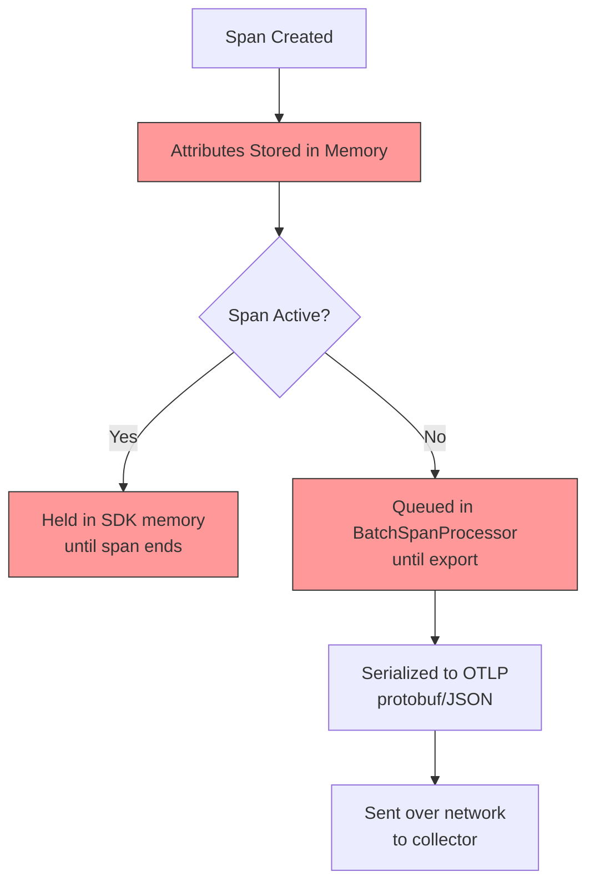
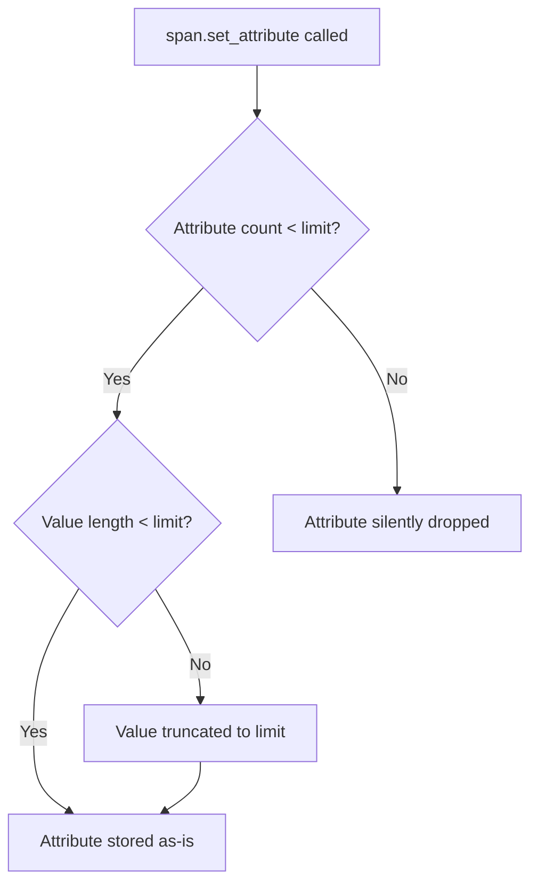

# How to Configure Attribute Limits to Prevent Memory Issues in SDKs

Author: [nawazdhandala](https://www.github.com/nawazdhandala)

Tags: OpenTelemetry, SDK, Memory, Performance, Configuration

Description: Learn how to configure OpenTelemetry SDK attribute limits to prevent memory leaks, OOM kills, and runaway resource consumption in production applications.

---

One of the quieter ways OpenTelemetry can take down your production application is through unbounded attribute growth. It does not happen all at once. A developer adds a request body as a span attribute. Another team starts logging full SQL queries. Someone sets a user's session data as a metric attribute. Each individual decision seems harmless. But the cumulative effect is that your application's memory usage grows steadily until the OOM killer pays a visit.

OpenTelemetry SDKs provide built-in safeguards for this. The problem is that the defaults are generous, and most teams never think to configure them until they have already hit a memory issue in production. This post walks through what limits are available, how to set them, and what values make sense for different workloads.

## What Attributes Actually Cost You

Every attribute you attach to a span, log record, or metric data point consumes memory. The cost depends on the attribute type and size, but here is a rough breakdown:



A single string attribute with a 100-character value costs about 200-300 bytes in memory when you account for the key, value, and overhead of the attribute data structures. That does not sound like much. But multiply it across hundreds of attributes, thousands of active spans, and you are looking at hundreds of megabytes.

The real danger comes from attributes with unpredictable sizes. Request bodies, SQL queries, error stack traces, serialized objects - these can be arbitrarily large. A single span with a 1 MB attribute value will consume 1 MB of heap memory for the entire lifetime of that span plus the time it sits in the export queue.

## The Three Limits You Need to Configure

OpenTelemetry SDKs expose three categories of limits that control attribute behavior:

1. **Maximum number of attributes** per span/log/metric data point
2. **Maximum length of attribute values** (for string and array types)
3. **Maximum number of events and links** per span (which also carry attributes)

Here is how to configure all of them in different languages.

### Python SDK

```python
# Configure comprehensive attribute limits for the Python SDK
from opentelemetry.sdk.trace import TracerProvider, SpanLimits
from opentelemetry.sdk.resources import Resource

# Define strict limits to prevent memory issues
span_limits = SpanLimits(
    # Maximum number of attributes per span
    max_attributes=64,
    # Maximum number of events (like exceptions, logs) per span
    max_events=64,
    # Maximum number of links to other spans
    max_links=32,
    # Maximum number of attributes per event
    max_event_attributes=16,
    # Maximum number of attributes per link
    max_link_attributes=16,
    # Maximum character length for string attribute values
    max_attribute_length=1024,
)

provider = TracerProvider(
    resource=Resource.create({"service.name": "my-service"}),
    span_limits=span_limits,
)
```

### Java SDK

```java
// Java SDK - Set attribute limits via system properties or environment variables
// These can also be set in code via SdkTracerProvider.builder()

// Option 1: Environment variables (set before JVM starts)
// OTEL_SPAN_ATTRIBUTE_COUNT_LIMIT=64
// OTEL_SPAN_EVENT_COUNT_LIMIT=64
// OTEL_SPAN_LINK_COUNT_LIMIT=32
// OTEL_ATTRIBUTE_VALUE_LENGTH_LIMIT=1024

// Option 2: System properties
// -Dotel.span.attribute.count.limit=64
// -Dotel.span.event.count.limit=64
// -Dotel.span.link.count.limit=32
// -Dotel.attribute.value.length.limit=1024

// Option 3: Programmatic configuration
SdkTracerProvider tracerProvider = SdkTracerProvider.builder()
    .setSpanLimits(SpanLimits.builder()
        .setMaxNumberOfAttributes(64)           // per span
        .setMaxNumberOfEvents(64)               // per span
        .setMaxNumberOfLinks(32)                // per span
        .setMaxNumberOfAttributesPerEvent(16)   // per event
        .setMaxNumberOfAttributesPerLink(16)    // per link
        .setMaxAttributeValueLength(1024)       // chars for strings
        .build())
    .build();
```

### Go SDK

```go
// Go SDK - Configure span limits in the TracerProvider
import (
    "go.opentelemetry.io/otel/sdk/trace"
)

// Create a TracerProvider with explicit attribute limits
tp := trace.NewTracerProvider(
    // Set the maximum number of attributes, events, and links per span
    trace.WithSpanLimits(trace.SpanLimits{
        AttributeCountLimit:         64,    // max attributes per span
        EventCountLimit:             64,    // max events per span
        LinkCountLimit:              32,    // max links per span
        AttributePerEventCountLimit: 16,    // max attributes per event
        AttributePerLinkCountLimit:  16,    // max attributes per link
        AttributeValueLengthLimit:   1024,  // max chars for string values
    }),
)
```

### Node.js SDK

```typescript
// Node.js SDK - Configure span limits in the TracerProvider
import { NodeTracerProvider } from '@opentelemetry/sdk-trace-node';

const provider = new NodeTracerProvider({
  spanLimits: {
    // Maximum number of attributes per span
    attributeCountLimit: 64,
    // Maximum number of events per span
    eventCountLimit: 64,
    // Maximum number of links per span
    linkCountLimit: 32,
    // Maximum number of attributes per event
    attributePerEventCountLimit: 16,
    // Maximum number of attributes per link
    attributePerLinkCountLimit: 16,
    // Maximum character length for string attribute values
    attributeValueLengthLimit: 1024,
  },
});
```

## What Happens When Limits Are Hit

Understanding the behavior when limits are exceeded is important. The SDK does not throw errors or crash. Instead, it silently drops the excess data. The specifics vary slightly by SDK, but the general behavior is:

- **Attribute count exceeded**: New attributes are dropped. The first N attributes are kept.
- **Attribute value too long**: The string is truncated to the maximum length. No error is raised.
- **Event/link count exceeded**: New events or links are dropped.

This means your application keeps running normally, but you lose some telemetry data. That is the correct tradeoff. It is far better to lose some attributes than to have your application OOM.



## Environment Variable Configuration

All OpenTelemetry SDKs respect a common set of environment variables for attribute limits. This is often the easiest way to configure limits across all your services, especially if you deploy in Kubernetes where you can set environment variables in your pod spec.

```yaml
# Kubernetes deployment snippet - Set OTEL attribute limits via env vars
apiVersion: apps/v1
kind: Deployment
metadata:
  name: my-service
spec:
  template:
    spec:
      containers:
        - name: app
          env:
            # Global attribute value length limit (applies to all signals)
            - name: OTEL_ATTRIBUTE_VALUE_LENGTH_LIMIT
              value: "1024"
            # Global attribute count limit (applies to all signals)
            - name: OTEL_ATTRIBUTE_COUNT_LIMIT
              value: "64"
            # Span-specific overrides (take precedence over global)
            - name: OTEL_SPAN_ATTRIBUTE_COUNT_LIMIT
              value: "64"
            - name: OTEL_SPAN_EVENT_COUNT_LIMIT
              value: "64"
            - name: OTEL_SPAN_LINK_COUNT_LIMIT
              value: "32"
            # Log-specific override
            - name: OTEL_LOGRECORD_ATTRIBUTE_COUNT_LIMIT
              value: "32"
```

The hierarchy is: signal-specific environment variables override the global ones. So if you set `OTEL_ATTRIBUTE_COUNT_LIMIT=128` and `OTEL_SPAN_ATTRIBUTE_COUNT_LIMIT=64`, spans will use 64 while logs (if no log-specific override is set) will use 128.

## Recommended Limits by Workload

There is no single right answer for attribute limits. It depends on your application's behavior and your observability requirements. Here are starting points for common scenarios:

**Standard web services** handling typical HTTP traffic where traces and spans are straightforward:

| Limit | Value |
|-------|-------|
| Attributes per span | 64 |
| Attribute value length | 2048 |
| Events per span | 64 |
| Links per span | 16 |

**High-throughput data pipelines** processing thousands of events per second where memory efficiency is critical:

| Limit | Value |
|-------|-------|
| Attributes per span | 32 |
| Attribute value length | 512 |
| Events per span | 16 |
| Links per span | 8 |

**Debug/development environments** where you want maximum visibility and memory is not a concern:

| Limit | Value |
|-------|-------|
| Attributes per span | 256 |
| Attribute value length | 8192 |
| Events per span | 256 |
| Links per span | 128 |

## Metric Attribute Limits Are Different

Metrics deserve special attention because attribute cardinality has a different impact on metrics than on traces. For traces, each span is independent. For metrics, each unique combination of attribute values creates a new time series. This means unbounded metric attributes do not just consume SDK memory - they create cardinality explosions in your backend.

The OpenTelemetry Metrics SDK has a concept called "cardinality limit" or "attribute filter" that you can configure:

```python
# Python SDK - Configure metric view to limit attributes on a specific metric
from opentelemetry.sdk.metrics import MeterProvider
from opentelemetry.sdk.metrics.view import View

# Create a view that only keeps specific attributes for HTTP metrics
# This prevents high-cardinality attributes like user IDs from creating
# an explosion of time series
http_view = View(
    instrument_name="http.server.request.duration",
    attribute_keys={"http.method", "http.status_code", "http.route"},
    # All other attributes are dropped for this metric
)

provider = MeterProvider(views=[http_view])
```

This is arguably more important than span attribute limits. A single metric with an unbounded `user.id` attribute can create millions of time series and bring down both your application and your metrics backend.

## Catching Problems Early

Rather than waiting for production memory issues, you can proactively detect attribute limit violations during development and testing.

Enable SDK debug logging to see when attributes are dropped:

```python
# Python - Enable debug logging to see attribute truncation warnings
import logging

# Set OpenTelemetry SDK logging to DEBUG level
# This will log warnings when attributes are dropped or truncated
logging.getLogger("opentelemetry.sdk").setLevel(logging.DEBUG)
```

You can also monitor the SDK's internal metrics. The OpenTelemetry specification defines standard metrics for SDK behavior, including counters for dropped attributes.

## Wrapping Up

Configuring attribute limits is one of those small, preventive tasks that saves you from painful production incidents later. Set them early in your OpenTelemetry rollout, before you have hundreds of services with unchecked attribute growth. Start with the recommended values for your workload type, monitor for dropped attributes in development, and adjust as needed. The five minutes you spend on this configuration could save you from a 3 AM page about OOM kills in production.
