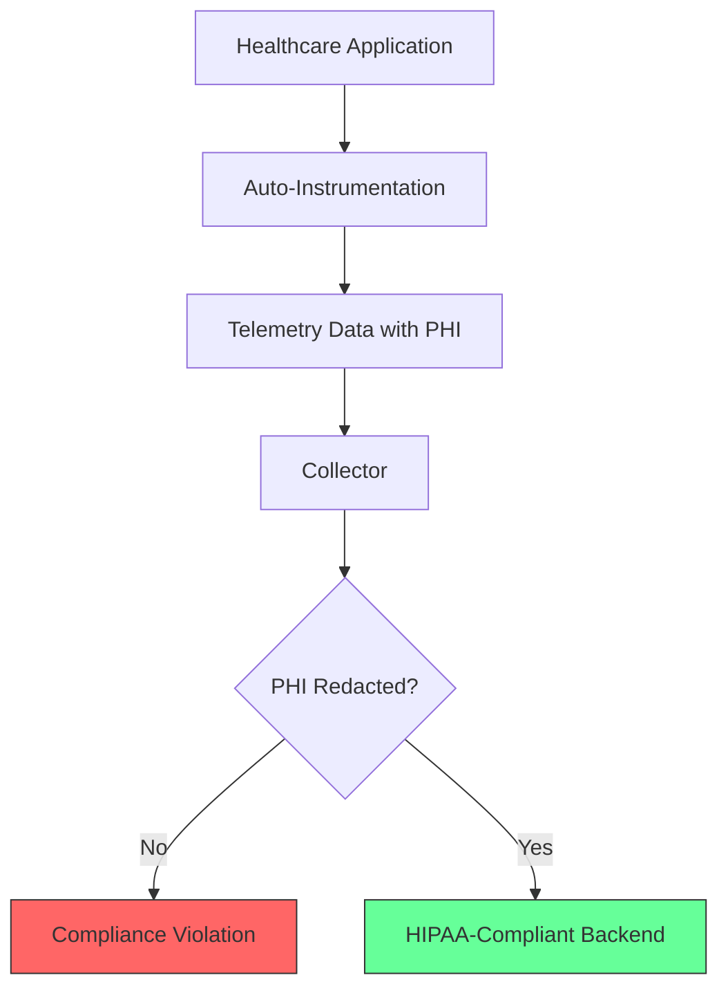
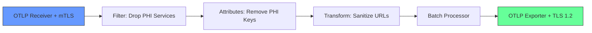

# How to Configure the OpenTelemetry Collector for HIPAA-Compliant Environments

Author: [nawazdhandala](https://www.github.com/nawazdhandala)

Tags: OpenTelemetry, Collector, HIPAA, Compliance, Security, Healthcare, Data Privacy

Description: A practical guide to configuring the OpenTelemetry Collector for HIPAA compliance, covering PHI redaction, encryption, access controls, and audit logging.

---

If you work in healthcare technology, you already know that HIPAA adds constraints to nearly every technical decision you make. Observability is no exception. The OpenTelemetry Collector is a powerful tool for processing and routing telemetry data, but its default configuration is not designed with Protected Health Information (PHI) in mind. Traces can contain patient names in HTTP URLs. Logs can include diagnosis codes. Metrics labels can carry patient identifiers. All of this constitutes PHI under HIPAA, and mishandling it can lead to compliance violations.

This guide covers the specific configuration changes you need to make to the OpenTelemetry Collector so that it meets HIPAA requirements. We will address data redaction, encryption in transit, encryption at rest, access controls, and audit logging.

## Understanding the HIPAA Risk with Telemetry

HIPAA's Security Rule requires covered entities and their business associates to protect electronic PHI (ePHI) through administrative, physical, and technical safeguards. Telemetry data - traces, logs, and metrics - can easily contain ePHI if your application processes patient information.

Consider a typical healthcare API. A request to `/api/patients/12345/records` already embeds a patient identifier in the URL. The auto-instrumentation captures that URL as a span attribute. Now your observability backend stores ePHI, and everyone with dashboard access can see it.



## Step 1: Strip PHI from Span Attributes

The first and most critical step is ensuring that no PHI reaches your observability backend. The Collector's `attributes` processor lets you delete or modify specific attribute keys.

This configuration removes common attributes that might contain patient information. Adjust the keys based on what your application actually captures.

```yaml
processors:
  # Remove attributes that commonly contain PHI
  attributes/phi-removal:
    actions:
      # Delete URL-related attributes that may contain patient IDs
      - key: url.full
        action: delete
      - key: url.path
        action: delete
      - key: http.target
        action: delete
      # Delete query string which may contain search parameters with PHI
      - key: url.query
        action: delete
      # Delete request and response bodies
      - key: http.request.body
        action: delete
      - key: http.response.body
        action: delete
      # Hash user identifiers so they can be correlated but not reversed
      - key: enduser.id
        action: hash
      # Delete any custom attributes your app sets with patient data
      - key: patient.id
        action: delete
      - key: patient.name
        action: delete
      - key: patient.mrn
        action: delete
```

For URL paths, rather than deleting the entire path (which would make traces less useful), you can use the `transform` processor to replace patient identifiers with placeholders.

```yaml
processors:
  # Replace patient IDs in URL paths with a placeholder
  transform/sanitize-urls:
    trace_statements:
      - context: span
        statements:
          # Replace numeric patient IDs in URL paths with a generic placeholder
          # This preserves the route structure while removing the identifier
          - replace_pattern(attributes["url.path"], "/patients/[0-9]+", "/patients/{id}")
          - replace_pattern(attributes["url.path"], "/records/[0-9]+", "/records/{id}")
```

## Step 2: Redact PHI from Log Bodies

Logs are often the biggest source of PHI leakage. Application logs frequently contain patient names, medical record numbers, and diagnosis information in free-text messages.

The `transform` processor can apply regex-based redaction to log bodies. This configuration targets common PHI patterns.

```yaml
processors:
  # Redact PHI patterns from log message bodies
  transform/redact-logs:
    log_statements:
      - context: log
        statements:
          # Redact Social Security Numbers (XXX-XX-XXXX pattern)
          - replace_pattern(body, "[0-9]{3}-[0-9]{2}-[0-9]{4}", "[SSN-REDACTED]")
          # Redact Medical Record Numbers (assuming MRN-XXXXXX format)
          - replace_pattern(body, "MRN-[A-Z0-9]{6,10}", "[MRN-REDACTED]")
          # Redact date of birth patterns (MM/DD/YYYY)
          - replace_pattern(body, "[0-1][0-9]/[0-3][0-9]/[1-2][0-9]{3}", "[DOB-REDACTED]")
```

Keep in mind that regex-based redaction is not foolproof. Patient names in free text cannot be reliably caught by pattern matching. The better approach is to prevent your application from logging PHI in the first place. Use structured logging and keep PHI out of log messages at the source.

## Step 3: Enforce TLS for All Communications

HIPAA requires encryption of ePHI in transit. Every connection to and from the Collector must use TLS. This means configuring TLS on receivers (incoming data), exporters (outgoing data), and any extensions that expose HTTP endpoints.

This configuration enforces TLS 1.2 as the minimum version on both the receiver and exporter sides.

```yaml
receivers:
  otlp:
    protocols:
      grpc:
        endpoint: 0.0.0.0:4317
        tls:
          # Path to the server certificate file
          cert_file: /etc/otel/certs/server.crt
          # Path to the server private key
          key_file: /etc/otel/certs/server.key
          # Minimum TLS version - HIPAA requires at least TLS 1.2
          min_version: "1.2"
      http:
        endpoint: 0.0.0.0:4318
        tls:
          cert_file: /etc/otel/certs/server.crt
          key_file: /etc/otel/certs/server.key
          min_version: "1.2"

exporters:
  otlp:
    endpoint: backend.example.com:4317
    tls:
      # Path to the CA certificate for verifying the backend
      ca_file: /etc/otel/certs/ca.crt
      # Client certificate for mutual TLS authentication
      cert_file: /etc/otel/certs/client.crt
      key_file: /etc/otel/certs/client.key
      # Enforce minimum TLS 1.2 for outbound connections
      min_version: "1.2"
```

## Step 4: Enable Mutual TLS (mTLS) for Authentication

HIPAA's access control requirements mean you need to verify the identity of systems sending telemetry data. Mutual TLS ensures that both the client and server present certificates, preventing unauthorized services from sending data to your Collector.

```yaml
receivers:
  otlp:
    protocols:
      grpc:
        endpoint: 0.0.0.0:4317
        tls:
          cert_file: /etc/otel/certs/server.crt
          key_file: /etc/otel/certs/server.key
          # CA certificate used to verify client certificates
          client_ca_file: /etc/otel/certs/ca.crt
          min_version: "1.2"
```

With `client_ca_file` set, the Collector will reject connections from any client that does not present a certificate signed by the specified CA. This is the strongest form of transport-level authentication available.

## Step 5: Use the Filter Processor to Drop High-Risk Data

Some telemetry data is too risky to process at all. If certain services handle raw PHI and you cannot guarantee proper redaction at the application level, you can drop their telemetry entirely at the Collector.

```yaml
processors:
  # Drop all traces from high-risk services that handle raw PHI
  filter/drop-phi-services:
    traces:
      span:
        - 'resource.attributes["service.name"] == "patient-records-importer"'
        - 'resource.attributes["service.name"] == "hl7-message-processor"'
    logs:
      log_record:
        - 'resource.attributes["service.name"] == "patient-records-importer"'
```

This is a blunt tool. You lose observability into those services entirely. But for batch processing services that ingest raw patient data, this may be the safest option until you can implement proper PHI handling at the application level.

## Step 6: Configure Audit Logging

HIPAA requires audit controls that record activity in systems containing ePHI. The Collector itself should log its operational activity so you have a record of what data it processed.

```yaml
service:
  # Enable detailed telemetry about the Collector's own operations
  telemetry:
    logs:
      # Set log level to info to capture operational events
      level: info
      # Write logs to a file for long-term retention
      output_paths: ["/var/log/otel/collector.log"]
    metrics:
      # Expose Collector health metrics on a separate port
      address: 0.0.0.0:8888
```

These Collector logs should be shipped to a tamper-evident log storage system. Configure log rotation and ensure the logs are retained for at least six years, as HIPAA requires.

## Step 7: Put It All Together

Here is a complete Collector configuration that combines all the HIPAA controls discussed above into a single pipeline.

```yaml
receivers:
  otlp:
    protocols:
      grpc:
        endpoint: 0.0.0.0:4317
        tls:
          cert_file: /etc/otel/certs/server.crt
          key_file: /etc/otel/certs/server.key
          client_ca_file: /etc/otel/certs/ca.crt
          min_version: "1.2"

processors:
  # First: drop entire spans from high-risk services
  filter/drop-phi-services:
    traces:
      span:
        - 'resource.attributes["service.name"] == "patient-records-importer"'

  # Second: remove known PHI attribute keys
  attributes/phi-removal:
    actions:
      - key: patient.id
        action: delete
      - key: patient.name
        action: delete
      - key: enduser.id
        action: hash

  # Third: sanitize URL paths to remove identifiers
  transform/sanitize-urls:
    trace_statements:
      - context: span
        statements:
          - replace_pattern(attributes["url.path"], "/patients/[0-9]+", "/patients/{id}")

  # Fourth: batch for efficient export
  batch:
    timeout: 5s
    send_batch_size: 512

exporters:
  otlp:
    endpoint: hipaa-backend.example.com:4317
    tls:
      ca_file: /etc/otel/certs/ca.crt
      cert_file: /etc/otel/certs/client.crt
      key_file: /etc/otel/certs/client.key
      min_version: "1.2"

service:
  telemetry:
    logs:
      level: info
      output_paths: ["/var/log/otel/collector.log"]
  pipelines:
    traces:
      receivers: [otlp]
      # Processors run in the order listed
      processors: [filter/drop-phi-services, attributes/phi-removal, transform/sanitize-urls, batch]
      exporters: [otlp]
```



## Additional Recommendations

Beyond the Collector configuration, keep these points in mind for full HIPAA compliance:

- **Business Associate Agreement (BAA):** If your telemetry backend is a third-party SaaS product, ensure you have a signed BAA with the vendor.
- **Access Controls:** Restrict who can view the observability dashboards. Not every engineer needs access to production telemetry from healthcare services.
- **Data Retention:** Configure your backend to automatically delete telemetry data after a defined retention period. Six years is the HIPAA minimum for audit logs, but you should consult your compliance team for the appropriate retention policy.
- **Regular Audits:** Periodically export a sample of your telemetry data and search for PHI patterns. Automated scanning tools can help catch leaks that your redaction rules miss.

HIPAA compliance is not a one-time configuration task. It requires ongoing attention, regular audits, and updates as your application evolves. But getting the Collector configuration right is a strong foundation.
