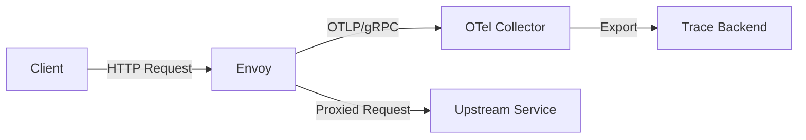

# How to Configure Envoy Proxy to Export OTLP Traces via gRPC

Author: [nawazdhandala](https://www.github.com/nawazdhandala)

Tags: OpenTelemetry, Envoy, OTLP, gRPC, Distributed Tracing, Proxy, Observability

Description: A practical guide to configuring Envoy proxy to export distributed traces using the OpenTelemetry Protocol (OTLP) over gRPC to an OpenTelemetry Collector.

---

Envoy proxy sits at the heart of many modern infrastructure stacks. Whether you're running it as a standalone edge proxy, a sidecar in a service mesh, or part of an API gateway like Ambassador or Gloo, Envoy handles a massive volume of traffic. It also has built-in support for generating distributed traces for every request it processes. Getting those traces out in OTLP format over gRPC means you can feed them directly into the OpenTelemetry ecosystem without any format translation.

This guide walks through configuring Envoy to emit traces using its native OpenTelemetry tracing provider and send them to an OTel Collector via gRPC.

## How Envoy Generates Traces

Envoy generates trace data at the connection manager level. Every HTTP request that passes through an Envoy listener gets a trace span created for it. The span captures the request's lifecycle: when it arrived, how long the upstream took to respond, the HTTP method and status code, and various other attributes.

Envoy supports several tracing providers, including Zipkin, Jaeger, Datadog, and OpenTelemetry. The OpenTelemetry provider was added in later Envoy releases and supports exporting spans in OTLP format over gRPC. This is what we want.



## Prerequisites

Before diving into the configuration, make sure you have:

- Envoy 1.26 or later (the OpenTelemetry tracing provider has been stable since this version)
- An OpenTelemetry Collector running and accessible on port 4317 (the default OTLP gRPC port)
- Basic familiarity with Envoy's configuration structure (listeners, clusters, routes)

## Setting Up the OpenTelemetry Tracing Provider

Envoy's tracing configuration lives in two places: the bootstrap config (where you define the tracing provider) and the HTTP connection manager (where you enable tracing on specific listeners).

Let's start with a complete working configuration. This sets up Envoy to proxy HTTP traffic and export OTLP traces for every request.

```yaml
# envoy.yaml - Complete Envoy config with OTLP trace export via gRPC
static_resources:
  listeners:
    - name: main_listener
      address:
        socket_address:
          address: 0.0.0.0
          port_value: 8080
      filter_chains:
        - filters:
            - name: envoy.filters.network.http_connection_manager
              typed_config:
                "@type": type.googleapis.com/envoy.extensions.filters.network.http_connection_manager.v3.HttpConnectionManager
                stat_prefix: ingress_http
                # Enable tracing on this listener
                tracing:
                  # Use the OpenTelemetry provider defined below
                  provider:
                    name: envoy.tracers.opentelemetry
                    typed_config:
                      "@type": type.googleapis.com/envoy.config.trace.v3.OpenTelemetryConfig
                      # Name that will appear as the service name in traces
                      service_name: envoy-edge-proxy
                      # Reference to the gRPC cluster for the OTel Collector
                      grpc_service:
                        envoy_grpc:
                          cluster_name: otel_collector
                        # Timeout for sending trace data
                        timeout: 5s
                  # Random sampling configuration
                  random_sampling:
                    value: 100.0  # Sample all requests; lower this in production
                route_config:
                  name: local_route
                  virtual_hosts:
                    - name: backend_service
                      domains: ["*"]
                      routes:
                        - match:
                            prefix: "/"
                          route:
                            cluster: upstream_service
                          # Optionally override tracing behavior per route
                          decorator:
                            operation: "proxy-to-upstream"
                http_filters:
                  - name: envoy.filters.http.router
                    typed_config:
                      "@type": type.googleapis.com/envoy.extensions.filters.http.router.v3.Router

  clusters:
    # The upstream service cluster that Envoy proxies traffic to
    - name: upstream_service
      type: STRICT_DNS
      lb_policy: ROUND_ROBIN
      load_assignment:
        cluster_name: upstream_service
        endpoints:
          - lb_endpoints:
              - endpoint:
                  address:
                    socket_address:
                      address: backend-app
                      port_value: 3000

    # The OpenTelemetry Collector cluster - this is where traces go
    - name: otel_collector
      type: STRICT_DNS
      lb_policy: ROUND_ROBIN
      typed_extension_protocol_options:
        # Configure this cluster to use HTTP/2 (required for gRPC)
        envoy.extensions.upstreams.http.v3.HttpProtocolOptions:
          "@type": type.googleapis.com/envoy.extensions.upstreams.http.v3.HttpProtocolOptions
          explicit_http_config:
            http2_protocol_options: {}
      load_assignment:
        cluster_name: otel_collector
        endpoints:
          - lb_endpoints:
              - endpoint:
                  address:
                    socket_address:
                      # Address of the OTel Collector
                      address: otel-collector
                      # Standard OTLP gRPC port
                      port_value: 4317
```

There are a few things worth calling out in this config. The `otel_collector` cluster must use HTTP/2 because gRPC requires it. The `typed_extension_protocol_options` block handles that. If you miss this, Envoy will try to send gRPC over HTTP/1.1 and the Collector will reject the connection.

## Understanding the Trace Output

When Envoy exports a trace span via OTLP, it includes a set of attributes that describe the request. Here's what you'll typically see on each span:

- `http.method` - GET, POST, PUT, etc.
- `http.url` - The full request URL
- `http.status_code` - The upstream response code
- `http.protocol` - HTTP/1.1 or HTTP/2
- `upstream_cluster` - Which Envoy cluster handled the request
- `response_flags` - Envoy-specific flags (timeouts, circuit breaking, etc.)

The span name defaults to the route's `decorator.operation` value if set, or the Envoy-generated operation name otherwise.

## Adding Resource Attributes

You might want to enrich the trace data with additional context about where Envoy is running. You can do this through the `resource_attributes` field in the OpenTelemetry config.

```yaml
# Enhanced tracing provider config with resource attributes
tracing:
  provider:
    name: envoy.tracers.opentelemetry
    typed_config:
      "@type": type.googleapis.com/envoy.config.trace.v3.OpenTelemetryConfig
      service_name: envoy-edge-proxy
      # Add resource attributes to identify this Envoy instance
      resource_detectors:
        - name: envoy.tracers.opentelemetry.resource_detectors.environment
          typed_config:
            "@type": type.googleapis.com/envoy.extensions.tracers.opentelemetry.resource_detectors.v3.EnvironmentResourceDetectorConfig
      grpc_service:
        envoy_grpc:
          cluster_name: otel_collector
        timeout: 5s
```

You can also set resource attributes through environment variables that Envoy reads. Set `OTEL_RESOURCE_ATTRIBUTES` before starting Envoy:

```bash
# Set resource attributes via environment variable before launching Envoy
# These will be attached to every span Envoy exports
export OTEL_RESOURCE_ATTRIBUTES="deployment.environment=production,k8s.namespace.name=gateway,service.version=1.5.0"

# Start Envoy with the config
envoy -c /etc/envoy/envoy.yaml
```

## Context Propagation Settings

By default, Envoy propagates trace context using the W3C Trace Context format (`traceparent` and `tracestate` headers). This is the standard that OpenTelemetry also uses, so things work well out of the box.

If you need to support additional propagation formats (for example, if some upstream services still use B3 headers from Zipkin), you can configure Envoy to inject multiple formats.

```yaml
# Tracing config with custom context propagation headers
tracing:
  provider:
    name: envoy.tracers.opentelemetry
    typed_config:
      "@type": type.googleapis.com/envoy.config.trace.v3.OpenTelemetryConfig
      service_name: envoy-edge-proxy
      grpc_service:
        envoy_grpc:
          cluster_name: otel_collector
        timeout: 5s
  # Specify which headers to use for context propagation
  # Envoy will read and write these headers on requests
  custom_tags:
    - tag: "envoy.zone"
      environment:
        name: ENVOY_ZONE
        default_value: "unknown"
```

## Setting Up the OpenTelemetry Collector

On the receiving end, your Collector config needs to accept OTLP over gRPC. Here's a minimal Collector configuration that works with the Envoy setup above.

```yaml
# otel-collector-config.yaml
receivers:
  # Accept OTLP traces over gRPC on the standard port
  otlp:
    protocols:
      grpc:
        endpoint: 0.0.0.0:4317

processors:
  # Batch spans for efficient export
  batch:
    timeout: 10s
    send_batch_size: 512

  # Add attributes to identify traces coming from Envoy
  attributes:
    actions:
      - key: telemetry.source
        value: envoy-proxy
        action: upsert

exporters:
  # Send to your preferred backend
  otlp:
    endpoint: "https://oneuptime.example.com:4317"
    tls:
      insecure: false

  # Also log to stdout for debugging
  debug:
    verbosity: detailed

service:
  pipelines:
    traces:
      receivers: [otlp]
      processors: [attributes, batch]
      exporters: [otlp, debug]
```

## Controlling Sampling

In production, you probably don't want to trace every single request. Envoy gives you a few ways to control sampling.

The `random_sampling` value in the connection manager config is the most straightforward approach. Set it to a percentage between 0 and 100.

```yaml
# Lower sampling rate for production traffic
tracing:
  provider:
    name: envoy.tracers.opentelemetry
    typed_config:
      "@type": type.googleapis.com/envoy.config.trace.v3.OpenTelemetryConfig
      service_name: envoy-edge-proxy
      grpc_service:
        envoy_grpc:
          cluster_name: otel_collector
        timeout: 5s
  # Sample 5% of traffic in production
  random_sampling:
    value: 5.0
```

You can also use client-driven sampling. If an incoming request already has a `traceparent` header with a sampling flag set, Envoy will respect that decision. This is useful when you want upstream services or load balancers to control which requests get traced.

## Testing the Setup

To verify everything is working, start Envoy and the Collector, then send a test request through the proxy.

```bash
# Send a test request through Envoy
curl -v http://localhost:8080/api/health

# Check the Collector logs for received trace spans
# If using the debug exporter, you'll see span details in stdout
docker logs otel-collector 2>&1 | grep "Span #"
```

You should see spans appear in the Collector's output with the service name `envoy-edge-proxy` and attributes like `http.method`, `http.status_code`, and the route information.

## Common Issues

A few problems you might run into:

**gRPC connection failures.** Make sure the `otel_collector` cluster has HTTP/2 configured. Without `http2_protocol_options`, the gRPC connection won't work. Check Envoy's admin interface at `/clusters` to see if the Collector cluster is healthy.

**Missing spans.** If you see requests going through Envoy but no traces appearing, check the sampling rate. Also verify that the Collector is actually listening on port 4317 and that there are no network policies blocking the connection.

**High latency from tracing.** The gRPC call to the Collector is asynchronous and shouldn't block request processing. However, if the Collector is slow or unreachable, Envoy's trace buffer can fill up. The `timeout` setting on the gRPC service config controls how long Envoy waits before dropping trace data.

## Summary

Configuring Envoy to export OTLP traces over gRPC is relatively straightforward once you understand the pieces involved: the tracing provider configuration on the HTTP connection manager, the gRPC cluster pointing to the Collector, and the HTTP/2 protocol requirement. With this setup, every request flowing through Envoy generates a trace span that feeds into the OpenTelemetry ecosystem, giving you visibility into your proxy layer alongside your application traces.
