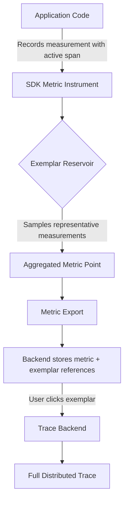

# How to Configure Exemplars to Link Metric Points to Specific Traces

Author: [nawazdhandala](https://www.github.com/nawazdhandala)

Tags: OpenTelemetry, Exemplars, Metrics, Traces, Correlation, Observability, SDK

Description: Learn how to configure OpenTelemetry exemplars to attach trace context to metric data points, enabling direct navigation from metrics to traces.

---

You are staring at a latency spike in your metrics dashboard. The p99 jumped from 200ms to 3 seconds five minutes ago. You know something went wrong, but the metric alone does not tell you what. You need to find the actual requests that were slow. Without exemplars, you are left guessing, searching through traces by time range and hoping to find a match. With exemplars, the metric data point itself carries a direct link to the trace that produced it.

Exemplars are sample trace references attached to metric measurements. When the SDK records a histogram observation or counter increment, it can also store the trace ID and span ID of the active span at that moment. When you later query the metric, the exemplar gives you a direct link to a specific trace that contributed to that data point.

## How Exemplars Work

The OpenTelemetry SDK attaches exemplars to aggregated metric data points. Each exemplar contains the trace ID and span ID from the recording context, the raw measured value, the timestamp, and optionally filtered attributes that were dropped by views.



The key insight is that exemplars are sampled. The SDK does not attach a trace reference to every single measurement. Instead, it uses a reservoir sampling algorithm to pick representative examples. This keeps the overhead low while still giving you useful links.

## Enabling Exemplars in Python

By default, exemplar collection is disabled or uses a minimal configuration. You need to explicitly enable it with the right exemplar filter:

```python
# Enabling exemplar collection in the Python SDK
from opentelemetry.sdk.metrics import MeterProvider
from opentelemetry.sdk.metrics.export import (
    PeriodicExportingMetricReader,
    ConsoleMetricExporter,
)
from opentelemetry.sdk.metrics.view import View, ExplicitBucketHistogramAggregation
import os

# Set the exemplar filter via environment variable
# Options: "trace_based" (default in newer SDKs), "always_on", "always_off"
os.environ["OTEL_METRICS_EXEMPLAR_FILTER"] = "trace_based"

# The trace_based filter only records exemplars when there is
# an active sampled span in the current context. This means
# exemplars only link to traces that are actually being collected.

reader = PeriodicExportingMetricReader(
    ConsoleMetricExporter(),
    export_interval_millis=10000,
)

# Create the MeterProvider with exemplar-aware configuration
provider = MeterProvider(
    metric_readers=[reader],
    views=[
        # Custom histogram buckets for HTTP duration
        View(
            instrument_name="http.server.request.duration",
            aggregation=ExplicitBucketHistogramAggregation(
                boundaries=[0.005, 0.01, 0.025, 0.05, 0.1, 0.25, 0.5, 1.0, 5.0]
            ),
        ),
    ],
)
```

The `trace_based` filter is the most practical choice. It only captures exemplars when there is a sampled trace in the current context. This avoids creating exemplars that reference traces your backend never received, which would lead to broken links in your dashboard.

## Recording Measurements with Trace Context

For exemplars to work, the measurement must happen within an active span context. Here is how a typical instrumented endpoint looks:

```python
# Recording metrics within trace context for exemplar collection
from opentelemetry import trace, metrics
import time

# Get a tracer and meter from the global providers
tracer = trace.get_tracer("my-service")
meter = metrics.get_meter("my-service")

# Create a histogram instrument for request duration
request_duration = meter.create_histogram(
    name="http.server.request.duration",
    description="Duration of HTTP server requests",
    unit="s",
)

# Create a counter for request count
request_count = meter.create_counter(
    name="http.server.request.count",
    description="Number of HTTP server requests",
)


def handle_request(method, route, process_fn):
    """Handle an HTTP request with tracing and metrics."""
    # Start a span for this request
    with tracer.start_as_current_span(
        "http.request",
        attributes={
            "http.request.method": method,
            "http.route": route,
        },
    ) as span:
        start = time.monotonic()

        try:
            result = process_fn()
            status_code = 200
        except Exception as e:
            status_code = 500
            span.set_status(trace.StatusCode.ERROR, str(e))
            raise
        finally:
            duration = time.monotonic() - start
            attrs = {
                "http.request.method": method,
                "http.route": route,
                "http.response.status_code": status_code,
            }
            # When this measurement is recorded, the SDK checks for
            # an active span in the current context. Since we are
            # inside the tracer.start_as_current_span block, the SDK
            # captures the trace_id and span_id as an exemplar.
            request_duration.record(duration, attributes=attrs)
            request_count.add(1, attributes=attrs)
```

The measurement call `request_duration.record(duration, attributes=attrs)` happens inside the span context. The SDK's exemplar reservoir automatically captures the trace and span IDs from the current context. You do not need to pass them explicitly.

## Configuring Exemplar Reservoirs

The SDK uses reservoir sampling to decide which measurements get exemplars. Different reservoir types suit different use cases:

```python
# Exemplar reservoir configuration (conceptual, varies by SDK version)
# The reservoir determines HOW exemplars are sampled from measurements

# SimpleFixedSizeExemplarReservoir: Keeps a fixed number of exemplars
# per metric stream. Good for counters and simple metrics.
# Size defaults to 1 per metric point.

# AlignedHistogramBucketExemplarReservoir: Keeps one exemplar per
# histogram bucket. This is the default for histogram instruments.
# It ensures each bucket has a representative trace link.
```

For histogram instruments, the aligned reservoir is the most useful. It stores one exemplar per bucket, so when you look at your latency distribution and see that the 500ms-1s bucket has unusual traffic, the exemplar for that specific bucket links you directly to a trace that fell in that range.

## Go Implementation

Here is the equivalent setup in Go:

```go
// Configuring exemplars in the Go SDK
package main

import (
	"context"
	"time"

	"go.opentelemetry.io/otel"
	"go.opentelemetry.io/otel/metric"
	sdkmetric "go.opentelemetry.io/otel/sdk/metric"
	"go.opentelemetry.io/otel/sdk/metric/exemplar"
)

func setupMetrics() *sdkmetric.MeterProvider {
	// Configure the exemplar filter
	// TraceBasedFilter only records exemplars for sampled spans
	provider := sdkmetric.NewMeterProvider(
		sdkmetric.WithReader(reader),
		// Set the exemplar filter at the provider level
		sdkmetric.WithExemplarFilter(
			exemplar.TraceBasedFilter,
		),
	)

	return provider
}

// RecordLatency records a request duration metric within a span context.
// The exemplar is captured automatically from the span context.
func RecordLatency(ctx context.Context, histogram metric.Float64Histogram, duration time.Duration) {
	// The ctx must contain an active span for exemplar capture
	// The SDK extracts trace_id and span_id from the span in ctx
	histogram.Record(
		ctx,
		duration.Seconds(),
		metric.WithAttributes(
			attribute.String("http.request.method", "GET"),
			attribute.Int("http.response.status_code", 200),
		),
	)
}
```

In Go, the context parameter is explicit. You must pass the context containing the active span to the `Record` method. If you pass `context.Background()` or a context without a span, no exemplar will be captured even with exemplars enabled.

## OTLP Export and Backend Support

Exemplars travel through the OTLP protocol alongside the metric data. The collector passes them through transparently:

```yaml
# Collector configuration that preserves exemplars
receivers:
  otlp:
    protocols:
      grpc:
        endpoint: 0.0.0.0:4317

exporters:
  # OTLP exporter preserves exemplars automatically
  otlp/metrics:
    endpoint: metrics-backend.example.com:4317
    # No special configuration needed for exemplars
    # They are included in the OTLP metric data model

  # Prometheus remote write also supports exemplars
  prometheusremotewrite:
    endpoint: "http://prometheus:9090/api/v1/write"
    # Enable exemplars in Prometheus remote write
    resource_to_telemetry_conversion:
      enabled: true

processors:
  batch:
    timeout: 10s

service:
  pipelines:
    metrics:
      receivers: [otlp]
      processors: [batch]
      exporters: [otlp/metrics]
```

Not all backends support exemplars equally. Prometheus added native exemplar support in version 2.26, and Grafana can display them starting from version 7.4. If your backend does not support exemplars, they are silently dropped during export. No data is lost from the metrics themselves.

## Connecting the Dots in Practice

The real power of exemplars shows up in your observability workflow. Consider a scenario where you see a latency spike:

```python
# Example: instrumenting a payment service where exemplars shine
from opentelemetry import trace, metrics

tracer = trace.get_tracer("payment-service")
meter = metrics.get_meter("payment-service")

payment_duration = meter.create_histogram(
    name="payment.processing.duration",
    description="Time to process a payment",
    unit="s",
)

payment_errors = meter.create_counter(
    name="payment.errors",
    description="Number of payment processing errors",
)


def process_payment(payment_id, amount, method):
    """Process a payment with full trace and metric correlation."""
    with tracer.start_as_current_span(
        "process_payment",
        attributes={
            "payment.id": payment_id,
            "payment.method": method,
            # Do not put PII or sensitive amounts in span attributes
            # in production. This is simplified for the example.
        },
    ) as span:
        start = time.monotonic()

        try:
            # Validate payment
            validate_payment(payment_id, amount)

            # Charge the payment processor
            result = charge_processor(method, amount)

            # Update the database
            update_payment_record(payment_id, result)

            duration = time.monotonic() - start
            # This records duration AND captures the trace link as an exemplar
            # When you see a slow payment in your dashboard, click the
            # exemplar to see the full trace with all three child spans
            payment_duration.record(duration, attributes={
                "payment.method": method,
                "payment.status": "success",
            })

            return result

        except Exception as e:
            duration = time.monotonic() - start
            payment_duration.record(duration, attributes={
                "payment.method": method,
                "payment.status": "error",
            })
            payment_errors.add(1, attributes={
                "payment.method": method,
                "error.type": type(e).__name__,
            })
            span.record_exception(e)
            span.set_status(trace.StatusCode.ERROR)
            raise
```

When the `payment.processing.duration` histogram shows a spike, the exemplar on the high-latency bucket gives you a trace ID. You click it, and the trace shows you exactly what happened: maybe the `charge_processor` child span took 4 seconds because the payment gateway had a timeout, or the `update_payment_record` span shows a database deadlock. You go from "something is slow" to "the payment gateway timed out on Visa transactions" in seconds.

## Practical Considerations

Exemplar overhead is minimal because of reservoir sampling. The SDK only stores a small number of exemplars per metric stream per collection interval. You will not see measurable performance impact in production.

Make sure your trace and metric backends share a common query interface. The value of exemplars depends entirely on being able to click a trace ID in your metrics view and navigate to the trace detail view. If your metrics are in Prometheus and traces are in a separate system with no cross-linking UI, exemplars lose most of their value.

Also ensure that your trace sampling rate is high enough for exemplars to be useful. If you sample only 1% of traces, most exemplar references will point to traces that were not collected. The `trace_based` exemplar filter helps here by only recording exemplars for sampled traces, but you still need enough sampled traces to get good coverage.

Exemplars bridge the gap between aggregated metrics and individual request traces. Configure them once, and your team gains the ability to jump from any metric anomaly directly to the exact traces that caused it. That direct link transforms how fast you can diagnose and resolve production issues.
