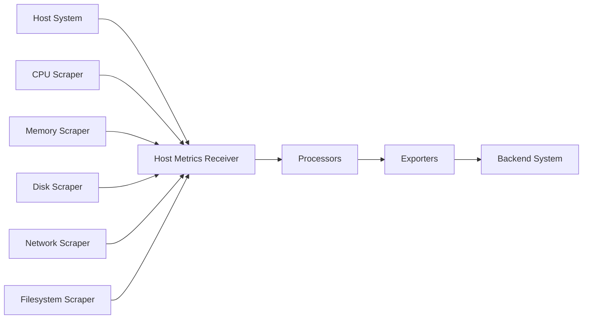

# How to Configure the Host Metrics Receiver in the OpenTelemetry Collector

Author: [nawazdhandala](https://www.github.com/nawazdhandala)

Tags: OpenTelemetry, Collector, Host Metrics, Receiver, CPU, Memory, Disk

Description: Learn how to configure the Host Metrics Receiver in OpenTelemetry Collector to collect CPU, memory, disk, network, and filesystem metrics from your infrastructure.

The Host Metrics Receiver is one of the most essential components when setting up infrastructure monitoring with the OpenTelemetry Collector. It collects telemetry data about the host system where the collector runs, including CPU usage, memory consumption, disk I/O, network traffic, and filesystem metrics. This receiver eliminates the need for separate host monitoring agents, consolidating your observability stack.

## Why Host Metrics Matter

Before cloud-native applications and container orchestration became standard, monitoring individual hosts was straightforward. You would install an agent like collectd or node_exporter, and it would report metrics to your monitoring system. However, modern infrastructure is more complex. You might have hundreds of containers running across dozens of hosts, with workloads shifting dynamically based on load.

The Host Metrics Receiver provides a vendor-neutral way to collect these metrics. Whether you're running on bare metal, virtual machines, or container orchestration platforms, you get consistent metric collection without vendor lock-in. The metrics follow OpenTelemetry semantic conventions, making them portable across different backend systems.

## Understanding the Host Metrics Receiver

The receiver works by interfacing with the operating system's performance counters and system APIs. On Linux, it reads from `/proc` and `/sys` filesystems. On Windows, it uses Performance Data Helper (PDH) APIs. On macOS, it leverages system libraries to gather performance data.

What makes this receiver powerful is its scraper architecture. Instead of collecting all possible metrics, you configure specific scrapers for the metric categories you care about. This approach reduces overhead and keeps your metric cardinality manageable.

## Architecture Overview

Here's how the Host Metrics Receiver fits into the OpenTelemetry Collector pipeline:



## Basic Configuration

Here's a minimal configuration to get started:

```yaml
# This configuration collects basic CPU and memory metrics
# The collection_interval determines how often metrics are scraped
receivers:
  hostmetrics:
    collection_interval: 30s
    scrapers:
      cpu:
      memory:

processors:
  batch:
    timeout: 10s

exporters:
  logging:
    loglevel: debug

service:
  pipelines:
    metrics:
      receivers: [hostmetrics]
      processors: [batch]
      exporters: [logging]
```

This configuration scrapes CPU and memory metrics every 30 seconds. The batch processor aggregates metrics before exporting to reduce network overhead. In production, you would replace the logging exporter with your actual backend (Prometheus, OTLP, etc.).

## Comprehensive Scraper Configuration

Each scraper has specific options. Here's a production-ready configuration with all scrapers enabled:

```yaml
# Production configuration with all available scrapers
# Each scraper collects different aspects of host performance
receivers:
  hostmetrics:
    collection_interval: 60s
    scrapers:
      # CPU metrics: usage per core, wait time, system vs user time
      cpu:
        metrics:
          system.cpu.utilization:
            enabled: true
          system.cpu.time:
            enabled: true

      # Memory metrics: used, available, cached, buffered
      memory:
        metrics:
          system.memory.usage:
            enabled: true
          system.memory.utilization:
            enabled: true

      # Disk I/O metrics: read/write operations, bytes, time
      disk:
        metrics:
          system.disk.io:
            enabled: true
          system.disk.operations:
            enabled: true
          system.disk.io_time:
            enabled: true

      # Filesystem metrics: usage per mount point
      filesystem:
        metrics:
          system.filesystem.usage:
            enabled: true
          system.filesystem.utilization:
            enabled: true

      # Network metrics: bytes in/out, packets, errors
      network:
        metrics:
          system.network.io:
            enabled: true
          system.network.errors:
            enabled: true
          system.network.connections:
            enabled: true

      # Load average (Linux/Unix only)
      load:
        metrics:
          system.cpu.load_average.1m:
            enabled: true
          system.cpu.load_average.5m:
            enabled: true
          system.cpu.load_average.15m:
            enabled: true

      # Paging/swap metrics
      paging:
        metrics:
          system.paging.usage:
            enabled: true
          system.paging.operations:
            enabled: true

      # Process count and resource usage
      processes:
        metrics:
          system.processes.count:
            enabled: true
          system.processes.created:
            enabled: true

processors:
  # Add resource attributes to identify the host
  resource:
    attributes:
      - key: host.name
        from_attribute: host.name
        action: upsert
      - key: environment
        value: production
        action: insert

  # Batch metrics for efficient transmission
  batch:
    timeout: 10s
    send_batch_size: 1024

exporters:
  otlp:
    endpoint: https://your-backend.example.com:4317
    headers:
      api-key: ${API_KEY}

service:
  pipelines:
    metrics:
      receivers: [hostmetrics]
      processors: [resource, batch]
      exporters: [otlp]
```

## Advanced Scraper Options

### CPU Scraper Configuration

The CPU scraper can report per-core metrics or aggregate across all cores:

```yaml
# Collect detailed CPU metrics including per-core utilization
# This is useful for detecting CPU pinning issues or core imbalances
receivers:
  hostmetrics:
    collection_interval: 30s
    scrapers:
      cpu:
        # Report metrics for each CPU core separately
        report_per_cpu: true
        metrics:
          system.cpu.utilization:
            enabled: true
          system.cpu.time:
            enabled: true
          # Physical vs logical CPU metrics
          system.cpu.physical.count:
            enabled: true
          system.cpu.logical.count:
            enabled: true
```

### Filesystem Scraper Filtering

When you have many mount points, you can filter which ones to monitor:

```yaml
# Filter filesystems to avoid monitoring temporary or virtual filesystems
# This reduces metric cardinality and focuses on important storage
receivers:
  hostmetrics:
    collection_interval: 60s
    scrapers:
      filesystem:
        # Include only specific mount points
        include_mount_points:
          mount_points: ["/", "/data", "/var"]
          match_type: strict

        # Exclude virtual filesystems
        exclude_fs_types:
          fs_types: ["tmpfs", "devfs", "sysfs", "proc"]
          match_type: strict

        # Include specific filesystem types
        include_fs_types:
          fs_types: ["ext4", "xfs", "btrfs"]
          match_type: regexp
```

### Network Scraper Interface Selection

On hosts with many network interfaces, you can filter which ones to monitor:

```yaml
# Monitor only specific network interfaces
# Useful for focusing on external-facing or high-traffic interfaces
receivers:
  hostmetrics:
    collection_interval: 30s
    scrapers:
      network:
        # Include only physical network interfaces
        include:
          interfaces: ["eth0", "eth1", "en0"]
          match_type: strict

        # Exclude loopback and virtual interfaces
        exclude:
          interfaces: ["lo", "docker.*", "veth.*"]
          match_type: regexp
```

## Metric Details and Interpretation

### CPU Metrics

The CPU scraper provides several metric types:

- `system.cpu.time`: Cumulative CPU time in seconds, broken down by state (user, system, idle, wait)
- `system.cpu.utilization`: CPU usage as a percentage (0-1 range)
- `system.cpu.load_average.*`: Average number of processes waiting for CPU time

CPU utilization above 80% sustained over time typically indicates you need more compute capacity. High wait times suggest I/O bottlenecks rather than CPU limitations.

### Memory Metrics

Memory metrics help identify when applications are consuming too much RAM:

- `system.memory.usage`: Bytes of memory in use, available, cached, or buffered
- `system.memory.utilization`: Memory usage as a percentage

On Linux, "cached" memory is not a problem. The kernel uses unused RAM for caching disk reads, but releases it immediately when applications need it. Focus on the "available" metric rather than "free" to get accurate memory pressure information.

### Disk Metrics

Disk I/O metrics reveal storage bottlenecks:

- `system.disk.io`: Bytes read from and written to disk
- `system.disk.operations`: Number of read and write operations
- `system.disk.io_time`: Time spent on I/O operations
- `system.disk.weighted_io_time`: Weighted time accounting for concurrent operations

High I/O wait times combined with low throughput suggests you're hitting disk IOPS limits. Modern NVMe drives can handle hundreds of thousands of IOPS, while traditional spinning disks max out around 100-200 IOPS.

## Platform-Specific Considerations

### Linux

On Linux systems, the receiver reads from `/proc` and `/sys`:

```yaml
# Linux-specific scrapers provide additional system insights
receivers:
  hostmetrics:
    collection_interval: 60s
    scrapers:
      cpu:
      memory:
      disk:
      filesystem:
      network:
      load:  # Linux/Unix only
      paging:
      processes:
```

The load average scraper is particularly useful on Linux. Load average represents the average number of processes in a runnable state. A load average higher than your CPU count indicates CPU saturation.

### Windows

On Windows, some scrapers behave differently:

```yaml
# Windows configuration uses Performance Data Helper APIs
# Some scrapers like 'load' are not available on Windows
receivers:
  hostmetrics:
    collection_interval: 60s
    scrapers:
      cpu:
      memory:
      disk:
      filesystem:
      network:
      paging:  # Available on Windows
      processes:
```

The load average scraper is not available on Windows because the operating system doesn't expose this metric. Instead, focus on CPU utilization and queue length metrics.

## Integration with Resource Detection

Combine the Host Metrics Receiver with the resource detection processor to automatically add cloud provider metadata:

```yaml
# Automatically detect and add cloud provider information
# This enriches metrics with instance type, region, availability zone
receivers:
  hostmetrics:
    collection_interval: 60s
    scrapers:
      cpu:
      memory:
      disk:

processors:
  resourcedetection:
    detectors: [env, system, docker, ec2, gcp, azure]
    timeout: 5s
    override: false

  batch:
    timeout: 10s

exporters:
  otlp:
    endpoint: https://your-backend.example.com:4317

service:
  pipelines:
    metrics:
      receivers: [hostmetrics]
      processors: [resourcedetection, batch]
      exporters: [otlp]
```

The resource detection processor automatically adds attributes like `cloud.provider`, `cloud.region`, `host.type`, and `cloud.availability_zone`, making it easier to aggregate and filter metrics in your backend.

## Performance Tuning

The Host Metrics Receiver is lightweight, but you should still optimize it for production:

### Collection Interval

Choose an appropriate collection interval based on your monitoring needs:

- 10s: High-resolution monitoring for critical systems
- 30s: Standard monitoring for production systems
- 60s: Cost-effective monitoring for non-critical hosts
- 300s: Long-term trend analysis

Shorter intervals provide better resolution for incident investigation but increase metric volume and costs. For most production systems, 60 seconds strikes a good balance.

### Selective Scraper Enablement

Only enable scrapers you actually need:

```yaml
# Minimal configuration for basic monitoring
# Reduces overhead and metric cardinality
receivers:
  hostmetrics:
    collection_interval: 60s
    scrapers:
      cpu:
      memory:
      filesystem:
      # Omit disk, network, paging if not needed
```

### Metric Filtering

Use the filter processor to drop unnecessary metrics:

```yaml
# Filter out metrics you don't need to reduce cardinality
processors:
  filter:
    metrics:
      exclude:
        match_type: regexp
        metric_names:
          - system.cpu.time  # Keep only utilization, not raw time
          - system.disk.weighted_io_time  # Simplify disk metrics

service:
  pipelines:
    metrics:
      receivers: [hostmetrics]
      processors: [filter, batch]
      exporters: [otlp]
```

## Troubleshooting Common Issues

### Missing Metrics

If you're not seeing expected metrics, check:

1. Verify the scraper is enabled in your configuration
2. Check that specific metrics are enabled (some are disabled by default)
3. Ensure the collector has appropriate permissions (especially for network and process metrics)
4. Review collector logs for permission errors or scraper failures

### High Cardinality

If you're experiencing high metric cardinality:

1. Use `report_per_cpu: false` to aggregate CPU metrics
2. Filter filesystems and network interfaces
3. Disable detailed metrics you don't need
4. Increase collection interval

### Permission Errors

On Linux, some metrics require elevated permissions:

```bash
# Run collector with capabilities instead of full root access
# This follows the principle of least privilege
sudo setcap 'cap_net_admin,cap_net_bind_service+eip' /usr/local/bin/otelcol
```

## Complete Production Example

Here's a complete, production-ready configuration:

```yaml
# Production configuration for the Host Metrics Receiver
# Optimized for real-world use with reasonable defaults
receivers:
  hostmetrics:
    collection_interval: 60s
    scrapers:
      cpu:
        report_per_cpu: false
        metrics:
          system.cpu.utilization:
            enabled: true
      memory:
      disk:
      filesystem:
        exclude_fs_types:
          fs_types: ["tmpfs", "devfs", "sysfs"]
          match_type: strict
      network:
        exclude:
          interfaces: ["lo", "docker.*", "veth.*"]
          match_type: regexp
      load:
      paging:

processors:
  resourcedetection:
    detectors: [env, system, docker, ec2]
    timeout: 5s

  attributes:
    actions:
      - key: deployment.environment
        value: ${ENVIRONMENT}
        action: insert

  batch:
    timeout: 10s
    send_batch_size: 1024

  memory_limiter:
    check_interval: 1s
    limit_mib: 512

exporters:
  otlp:
    endpoint: ${OTLP_ENDPOINT}
    compression: gzip
    retry_on_failure:
      enabled: true
      initial_interval: 5s
      max_interval: 30s

service:
  pipelines:
    metrics:
      receivers: [hostmetrics]
      processors: [resourcedetection, attributes, memory_limiter, batch]
      exporters: [otlp]

  telemetry:
    logs:
      level: info
    metrics:
      level: detailed
      address: localhost:8888
```

## Next Steps

The Host Metrics Receiver provides foundation-level infrastructure monitoring. To build a complete observability solution:

1. Combine with application-level metrics receivers
2. Add the [OpenTelemetry Collector](https://oneuptime.com/blog/post/2025-09-18-what-is-opentelemetry-collector-and-why-use-one/view) for centralized collection
3. Monitor [collector internal metrics](https://oneuptime.com/blog/post/2025-01-22-how-to-collect-opentelemetry-collector-internal-metrics/view) to ensure reliability
4. Implement alerting rules based on host metrics thresholds

Host metrics form the base layer of your monitoring pyramid. CPU, memory, disk, and network metrics tell you when infrastructure constraints affect application performance. Combined with application traces and logs, you get complete visibility into your system's behavior.
