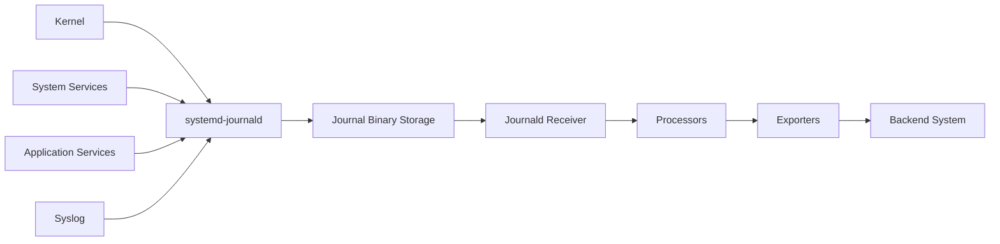

# How to Configure the Journald Receiver in the OpenTelemetry Collector

Author: [nawazdhandala](https://www.github.com/nawazdhandala)

Tags: OpenTelemetry, Collector, Journald, Receiver, Linux, Systemd Logs

Description: Configure the Journald Receiver to collect systemd logs from Linux systems, filter by units, and integrate system logs into OpenTelemetry pipelines.

The Journald Receiver collects logs directly from systemd's journal on Linux systems. Instead of parsing text files, it queries the binary journal database using the journald API, providing efficient access to system logs with rich metadata. This receiver is essential for monitoring modern Linux systems where systemd manages services and captures all system and service logs.

## Why Journald Matters

Traditional syslog wrote logs to text files in `/var/log/`. While simple, this approach had limitations: no structured metadata, difficult log rotation, and poor performance with high log volumes. Systemd's journal addresses these issues with a binary log format that includes extensive metadata for each log entry.

The journal captures logs from multiple sources:

- Kernel messages (previously in `/var/log/kern.log`)
- System services managed by systemd
- Application stdout/stderr when running as systemd services
- Syslog messages forwarded through systemd-journald
- Audit logs from the Linux audit subsystem

For modern Linux distributions using systemd (Ubuntu 16.04+, RHEL 7+, Debian 8+, Fedora, Arch, etc.), the journal is the primary logging mechanism. Collecting these logs provides visibility into system behavior, service health, and security events.

## How Journald Works

Systemd-journald receives logs from multiple sources and stores them in a binary format at `/var/log/journal/` or `/run/log/journal/`. Each log entry includes:

- Message content
- Priority level (from kernel/syslog)
- Timestamp with microsecond precision
- Service/unit name
- Process ID and command line
- User ID and group ID
- System identifiers (hostname, boot ID, machine ID)
- Custom fields added by the application

The Journald Receiver uses the journal's C API (via CGO) to query these logs, filter by criteria, and transform them into OpenTelemetry log format. This approach is more efficient than parsing text because the journal maintains indexes for fast querying.

## Architecture Overview

Here's how the Journald Receiver integrates with the collector:



## Basic Configuration

Start with a simple configuration that collects all journal entries:

```yaml
# Basic Journald Receiver configuration
# Collects all journal entries from the current boot
receivers:
  journald:
    directory: /var/log/journal
    units:
      - all

processors:
  batch:
    timeout: 10s

exporters:
  logging:
    loglevel: debug

service:
  pipelines:
    logs:
      receivers: [journald]
      processors: [batch]
      exporters: [logging]
```

This configuration reads from the default journal location and collects logs from all systemd units. The receiver starts from the end of the journal, processing only new entries.

## Directory Configuration

The journal stores logs in different locations depending on configuration:

```yaml
# Specify journal storage location
# Persistent storage vs volatile (RAM-based) storage
receivers:
  journald:
    # Persistent journal (survives reboots)
    directory: /var/log/journal

    # Alternative: Volatile journal (cleared on reboot)
    # directory: /run/log/journal
```

Most distributions configure persistent storage at `/var/log/journal/`. If this directory doesn't exist, the journal stores logs in `/run/log/journal/`, which is cleared on reboot. Check your system's configuration:

```bash
# Check journal storage location
journalctl --disk-usage
```

## Filtering by Units

Collect logs only from specific systemd services:

```yaml
# Filter journal entries by systemd unit
# Reduces log volume by focusing on relevant services
receivers:
  journald:
    directory: /var/log/journal
    units:
      - nginx.service
      - postgresql.service
      - myapp.service
```

This configuration collects logs only from the specified units. The receiver ignores logs from other services, reducing processing overhead and metric cardinality.

Unit names must match exactly as they appear in journalctl. Check available units:

```bash
# List all systemd units
systemctl list-units --type=service

# View logs for a specific unit
journalctl -u nginx.service
```

## Priority Filtering

Filter by log priority (severity):

```yaml
# Collect only logs at or above a certain priority
# Maps to syslog severity levels
receivers:
  journald:
    directory: /var/log/journal
    units:
      - all

    # Priority levels: emerg, alert, crit, err, warning, notice, info, debug
    # This collects warning and above (ignores info and debug)
    priority: warning
```

Priority levels correspond to syslog severity:

- `emerg` (0): System is unusable
- `alert` (1): Action must be taken immediately
- `crit` (2): Critical conditions
- `err` (3): Error conditions
- `warning` (4): Warning conditions
- `notice` (5): Normal but significant condition
- `info` (6): Informational messages
- `debug` (7): Debug-level messages

Setting `priority: warning` collects all messages at warning level or higher (warning, err, crit, alert, emerg). This helps reduce log volume in production while maintaining visibility into issues.

## Start Position

Control where the receiver begins reading:

```yaml
# Define where to start reading journal entries
receivers:
  journald:
    directory: /var/log/journal
    units:
      - all

    # Options: 'end' or 'beginning'
    # 'end': Only process new entries (default)
    # 'beginning': Process all existing entries from this boot
    start_at: end
```

Use `end` in production to avoid reprocessing old logs. The receiver maintains a cursor position so it resumes from where it left off after a restart.

Use `beginning` for initial deployment to backfill recent logs, or when troubleshooting issues that occurred before the collector started.

## Identifier Filtering

Filter logs by process, user, or other identifiers:

```yaml
# Advanced filtering by various identifiers
# Useful for focusing on specific processes or users
receivers:
  journald:
    directory: /var/log/journal

    # Filter by systemd unit
    units:
      - myapp.service

    # Alternatively, use matches for more complex filtering
    # matches:
    #   # Filter by syslog identifier
    #   - _SYSLOG_IDENTIFIER=myapp
    #
    #   # Filter by process ID
    #   - _PID=1234
    #
    #   # Filter by user ID
    #   - _UID=1000
```

The `matches` parameter uses journald's field matching syntax. Each match is an AND condition. Common fields include:

- `_SYSTEMD_UNIT`: Systemd unit name
- `_PID`: Process ID
- `_UID`: User ID
- `_GID`: Group ID
- `_HOSTNAME`: Hostname
- `_SYSLOG_IDENTIFIER`: Syslog program name
- `_COMM`: Command name
- `PRIORITY`: Message priority

## Working with Journal Fields

The journal includes extensive metadata. Here's how it maps to OpenTelemetry:

```yaml
# Journal fields are automatically mapped to log attributes
# Understanding this mapping helps with downstream processing
receivers:
  journald:
    directory: /var/log/journal
    units:
      - all

processors:
  # Access journal fields as log attributes
  attributes:
    actions:
      # Journal MESSAGE field becomes log body
      - key: body
        action: insert

      # Add journal fields as attributes
      - key: systemd.unit
        from_attribute: _SYSTEMD_UNIT
        action: upsert

      - key: process.pid
        from_attribute: _PID
        action: upsert

      - key: process.command
        from_attribute: _COMM
        action: upsert
```

Key journal fields automatically available:

- `MESSAGE`: Log message text (becomes log body)
- `_SYSTEMD_UNIT`: Systemd unit name
- `_PID`: Process ID
- `_COMM`: Command name
- `_CMDLINE`: Full command line
- `_HOSTNAME`: Hostname
- `_BOOT_ID`: Boot session identifier
- `_MACHINE_ID`: Unique machine identifier
- `PRIORITY`: Priority level
- `SYSLOG_FACILITY`: Syslog facility code

## Priority Mapping

The receiver automatically maps journal priority to OpenTelemetry severity:

```yaml
# Priority to severity mapping happens automatically
# This shows the mapping for reference
receivers:
  journald:
    directory: /var/log/journal
    units:
      - all

    # Journal priority -> OpenTelemetry severity
    # 0 (emerg)   -> Fatal (21)
    # 1 (alert)   -> Fatal (21)
    # 2 (crit)    -> Fatal (21)
    # 3 (err)     -> Error (17)
    # 4 (warning) -> Warn (13)
    # 5 (notice)  -> Info (9)
    # 6 (info)    -> Info (9)
    # 7 (debug)   -> Debug (5)
```

This automatic mapping ensures consistent severity levels across your observability pipeline, regardless of the original log source.

## Collecting Kernel Logs

The journal captures kernel messages (dmesg):

```yaml
# Collect kernel messages from the journal
# Useful for monitoring hardware issues, driver problems, OOM kills
receivers:
  journald:
    directory: /var/log/journal
    units:
      - kernel

    # Only collect errors and above from kernel
    priority: err

processors:
  attributes:
    actions:
      # Tag kernel messages for easier filtering
      - key: log.source
        value: kernel
        action: insert
```

Kernel logs provide critical visibility into hardware failures, out-of-memory conditions, and driver issues. These logs are essential for root cause analysis when applications fail due to infrastructure problems.

## Audit Log Collection

On systems with auditd, the journal can include audit events:

```yaml
# Collect Linux audit logs from the journal
# Tracks security events, file access, authentication
receivers:
  journald:
    directory: /var/log/journal

    matches:
      # Collect only audit messages
      - _TRANSPORT=audit

processors:
  attributes:
    actions:
      - key: log.type
        value: audit
        action: insert
```

Audit logs track security-relevant events like authentication attempts, file access, and permission changes. Integrating these into your observability pipeline helps with security monitoring and compliance.

## Multi-Unit Collection

Collect from multiple services with different configurations:

```yaml
# Use multiple receivers for different unit groups
# Allows different processing per service type
receivers:
  # Web services logs
  journald/web:
    directory: /var/log/journal
    units:
      - nginx.service
      - apache2.service
    priority: info

  # Database logs
  journald/database:
    directory: /var/log/journal
    units:
      - postgresql.service
      - mysql.service
      - redis.service
    priority: warning

  # Application logs
  journald/app:
    directory: /var/log/journal
    units:
      - myapp.service
    priority: debug

processors:
  batch:
    timeout: 10s

  # Add service type labels
  attributes/web:
    actions:
      - key: service.type
        value: web
        action: insert

  attributes/database:
    actions:
      - key: service.type
        value: database
        action: insert

  attributes/app:
    actions:
      - key: service.type
        value: application
        action: insert

exporters:
  otlp:
    endpoint: https://backend.example.com:4317

service:
  pipelines:
    # Separate pipeline for each service type
    logs/web:
      receivers: [journald/web]
      processors: [attributes/web, batch]
      exporters: [otlp]

    logs/database:
      receivers: [journald/database]
      processors: [attributes/database, batch]
      exporters: [otlp]

    logs/app:
      receivers: [journald/app]
      processors: [attributes/app, batch]
      exporters: [otlp]
```

This pattern allows different processing and routing for different service types. Web services might need info-level logs, while databases only need warnings. Application logs might include debug information during troubleshooting.

## Resource Attributes

Add resource attributes to identify the log source:

```yaml
# Attach resource attributes to all journal logs
# Helps identify source in multi-host environments
receivers:
  journald:
    directory: /var/log/journal
    units:
      - all

processors:
  resource:
    attributes:
      - key: host.name
        value: ${HOSTNAME}
        action: insert

      - key: deployment.environment
        value: production
        action: insert

      - key: log.source
        value: journald
        action: insert

exporters:
  otlp:
    endpoint: https://backend.example.com:4317

service:
  pipelines:
    logs:
      receivers: [journald]
      processors: [resource]
      exporters: [otlp]
```

Resource attributes apply to all logs from this receiver and typically represent the entity producing the logs (host, environment, source system).

## Performance Considerations

The Journald Receiver is generally efficient, but large journals can impact performance:

```yaml
# Optimize for high-volume journal collection
receivers:
  journald:
    directory: /var/log/journal
    units:
      - all

    # Start at end to avoid processing old logs
    start_at: end

    # Filter by priority to reduce volume
    priority: info

processors:
  # Batch aggressively for efficiency
  batch:
    timeout: 5s
    send_batch_size: 8192
    send_batch_max_size: 16384

  # Limit memory usage
  memory_limiter:
    check_interval: 1s
    limit_mib: 512

exporters:
  otlp:
    endpoint: https://backend.example.com:4317
    compression: gzip

service:
  pipelines:
    logs:
      receivers: [journald]
      processors: [memory_limiter, batch]
      exporters: [otlp]
```

Large batch sizes reduce the frequency of export operations, improving throughput. Compression reduces network bandwidth usage.

## Cursor Persistence

The receiver maintains its position in the journal using a cursor. This cursor persists across collector restarts:

```yaml
# Cursor persistence is automatic
# The receiver remembers its position in the journal
receivers:
  journald:
    directory: /var/log/journal
    units:
      - all

    # Receiver stores cursor in collector state
    # No configuration needed for persistence
```

The cursor ensures you don't lose or duplicate logs during collector restarts. The receiver stores the cursor in its internal state directory, typically `/var/lib/otelcol/`.

## Combining with File-Based Logs

Use both Journald and Filelog receivers for comprehensive log collection:

```yaml
# Collect both systemd journal and application file logs
receivers:
  # Systemd journal for system services
  journald:
    directory: /var/log/journal
    units:
      - nginx.service
      - postgresql.service

  # File logs for applications not using systemd
  filelog:
    include:
      - /var/log/myapp/*.log
    operators:
      - type: json_parser

processors:
  batch:
    timeout: 10s

exporters:
  otlp:
    endpoint: https://backend.example.com:4317

service:
  pipelines:
    logs:
      receivers: [journald, filelog]
      processors: [batch]
      exporters: [otlp]
```

This configuration covers both systemd-managed services (via journal) and traditional file-based logs, providing complete visibility into your system.

## Kubernetes DaemonSet Deployment

Deploy the Journald Receiver as a DaemonSet to collect logs from all nodes:

```yaml
# DaemonSet configuration for Kubernetes
# Mounts host journal directory into collector pods
apiVersion: apps/v1
kind: DaemonSet
metadata:
  name: otel-collector-journald
  namespace: observability
spec:
  selector:
    matchLabels:
      app: otel-collector-journald
  template:
    metadata:
      labels:
        app: otel-collector-journald
    spec:
      serviceAccountName: otel-collector
      containers:
      - name: otel-collector
        image: otel/opentelemetry-collector-contrib:latest
        volumeMounts:
        # Mount host journal directory
        - name: journal
          mountPath: /var/log/journal
          readOnly: true
        # Mount collector config
        - name: config
          mountPath: /etc/otelcol
      volumes:
      - name: journal
        hostPath:
          path: /var/log/journal
      - name: config
        configMap:
          name: otel-collector-config
```

The DaemonSet runs one collector pod per node, each collecting that node's journal. The host path mount provides read-only access to the journal.

## Complete Production Example

Here's a production-ready configuration:

```yaml
# Production Journald Receiver configuration
# Optimized for real-world use with filtering and resource attributes
receivers:
  # System and infrastructure logs
  journald/system:
    directory: /var/log/journal
    units:
      - sshd.service
      - systemd-networkd.service
      - systemd-resolved.service
    priority: warning
    start_at: end

  # Application service logs
  journald/app:
    directory: /var/log/journal
    units:
      - myapp.service
      - worker.service
    priority: info
    start_at: end

  # Kernel logs for hardware monitoring
  journald/kernel:
    directory: /var/log/journal
    units:
      - kernel
    priority: err
    start_at: end

processors:
  # Add resource attributes for system logs
  resource/system:
    attributes:
      - key: log.category
        value: system
        action: insert
      - key: host.name
        value: ${HOSTNAME}
        action: insert

  # Add resource attributes for app logs
  resource/app:
    attributes:
      - key: log.category
        value: application
        action: insert
      - key: host.name
        value: ${HOSTNAME}
        action: insert
      - key: service.name
        value: myapp
        action: insert

  # Add resource attributes for kernel logs
  resource/kernel:
    attributes:
      - key: log.category
        value: kernel
        action: insert
      - key: host.name
        value: ${HOSTNAME}
        action: insert

  # Batch processing for efficiency
  batch:
    timeout: 10s
    send_batch_size: 4096

  # Memory limit protection
  memory_limiter:
    check_interval: 1s
    limit_mib: 512

exporters:
  otlp:
    endpoint: ${OTLP_ENDPOINT}
    compression: gzip
    retry_on_failure:
      enabled: true
      initial_interval: 5s
      max_interval: 30s

service:
  pipelines:
    logs/system:
      receivers: [journald/system]
      processors: [resource/system, memory_limiter, batch]
      exporters: [otlp]

    logs/app:
      receivers: [journald/app]
      processors: [resource/app, memory_limiter, batch]
      exporters: [otlp]

    logs/kernel:
      receivers: [journald/kernel]
      processors: [resource/kernel, memory_limiter, batch]
      exporters: [otlp]
```

## Troubleshooting

### No Logs Appearing

Check these issues:

1. Verify journal directory exists: `ls -la /var/log/journal/`
2. Check permissions: Collector needs read access to journal files
3. Verify units exist: `systemctl list-units | grep <your-unit>`
4. Check start position: Using `start_at: end` means only new logs appear
5. Review collector logs for errors

### Permission Denied Errors

The journal requires specific permissions:

```bash
# Add collector user to systemd-journal group
sudo usermod -aG systemd-journal otelcol

# Or run collector with capabilities
sudo setcap 'cap_dac_read_search+eip' /usr/local/bin/otelcol
```

In containers, run with the appropriate security context:

```yaml
securityContext:
  runAsUser: 0  # Root user for journal access
  # Or mount journal with appropriate permissions
```

### High Memory Usage

If the receiver consumes excessive memory:

1. Add the `memory_limiter` processor
2. Increase batch timeout to reduce processing frequency
3. Filter by priority to reduce log volume
4. Filter by specific units instead of collecting all logs

## Next Steps

The Journald Receiver integrates systemd logs into OpenTelemetry. For complete observability:

1. Use the [OpenTelemetry Collector](https://oneuptime.com/blog/post/2025-09-18-what-is-opentelemetry-collector-and-why-use-one/view) in gateway mode for centralized processing
2. Monitor [collector internal metrics](https://oneuptime.com/blog/post/2025-01-22-how-to-collect-opentelemetry-collector-internal-metrics/view) to track log throughput
3. Combine with other receivers (Filelog, Kubernetes Events) for comprehensive log collection
4. Set up alerting based on systemd service failures and kernel errors

The journal provides a unified view of everything happening on your Linux system. By collecting these logs with the Journald Receiver, you gain visibility into system behavior, service health, and security events, all integrated into your existing observability platform.
