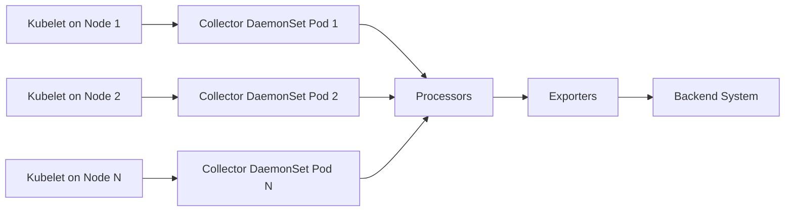

# How to Configure the Kubelet Stats Receiver in the OpenTelemetry Collector

Author: [nawazdhandala](https://www.github.com/nawazdhandala)

Tags: OpenTelemetry, Collector, Kubelet, Stats, Receiver, Kubernetes, Pods

Description: Configure the Kubelet Stats Receiver to collect detailed pod and container resource metrics including CPU, memory, network, and filesystem usage from Kubernetes nodes.

The Kubelet Stats Receiver collects resource usage metrics directly from the Kubelet on each Kubernetes node. It provides detailed CPU, memory, network, and filesystem metrics for pods, containers, and nodes. This receiver is essential for understanding actual resource consumption, identifying resource-constrained workloads, and rightsizing container requests and limits.

## Understanding Kubelet Metrics

Every Kubernetes node runs a Kubelet, which manages pods and containers on that node. The Kubelet exposes a `/stats/summary` endpoint that provides real-time resource usage data for:

- Node-level resource consumption (total CPU, memory, disk usage)
- Pod-level aggregate metrics (total resources used by all containers in a pod)
- Container-level detailed metrics (per-container CPU, memory, restarts)
- Volume metrics (persistent volume usage)

Unlike the Kubernetes Cluster Receiver which reports desired state (how many replicas should exist), the Kubelet Stats Receiver reports actual resource consumption (how much CPU and memory pods are actually using right now).

## Architecture Overview

Here's how the Kubelet Stats Receiver works:



The receiver runs as a DaemonSet, with one collector pod per node. Each collector queries the local Kubelet's stats endpoint to gather metrics for all pods on that node.

## Basic Configuration

Start with a minimal configuration:

```yaml
# Basic Kubelet Stats Receiver configuration
# Collects metrics from the local node's Kubelet
receivers:
  kubeletstats:
    # Authentication method
    auth_type: serviceAccount

    # Kubelet endpoint (use node IP)
    endpoint: https://${K8S_NODE_IP}:10250

    # Skip TLS verification (not recommended for production)
    insecure_skip_verify: true

    # Collection interval
    collection_interval: 30s

    # Metric groups to collect
    metric_groups:
      - node
      - pod
      - container

processors:
  batch:
    timeout: 10s

exporters:
  logging:
    loglevel: debug

service:
  pipelines:
    metrics:
      receivers: [kubeletstats]
      processors: [batch]
      exporters: [logging]
```

The `K8S_NODE_IP` environment variable is typically set by Kubernetes' downward API, allowing each DaemonSet pod to discover its node's IP address.

## Authentication Methods

The receiver supports multiple authentication approaches:

```yaml
# Service account authentication (recommended)
# Uses the pod's mounted service account token
receivers:
  kubeletstats:
    auth_type: serviceAccount
    endpoint: https://${K8S_NODE_IP}:10250
    insecure_skip_verify: true
    collection_interval: 30s
```

```yaml
# TLS certificate authentication
# Uses client certificates for Kubelet authentication
receivers:
  kubeletstats:
    auth_type: tls
    endpoint: https://${K8S_NODE_IP}:10250
    ca_file: /var/run/secrets/kubernetes.io/serviceaccount/ca.crt
    cert_file: /etc/otelcol/certs/tls.crt
    key_file: /etc/otelcol/certs/tls.key
    collection_interval: 30s
```

```yaml
# Kubeconfig authentication (for development)
receivers:
  kubeletstats:
    auth_type: kubeConfig
    endpoint: https://${K8S_NODE_IP}:10250
    collection_interval: 30s
```

In production, use `serviceAccount` authentication with appropriate RBAC permissions. This leverages Kubernetes' built-in security mechanisms.

## Metric Groups

Control which metric categories to collect:

```yaml
# Select specific metric groups to reduce cardinality
# Each group provides different granularity
receivers:
  kubeletstats:
    auth_type: serviceAccount
    endpoint: https://${K8S_NODE_IP}:10250
    insecure_skip_verify: true
    collection_interval: 30s

    # Available metric groups:
    # - node: Node-level metrics (CPU, memory, filesystem, network)
    # - pod: Pod-level aggregate metrics
    # - container: Per-container detailed metrics
    # - volume: Persistent volume usage metrics
    metric_groups:
      - node
      - pod
      - container
      - volume
```

Each metric group increases cardinality:

- `node`: One set of metrics per node (lowest cardinality)
- `pod`: One set per pod (medium cardinality)
- `container`: One set per container (high cardinality)
- `volume`: One set per volume (variable cardinality)

Start with `node` and `pod` for basic monitoring, add `container` when you need detailed per-container visibility.

## Node Metrics

Node-level metrics show overall node resource consumption:

```yaml
# Node metrics provide host-level resource usage
# Useful for capacity planning and node health monitoring
receivers:
  kubeletstats:
    auth_type: serviceAccount
    endpoint: https://${K8S_NODE_IP}:10250
    insecure_skip_verify: true
    collection_interval: 30s
    metric_groups:
      - node

# Example node metrics collected:
# - k8s.node.cpu.usage: CPU usage in cores
# - k8s.node.cpu.utilization: CPU usage percentage
# - k8s.node.memory.usage: Memory usage in bytes
# - k8s.node.memory.available: Available memory
# - k8s.node.memory.working_set: Working set memory (used by kernel for OOM decisions)
# - k8s.node.filesystem.usage: Filesystem usage in bytes
# - k8s.node.filesystem.available: Available filesystem space
# - k8s.node.network.io: Network bytes transmitted/received
```

The `working_set` memory metric is particularly important because Kubernetes uses it to determine when to evict pods due to memory pressure.

## Pod Metrics

Pod-level metrics aggregate resource usage across all containers in a pod:

```yaml
# Pod metrics aggregate container usage within each pod
# Useful for application-level monitoring
receivers:
  kubeletstats:
    auth_type: serviceAccount
    endpoint: https://${K8S_NODE_IP}:10250
    insecure_skip_verify: true
    collection_interval: 30s
    metric_groups:
      - pod

# Example pod metrics collected:
# - k8s.pod.cpu.usage: Total CPU usage for all containers
# - k8s.pod.cpu.utilization: CPU usage percentage vs limits
# - k8s.pod.memory.usage: Total memory usage
# - k8s.pod.memory.working_set: Working set memory
# - k8s.pod.memory.rss: Resident set size
# - k8s.pod.memory.page_faults: Page faults (major and minor)
# - k8s.pod.network.io: Network traffic
# - k8s.pod.network.errors: Network errors
```

Pod metrics help answer questions like "Which pods are consuming the most CPU?" and "Which applications are nearing their memory limits?"

## Container Metrics

Container-level metrics provide the highest granularity:

```yaml
# Container metrics show per-container resource usage
# Highest cardinality but most detailed visibility
receivers:
  kubeletstats:
    auth_type: serviceAccount
    endpoint: https://${K8S_NODE_IP}:10250
    insecure_skip_verify: true
    collection_interval: 30s
    metric_groups:
      - container

# Example container metrics collected:
# - container.cpu.usage: CPU usage per container
# - container.cpu.utilization: CPU usage vs limits
# - container.memory.usage: Memory usage per container
# - container.memory.working_set: Working set memory
# - container.memory.rss: Resident set size
# - container.memory.page_faults: Page faults
# - container.filesystem.usage: Container filesystem usage
# - container.restarts: Container restart count
```

Container metrics are essential for identifying which specific containers in a multi-container pod are consuming resources or experiencing issues.

## Volume Metrics

Volume metrics track persistent volume usage:

```yaml
# Volume metrics monitor persistent volume consumption
# Critical for preventing "disk full" issues
receivers:
  kubeletstats:
    auth_type: serviceAccount
    endpoint: https://${K8S_NODE_IP}:10250
    insecure_skip_verify: true
    collection_interval: 30s
    metric_groups:
      - volume

# Example volume metrics collected:
# - k8s.volume.available: Available bytes in volume
# - k8s.volume.capacity: Total volume capacity
# - k8s.volume.inodes.used: Used inodes
# - k8s.volume.inodes.free: Free inodes
```

Volume metrics help prevent disk space issues that can crash databases and other stateful applications.

## Collection Interval

Choose an appropriate collection interval:

```yaml
# Balance freshness vs overhead
receivers:
  kubeletstats:
    auth_type: serviceAccount
    endpoint: https://${K8S_NODE_IP}:10250
    insecure_skip_verify: true

    # Collection interval options:
    # 10s: High resolution (use for critical workloads)
    # 30s: Standard monitoring (recommended default)
    # 60s: Low overhead (sufficient for most cases)
    collection_interval: 30s
```

Shorter intervals provide better resolution for troubleshooting but increase Kubelet load and metric volume. For production, 30-60 seconds typically provides good balance.

## TLS Configuration

Secure communication with the Kubelet:

```yaml
# Production TLS configuration
# Validates Kubelet certificate for security
receivers:
  kubeletstats:
    auth_type: serviceAccount
    endpoint: https://${K8S_NODE_IP}:10250

    # Validate Kubelet certificate
    insecure_skip_verify: false

    # CA certificate for validation
    ca_file: /var/run/secrets/kubernetes.io/serviceaccount/ca.crt

    collection_interval: 30s
    metric_groups:
      - node
      - pod
      - container
```

In production, avoid `insecure_skip_verify: true`. Instead, configure proper certificate validation. The service account CA certificate is automatically mounted into pods.

## Resource Attributes

The receiver automatically adds Kubernetes metadata:

```yaml
# Automatic metadata enrichment
# These attributes are added automatically to all metrics:
# - k8s.node.name: Node name
# - k8s.namespace.name: Namespace (for pod/container metrics)
# - k8s.pod.name: Pod name (for pod/container metrics)
# - k8s.pod.uid: Pod UID
# - k8s.container.name: Container name (for container metrics)
# - container.id: Container ID
# - container.image.name: Container image
# - container.image.tag: Image tag

# Additional enrichment with processors
processors:
  resource:
    attributes:
      - key: k8s.cluster.name
        value: ${CLUSTER_NAME}
        action: insert

      - key: deployment.environment
        value: production
        action: insert

service:
  pipelines:
    metrics:
      receivers: [kubeletstats]
      processors: [resource]
      exporters: [otlp]
```

These attributes enable filtering and aggregation by namespace, pod, container, or image.

## Kubernetes Attributes Processor

Enhance metrics with additional Kubernetes metadata:

```yaml
# Enrich with deployment, service, and label metadata
receivers:
  kubeletstats:
    auth_type: serviceAccount
    endpoint: https://${K8S_NODE_IP}:10250
    insecure_skip_verify: true
    collection_interval: 30s
    metric_groups:
      - pod
      - container

processors:
  # Add pod metadata from Kubernetes API
  k8sattributes:
    auth_type: serviceAccount
    passthrough: false
    extract:
      metadata:
        - k8s.namespace.name
        - k8s.deployment.name
        - k8s.statefulset.name
        - k8s.daemonset.name
        - k8s.job.name
        - k8s.cronjob.name
        - k8s.replicaset.name
        - k8s.pod.name
        - k8s.pod.uid
        - k8s.node.name
      labels:
        - tag_name: app
          key: app
          from: pod
        - tag_name: version
          key: version
          from: pod

  batch:
    timeout: 10s

exporters:
  otlp:
    endpoint: https://backend.example.com:4317

service:
  pipelines:
    metrics:
      receivers: [kubeletstats]
      processors: [k8sattributes, batch]
      exporters: [otlp]
```

The k8sattributes processor queries the Kubernetes API to add controller names (Deployment, StatefulSet, etc.) and pod labels as metric attributes.

## RBAC Configuration

The receiver needs specific permissions:

```yaml
# ServiceAccount
apiVersion: v1
kind: ServiceAccount
metadata:
  name: otel-collector-kubeletstats
  namespace: observability
---
# ClusterRole for Kubelet stats access
apiVersion: rbac.authorization.k8s.io/v1
kind: ClusterRole
metadata:
  name: otel-collector-kubeletstats
rules:
  # Permission to get node metrics from Kubelet
  - apiGroups: [""]
    resources: ["nodes/stats"]
    verbs: ["get"]

  # Permission to list nodes (for k8sattributes processor)
  - apiGroups: [""]
    resources: ["nodes", "pods"]
    verbs: ["get", "list", "watch"]

  # Permission for k8sattributes processor metadata
  - apiGroups: ["apps"]
    resources: ["replicasets", "deployments", "statefulsets", "daemonsets"]
    verbs: ["get", "list"]

  - apiGroups: ["batch"]
    resources: ["jobs", "cronjobs"]
    verbs: ["get", "list"]
---
# ClusterRoleBinding
apiVersion: rbac.authorization.k8s.io/v1
kind: ClusterRoleBinding
metadata:
  name: otel-collector-kubeletstats
subjects:
  - kind: ServiceAccount
    name: otel-collector-kubeletstats
    namespace: observability
roleRef:
  kind: ClusterRole
  name: otel-collector-kubeletstats
  apiGroup: rbac.authorization.k8s.io
```

The `nodes/stats` permission is critical. Without it, the Kubelet will reject requests from the collector.

## DaemonSet Deployment

Deploy as a DaemonSet to collect from all nodes:

```yaml
# DaemonSet configuration for per-node collection
apiVersion: apps/v1
kind: DaemonSet
metadata:
  name: otel-collector-kubeletstats
  namespace: observability
spec:
  selector:
    matchLabels:
      app: otel-collector-kubeletstats
  template:
    metadata:
      labels:
        app: otel-collector-kubeletstats
    spec:
      serviceAccountName: otel-collector-kubeletstats
      hostNetwork: true  # Access Kubelet on node network
      containers:
      - name: otel-collector
        image: otel/opentelemetry-collector-contrib:0.93.0
        args:
          - --config=/etc/otelcol/config.yaml
        env:
          # Downward API provides node IP
          - name: K8S_NODE_IP
            valueFrom:
              fieldRef:
                fieldPath: status.hostIP
          - name: K8S_NODE_NAME
            valueFrom:
              fieldRef:
                fieldPath: spec.nodeName
          - name: CLUSTER_NAME
            value: production-cluster
        resources:
          requests:
            memory: 128Mi
            cpu: 50m
          limits:
            memory: 256Mi
            cpu: 200m
        volumeMounts:
        - name: config
          mountPath: /etc/otelcol
      volumes:
      - name: config
        configMap:
          name: otel-collector-kubeletstats-config
```

The `hostNetwork: true` setting allows the collector to reach the Kubelet's secure port on `localhost:10250`. The downward API injects the node's IP address as an environment variable.

## Filtering Namespaces

Exclude system namespaces to reduce metric volume:

```yaml
# Filter out system namespace metrics
receivers:
  kubeletstats:
    auth_type: serviceAccount
    endpoint: https://${K8S_NODE_IP}:10250
    insecure_skip_verify: true
    collection_interval: 30s
    metric_groups:
      - pod
      - container

processors:
  filter:
    metrics:
      exclude:
        match_type: regexp
        resource_attributes:
          - key: k8s.namespace.name
            value: ^(kube-system|kube-public|kube-node-lease)$

  batch:
    timeout: 10s

exporters:
  otlp:
    endpoint: https://backend.example.com:4317

service:
  pipelines:
    metrics:
      receivers: [kubeletstats]
      processors: [filter, batch]
      exporters: [otlp]
```

This dramatically reduces metric cardinality by excluding metrics from system pods that are typically monitored through other means.

## Calculating CPU Utilization

CPU metrics need interpretation:

```yaml
# CPU metrics explained
# - k8s.pod.cpu.usage: Actual CPU time used (cumulative counter)
# - k8s.pod.cpu.utilization: Usage as percentage of limits

# CPU utilization calculation:
# utilization = (current_usage - previous_usage) / (time_elapsed * num_cores)

# With limits:
# utilization_vs_limit = (usage / limit) * 100

# The receiver provides utilization metrics automatically
# These metrics are gauge values (0-1 range, or 0-100%)
```

CPU usage is a cumulative counter (total CPU seconds consumed). To get current CPU usage rate, you need to calculate the derivative (change over time). The receiver does this automatically for utilization metrics.

## Memory Metrics Interpretation

Memory metrics have specific meanings:

```yaml
# Memory metric definitions

# k8s.pod.memory.usage
# Total memory allocated by containers
# Includes cache and buffers
# Not used for OOM decisions

# k8s.pod.memory.working_set
# Active memory used by processes
# Excludes inactive cache
# THIS is what Kubernetes uses for OOM decisions
# Alert on this metric, not usage

# k8s.pod.memory.rss
# Resident set size (anonymous memory)
# Actual RAM used by processes
# Does not include cache

# k8s.pod.memory.page_faults
# Major: Required disk I/O (slow)
# Minor: Resolved without I/O (fast)
# High major page faults indicate memory pressure
```

The `working_set` metric is critical. When a pod's working set exceeds its memory limit, Kubernetes kills it with an OOMKilled status.

## Network Metrics

Track network I/O per pod:

```yaml
# Network metrics show traffic patterns
receivers:
  kubeletstats:
    auth_type: serviceAccount
    endpoint: https://${K8S_NODE_IP}:10250
    insecure_skip_verify: true
    collection_interval: 30s
    metric_groups:
      - pod

# Example network metrics:
# - k8s.pod.network.io{direction="receive"}: Bytes received
# - k8s.pod.network.io{direction="transmit"}: Bytes transmitted
# - k8s.pod.network.errors{direction="receive"}: Receive errors
# - k8s.pod.network.errors{direction="transmit"}: Transmit errors

# Useful for:
# - Identifying chatty services
# - Detecting network issues
# - Capacity planning for network bandwidth
```

Network metrics help identify pods generating excessive traffic or experiencing network problems.

## Complete Production Configuration

Here's a production-ready configuration:

```yaml
# Production Kubelet Stats Receiver configuration
# Optimized for real-world Kubernetes monitoring
receivers:
  kubeletstats:
    auth_type: serviceAccount
    endpoint: https://${K8S_NODE_IP}:10250

    # Validate certificates in production
    insecure_skip_verify: false
    ca_file: /var/run/secrets/kubernetes.io/serviceaccount/ca.crt

    collection_interval: 30s

    # Collect all metric groups for comprehensive visibility
    metric_groups:
      - node
      - pod
      - container
      - volume

processors:
  # Filter system namespaces
  filter:
    metrics:
      exclude:
        match_type: regexp
        resource_attributes:
          - key: k8s.namespace.name
            value: ^(kube-system|kube-public|kube-node-lease)$

  # Add Kubernetes metadata
  k8sattributes:
    auth_type: serviceAccount
    passthrough: false
    extract:
      metadata:
        - k8s.namespace.name
        - k8s.deployment.name
        - k8s.statefulset.name
        - k8s.daemonset.name
        - k8s.pod.name
        - k8s.node.name
      labels:
        - tag_name: app
          key: app
          from: pod
        - tag_name: version
          key: version
          from: pod
        - tag_name: team
          key: team
          from: pod

  # Add cluster context
  resource:
    attributes:
      - key: k8s.cluster.name
        value: ${CLUSTER_NAME}
        action: insert

      - key: deployment.environment
        value: ${ENVIRONMENT}
        action: insert

  # Batch for efficiency
  batch:
    timeout: 10s
    send_batch_size: 2048

  # Memory protection
  memory_limiter:
    check_interval: 1s
    limit_mib: 256

exporters:
  otlp:
    endpoint: ${OTLP_ENDPOINT}
    compression: gzip
    retry_on_failure:
      enabled: true
      initial_interval: 5s
      max_interval: 30s

service:
  pipelines:
    metrics:
      receivers: [kubeletstats]
      processors: [filter, k8sattributes, resource, memory_limiter, batch]
      exporters: [otlp]

  # Collector self-monitoring
  telemetry:
    logs:
      level: info
    metrics:
      level: detailed
      address: localhost:8888
```

## Key Metrics for Alerting

Set up alerts on these critical metrics:

```yaml
# Critical alerts based on Kubelet Stats metrics

# Pod memory near limit
# k8s.pod.memory.working_set / k8s.pod.memory.limit > 0.9
# Alert when pod uses >90% of memory limit

# Container CPU throttling
# rate(container.cpu.throttling_time[5m]) > 0
# Alert when containers are being CPU throttled

# Pod network errors
# rate(k8s.pod.network.errors[5m]) > 10
# Alert on sustained network errors

# Volume near capacity
# k8s.volume.available / k8s.volume.capacity < 0.1
# Alert when volume <10% free space

# High container restart rate
# rate(container.restarts[5m]) > 0.1
# Alert on frequent container restarts

# Node filesystem pressure
# k8s.node.filesystem.available / k8s.node.filesystem.capacity < 0.1
# Alert when node filesystem <10% free
```

## Troubleshooting

### No Metrics Appearing

Check these issues:

1. Verify RBAC permissions: `kubectl auth can-i get nodes/stats --as=system:serviceaccount:observability:otel-collector-kubeletstats`
2. Check Kubelet endpoint accessibility from pod
3. Verify `K8S_NODE_IP` environment variable is set correctly
4. Review collector logs for authentication errors
5. Ensure DaemonSet is running on all nodes

### Certificate Validation Errors

If you see TLS certificate errors:

```yaml
# Temporary fix for development
receivers:
  kubeletstats:
    insecure_skip_verify: true

# Production fix
receivers:
  kubeletstats:
    insecure_skip_verify: false
    ca_file: /var/run/secrets/kubernetes.io/serviceaccount/ca.crt
```

### High Cardinality Issues

If metric cardinality is too high:

1. Filter out system namespaces
2. Exclude container metrics (use only pod-level)
3. Reduce label extraction in k8sattributes processor
4. Increase collection interval

### Missing Node Metrics

If node-level metrics are missing:

1. Verify `node` is in `metric_groups`
2. Check Kubelet `/stats/summary` endpoint is accessible
3. Verify Kubelet is running on the node
4. Check Kubelet configuration allows stats endpoint access

## Use Cases

### Resource Optimization

Kubelet Stats helps rightsize containers:

- Compare actual CPU/memory usage against requests/limits
- Identify over-provisioned pods wasting resources
- Detect under-provisioned pods getting throttled or OOMKilled

### Capacity Planning

Track resource trends over time:

- CPU and memory usage patterns by application
- Volume growth rates for capacity forecasting
- Network bandwidth consumption

### Performance Troubleshooting

Diagnose performance issues:

- High CPU usage or throttling
- Memory pressure and OOMKills
- Network errors or high latency
- Disk I/O bottlenecks

## Next Steps

The Kubelet Stats Receiver provides pod and container resource metrics. For complete Kubernetes observability:

1. Use the [OpenTelemetry Collector](https://oneuptime.com/blog/post/2025-09-18-what-is-opentelemetry-collector-and-why-use-one/view) in gateway mode for centralized aggregation
2. Monitor [collector internal metrics](https://oneuptime.com/blog/post/2025-01-22-how-to-collect-opentelemetry-collector-internal-metrics/view) to ensure reliability
3. Combine with Kubernetes Cluster Receiver for cluster-level metrics
4. Add Kubernetes Events Receiver for event correlation
5. Deploy Prometheus-compatible dashboards to visualize metrics

The Kubelet Stats Receiver provides the foundation for Kubernetes resource monitoring. By collecting actual resource consumption data, you gain visibility into how your applications really behave in production, enabling data-driven decisions about resource allocation and capacity planning.
