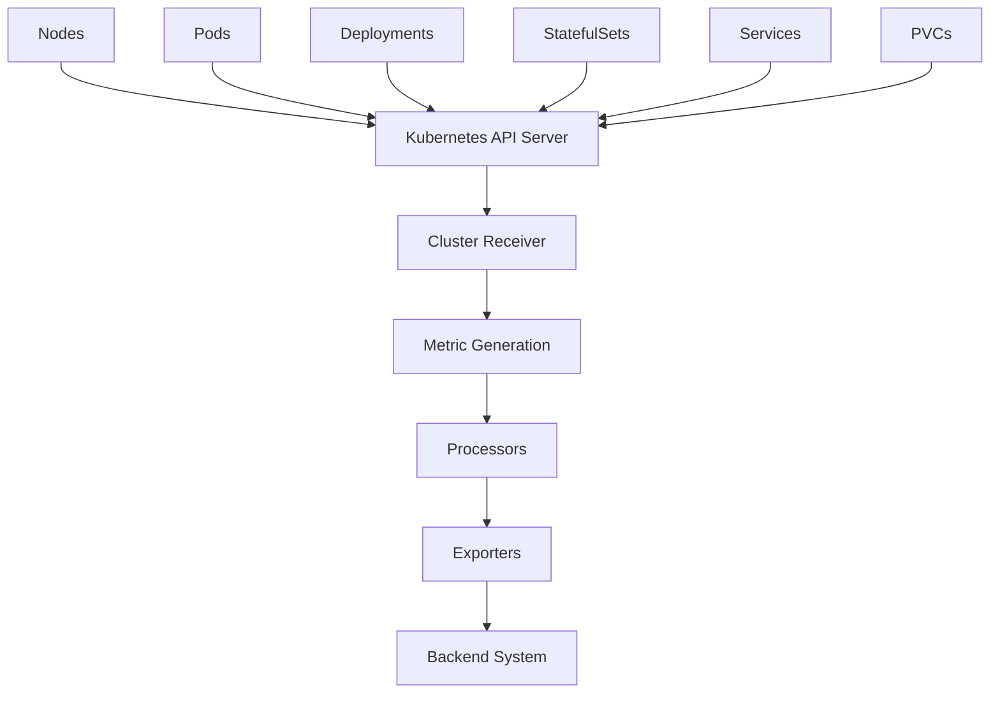

# How to Configure the Kubernetes Cluster Receiver in the OpenTelemetry Collector

Author: [nawazdhandala](https://www.github.com/nawazdhandala)

Tags: OpenTelemetry, Collector, Kubernetes, Cluster, Receiver, Metric

Description: Configure the Kubernetes Cluster Receiver to collect cluster-level metrics including node status, pod phases, deployments, and resource allocations.

The Kubernetes Cluster Receiver collects metrics about the overall state of your Kubernetes cluster. Unlike the Kubelet Stats Receiver which focuses on pod and container resource usage, the Cluster Receiver provides a bird's-eye view: how many nodes are ready, how many pods are running, deployment replica counts, namespace resource quotas, and persistent volume claim states. These metrics are essential for cluster health monitoring and capacity planning.

## Cluster Metrics vs Node Metrics

The Kubernetes ecosystem has several metric sources:

- **Kubelet Stats**: Resource usage per pod and container (CPU, memory, network, disk)
- **Cluster Receiver**: Cluster state metrics (node count, pod phases, replica status)
- **Node Exporter**: Host-level metrics (hardware, OS metrics)
- **kube-state-metrics**: Original cluster metrics solution; the Cluster Receiver provides a Collector-native alternative

The Cluster Receiver collects metrics from the Kubernetes API server about cluster objects, not from individual nodes. It watches resources like Nodes, Pods, Deployments, ReplicaSets, StatefulSets, DaemonSets, Jobs, CronJobs, and more, converting their state into OpenTelemetry metrics.

## Architecture Overview

Here's how the Cluster Receiver works:


```mermaid
graph TB
    A[Kubernetes API Server] --> B[Cluster Receiver]

    C[Nodes] --> A
    D[Pods] --> A
    E[Deployments] --> A
    F[StatefulSets] --> A
    G[Services] --> A
    H[PVCs] --> A

    B --> I[Metric Generation]
    I --> J[Processors]
    J --> K[Exporters]
    K --> L[Backend System]
```

The receiver establishes a watch on multiple Kubernetes resource types and generates metrics based on their current state.

## Basic Configuration

Start with a minimal configuration:

```yaml
# Basic Kubernetes Cluster Receiver configuration

# Requires RBAC permissions to list and watch cluster resources
receivers:
  k8s_cluster:
    # Authentication method
    auth_type: serviceAccount

    # How often to collect metrics
    collection_interval: 30s

processors:
  batch:
    timeout: 10s

exporters:
  debug:
    verbosity: detailed

service:
  pipelines:
    metrics:
      receivers: [k8s_cluster]
      processors: [batch]
      exporters: [debug]
```

This configuration collects cluster metrics every 30 seconds using the pod's service account for authentication.

## Authentication Methods

The receiver supports multiple authentication approaches:

```yaml
# Service account authentication (recommended for in-cluster deployment)
receivers:
  k8s_cluster:
    auth_type: serviceAccount
    collection_interval: 30s
```

```yaml
# Kubeconfig authentication (for development or external deployment)
receivers:
  k8s_cluster:
    auth_type: kubeConfig
    collection_interval: 30s
```

In production, deploy the collector inside your cluster and use `serviceAccount` authentication. This provides automatic credential management and follows Kubernetes security best practices.

## Collection Interval

Choose an appropriate collection interval:

```yaml
# Collection interval determines metric freshness vs load
receivers:
  k8s_cluster:
    auth_type: serviceAccount

    # Options based on your needs:
    # 10s: High-resolution monitoring (higher API server load)
    # 30s: Standard monitoring (recommended)
    # 60s: Low-overhead monitoring (sufficient for most cases)
    # 300s: Minimal overhead (trend analysis only)
    collection_interval: 30s
```

The collection interval controls how often watched state is emitted as metrics. The receiver still watches multiple resource types through the Kubernetes API, so very large clusters should use reasonable metric and metadata collection intervals. For most production clusters, 30-60 seconds provides good balance.

## Node Metrics Configuration

Control which node metrics to collect:

```yaml
# Configure node condition and resource reporting
receivers:
  k8s_cluster:
    auth_type: serviceAccount
    collection_interval: 30s

    # Node conditions to monitor
    node_conditions_to_report:
      - Ready            # Is node ready to accept pods
      - MemoryPressure   # Is node experiencing memory pressure
      - DiskPressure     # Is node experiencing disk pressure
      - PIDPressure      # Is node running out of PIDs
      - NetworkUnavailable  # Is node network properly configured

    # Resource allocation types to report
    allocatable_types_to_report:
      - cpu
      - memory
      - ephemeral-storage
      - pods
```

Node conditions provide binary status (true/false) about node health. The receiver generates a metric with value 1 when a condition is true, 0 when false. This enables alerting on node issues.

Allocatable resources show what's available for scheduling after accounting for system daemons and Kubernetes components.

Resource Distribution Metrics

Track how resources are distributed across nodes:

```yaml
# Enable detailed resource distribution metrics
receivers:
  k8s_cluster:
    auth_type: serviceAccount
    collection_interval: 30s

    # Collect entity metadata periodically
    metadata_collection_interval: 60s

    node_conditions_to_report:
      - Ready
      - MemoryPressure
      - DiskPressure

    allocatable_types_to_report:
      - cpu
      - memory
```

Resource request and limit metrics help show how workloads are distributed across the cluster, helping identify unbalanced clusters where some nodes are heavily loaded while others sit idle.

## Metric Details

The receiver generates numerous metrics. Here are the most important:

### Node Metrics

```yaml
# Node-related metrics automatically collected
# These help monitor cluster capacity and node health

# k8s.node.condition_ready, k8s.node.condition_memory_pressure, etc.
# Value: 1 (condition true), 0 (condition false), or -1 (condition unknown)
# Labels: node, condition (Ready, MemoryPressure, etc.)
# Indicates node health status

# k8s.node.allocatable_cpu
# k8s.node.allocatable_memory
# k8s.node.allocatable_ephemeral_storage
# k8s.node.allocatable_pods
# Value: Amount of allocatable resource
# Labels: node
# Shows resources available for scheduling
```

### Pod Metrics

```yaml
# Pod state metrics for tracking pod lifecycle

# k8s.pod.phase
# Value: 1 (Pending), 2 (Running), 3 (Succeeded), 4 (Failed), or 5 (Unknown)
# Labels: namespace, pod
# Tracks pod lifecycle state

# k8s.pod.status_reason
# Value: 1 (Evicted), 2 (NodeAffinity), 3 (NodeLost), 4 (Shutdown),
# 5 (UnexpectedAdmissionError), or 6 (Unknown)
# Labels: namespace, pod
# Indicates why pod is in current state
```

### Deployment Metrics

```yaml
# Deployment and replica management metrics

# k8s.deployment.desired
# Value: Number of desired replicas
# Labels: namespace, deployment
# What the deployment should have

# k8s.deployment.available
# Value: Number of available replicas
# Labels: namespace, deployment
# How many replicas are ready and available

```

### ReplicaSet Metrics

```yaml
# ReplicaSet metrics for detailed deployment tracking

# k8s.replicaset.desired
# Value: Desired replica count
# Labels: namespace, replicaset
# Target replica count

# k8s.replicaset.available
# Value: Available replica count
# Labels: namespace, replicaset
# Ready replicas

```

### StatefulSet Metrics

```yaml
# StatefulSet-specific metrics

# k8s.statefulset.desired_pods
# Value: Desired pod count
# Labels: namespace, statefulset
# How many pods should exist

# k8s.statefulset.ready_pods
# Value: Ready pod count
# Labels: namespace, statefulset
# How many pods are ready

# k8s.statefulset.current_pods
# Value: Current pod count
# Labels: namespace, statefulset
# How many pods exist now

# k8s.statefulset.updated_pods
# Value: Updated pod count
# Labels: namespace, statefulset
# How many pods have been updated to current spec
```

### DaemonSet Metrics

```yaml
# DaemonSet metrics for node coverage monitoring

# k8s.daemonset.desired_scheduled_nodes
# Value: Number of nodes that should run this daemon
# Labels: namespace, daemonset
# Target node count

# k8s.daemonset.current_scheduled_nodes
# Value: Number of nodes currently running this daemon
# Labels: namespace, daemonset
# Actual scheduled count

# k8s.daemonset.ready_nodes
# Value: Number of nodes where daemon is ready
# Labels: namespace, daemonset
# Ready daemon count

# k8s.daemonset.misscheduled_nodes
# Value: Number of nodes running daemon that shouldn't
# Labels: namespace, daemonset
# Scheduling errors
```

### Job and CronJob Metrics

```yaml
# Job execution metrics

# k8s.job.active_pods
# Value: Number of active pods
# Labels: namespace, job
# Currently running job pods

# k8s.job.desired_successful_pods
# Value: Desired completions
# Labels: namespace, job
# How many successful completions needed

# k8s.job.failed_pods
# Value: Number of failed pods
# Labels: namespace, job
# Failed attempts

# k8s.job.max_parallel_pods
# Value: Maximum parallelism
# Labels: namespace, job
# Max concurrent pods

# k8s.cronjob.active_jobs
# Value: Number of active jobs
# Labels: namespace, cronjob
# Currently running jobs from this CronJob
```

## RBAC Configuration

The receiver needs extensive read permissions:

```yaml
# ServiceAccount
apiVersion: v1
kind: ServiceAccount
metadata:
  name: otel-collector-cluster
  namespace: observability
---
# ClusterRole with necessary permissions
apiVersion: rbac.authorization.k8s.io/v1
kind: ClusterRole
metadata:
  name: otel-collector-cluster
rules:
  # Node metrics
  - apiGroups: [""]
    resources: ["nodes", "nodes/spec"]
    verbs: ["get", "list", "watch"]

  # Pod metrics
  - apiGroups: [""]
    resources: ["pods", "pods/status"]
    verbs: ["get", "list", "watch"]

  # Namespace metrics
  - apiGroups: [""]
    resources: ["namespaces", "namespaces/status"]
    verbs: ["get", "list", "watch"]

  # ReplicationController metrics
  - apiGroups: [""]
    resources: ["replicationcontrollers", "replicationcontrollers/status"]
    verbs: ["get", "list", "watch"]

  # Event metrics and entity events
  - apiGroups: [""]
    resources: ["events"]
    verbs: ["get", "list", "watch"]

  # Service endpoint metrics
  - apiGroups: ["discovery.k8s.io"]
    resources: ["endpointslices"]
    verbs: ["get", "list", "watch"]

  # Service metrics
  - apiGroups: [""]
    resources: ["services"]
    verbs: ["get", "list", "watch"]

  # ResourceQuota metrics
  - apiGroups: [""]
    resources: ["resourcequotas"]
    verbs: ["get", "list", "watch"]

  # PersistentVolume and PersistentVolumeClaim metrics
  - apiGroups: [""]
    resources: ["persistentvolumes", "persistentvolumeclaims"]
    verbs: ["get", "list", "watch"]

  # Deployment metrics
  - apiGroups: ["apps"]
    resources: ["deployments", "replicasets"]
    verbs: ["get", "list", "watch"]

  # Legacy extensions API metrics
  - apiGroups: ["extensions"]
    resources: ["daemonsets", "deployments", "replicasets"]
    verbs: ["get", "list", "watch"]

  # StatefulSet metrics
  - apiGroups: ["apps"]
    resources: ["statefulsets"]
    verbs: ["get", "list", "watch"]

  # DaemonSet metrics
  - apiGroups: ["apps"]
    resources: ["daemonsets"]
    verbs: ["get", "list", "watch"]

  # Job metrics
  - apiGroups: ["batch"]
    resources: ["jobs", "cronjobs"]
    verbs: ["get", "list", "watch"]

  # HorizontalPodAutoscaler metrics
  - apiGroups: ["autoscaling"]
    resources: ["horizontalpodautoscalers"]
    verbs: ["get", "list", "watch"]
---
# ClusterRoleBinding
apiVersion: rbac.authorization.k8s.io/v1
kind: ClusterRoleBinding
metadata:
  name: otel-collector-cluster
subjects:
  - kind: ServiceAccount
    name: otel-collector-cluster
    namespace: observability
roleRef:
  kind: ClusterRole
  name: otel-collector-cluster
  apiGroup: rbac.authorization.k8s.io
```

These are read-only permissions. The receiver never modifies cluster state.

Resource Filtering

Collect metrics for specific resources:

```yaml
# Disable metric groups you do not need
# Reduces metric volume and cardinality
receivers:
  k8s_cluster:
    auth_type: serviceAccount
    collection_interval: 30s

    metrics:
      k8s.service.endpoint.count:
        enabled: false
      k8s.service.load_balancer.ingress.count:
        enabled: false
      k8s.container.cpu_limit:
        enabled: false
      k8s.container.memory_limit:
        enabled: false
```

If you only care about certain metric groups, disabling metrics reduces the volume generated.

## Namespace Filtering

Focus on specific namespaces:

```yaml
# Monitor specific namespaces only
receivers:
  k8s_cluster:
    auth_type: serviceAccount
    collection_interval: 30s

    # Only watch namespaced resources in these namespaces
    namespaces:
      - production
      - payments

service:
  pipelines:
    metrics:
      receivers: [k8s_cluster]
      exporters: [otlp]
```

Namespace filtering reduces metric volume. When `namespaces` is set, cluster-scoped resources such as Nodes, Namespaces, PersistentVolumes, and ClusterResourceQuotas are not observed.

## Metadata Enrichment

Add cluster context to metrics:

```yaml
# Enrich metrics with cluster metadata
# Essential for multi-cluster environments
receivers:
  k8s_cluster:
    auth_type: serviceAccount
    collection_interval: 30s

processors:
  resource:
    attributes:
      - key: k8s.cluster.name
        value: ${env:CLUSTER_NAME}
        action: insert

      - key: cloud.provider
        value: aws
        action: insert

      - key: cloud.region
        value: ${env:AWS_REGION}
        action: insert

      - key: deployment.environment
        value: production
        action: insert

exporters:
  otlp:
    endpoint: https://backend.example.com:4317

service:
  pipelines:
    metrics:
      receivers: [k8s_cluster]
      processors: [resource]
      exporters: [otlp]
```

When you manage multiple clusters, these attributes make it possible to aggregate and filter metrics by cluster, region, or environment.

## Combining with Kubelet Stats

For complete Kubernetes observability, combine cluster metrics with Kubelet Stats:

```yaml
# Comprehensive Kubernetes monitoring configuration
receivers:
  # Cluster-level metrics
  k8s_cluster:
    auth_type: serviceAccount
    collection_interval: 30s
    node_conditions_to_report:
      - Ready
      - MemoryPressure
      - DiskPressure
    allocatable_types_to_report:
      - cpu
      - memory

  # Pod and container resource usage
  kubeletstats:
    auth_type: serviceAccount
    collection_interval: 30s
    # Set K8S_NODE_NAME from spec.nodeName via the Kubernetes Downward API
    endpoint: https://${env:K8S_NODE_NAME}:10250
    insecure_skip_verify: true
    metric_groups:
      - node
      - pod
      - container

processors:
  resource:
    attributes:
      - key: k8s.cluster.name
        value: ${env:CLUSTER_NAME}
        action: insert

  batch:
    timeout: 10s

exporters:
  otlp:
    endpoint: https://backend.example.com:4317

service:
  pipelines:
    metrics:
      receivers: [k8s_cluster, kubeletstats]
      processors: [resource, batch]
      exporters: [otlp]
```

Cluster metrics tell you about object states (pods pending, deployments scaled), while Kubelet Stats tells you about resource consumption (CPU usage, memory pressure). Run Kubelet Stats on each node, typically as part of a DaemonSet.

## Complete Production Configuration

Here's a production-ready configuration:

```yaml
# Production Kubernetes Cluster Receiver configuration
# Optimized for real-world multi-tenant clusters
receivers:
  k8s_cluster:
    auth_type: serviceAccount
    collection_interval: 30s

    # Monitor critical node conditions
    node_conditions_to_report:
      - Ready
      - MemoryPressure
      - DiskPressure
      - PIDPressure

    # Track allocatable resources
    allocatable_types_to_report:
      - cpu
      - memory
      - ephemeral-storage
      - pods

    # Collect entity metadata periodically
    metadata_collection_interval: 60s

processors:
  # Filter out system namespaces
  filter:
    error_mode: ignore
    metric_conditions:
      - resource.attributes["k8s.namespace.name"] != nil and IsMatch(resource.attributes["k8s.namespace.name"], "^(kube-system|kube-public|kube-node-lease)$")

  # Add cluster identification
  resource:
    attributes:
      - key: k8s.cluster.name
        value: ${env:CLUSTER_NAME}
        action: insert

      - key: k8s.cluster.uid
        value: ${env:CLUSTER_UID}
        action: insert

      - key: deployment.environment
        value: ${env:ENVIRONMENT}
        action: insert

      - key: cloud.provider
        value: ${env:CLOUD_PROVIDER}
        action: insert

      - key: cloud.region
        value: ${env:CLOUD_REGION}
        action: insert

  # Batch for efficiency
  batch:
    timeout: 10s
    send_batch_size: 2048

  # Memory protection
  memory_limiter:
    check_interval: 1s
    limit_mib: 512

exporters:
  otlp:
    endpoint: ${env:OTLP_ENDPOINT}
    compression: gzip
    retry_on_failure:
      enabled: true
      initial_interval: 5s
      max_interval: 30s

service:
  pipelines:
    metrics:
      receivers: [k8s_cluster]
      processors: [memory_limiter, filter, resource, batch]
      exporters: [otlp]

  # Collector self-monitoring
  telemetry:
    logs:
      level: info
    metrics:
      level: normal
```

## Deployment Configuration

Deploy as a single replica Deployment:

```yaml
# Single deployment for cluster-wide metrics collection
apiVersion: apps/v1
kind: Deployment
metadata:
  name: otel-collector-cluster
  namespace: observability
spec:
  # Only one replica needed (metrics are cluster-wide)
  replicas: 1
  selector:
    matchLabels:
      app: otel-collector-cluster
  template:
    metadata:
      labels:
        app: otel-collector-cluster
    spec:
      serviceAccountName: otel-collector-cluster
      containers:
      - name: otel-collector
        image: otel/opentelemetry-collector-contrib:0.153.0
        args:
          - --config=/etc/otelcol/config.yaml
        env:
          - name: CLUSTER_NAME
            value: production-cluster
          - name: CLUSTER_UID
            value: abc123
          - name: ENVIRONMENT
            value: production
          - name: CLOUD_PROVIDER
            value: aws
          - name: CLOUD_REGION
            value: us-east-1
          - name: OTLP_ENDPOINT
            value: https://backend.example.com:4317
        resources:
          requests:
            memory: 256Mi
            cpu: 100m
          limits:
            memory: 512Mi
            cpu: 500m
        volumeMounts:
        - name: config
          mountPath: /etc/otelcol
      volumes:
      - name: config
        configMap:
          name: otel-collector-cluster-config
```

Only one replica is needed because cluster metrics are global. Multiple replicas would produce duplicate metrics.

## Key Metrics for Alerting

Set up alerts on these critical metrics:

```yaml
# Critical metrics to monitor

# Node health
# k8s.node.condition_ready == 0
# Alert when nodes become NotReady

# Memory pressure
# k8s.node.condition_memory_pressure == 1
# Alert on memory pressure

# Disk pressure
# k8s.node.condition_disk_pressure == 1
# Alert on disk pressure

# Deployment availability
# k8s.deployment.available < k8s.deployment.desired
# Alert when deployments are under-replicated

# Pod failures
# k8s.pod.phase == 4
# Alert on failed pods

# StatefulSet readiness
# k8s.statefulset.ready_pods < k8s.statefulset.desired_pods
# Alert when StatefulSets aren't fully ready

# DaemonSet coverage
# k8s.daemonset.current_scheduled_nodes < k8s.daemonset.desired_scheduled_nodes
# Alert when DaemonSets aren't running on all desired nodes
```

## Troubleshooting

### No Metrics Appearing

Check these issues:

1. Verify RBAC permissions: `kubectl auth can-i list pods --all-namespaces --as=system:serviceaccount:observability:otel-collector-cluster`
2. Check service account exists: `kubectl get sa otel-collector-cluster -n observability`
3. Review collector logs: `kubectl logs -n observability deployment/otel-collector-cluster`
4. Verify API server accessibility from pod

### High API Server Load

If the receiver creates excessive API server load:

1. Increase collection interval and metadata collection interval
2. Disable metrics you do not need
3. Check for excessive metric cardinality
4. Verify you're running only one replica

### Missing RBAC Permissions

If metrics are missing:

```bash
# Test permissions for each resource type
kubectl auth can-i list nodes --as=system:serviceaccount:observability:otel-collector-cluster
kubectl auth can-i list pods --all-namespaces --as=system:serviceaccount:observability:otel-collector-cluster
kubectl auth can-i list deployments --all-namespaces --as=system:serviceaccount:observability:otel-collector-cluster
```

Add missing permissions to the ClusterRole.

### High Memory Usage

If the collector consumes too much memory:

1. Add the `memory_limiter` processor
2. Increase collection interval
3. Filter out unnecessary namespaces
4. Increase batch processor timeout

## Use Cases

### Capacity Planning

Cluster metrics inform capacity decisions:

- Node allocatable resources vs requests (headroom available)
- Pod distribution across nodes (balancing)
- Deployment replica counts over time (scaling trends)

### Availability Monitoring

Track service availability:

- Deployment replica availability vs desired
- StatefulSet pod readiness
- DaemonSet node coverage
- Job success rates

### Cluster Health

Monitor overall cluster health:

- Node conditions (Ready, MemoryPressure, DiskPressure)
- Pod phases (Running, Pending, Failed)
- Resource quota usage
- PersistentVolumeClaim status

## Next Steps

The Kubernetes Cluster Receiver provides cluster-wide visibility. To build complete Kubernetes observability:

1. Use the [OpenTelemetry Collector](https://oneuptime.com/blog/post/2025-09-18-what-is-opentelemetry-collector-and-why-use-one/view) in gateway mode for centralized processing
2. Monitor [collector internal metrics](https://oneuptime.com/blog/post/2025-01-22-how-to-collect-opentelemetry-collector-internal-metrics/view) to ensure reliability
3. Combine with Kubelet Stats Receiver for pod-level resource metrics
4. Add Kubernetes Events Receiver for event correlation
5. Implement comprehensive alerting based on these metrics

Cluster metrics provide the foundation for understanding Kubernetes health and capacity. Combined with pod metrics and events, you get complete visibility into your cluster's operation and can identify issues before they impact applications.
