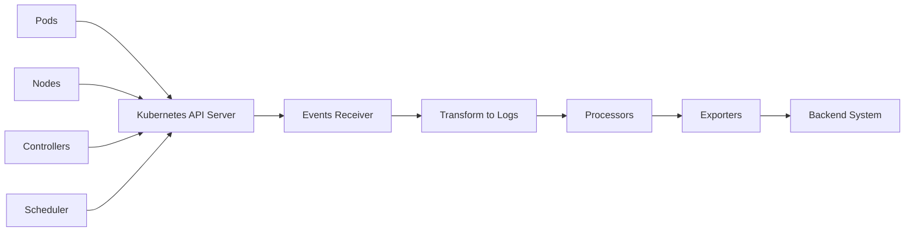

# How to Configure the Kubernetes Events Receiver in the OpenTelemetry Collector

Author: [nawazdhandala](https://www.github.com/nawazdhandala)

Tags: OpenTelemetry, Collector, Kubernetes, Events, Receiver, K8s

Description: Configure the Kubernetes Events Receiver to capture cluster events like pod scheduling, failures, and resource warnings in your OpenTelemetry pipeline.

The Kubernetes Events Receiver captures events from the Kubernetes API server and transforms them into OpenTelemetry logs. Events are Kubernetes' way of surfacing what's happening in your cluster: pods starting, containers crashing, nodes becoming unready, deployments scaling, and more. These events are critical for understanding cluster behavior and troubleshooting issues.

## Understanding Kubernetes Events

Kubernetes events are distinct from application logs. While logs tell you what your application is doing, events tell you what Kubernetes is doing to manage your application. When a pod fails to start because it can't pull an image, that's an event. When the horizontal pod autoscaler scales your deployment, that's an event. When a node runs out of disk space, that's an event.

Events have a short retention period in Kubernetes (typically 1 hour). They're stored in etcd and retrieved through the API server, but they're not persisted long-term. The Events Receiver solves this by collecting events and forwarding them to your observability backend for long-term storage and analysis.

## Event Types

Kubernetes generates events for various reasons:

- **Pod events**: Scheduling, pulling images, starting containers, readiness checks
- **Node events**: Status changes, resource pressure, kubelet activity
- **Deployment events**: Scaling, rolling updates, rollback operations
- **Volume events**: Mounting, unmounting, provisioning
- **Service events**: Endpoint updates, load balancer provisioning
- **ReplicaSet events**: Scaling operations, pod creation/deletion
- **StatefulSet events**: Pod management, persistent volume handling

Events have a type (Normal or Warning) and a reason (ImagePullBackOff, FailedScheduling, etc.) that categorize what happened.

## Architecture Overview

Here's how the Kubernetes Events Receiver works:



The receiver watches the Kubernetes Events API and converts each event into an OpenTelemetry log entry with rich metadata.

## Basic Configuration

Start with a minimal configuration:

```yaml
# Basic Kubernetes Events Receiver configuration
# Requires RBAC permissions to watch events
receivers:
  k8s_events:
    # Authentication method
    auth_type: serviceAccount

    # Watch all namespaces
    namespaces: [all]

processors:
  batch:
    timeout: 10s

exporters:
  logging:
    loglevel: debug

service:
  pipelines:
    logs:
      receivers: [k8s_events]
      processors: [batch]
      exporters: [logging]
```

This configuration watches events across all namespaces using the pod's service account for authentication.

## Authentication Methods

The receiver supports multiple authentication methods:

```yaml
# Service account authentication (recommended for in-cluster deployment)
# Uses the pod's mounted service account token
receivers:
  k8s_events:
    auth_type: serviceAccount
    namespaces: [all]
```

```yaml
# Kubeconfig authentication (for development or out-of-cluster deployment)
# Uses your local kubectl configuration
receivers:
  k8s_events:
    auth_type: kubeConfig
    namespaces: [all]
```

In production, deploy the collector inside the cluster and use `serviceAccount` authentication. This is more secure than distributing kubeconfig files and automatically handles token rotation.

## Namespace Filtering

Control which namespaces to watch:

```yaml
# Watch specific namespaces
# Reduces event volume and focuses on relevant namespaces
receivers:
  k8s_events:
    auth_type: serviceAccount

    # Watch multiple specific namespaces
    namespaces:
      - production
      - staging
      - monitoring
```

```yaml
# Watch all namespaces except system namespaces
# Use processor filtering for exclusions
receivers:
  k8s_events:
    auth_type: serviceAccount
    namespaces: [all]

processors:
  # Filter out events from system namespaces
  filter:
    logs:
      exclude:
        match_type: regexp
        resource_attributes:
          - key: k8s.namespace.name
            value: ^(kube-system|kube-public|kube-node-lease)$
```

Filtering namespaces reduces event volume. Most clusters generate many events from kube-system that are only relevant for deep cluster debugging.

## RBAC Configuration

The receiver needs permissions to watch events:

```yaml
# ServiceAccount for the collector
apiVersion: v1
kind: ServiceAccount
metadata:
  name: otel-collector
  namespace: observability
---
# ClusterRole with events permissions
apiVersion: rbac.authorization.k8s.io/v1
kind: ClusterRole
metadata:
  name: otel-collector-events
rules:
  # Permission to watch events cluster-wide
  - apiGroups: [""]
    resources: ["events"]
    verbs: ["get", "list", "watch"]

  # Permission to watch events in events.k8s.io API group (K8s 1.19+)
  - apiGroups: ["events.k8s.io"]
    resources: ["events"]
    verbs: ["get", "list", "watch"]
---
# ClusterRoleBinding to grant permissions
apiVersion: rbac.authorization.k8s.io/v1
kind: ClusterRoleBinding
metadata:
  name: otel-collector-events
subjects:
  - kind: ServiceAccount
    name: otel-collector
    namespace: observability
roleRef:
  kind: ClusterRole
  name: otel-collector-events
  apiGroup: rbac.authorization.k8s.io
```

Kubernetes 1.19+ introduced a new events API group (`events.k8s.io`). The receiver needs permissions for both the legacy (`""`) and new API groups to capture all events.

For namespace-scoped watching, use a Role and RoleBinding instead:

```yaml
# Role for namespace-scoped event watching
apiVersion: rbac.authorization.k8s.io/v1
kind: Role
metadata:
  name: otel-collector-events
  namespace: production
rules:
  - apiGroups: ["", "events.k8s.io"]
    resources: ["events"]
    verbs: ["get", "list", "watch"]
---
# RoleBinding for namespace-scoped permissions
apiVersion: rbac.authorization.k8s.io/v1
kind: RoleBinding
metadata:
  name: otel-collector-events
  namespace: production
subjects:
  - kind: ServiceAccount
    name: otel-collector
    namespace: observability
roleRef:
  kind: Role
  name: otel-collector-events
  apiGroup: rbac.authorization.k8s.io
```

## Event Metadata

Events are converted to logs with extensive metadata:

```yaml
# Events include automatic metadata mapping
# Understanding this structure helps with querying and filtering
receivers:
  k8s_events:
    auth_type: serviceAccount
    namespaces: [all]

# Example event log attributes:
# - k8s.event.start_time: When the event first occurred
# - k8s.event.name: Event name
# - k8s.event.uid: Unique event identifier
# - k8s.event.reason: Event reason (e.g., FailedScheduling)
# - k8s.event.type: Normal or Warning
# - k8s.event.action: Action taken
# - k8s.event.reporting_controller: Controller that reported the event
# - k8s.event.reporting_instance: Instance of the controller
# - k8s.namespace.name: Namespace where event occurred
# - k8s.object.kind: Kind of object (Pod, Node, Deployment, etc.)
# - k8s.object.name: Name of the object
# - k8s.object.uid: UID of the object
# - k8s.object.api_version: API version
# - body: Event message text
```

These attributes enable powerful querying and correlation with other telemetry data.

## Filtering by Event Type

Focus on warnings or specific event reasons:

```yaml
# Collect only warning events
# Reduces noise from normal operational events
receivers:
  k8s_events:
    auth_type: serviceAccount
    namespaces: [all]

processors:
  # Filter to only include warnings
  filter:
    logs:
      include:
        match_type: strict
        attributes:
          - key: k8s.event.type
            value: Warning
```

```yaml
# Collect specific event reasons
# Focus on actionable events
receivers:
  k8s_events:
    auth_type: serviceAccount
    namespaces: [all]

processors:
  filter:
    logs:
      include:
        match_type: regexp
        attributes:
          - key: k8s.event.reason
            value: ^(FailedScheduling|ImagePullBackOff|CrashLoopBackOff|OOMKilled|FailedMount)$
```

This approach dramatically reduces event volume while maintaining visibility into problems that need attention.

## Enriching Events with Resource Attributes

Add cluster context to events:

```yaml
# Add cluster and environment metadata
# Helps when aggregating events from multiple clusters
receivers:
  k8s_events:
    auth_type: serviceAccount
    namespaces: [all]

processors:
  resource:
    attributes:
      - key: k8s.cluster.name
        value: ${CLUSTER_NAME}
        action: insert

      - key: deployment.environment
        value: production
        action: insert

      - key: cloud.provider
        value: aws
        action: insert

      - key: cloud.region
        value: us-east-1
        action: insert

  batch:
    timeout: 10s

exporters:
  otlp:
    endpoint: https://backend.example.com:4317

service:
  pipelines:
    logs:
      receivers: [k8s_events]
      processors: [resource, batch]
      exporters: [otlp]
```

When you manage multiple clusters, these resource attributes make it easy to filter and aggregate events by cluster, region, or environment.

## Correlating Events with Metrics

Events become more valuable when correlated with metrics:

```yaml
# Collect both events and cluster metrics
# Enables correlation between events and resource utilization
receivers:
  # Kubernetes events
  k8s_events:
    auth_type: serviceAccount
    namespaces: [all]

  # Cluster metrics
  k8s_cluster:
    auth_type: serviceAccount
    collection_interval: 30s
    node_conditions_to_report:
      - Ready
      - MemoryPressure
      - DiskPressure
    allocatable_types_to_report:
      - cpu
      - memory

processors:
  resource:
    attributes:
      - key: k8s.cluster.name
        value: ${CLUSTER_NAME}
        action: insert

  batch:
    timeout: 10s

exporters:
  otlp:
    endpoint: https://backend.example.com:4317

service:
  pipelines:
    # Events pipeline
    logs:
      receivers: [k8s_events]
      processors: [resource, batch]
      exporters: [otlp]

    # Metrics pipeline
    metrics:
      receivers: [k8s_cluster]
      processors: [resource, batch]
      exporters: [otlp]
```

With both events and metrics, you can correlate a pod eviction event with node memory pressure metrics, or relate deployment scaling events to CPU utilization trends.

## Alerting on Critical Events

Transform critical events into actionable alerts:

```yaml
# Route critical events to alerting pipeline
# Enables immediate notification of cluster issues
receivers:
  k8s_events:
    auth_type: serviceAccount
    namespaces: [all]

processors:
  # Add severity to events based on reason
  attributes:
    actions:
      - key: alert.severity
        value: critical
        action: insert
        # Only add to specific event reasons
        filters:
          - key: k8s.event.reason
            value: OOMKilled
            match_type: strict

      - key: alert.severity
        value: critical
        action: insert
        filters:
          - key: k8s.event.reason
            value: FailedScheduling
            match_type: strict

  batch:
    timeout: 10s

exporters:
  # Send to main backend
  otlp:
    endpoint: https://backend.example.com:4317

  # Send to alerting system
  otlp/alerts:
    endpoint: https://alerts.example.com:4317

service:
  pipelines:
    logs:
      receivers: [k8s_events]
      processors: [attributes, batch]
      exporters: [otlp, otlp/alerts]
```

## Event Deduplication

Kubernetes can generate duplicate events. Handle them with attribute manipulation:

```yaml
# Deduplicate events based on content
# Reduces noise from repeated events
receivers:
  k8s_events:
    auth_type: serviceAccount
    namespaces: [all]

processors:
  # Group events for deduplication downstream
  groupbyattrs:
    keys:
      - k8s.event.reason
      - k8s.object.name
      - k8s.namespace.name

  batch:
    timeout: 10s

exporters:
  otlp:
    endpoint: https://backend.example.com:4317

service:
  pipelines:
    logs:
      receivers: [k8s_events]
      processors: [groupbyattrs, batch]
      exporters: [otlp]
```

Your backend system can then deduplicate based on these grouped attributes, showing a single event with a count rather than hundreds of identical entries.

## Deployment Patterns

### Single Collector Deployment

Deploy one collector instance for cluster-wide event collection:

```yaml
# Single deployment for centralized event collection
apiVersion: apps/v1
kind: Deployment
metadata:
  name: otel-collector-events
  namespace: observability
spec:
  replicas: 1  # Only one replica needed for event watching
  selector:
    matchLabels:
      app: otel-collector-events
  template:
    metadata:
      labels:
        app: otel-collector-events
    spec:
      serviceAccountName: otel-collector
      containers:
      - name: otel-collector
        image: otel/opentelemetry-collector-contrib:latest
        resources:
          requests:
            memory: 256Mi
            cpu: 100m
          limits:
            memory: 512Mi
            cpu: 500m
        volumeMounts:
        - name: config
          mountPath: /etc/otelcol
      volumes:
      - name: config
        configMap:
          name: otel-collector-events-config
```

Only one replica is needed because the Kubernetes API distributes events to all watchers. Multiple replicas would receive duplicate events.

### Gateway Pattern

Use a gateway collector for centralized processing:

```yaml
# Agent collector on each node (metrics and logs)
apiVersion: apps/v1
kind: DaemonSet
metadata:
  name: otel-collector-agent
  namespace: observability
spec:
  selector:
    matchLabels:
      app: otel-collector-agent
  template:
    metadata:
      labels:
        app: otel-collector-agent
    spec:
      serviceAccountName: otel-collector-agent
      containers:
      - name: otel-collector
        image: otel/opentelemetry-collector-contrib:latest
        # Agent collects host metrics, logs, etc.
---
# Gateway collector for events and centralized processing
apiVersion: apps/v1
kind: Deployment
metadata:
  name: otel-collector-gateway
  namespace: observability
spec:
  replicas: 1
  selector:
    matchLabels:
      app: otel-collector-gateway
  template:
    metadata:
      labels:
        app: otel-collector-gateway
    spec:
      serviceAccountName: otel-collector-gateway
      containers:
      - name: otel-collector
        image: otel/opentelemetry-collector-contrib:latest
        # Gateway collects events and receives from agents
```

This pattern separates concerns: DaemonSet agents collect node-specific telemetry, while the gateway handles cluster-wide events and aggregation.

## Complete Production Configuration

Here's a production-ready setup:

```yaml
# Production Kubernetes Events Receiver configuration
# Includes filtering, enrichment, and correlation
receivers:
  k8s_events:
    auth_type: serviceAccount

    # Watch application namespaces only
    namespaces:
      - production
      - staging
      - canary

processors:
  # Filter out noisy normal events
  filter:
    logs:
      exclude:
        match_type: regexp
        attributes:
          # Exclude common normal events
          - key: k8s.event.reason
            value: ^(Started|Created|Scheduled|Pulled|SuccessfulCreate)$

  # Add cluster context
  resource:
    attributes:
      - key: k8s.cluster.name
        value: ${CLUSTER_NAME}
        action: insert

      - key: deployment.environment
        value: ${ENVIRONMENT}
        action: insert

      - key: cloud.provider
        value: aws
        action: insert

      - key: cloud.region
        value: ${AWS_REGION}
        action: insert

  # Add severity tags for alerting
  attributes:
    actions:
      # Critical events
      - key: event.severity
        value: critical
        action: insert
        filters:
          - key: k8s.event.reason
            value: ^(OOMKilled|FailedScheduling|FailedMount)$
            match_type: regexp

      # Warning events
      - key: event.severity
        value: warning
        action: insert
        filters:
          - key: k8s.event.reason
            value: ^(ImagePullBackOff|CrashLoopBackOff|Unhealthy)$
            match_type: regexp

      # Informational events
      - key: event.severity
        value: info
        action: insert
        filters:
          - key: k8s.event.type
            value: Normal
            match_type: strict

  # Batch for efficiency
  batch:
    timeout: 10s
    send_batch_size: 256

  # Memory protection
  memory_limiter:
    check_interval: 1s
    limit_mib: 256

exporters:
  otlp:
    endpoint: ${OTLP_ENDPOINT}
    compression: gzip
    retry_on_failure:
      enabled: true
      initial_interval: 5s
      max_interval: 30s

service:
  pipelines:
    logs:
      receivers: [k8s_events]
      processors: [filter, resource, attributes, memory_limiter, batch]
      exporters: [otlp]

  # Monitor collector health
  telemetry:
    logs:
      level: info
    metrics:
      level: detailed
      address: localhost:8888
```

## Complete Kubernetes Deployment

Here's the full deployment manifest:

```yaml
# Namespace
apiVersion: v1
kind: Namespace
metadata:
  name: observability
---
# ServiceAccount
apiVersion: v1
kind: ServiceAccount
metadata:
  name: otel-collector-events
  namespace: observability
---
# ClusterRole
apiVersion: rbac.authorization.k8s.io/v1
kind: ClusterRole
metadata:
  name: otel-collector-events
rules:
  - apiGroups: ["", "events.k8s.io"]
    resources: ["events"]
    verbs: ["get", "list", "watch"]
---
# ClusterRoleBinding
apiVersion: rbac.authorization.k8s.io/v1
kind: ClusterRoleBinding
metadata:
  name: otel-collector-events
subjects:
  - kind: ServiceAccount
    name: otel-collector-events
    namespace: observability
roleRef:
  kind: ClusterRole
  name: otel-collector-events
  apiGroup: rbac.authorization.k8s.io
---
# ConfigMap with collector configuration
apiVersion: v1
kind: ConfigMap
metadata:
  name: otel-collector-events-config
  namespace: observability
data:
  config.yaml: |
    receivers:
      k8s_events:
        auth_type: serviceAccount
        namespaces: [all]

    processors:
      batch:
        timeout: 10s
      resource:
        attributes:
          - key: k8s.cluster.name
            value: my-cluster
            action: insert

    exporters:
      otlp:
        endpoint: https://backend.example.com:4317

    service:
      pipelines:
        logs:
          receivers: [k8s_events]
          processors: [resource, batch]
          exporters: [otlp]
---
# Deployment
apiVersion: apps/v1
kind: Deployment
metadata:
  name: otel-collector-events
  namespace: observability
spec:
  replicas: 1
  selector:
    matchLabels:
      app: otel-collector-events
  template:
    metadata:
      labels:
        app: otel-collector-events
    spec:
      serviceAccountName: otel-collector-events
      containers:
      - name: otel-collector
        image: otel/opentelemetry-collector-contrib:0.93.0
        args:
          - --config=/etc/otelcol/config.yaml
        resources:
          requests:
            memory: 256Mi
            cpu: 100m
          limits:
            memory: 512Mi
            cpu: 500m
        volumeMounts:
        - name: config
          mountPath: /etc/otelcol
      volumes:
      - name: config
        configMap:
          name: otel-collector-events-config
```

## Troubleshooting

### No Events Appearing

Check these issues:

1. Verify RBAC permissions: `kubectl auth can-i watch events --all-namespaces --as=system:serviceaccount:observability:otel-collector-events`
2. Check service account: `kubectl get sa otel-collector-events -n observability`
3. Review collector logs: `kubectl logs -n observability deployment/otel-collector-events`
4. Verify events exist: `kubectl get events -A`

### Permission Errors

If you see RBAC errors:

```bash
# Verify ClusterRole exists
kubectl get clusterrole otel-collector-events

# Verify ClusterRoleBinding
kubectl get clusterrolebinding otel-collector-events

# Check what permissions the service account has
kubectl auth can-i --list --as=system:serviceaccount:observability:otel-collector-events
```

### Duplicate Events

If you're receiving duplicate events:

1. Ensure only one collector replica is running
2. Verify you don't have multiple collectors watching events
3. Check that your backend isn't deduplicating properly

### High Memory Usage

Events can accumulate quickly during incidents:

1. Add the `memory_limiter` processor
2. Filter out normal events that don't require investigation
3. Increase batch timeout to reduce processing frequency
4. Limit to specific namespaces rather than watching all

## Use Cases

### Incident Investigation

Events provide context during outages:

- Pod evictions during resource pressure
- Image pull failures blocking deployments
- Scheduling failures due to resource constraints
- Node failures and pod rescheduling

### Capacity Planning

Events signal resource issues before they become critical:

- Frequent pod evictions indicate insufficient memory
- Pending pods suggest node capacity issues
- Volume provisioning delays point to storage bottlenecks

### Security Monitoring

Events can indicate security issues:

- Unauthorized API access attempts
- Privileged container creation
- Service account token usage
- Network policy violations

## Next Steps

The Kubernetes Events Receiver provides visibility into cluster operations. To build complete observability:

1. Use the [OpenTelemetry Collector](https://oneuptime.com/blog/post/2025-09-18-what-is-opentelemetry-collector-and-why-use-one/view) in gateway mode for centralized collection
2. Monitor [collector internal metrics](https://oneuptime.com/blog/post/2025-01-22-how-to-collect-opentelemetry-collector-internal-metrics/view) to ensure reliability
3. Combine with Kubernetes Cluster Receiver for metrics correlation
4. Implement alerting rules based on critical event patterns

Kubernetes events are ephemeral by design, but they contain essential information about cluster health and application behavior. The Events Receiver ensures these valuable signals are captured and available for long-term analysis.
