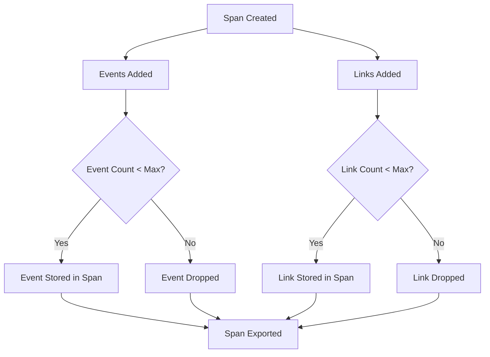
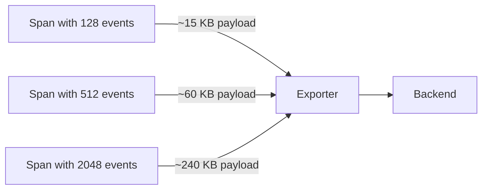

# How to Configure Max Events Per Span and Max Links Per Span

Author: [nawazdhandala](https://www.github.com/nawazdhandala)

Tags: OpenTelemetry, Tracing, Spans, Configuration, SDK, Performance, Observability

Description: Learn how to configure maximum events per span and maximum links per span in OpenTelemetry SDKs to control memory usage and telemetry volume.

---

Every span in OpenTelemetry can carry events and links. Events record things that happen during a span's lifetime, like exceptions or log entries. Links connect spans that are causally related but do not have a direct parent-child relationship. Both of these are useful for building rich traces, but without proper limits they can cause memory bloat and excessive data transfer. This post covers how to configure `maxNumberOfEventsPerSpan` and `maxNumberOfLinksPerSpan` in the OpenTelemetry SDK, why these limits matter, and how to tune them for your workloads.

## Why Limits Exist

The OpenTelemetry specification defines default limits on how many events and links a span can hold. The defaults are 128 events per span and 128 links per span. These defaults exist for practical reasons. A span that accumulates thousands of events, such as one event per loop iteration in a tight loop, will consume large amounts of memory and generate massive payloads when exported. Similarly, a span that links to thousands of other spans creates unwieldy trace graphs.

The limits act as a safety valve. Once the maximum is reached, additional events or links are silently dropped. This prevents a single poorly instrumented span from bringing down your application or overwhelming your backend.



## Configuring Limits in Python

The Python SDK exposes these limits through the `SpanLimits` class, which you pass to the `TracerProvider`. Here is how to set both values:

```python
from opentelemetry import trace
from opentelemetry.sdk.trace import TracerProvider, SpanLimits
from opentelemetry.sdk.trace.export import (
    BatchSpanProcessor,
    ConsoleSpanExporter,
)

# Create span limits with custom max events and links
# Default for both is 128; here we reduce to 64 for tighter control
span_limits = SpanLimits(
    max_events=64,
    max_links=32,
)

# Pass limits to the TracerProvider
provider = TracerProvider(span_limits=span_limits)

# Add an exporter so we can see the results
processor = BatchSpanProcessor(ConsoleSpanExporter())
provider.add_span_processor(processor)

# Register the provider globally
trace.set_tracer_provider(provider)

tracer = trace.get_tracer("example.service")
```

The `SpanLimits` constructor also accepts `max_attributes`, `max_span_attribute_value_length`, `max_event_attributes`, and `max_link_attributes`, so you can control all dimension limits in one place.

After setting this up, any span created by this provider will enforce the limits. Let's test it by adding more events than allowed:

```python
# Demonstrate the event limit in action
with tracer.start_as_current_span("process-batch") as span:
    for i in range(100):
        # Add events in a loop; only the first 64 will be kept
        span.add_event(f"processing-item-{i}", attributes={"item.id": i})

    # Check how many events the span actually holds
    # The span will contain exactly 64 events, not 100
    print(f"Events recorded: {len(span.events)}")
```

When you run this, the span will contain 64 events. The remaining 36 are dropped without raising an error. This is by design. The SDK does not throw exceptions for dropped events because doing so would disrupt application flow for what is essentially a telemetry concern.

## Configuring Limits in Java

The Java SDK uses `SpanLimits` as well, accessed through the `TracerProviderBuilder`:

```java
import io.opentelemetry.sdk.OpenTelemetrySdk;
import io.opentelemetry.sdk.trace.SdkTracerProvider;
import io.opentelemetry.sdk.trace.SpanLimits;
import io.opentelemetry.sdk.trace.export.BatchSpanProcessor;
import io.opentelemetry.sdk.trace.export.SimpleSpanProcessor;
import io.opentelemetry.exporter.logging.LoggingSpanExporter;

public class TracingConfig {
    public static void main(String[] args) {
        // Build custom span limits
        // maxNumberOfEvents controls events per span
        // maxNumberOfLinks controls links per span
        SpanLimits spanLimits = SpanLimits.builder()
            .setMaxNumberOfEvents(64)
            .setMaxNumberOfLinks(32)
            .build();

        // Create the tracer provider with custom limits
        SdkTracerProvider tracerProvider = SdkTracerProvider.builder()
            .setSpanLimits(spanLimits)
            .addSpanProcessor(SimpleSpanProcessor.create(
                LoggingSpanExporter.create()))
            .build();

        // Build the OpenTelemetry SDK instance
        OpenTelemetrySdk openTelemetry = OpenTelemetrySdk.builder()
            .setTracerProvider(tracerProvider)
            .build();

        // Use the tracer
        var tracer = openTelemetry.getTracer("example.service");
    }
}
```

The Java SDK mirrors the Python approach. Once `SpanLimits` are set on the provider, every span respects them. You can also configure these through environment variables, which is often more practical for production deployments.

## Configuring Limits with Environment Variables

Both the Python and Java SDKs (and most other language SDKs) support environment variable configuration. This lets you change limits without modifying code:

```bash
# Set max events per span to 64
export OTEL_SPAN_EVENT_COUNT_LIMIT=64

# Set max links per span to 32
export OTEL_SPAN_LINK_COUNT_LIMIT=32

# These apply when the SDK initializes with default SpanLimits
# No code changes needed if you use default TracerProvider setup
```

Environment variables take effect when the SDK reads its configuration during initialization. If you explicitly pass a `SpanLimits` object in code, the code values take precedence. This means environment variables are best used when you rely on the SDK's default or auto-configuration setup.

## Configuring Limits in Node.js

The Node.js SDK provides the same controls through the `SpanLimits` interface:

```javascript
const { NodeTracerProvider } = require('@opentelemetry/sdk-trace-node');
const { SimpleSpanProcessor, ConsoleSpanExporter } = require('@opentelemetry/sdk-trace-base');

// Configure the tracer provider with custom span limits
const provider = new NodeTracerProvider({
  spanLimits: {
    // Maximum number of events that can be added to a span
    eventCountLimit: 64,
    // Maximum number of links that can be added to a span
    linkCountLimit: 32,
    // You can also set attribute limits here
    attributeCountLimit: 128,
    attributeValueLengthLimit: 1024,
  },
});

// Register an exporter
provider.addSpanProcessor(new SimpleSpanProcessor(new ConsoleSpanExporter()));
provider.register();

const tracer = provider.getTracer('example.service');
```

The property names differ slightly from Java and Python, but the concept is the same. The `eventCountLimit` and `linkCountLimit` fields map directly to the specification's `maxNumberOfEventsPerSpan` and `maxNumberOfLinksPerSpan`.

## When to Increase the Limits

The default of 128 events and 128 links works well for most applications. However, some workloads genuinely need higher limits. Consider increasing them if:

- Your application processes batches where each item in the batch produces an event. A batch of 500 items might warrant a 512 event limit.
- You use span links extensively to connect fan-out/fan-in patterns. A span that aggregates results from 200 upstream spans needs at least 200 links.
- You log exceptions as events and your error-handling paths can generate many exceptions in a single span.

When raising limits, also consider the downstream impact. More events and links mean larger span payloads:



The payload sizes are approximate and depend on event attribute sizes, but the relationship is roughly linear. Doubling events roughly doubles the payload for that span.

## When to Decrease the Limits

Lowering limits makes sense when you want to reduce telemetry volume or when your backend charges by data volume. Common scenarios include:

- High-throughput services where every span has many events but most are low-value informational messages.
- Cost-sensitive environments where you pay per gigabyte of ingested telemetry.
- Resource-constrained applications like edge devices or serverless functions where memory is limited.

A practical lower bound depends on your instrumentation. If your spans typically carry 5 to 10 events, setting the limit to 16 or 32 provides headroom without wasting memory on unused capacity.

## Understanding How Links Work

Span links are less commonly used than events, so it helps to understand when they apply. A link represents a causal relationship between spans that is not a parent-child relationship. Common use cases include:

- A consumer span linking back to the producer span that created the message.
- A batch processing span linking to all the individual request spans that triggered the batch.
- A retry span linking to the original span that failed.

```python
from opentelemetry import trace
from opentelemetry.trace import Link

tracer = trace.get_tracer("batch.processor")

def process_batch(message_contexts):
    # Create links to all the producer spans
    # Each message_contexts entry contains the span context
    # of the span that produced the message
    links = [
        Link(ctx, attributes={"message.index": i})
        for i, ctx in enumerate(message_contexts)
    ]

    # Start a span with links to all producer spans
    # If len(message_contexts) > max_links, extras are dropped
    with tracer.start_as_current_span(
        "process-batch",
        links=links,
    ) as span:
        span.set_attribute("batch.size", len(message_contexts))
        # Process the batch...
```

In this pattern, the number of links equals the batch size. If your batches routinely contain 256 messages and your link limit is 128, half the links will be dropped. Adjust accordingly.

## Monitoring Dropped Events and Links

The OpenTelemetry SDK tracks how many events and links were dropped per span. This information is exported as part of the span data, so your backend can alert you when drops occur:

```python
from opentelemetry import trace
from opentelemetry.sdk.trace import TracerProvider, SpanLimits
from opentelemetry.sdk.trace.export import (
    SimpleSpanProcessor,
    ConsoleSpanExporter,
)

# Set a very low limit to demonstrate drops
limits = SpanLimits(max_events=5, max_links=3)
provider = TracerProvider(span_limits=limits)
provider.add_span_processor(SimpleSpanProcessor(ConsoleSpanExporter()))
trace.set_tracer_provider(provider)

tracer = trace.get_tracer("drop.demo")

with tracer.start_as_current_span("demo-span") as span:
    # Add 10 events; only 5 will be kept
    for i in range(10):
        span.add_event(f"event-{i}")

# The exported span data includes:
# "dropped_events_count": 5
# "dropped_links_count": 0
# Your backend can use these fields to create alerts
```

When you see `dropped_events_count` or `dropped_links_count` in your trace backend, it signals that your limits may be too low for that particular span. Use this as a feedback mechanism to tune your configuration.

## Best Practices

Keep these guidelines in mind when configuring span limits:

1. Start with defaults. The 128/128 defaults work for most applications. Only change them when you have evidence of drops or resource constraints.

2. Use environment variables for production. This lets you tune limits without redeploying code. Pair this with a configuration management system for consistency across services.

3. Set limits per service, not globally. A batch processor may need 512 events per span while an API gateway only needs 16. Use different configurations for different services.

4. Monitor dropped counts. Build dashboards or alerts on `dropped_events_count` and `dropped_links_count` to catch misconfigured limits early.

5. Consider the full chain. Increasing span limits affects memory in the application, bandwidth to the collector, and storage in the backend. Make sure all components can handle the increased volume.

## Conclusion

Configuring `maxNumberOfEventsPerSpan` and `maxNumberOfLinksPerSpan` gives you control over how much detail each span carries. The defaults are sensible for general workloads, but batch processors, message consumers, and other specialized services often benefit from tuning. Use the `SpanLimits` class in your SDK of choice or set the `OTEL_SPAN_EVENT_COUNT_LIMIT` and `OTEL_SPAN_LINK_COUNT_LIMIT` environment variables. Monitor dropped counts in your traces to verify your configuration, and adjust as your workloads evolve.
