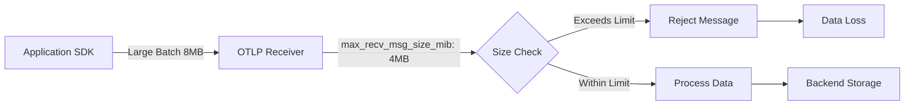

# How to Configure max_recv_msg_size_mib to Prevent Dropped Data in OTLP Receivers

Author: [nawazdhandala](https://www.github.com/nawazdhandala)

Tags: OpenTelemetry, Performance, OTLP, Configuration, Data Loss Prevention

Description: Learn how to configure max_recv_msg_size_mib in OpenTelemetry Collector receivers to prevent dropped telemetry data from large payloads and high-volume applications.

When operating OpenTelemetry Collectors at scale, one of the most frustrating issues you can encounter is silently dropped telemetry data. Your applications are sending traces, metrics, and logs, but they never arrive at your backend. The culprit is often a misconfigured message size limit in your OTLP receiver.

The `max_recv_msg_size_mib` parameter controls the maximum size of messages that an OTLP receiver will accept. When this limit is too low, large batches of telemetry data get rejected, resulting in incomplete observability and potential blind spots in your monitoring.

## Understanding the Message Size Problem

OpenTelemetry SDKs batch telemetry data before sending it to collectors. This batching improves efficiency by reducing network overhead. However, applications with high cardinality metrics, large span attributes, or verbose logging can produce batches that exceed the default receiver limits.

When a message exceeds `max_recv_msg_size_mib`, the gRPC receiver returns an error, and the SDK may retry or drop the data depending on its retry configuration. This creates a problematic cycle where your busiest services, which generate the most telemetry, are the ones most likely to lose data.



## Default Limits and Their Impact

The OpenTelemetry Collector uses different default values depending on the receiver type:

- OTLP gRPC receiver: 4 MiB default
- OTLP HTTP receiver: No explicit limit (controlled by HTTP server settings)

For many production workloads, 4 MiB is insufficient. A single trace with hundreds of spans, each containing detailed attributes, can easily exceed this limit. Similarly, metric batches from applications with thousands of time series can grow large quickly.

## Configuring max_recv_msg_size_mib

Here's how to configure the message size limit for an OTLP gRPC receiver. This configuration should be placed in your OpenTelemetry Collector configuration file.

```yaml
# otel-collector-config.yaml
receivers:
  otlp:
    protocols:
      grpc:
        # Set the endpoint where the receiver listens
        endpoint: 0.0.0.0:4317

        # Configure maximum receive message size to 16 MiB
        # This allows larger batches from high-volume applications
        max_recv_msg_size_mib: 16

        # Also configure maximum concurrent streams to handle load
        max_concurrent_streams: 100

      http:
        # HTTP receiver configuration
        endpoint: 0.0.0.0:4318

        # For HTTP, configure max request body size
        max_request_body_size: 16777216  # 16 MiB in bytes

# Configure processors to handle the larger batches
processors:
  batch:
    # Batch processor settings should align with receiver limits
    send_batch_size: 1024
    timeout: 10s
    send_batch_max_size: 2048

  memory_limiter:
    # Protect the collector from OOM with memory limits
    check_interval: 1s
    limit_mib: 512
    spike_limit_mib: 128

exporters:
  otlp:
    endpoint: backend:4317
    tls:
      insecure: false

service:
  pipelines:
    traces:
      receivers: [otlp]
      processors: [memory_limiter, batch]
      exporters: [otlp]

    metrics:
      receivers: [otlp]
      processors: [memory_limiter, batch]
      exporters: [otlp]

    logs:
      receivers: [otlp]
      processors: [memory_limiter, batch]
      exporters: [otlp]
```

## Determining the Right Size Limit

Choosing the appropriate `max_recv_msg_size_mib` value requires understanding your telemetry volume and patterns. Too small and you lose data; too large and you risk memory issues in the collector.

Start by monitoring rejected messages in your collector logs:

```yaml
# Enable detailed logging to track rejected messages
service:
  telemetry:
    logs:
      level: info
    metrics:
      level: detailed
      address: 0.0.0.0:8888
```

Look for log entries indicating gRPC errors with status code `RESOURCE_EXHAUSTED` or messages about exceeding size limits.

Calculate your expected maximum batch size using this formula:

```
max_batch_size = (avg_item_size * batch_size) + overhead
```

For example, if your average span is 2 KB and you batch 1000 spans:
- Base data: 2 KB * 1000 = 2 MB
- Protocol overhead: ~20% = 0.4 MB
- Recommended limit: 4 MB (with 50% buffer)

Set your `max_recv_msg_size_mib` to at least this calculated value, preferably with a 50-100% buffer for spikes.

## SDK-Side Configuration

Your SDKs also need appropriate batch settings to work with the receiver limits. Here's an example using the Go SDK:

```go
package main

import (
    "context"
    "go.opentelemetry.io/otel"
    "go.opentelemetry.io/otel/exporters/otlp/otlptrace/otlptracegrpc"
    "go.opentelemetry.io/otel/sdk/trace"
    "google.golang.org/grpc"
)

func initTracer() (*trace.TracerProvider, error) {
    // Configure gRPC exporter with appropriate message size
    exporter, err := otlptracegrpc.New(
        context.Background(),
        otlptracegrpc.WithEndpoint("collector:4317"),
        otlptracegrpc.WithInsecure(),
        // Set max message size on client side to match receiver
        otlptracegrpc.WithGRPCConn(
            grpc.Dial(
                "collector:4317",
                grpc.WithDefaultCallOptions(
                    grpc.MaxCallRecvMsgSize(16*1024*1024), // 16 MiB
                    grpc.MaxCallSendMsgSize(16*1024*1024), // 16 MiB
                ),
            ),
        ),
    )
    if err != nil {
        return nil, err
    }

    // Configure batch processor with appropriate batch size
    // Keep batches smaller than max message size
    tp := trace.NewTracerProvider(
        trace.WithBatcher(exporter,
            trace.WithMaxExportBatchSize(512),    // Limit batch size
            trace.WithMaxQueueSize(2048),         // Queue for high throughput
            trace.WithExportTimeout(30*time.Second),
        ),
    )

    otel.SetTracerProvider(tp)
    return tp, nil
}
```

## Monitoring and Alerting

Set up monitoring to detect when messages are being rejected. The OpenTelemetry Collector exposes metrics that can help:

```yaml
# Configure Prometheus exporter for collector metrics
exporters:
  prometheus:
    endpoint: 0.0.0.0:8889

service:
  telemetry:
    metrics:
      level: detailed
      address: 0.0.0.0:8888

  pipelines:
    metrics/internal:
      receivers: [prometheus]
      exporters: [prometheus]
```

Monitor these key metrics:
- `otelcol_receiver_refused_spans`: Number of refused spans due to size limits
- `otelcol_receiver_refused_metric_points`: Number of refused metric points
- `otelcol_receiver_refused_log_records`: Number of refused log records

Create alerts when these metrics exceed zero, indicating data loss.

## Performance Considerations

Increasing `max_recv_msg_size_mib` has memory implications. Each receiver connection can potentially use up to this amount of memory. Calculate your memory requirements:

```
total_memory = max_recv_msg_size_mib * max_concurrent_streams * num_receivers
```

For example, with `max_recv_msg_size_mib: 16`, `max_concurrent_streams: 100`, and 2 receivers:
- Memory requirement: 16 MB * 100 * 2 = 3.2 GB

Ensure your collector has sufficient memory, and use the `memory_limiter` processor to prevent OOM conditions.

## Related Configuration

When adjusting message sizes, also consider these related settings:

**Timeouts**: Larger messages take longer to transmit
```yaml
receivers:
  otlp:
    protocols:
      grpc:
        max_recv_msg_size_mib: 16
        read_buffer_size: 524288  # 512 KB
        write_buffer_size: 524288
```

**Queue sizes**: Ensure export queues can handle the throughput
```yaml
exporters:
  otlp:
    endpoint: backend:4317
    sending_queue:
      enabled: true
      num_consumers: 10
      queue_size: 1000
```

## Best Practices

1. **Start conservative**: Begin with 8-16 MiB and increase based on monitoring
2. **Match SDK and receiver**: Configure both sides to use the same limits
3. **Monitor continuously**: Track rejected messages and adjust accordingly
4. **Use memory limits**: Always configure `memory_limiter` processor
5. **Document decisions**: Record why you chose specific values for your team

For high-scale deployments, consider implementing tail-based sampling to reduce data volume instead of simply increasing message sizes. You can learn more about sampling strategies in our guide on [consistent probability sampling](https://oneuptime.com/blog/post/2026-02-06-consistent-probability-sampling-predictable-overhead/view).

## Troubleshooting Common Issues

**Problem**: Still seeing dropped data after increasing limits
- **Solution**: Check SDK-side configuration and network MTU limits

**Problem**: Collector running out of memory
- **Solution**: Reduce `max_concurrent_streams` or implement `memory_limiter` processor

**Problem**: High latency with large messages
- **Solution**: Consider reducing batch sizes or implementing [compression](https://oneuptime.com/blog/post/2026-02-06-reduce-network-bandwidth-opentelemetry-compression/view)

By properly configuring `max_recv_msg_size_mib`, you ensure that your OpenTelemetry pipeline can handle high-volume telemetry without data loss, maintaining complete observability across your infrastructure.
