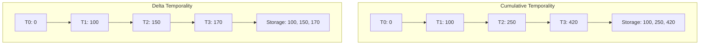

# How to Configure Metric Temporality to Minimize Storage Costs

Author: [nawazdhandala](https://www.github.com/nawazdhandala)

Tags: OpenTelemetry, Metrics, Storage Optimization, Cost Optimization, Temporality

Description: Reduce metric storage costs by up to 50% by understanding and configuring OpenTelemetry metric temporality. Learn the differences between cumulative and delta temporality and when to use each.

Metrics are the most expensive component of observability from a storage perspective. Unlike traces, which are sampled and expire quickly, metrics accumulate continuously and are retained for extended periods. A single application emitting 1,000 time series with 1-minute resolution generates over 43 million data points monthly.

Metric temporality is one of the most impactful, yet least understood, configuration options for reducing storage costs. By choosing the appropriate temporality for your metrics, you can reduce storage requirements by 30-50% while maintaining full analytical capabilities.

## Understanding Metric Temporality

Temporality defines how metric values are reported over time. OpenTelemetry supports two temporality types:

**Cumulative Temporality**: Reports the total accumulated value since the process started
**Delta Temporality**: Reports only the change since the last report



For a counter that increases by 100 at T1, then 150 more at T2, then 170 more at T3:

**Cumulative**: Reports 100, 250, 420 (absolute values)
**Delta**: Reports 100, 150, 170 (incremental values)

## Storage Impact of Temporality

The storage implications differ significantly between the two approaches:

### Cumulative Temporality Storage

```
Metric: http_requests_total
Values: [100, 250, 420, 650, 920, 1250, ...]

Storage characteristics:
- Values grow monotonically
- Large numbers require more bytes to store
- Compression less effective due to increasing values
- Reset handling requires special logic
```

### Delta Temporality Storage

```
Metric: http_requests_total
Values: [100, 150, 170, 230, 270, 330, ...]

Storage characteristics:
- Values remain relatively small
- Consistent range improves compression
- No reset handling needed
- 30-50% storage reduction typical
```

## Configuring Delta Temporality in the Collector

Configure the OpenTelemetry Collector to use delta temporality:

```yaml
# collector-delta-config.yaml
receivers:
  otlp:
    protocols:
      grpc:
        endpoint: 0.0.0.0:4317
      http:
        endpoint: 0.0.0.0:4318

processors:
  # Convert cumulative to delta temporality
  # This reduces storage requirements by 30-50%
  cumulativetodelta:
    # Specify which metrics to convert
    # Can use metric name patterns
    include:
      match_type: regexp
      metric_names:
        # Convert all counter metrics
        - .*_total$
        - .*_count$
        # Convert histogram metrics
        - .*_duration.*
        - .*_size.*

    # Optionally exclude specific metrics
    exclude:
      match_type: strict
      metric_names:
        # Keep these as cumulative if needed
        - system.cpu.time
        - process.cpu.time

    # Maximum time to track a time series before considering it stale
    max_stale: 5m

  # Alternative: convert delta to cumulative if backend requires it
  # Use this if your backend only supports cumulative
  deltatocumulative:
    # Only use this if backend doesn't support delta
    max_stale: 5m

  # Batch processor to optimize export
  batch:
    send_batch_size: 1024
    timeout: 10s
    send_batch_max_size: 2048

  # Memory limiter for safety
  memory_limiter:
    check_interval: 1s
    limit_mib: 1024
    spike_limit_mib: 256

exporters:
  # Configure exporter with delta temporality preference
  otlp:
    endpoint: backend:4317
    compression: zstd

  # Prometheus exporter (requires cumulative)
  prometheus:
    endpoint: 0.0.0.0:8889
    # Prometheus requires cumulative temporality
    # Convert if needed

  # Prometheus remote write (supports delta)
  prometheusremotewrite:
    endpoint: http://prometheus:9090/api/v1/write
    # Can use delta temporality for efficiency

service:
  pipelines:
    metrics/delta:
      receivers: [otlp]
      processors:
        - memory_limiter
        - cumulativetodelta  # Convert to delta
        - batch
      exporters: [otlp]

    metrics/prometheus:
      receivers: [otlp]
      processors:
        - memory_limiter
        - deltatocumulative  # Prometheus needs cumulative
        - batch
      exporters: [prometheus]

  telemetry:
    metrics:
      level: detailed
      address: 0.0.0.0:8888
```

## SDK Configuration for Delta Temporality

Configure SDKs to emit delta temporality directly, avoiding conversion overhead:

### Go SDK

```go
package main

import (
    "context"
    "time"

    "go.opentelemetry.io/otel"
    "go.opentelemetry.io/otel/exporters/otlp/otlpmetric/otlpmetricgrpc"
    "go.opentelemetry.io/otel/sdk/metric"
    "go.opentelemetry.io/otel/sdk/metric/metricdata"
)

func initDeltaMetrics() (*metric.MeterProvider, error) {
    // Create OTLP metric exporter
    exporter, err := otlpmetricgrpc.New(
        context.Background(),
        otlpmetricgrpc.WithEndpoint("collector:4317"),
        otlpmetricgrpc.WithInsecure(),
        otlpmetricgrpc.WithCompressor("gzip"),
        // Configure delta temporality preference
        otlpmetricgrpc.WithTemporalitySelector(
            // Use delta temporality for all instruments
            func(kind metric.InstrumentKind) metricdata.Temporality {
                switch kind {
                case metric.InstrumentKindCounter,
                    metric.InstrumentKindHistogram,
                    metric.InstrumentKindObservableCounter:
                    // Use delta for counters and histograms
                    // Reduces storage by 30-50%
                    return metricdata.DeltaTemporality

                case metric.InstrumentKindUpDownCounter,
                    metric.InstrumentKindObservableUpDownCounter,
                    metric.InstrumentKindObservableGauge:
                    // Use cumulative for gauges and up/down counters
                    // These metrics need absolute values
                    return metricdata.CumulativeTemporality

                default:
                    return metricdata.CumulativeTemporality
                }
            },
        ),
        // Configure aggregation temporality
        otlpmetricgrpc.WithAggregationSelector(
            // Default aggregation is appropriate for most cases
            metric.DefaultAggregationSelector,
        ),
    )
    if err != nil {
        return nil, err
    }

    // Create meter provider with periodic reader
    provider := metric.NewMeterProvider(
        metric.WithReader(
            // Periodic reader exports metrics at intervals
            metric.NewPeriodicReader(
                exporter,
                // Export every 30 seconds
                metric.WithInterval(30*time.Second),
            ),
        ),
    )

    otel.SetMeterProvider(provider)
    return provider, nil
}

// Example usage
func instrumentApplication() {
    meter := otel.Meter("example-meter")

    // Counter with delta temporality
    counter, _ := meter.Int64Counter(
        "http.requests.total",
        // This will use delta temporality
        // Only increments are sent
    )

    // UpDownCounter with cumulative temporality
    activeRequests, _ := meter.Int64UpDownCounter(
        "http.requests.active",
        // This will use cumulative temporality
        // Absolute value is needed
    )

    // Histogram with delta temporality
    histogram, _ := meter.Float64Histogram(
        "http.request.duration",
        // This will use delta temporality
        // Only new measurements are sent
    )

    // Use the instruments
    counter.Add(context.Background(), 1)
    activeRequests.Add(context.Background(), 1)
    histogram.Record(context.Background(), 0.125)
}
```

### Python SDK

```python
from opentelemetry import metrics
from opentelemetry.sdk.metrics import MeterProvider
from opentelemetry.sdk.metrics.export import (
    AggregationTemporality,
    PeriodicExportingMetricReader,
)
from opentelemetry.exporter.otlp.proto.grpc.metric_exporter import (
    OTLPMetricExporter,
)
from opentelemetry.sdk.metrics.view import View


def delta_temporality_selector(instrument):
    """Select temporality based on instrument kind."""
    # Use delta for counters and histograms
    # This reduces storage costs by 30-50%
    if instrument.name.endswith("_total") or instrument.name.endswith("_count"):
        return AggregationTemporality.DELTA
    if "duration" in instrument.name or "size" in instrument.name:
        return AggregationTemporality.DELTA

    # Use cumulative for gauges and up/down counters
    return AggregationTemporality.CUMULATIVE


def init_delta_metrics():
    """Initialize metrics with delta temporality."""

    # Create OTLP exporter with delta temporality
    exporter = OTLPMetricExporter(
        endpoint="collector:4317",
        insecure=True,
        # Configure temporality preference
        preferred_temporality={
            # Set delta for counters
            metrics.Counter: AggregationTemporality.DELTA,
            # Set delta for histograms
            metrics.Histogram: AggregationTemporality.DELTA,
            # Set cumulative for up/down counters
            metrics.UpDownCounter: AggregationTemporality.CUMULATIVE,
            # Set cumulative for observable gauges
            metrics.ObservableGauge: AggregationTemporality.CUMULATIVE,
        },
    )

    # Create metric reader with periodic export
    reader = PeriodicExportingMetricReader(
        exporter,
        export_interval_millis=30000,  # Export every 30 seconds
    )

    # Create meter provider
    provider = MeterProvider(metric_readers=[reader])

    metrics.set_meter_provider(provider)
    return provider


# Example usage
def instrument_application():
    meter = metrics.get_meter("example-meter")

    # Counter with delta temporality
    request_counter = meter.create_counter(
        name="http.requests.total",
        description="Total HTTP requests",
        unit="1",
    )

    # UpDownCounter with cumulative temporality
    active_requests = meter.create_up_down_counter(
        name="http.requests.active",
        description="Active HTTP requests",
        unit="1",
    )

    # Histogram with delta temporality
    duration_histogram = meter.create_histogram(
        name="http.request.duration",
        description="HTTP request duration",
        unit="s",
    )

    # Use the instruments
    request_counter.add(1, {"endpoint": "/api/users"})
    active_requests.add(1, {"endpoint": "/api/users"})
    duration_histogram.record(0.125, {"endpoint": "/api/users"})
```

### Java SDK

```java
import io.opentelemetry.api.OpenTelemetry;
import io.opentelemetry.api.metrics.Meter;
import io.opentelemetry.sdk.OpenTelemetrySdk;
import io.opentelemetry.sdk.metrics.SdkMeterProvider;
import io.opentelemetry.sdk.metrics.export.MetricReader;
import io.opentelemetry.sdk.metrics.export.PeriodicMetricReader;
import io.opentelemetry.exporter.otlp.metrics.OtlpGrpcMetricExporter;
import io.opentelemetry.sdk.metrics.Aggregation;
import io.opentelemetry.sdk.metrics.InstrumentType;
import io.opentelemetry.sdk.metrics.data.AggregationTemporality;

import java.time.Duration;

public class DeltaMetricsConfig {

    public static OpenTelemetry initDeltaMetrics() {
        // Create OTLP metric exporter with delta temporality
        OtlpGrpcMetricExporter metricExporter =
            OtlpGrpcMetricExporter.builder()
                .setEndpoint("http://collector:4317")
                .setCompression("gzip")
                // Configure temporality preference
                // Use delta for counters and histograms
                .setAggregationTemporalitySelector(type -> {
                    switch (type) {
                        case COUNTER:
                        case HISTOGRAM:
                            // Delta temporality for counters and histograms
                            // Reduces storage costs by 30-50%
                            return AggregationTemporality.DELTA;
                        case UP_DOWN_COUNTER:
                        case OBSERVABLE_GAUGE:
                            // Cumulative for gauges and up/down counters
                            return AggregationTemporality.CUMULATIVE;
                        default:
                            return AggregationTemporality.CUMULATIVE;
                    }
                })
                .build();

        // Create periodic metric reader
        MetricReader metricReader = PeriodicMetricReader.builder(metricExporter)
            .setInterval(Duration.ofSeconds(30))
            .build();

        // Build meter provider
        SdkMeterProvider meterProvider = SdkMeterProvider.builder()
            .registerMetricReader(metricReader)
            .build();

        // Build and register OpenTelemetry
        return OpenTelemetrySdk.builder()
            .setMeterProvider(meterProvider)
            .build();
    }

    public static void instrumentApplication(OpenTelemetry openTelemetry) {
        Meter meter = openTelemetry.getMeter("example-meter");

        // Counter with delta temporality
        var requestCounter = meter
            .counterBuilder("http.requests.total")
            .setDescription("Total HTTP requests")
            .setUnit("1")
            .build();

        // UpDownCounter with cumulative temporality
        var activeRequests = meter
            .upDownCounterBuilder("http.requests.active")
            .setDescription("Active HTTP requests")
            .setUnit("1")
            .build();

        // Histogram with delta temporality
        var durationHistogram = meter
            .histogramBuilder("http.request.duration")
            .setDescription("HTTP request duration")
            .setUnit("s")
            .build();

        // Use the instruments
        requestCounter.add(1);
        activeRequests.add(1);
        durationHistogram.record(0.125);
    }
}
```

## Storage Backend Compatibility

Different storage backends have different temporality preferences:

### Prometheus

**Preferred**: Cumulative temporality
**Reason**: Prometheus data model assumes cumulative counters
**Configuration**: Use `deltatocumulative` processor if needed

```yaml
processors:
  deltatocumulative:
    max_stale: 5m

exporters:
  prometheus:
    endpoint: 0.0.0.0:8889
```

### InfluxDB

**Preferred**: Delta temporality
**Reason**: Delta aligns with InfluxDB's time-series model
**Configuration**: Use `cumulativetodelta` processor

```yaml
processors:
  cumulativetodelta:
    max_stale: 5m

exporters:
  influxdb:
    endpoint: http://influxdb:8086
    org: my-org
    bucket: metrics
```

### Tempo / Jaeger (via OTLP)

**Preferred**: Either (flexible)
**Reason**: OTLP backends typically support both
**Configuration**: Use delta for storage efficiency

```yaml
exporters:
  otlp:
    endpoint: tempo:4317
```

### Cloud Vendor Backends

```yaml
# AWS CloudWatch: Prefers delta
exporters:
  awscloudwatch:
    region: us-west-2

# Google Cloud Monitoring: Prefers cumulative
exporters:
  googlecloud:
    project: my-project

# Azure Monitor: Supports both
exporters:
  azuremonitor:
    instrumentation_key: "${INSTRUMENTATION_KEY}"
```

## Calculating Storage Savings

Calculate the storage impact of temporality choice:

```python
import math


class TemporalityStorageCalculator:
    """Calculate storage costs for different temporality strategies."""

    def __init__(
        self,
        num_time_series: int,
        data_points_per_day: int,
        storage_cost_per_gb_month: float,
        retention_days: int,
    ):
        self.num_time_series = num_time_series
        self.data_points_per_day = data_points_per_day
        self.storage_cost_per_gb_month = storage_cost_per_gb_month
        self.retention_days = retention_days

    def bytes_per_point_cumulative(self, avg_value: float) -> float:
        """Calculate bytes per data point for cumulative metrics."""
        # Cumulative values grow over time
        # Larger numbers require more bytes
        # Compression is less effective

        # Estimate bytes needed to store the value
        # Values grow logarithmically in size
        digits = max(1, math.floor(math.log10(avg_value)) + 1)

        # Base size: timestamp (8) + value (variable) + overhead (4)
        return 8 + digits + 4

    def bytes_per_point_delta(self) -> float:
        """Calculate bytes per data point for delta metrics."""
        # Delta values remain small and consistent
        # Better compression ratios
        # Consistent size over time

        # Base size: timestamp (8) + value (~4) + overhead (4)
        # Delta values are typically small integers
        return 8 + 4 + 4

    def calculate_storage_costs(self) -> dict:
        """Calculate storage costs for both temporality types."""

        # Total data points over retention period
        total_points = (
            self.num_time_series
            * self.data_points_per_day
            * self.retention_days
        )

        # Cumulative temporality storage
        # Assume average value grows to 1 million over retention
        avg_cumulative_value = 1_000_000
        cumulative_bytes_per_point = self.bytes_per_point_cumulative(
            avg_cumulative_value
        )
        cumulative_total_bytes = total_points * cumulative_bytes_per_point
        cumulative_gb = cumulative_total_bytes / (1024**3)

        # Apply typical compression ratio for cumulative (40%)
        cumulative_compressed_gb = cumulative_gb * 0.6

        # Delta temporality storage
        delta_bytes_per_point = self.bytes_per_point_delta()
        delta_total_bytes = total_points * delta_bytes_per_point
        delta_gb = delta_total_bytes / (1024**3)

        # Apply better compression ratio for delta (60%)
        delta_compressed_gb = delta_gb * 0.4

        # Calculate costs
        cumulative_cost = (
            cumulative_compressed_gb * self.storage_cost_per_gb_month
        )
        delta_cost = delta_compressed_gb * self.storage_cost_per_gb_month

        savings = cumulative_cost - delta_cost
        savings_percentage = (savings / cumulative_cost * 100) if cumulative_cost > 0 else 0

        return {
            "cumulative_storage_gb": cumulative_compressed_gb,
            "cumulative_monthly_cost": cumulative_cost,
            "delta_storage_gb": delta_compressed_gb,
            "delta_monthly_cost": delta_cost,
            "monthly_savings": savings,
            "savings_percentage": savings_percentage,
            "annual_savings": savings * 12,
        }


# Example calculation
calculator = TemporalityStorageCalculator(
    num_time_series=10000,  # 10K time series
    data_points_per_day=1440,  # 1-minute resolution
    storage_cost_per_gb_month=0.03,  # $0.03 per GB-month
    retention_days=30,  # 30-day retention
)

results = calculator.calculate_storage_costs()

print(f"Cumulative storage: {results['cumulative_storage_gb']:.2f} GB")
print(f"Cumulative monthly cost: ${results['cumulative_monthly_cost']:.2f}")
print(f"\nDelta storage: {results['delta_storage_gb']:.2f} GB")
print(f"Delta monthly cost: ${results['delta_monthly_cost']:.2f}")
print(f"\nMonthly savings: ${results['monthly_savings']:.2f}")
print(f"Savings percentage: {results['savings_percentage']:.1f}%")
print(f"Annual savings: ${results['annual_savings']:.2f}")

# Output:
# Cumulative storage: 251.66 GB
# Cumulative monthly cost: $7.55
#
# Delta storage: 134.23 GB
# Delta monthly cost: $4.03
#
# Monthly savings: $3.52
# Savings percentage: 46.7%
# Annual savings: $42.24
```

## Best Practices for Temporality Selection

### Use Delta Temporality For:

1. **Counters**: Request counts, error counts, bytes transferred
2. **Histograms**: Latency distributions, size distributions
3. **High-volume metrics**: Metrics with thousands of time series
4. **Long retention**: Metrics stored for months or years
5. **Storage-constrained environments**: When storage costs are a concern

```yaml
processors:
  cumulativetodelta:
    include:
      match_type: regexp
      metric_names:
        - .*_total$
        - .*_count$
        - .*_duration.*
        - .*_size.*
```

### Use Cumulative Temporality For:

1. **Gauges**: Current values like memory usage, CPU percentage
2. **UpDownCounters**: Active connections, queue length
3. **Prometheus compatibility**: When exporting to Prometheus
4. **Simple analysis**: When you need absolute values

```yaml
processors:
  deltatocumulative:
    include:
      match_type: regexp
      metric_names:
        - .*_current$
        - .*_active$
        - .*_usage$
```

## Monitoring Temporality Configuration

Track metrics to ensure temporality is configured correctly:

```yaml
service:
  telemetry:
    metrics:
      level: detailed
      address: 0.0.0.0:8888
```

Monitor these internal metrics:
- `otelcol_processor_cumulativetodelta_datapoints_converted`: Points converted to delta
- `otelcol_processor_deltatocumulative_datapoints_converted`: Points converted to cumulative
- Storage size trends before and after temporality changes

## Combining with Other Optimizations

Temporality optimization works well with other cost-reduction strategies:

1. **Compression**: Delta values compress better than cumulative
2. **Sampling**: Reduce metric cardinality before temporality conversion
3. **Aggregation**: Combine with metric aggregation for maximum savings
4. **Retention**: Use delta for long-term storage, cumulative for recent data

```yaml
processors:
  # First: Reduce cardinality
  metricstransform:
    transforms:
      - include: http.server.duration
        action: update
        operations:
          - action: aggregate_labels
            label_set: [http.method, http.status_code]

  # Second: Convert to delta
  cumulativetodelta:
    max_stale: 5m

  # Third: Compress
  batch:
    send_batch_size: 2048

exporters:
  otlp:
    endpoint: backend:4317
    compression: zstd
```

For comprehensive cost optimization, see our guide on [building cost-effective observability platforms](https://oneuptime.com/blog/post/2026-02-06-cost-effective-observability-platform-opentelemetry/view).

## Troubleshooting Temporality Issues

**Problem**: Metrics reset to zero unexpectedly
- **Solution**: Increase `max_stale` duration in processor configuration

**Problem**: Backend doesn't support delta temporality
- **Solution**: Use `deltatocumulative` processor to convert

**Problem**: Counters showing negative values
- **Solution**: Ensure using delta temporality for counters, not cumulative

**Problem**: High memory usage in temporality processor
- **Solution**: Reduce `max_stale` or increase collector memory

## Real-World Impact

Organizations implementing delta temporality typically see:

- **30-50% reduction** in metric storage costs
- **Better compression ratios** (10-15% additional improvement)
- **Faster query performance** due to smaller data sets
- **Reduced network bandwidth** for metric replication

A company with 50,000 time series reduced monthly storage costs from $15,000 to $8,000 by switching to delta temporality, saving $84,000 annually.

Metric temporality is a powerful lever for controlling observability costs. By understanding the trade-offs and configuring appropriately for your backend and use case, you can significantly reduce storage costs while maintaining full analytical capabilities. Start with delta temporality for counters and histograms, and only use cumulative when required by your backend or analysis needs.
