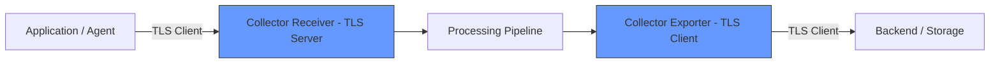
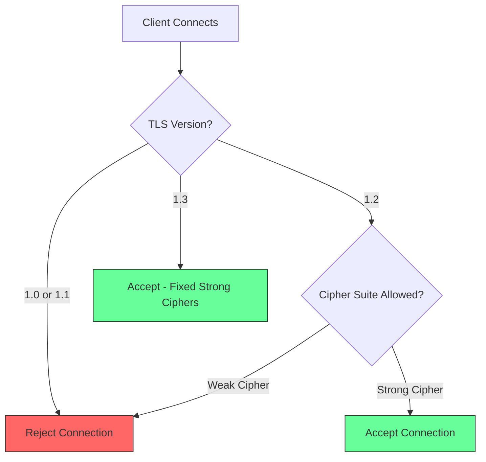

# How to Configure Minimum TLS Version and Cipher Suites in the Collector

Author: [nawazdhandala](https://www.github.com/nawazdhandala)

Tags: OpenTelemetry, Collector, TLS, Security, Encryption, Compliance, Configuration

Description: Learn how to configure minimum TLS versions and restrict cipher suites in the OpenTelemetry Collector for secure and compliant telemetry transport.

---

The OpenTelemetry Collector handles your telemetry data in transit. If that data includes traces from payment systems, logs from healthcare applications, or metrics from financial services, the transport layer needs to be locked down. Using outdated TLS versions or weak cipher suites means your telemetry traffic can be intercepted and read. Compliance frameworks like PCI DSS, HIPAA, and SOC 2 all require strong encryption in transit, and the Collector is no exception.

This post covers how to configure the Collector's TLS settings on both the receiver and exporter sides, how to choose the right minimum TLS version, and how to restrict cipher suites to only the strong ones.

## Understanding TLS in the Collector

The OpenTelemetry Collector uses TLS in two directions. On the receiver side, it acts as a TLS server, accepting connections from your applications and agents. On the exporter side, it acts as a TLS client, connecting to backends, other Collectors, or storage systems.



Both sides need proper configuration. A common mistake is hardening the receiver while leaving the exporter on default settings, or vice versa.

## Why TLS 1.2 is the Minimum

TLS 1.0 and 1.1 have known vulnerabilities. The BEAST, POODLE, and other attacks make them unsuitable for protecting sensitive data. Every major compliance standard now requires TLS 1.2 as the minimum. TLS 1.3 is preferred when both sides support it, as it removes legacy algorithms and simplifies the handshake.

Here is a quick comparison:

| TLS Version | Status | Compliance |
|-------------|--------|------------|
| TLS 1.0 | Deprecated | Not compliant with PCI DSS, HIPAA |
| TLS 1.1 | Deprecated | Not compliant with PCI DSS, HIPAA |
| TLS 1.2 | Current | Meets minimum requirements |
| TLS 1.3 | Current | Recommended, strongest security |

The Collector defaults to Go's TLS defaults, which already disable TLS 1.0 and 1.1 in recent Go versions. But relying on defaults is not a good compliance strategy. Explicitly setting the minimum version documents your intent and protects against future changes.

## Configuring TLS on the OTLP Receiver

The OTLP receiver supports both gRPC and HTTP protocols. Each one has its own TLS configuration block. You need to configure both if you use both.

This configuration sets TLS 1.2 as the minimum version on both the gRPC and HTTP receivers.

```yaml
receivers:
  otlp:
    protocols:
      grpc:
        endpoint: 0.0.0.0:4317
        tls:
          # Server certificate presented to connecting clients
          cert_file: /etc/otel/certs/server.crt
          # Private key for the server certificate
          key_file: /etc/otel/certs/server.key
          # Minimum TLS version accepted from clients
          # Valid values: "1.0", "1.1", "1.2", "1.3"
          min_version: "1.2"
          # Maximum TLS version (optional, defaults to latest)
          max_version: "1.3"
      http:
        endpoint: 0.0.0.0:4318
        tls:
          cert_file: /etc/otel/certs/server.crt
          key_file: /etc/otel/certs/server.key
          min_version: "1.2"
          max_version: "1.3"
```

When a client connects using TLS 1.1 or earlier, the Collector will reject the connection with a handshake failure. The client will see an error, and no data will be exchanged over the insecure connection.

## Configuring TLS on Exporters

The exporter side is equally important. When the Collector sends data to your backend, it acts as a TLS client. You need to ensure it negotiates a strong TLS version with the backend server.

```yaml
exporters:
  otlp:
    endpoint: backend.example.com:4317
    tls:
      # CA certificate to verify the backend server's identity
      ca_file: /etc/otel/certs/ca.crt
      # Minimum TLS version for outbound connections
      min_version: "1.2"
      # Optionally require TLS 1.3 if your backend supports it
      # min_version: "1.3"

  otlphttp:
    endpoint: https://backend.example.com:4318
    tls:
      ca_file: /etc/otel/certs/ca.crt
      min_version: "1.2"
```

If the backend only supports TLS 1.1, the Collector will refuse to connect. This is the correct behavior. The fix is to upgrade the backend, not to weaken the Collector.

## Restricting Cipher Suites

Beyond the TLS version, you should restrict which cipher suites the Collector will accept. A cipher suite defines the algorithms used for key exchange, encryption, and message authentication. Some older cipher suites use weak algorithms like RC4 or 3DES.

The Collector supports specifying allowed cipher suites using their IANA names. Here is a configuration that allows only strong cipher suites for TLS 1.2 connections.

```yaml
receivers:
  otlp:
    protocols:
      grpc:
        endpoint: 0.0.0.0:4317
        tls:
          cert_file: /etc/otel/certs/server.crt
          key_file: /etc/otel/certs/server.key
          min_version: "1.2"
          # Restrict to strong cipher suites only
          # These use AES-GCM or ChaCha20-Poly1305 for encryption
          # and ECDHE for forward secrecy
          cipher_suites:
            - TLS_ECDHE_RSA_WITH_AES_128_GCM_SHA256
            - TLS_ECDHE_RSA_WITH_AES_256_GCM_SHA384
            - TLS_ECDHE_ECDSA_WITH_AES_128_GCM_SHA256
            - TLS_ECDHE_ECDSA_WITH_AES_256_GCM_SHA384
            - TLS_ECDHE_RSA_WITH_CHACHA20_POLY1305_SHA256
            - TLS_ECDHE_ECDSA_WITH_CHACHA20_POLY1305_SHA256
```

Note that cipher suites only apply to TLS 1.2 and earlier. TLS 1.3 has a fixed set of cipher suites (TLS_AES_128_GCM_SHA256, TLS_AES_256_GCM_SHA384, and TLS_CHACHA20_POLY1305_SHA256) that cannot be configured. This is intentional - TLS 1.3 removed the ability to negotiate weak algorithms.



## Adding Mutual TLS (mTLS) for Authentication

For maximum security, combine your TLS version and cipher suite settings with mutual TLS authentication. This ensures that only clients with valid certificates can connect.

```yaml
receivers:
  otlp:
    protocols:
      grpc:
        endpoint: 0.0.0.0:4317
        tls:
          cert_file: /etc/otel/certs/server.crt
          key_file: /etc/otel/certs/server.key
          # CA certificate used to verify client certificates
          client_ca_file: /etc/otel/certs/client-ca.crt
          min_version: "1.2"
          cipher_suites:
            - TLS_ECDHE_RSA_WITH_AES_256_GCM_SHA384
            - TLS_ECDHE_ECDSA_WITH_AES_256_GCM_SHA384
            - TLS_ECDHE_RSA_WITH_CHACHA20_POLY1305_SHA256
            - TLS_ECDHE_ECDSA_WITH_CHACHA20_POLY1305_SHA256
```

With `client_ca_file` set, the Collector requires connecting clients to present a certificate signed by that CA. This is the standard approach for service-to-service authentication in zero-trust networks.

## Configuring TLS for Extensions

Do not forget the Collector's extensions. The health check, zPages, and pprof extensions can also expose HTTP endpoints. These need TLS too.

```yaml
extensions:
  # Health check endpoint with TLS
  health_check:
    endpoint: 0.0.0.0:13133
    tls:
      cert_file: /etc/otel/certs/server.crt
      key_file: /etc/otel/certs/server.key
      min_version: "1.2"

  # zPages debugging endpoint with TLS
  zpages:
    endpoint: 0.0.0.0:55679
    tls:
      cert_file: /etc/otel/certs/server.crt
      key_file: /etc/otel/certs/server.key
      min_version: "1.2"
```

If you cannot put TLS on these endpoints, make sure they are only accessible from within the pod or machine. Bind them to `127.0.0.1` instead of `0.0.0.0`.

```yaml
extensions:
  # Bind to localhost only - accessible only from within the machine
  health_check:
    endpoint: 127.0.0.1:13133
  zpages:
    endpoint: 127.0.0.1:55679
```

## Full Production Configuration

Here is a complete Collector configuration that combines all the TLS settings into a production-ready setup.

```yaml
receivers:
  otlp:
    protocols:
      grpc:
        endpoint: 0.0.0.0:4317
        tls:
          cert_file: /etc/otel/certs/server.crt
          key_file: /etc/otel/certs/server.key
          client_ca_file: /etc/otel/certs/client-ca.crt
          min_version: "1.2"
          max_version: "1.3"
          cipher_suites:
            - TLS_ECDHE_RSA_WITH_AES_128_GCM_SHA256
            - TLS_ECDHE_RSA_WITH_AES_256_GCM_SHA384
            - TLS_ECDHE_ECDSA_WITH_AES_128_GCM_SHA256
            - TLS_ECDHE_ECDSA_WITH_AES_256_GCM_SHA384
            - TLS_ECDHE_RSA_WITH_CHACHA20_POLY1305_SHA256
            - TLS_ECDHE_ECDSA_WITH_CHACHA20_POLY1305_SHA256
      http:
        endpoint: 0.0.0.0:4318
        tls:
          cert_file: /etc/otel/certs/server.crt
          key_file: /etc/otel/certs/server.key
          client_ca_file: /etc/otel/certs/client-ca.crt
          min_version: "1.2"
          max_version: "1.3"

processors:
  batch:
    timeout: 5s
    send_batch_size: 512

exporters:
  otlp:
    endpoint: backend.example.com:4317
    tls:
      ca_file: /etc/otel/certs/ca.crt
      cert_file: /etc/otel/certs/client.crt
      key_file: /etc/otel/certs/client.key
      min_version: "1.2"

extensions:
  health_check:
    endpoint: 127.0.0.1:13133
  zpages:
    endpoint: 127.0.0.1:55679

service:
  extensions: [health_check, zpages]
  pipelines:
    traces:
      receivers: [otlp]
      processors: [batch]
      exporters: [otlp]
    metrics:
      receivers: [otlp]
      processors: [batch]
      exporters: [otlp]
    logs:
      receivers: [otlp]
      processors: [batch]
      exporters: [otlp]
```

## Verifying Your TLS Configuration

After deploying, verify that the Collector actually enforces your TLS settings. Use `openssl s_client` to test the connection.

This command tests what TLS version and cipher suite the Collector negotiates.

```bash
# Test the TLS handshake against the Collector's gRPC endpoint
# The -tls1_2 flag forces TLS 1.2 to verify it is accepted
openssl s_client -connect localhost:4317 -tls1_2 -brief
```

Try connecting with a version that should be rejected.

```bash
# Attempt a TLS 1.1 connection - this should fail
# The Collector should refuse the handshake
openssl s_client -connect localhost:4317 -tls1_1 -brief
```

If the TLS 1.1 connection succeeds, your configuration is not being applied correctly. Check that the configuration file is being loaded and that there are no syntax errors.

You can also verify cipher suites by specifying a weak cipher.

```bash
# Attempt connection with a weak cipher - should be rejected
openssl s_client -connect localhost:4317 -cipher RC4-SHA -brief
```

## Certificate Management Tips

Strong TLS configuration is only as good as your certificate management. A few practical tips:

- **Automate certificate rotation.** Use cert-manager in Kubernetes or a similar tool. Do not rely on manual certificate renewals.
- **Use short-lived certificates.** A 90-day certificate limits the window of exposure if a key is compromised.
- **Monitor certificate expiry.** Set up alerts for certificates that are within 30 days of expiring. An expired certificate causes a complete outage, not just a security issue.
- **Store private keys securely.** Use Kubernetes secrets, HashiCorp Vault, or a similar secrets management system. Never store private keys in version control.

Getting TLS right in the Collector is not difficult, but it requires attention to all the connection points. Configure both receivers and exporters, restrict cipher suites, enforce minimum versions, and verify the setup with real connection tests. This is foundational security that every production Collector deployment should have.
