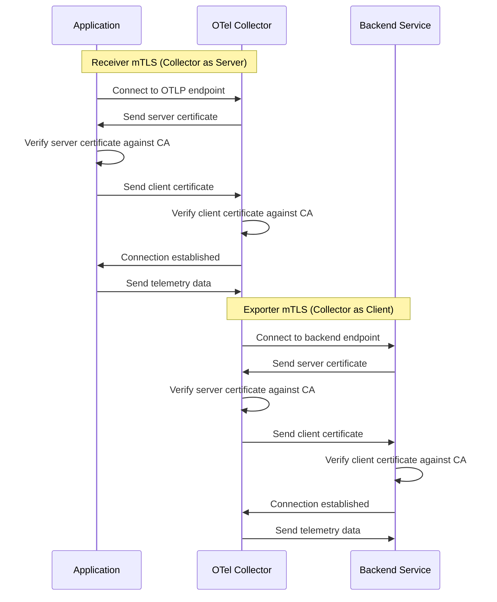

# How to Configure Mutual TLS (mTLS) for the OpenTelemetry Collector

Author: [nawazdhandala](https://www.github.com/nawazdhandala)

Tags: OpenTelemetry, Collector, mTLS, Security, TLS, Encryption

Description: Learn how to configure mutual TLS authentication for OpenTelemetry Collector receivers and exporters to secure telemetry data transmission with certificate-based authentication.

Securing telemetry data in transit is critical for production environments. Mutual TLS (mTLS) provides strong authentication by requiring both the client and server to present valid certificates, ensuring that only authorized parties can send or receive telemetry data through your OpenTelemetry Collector.

This guide walks through configuring mTLS for both receivers and exporters in the OpenTelemetry Collector, including certificate generation, configuration examples, and best practices for maintaining a secure telemetry pipeline.

## Understanding mTLS in OpenTelemetry Collector

Mutual TLS extends standard TLS by requiring both parties in a connection to authenticate using X.509 certificates. In the context of the OpenTelemetry Collector:

- **Receivers with mTLS**: The collector acts as a server, validating client certificates from applications sending telemetry
- **Exporters with mTLS**: The collector acts as a client, presenting its certificate to backend services

This bidirectional authentication prevents unauthorized access and ensures data integrity throughout your observability pipeline.

## Generating Certificates for mTLS

Before configuring the collector, you need a certificate infrastructure. Here's how to generate a self-signed CA and certificates for testing.

```bash
# Generate a Certificate Authority (CA)
openssl genrsa -out ca-key.pem 4096
openssl req -new -x509 -days 365 -key ca-key.pem -out ca-cert.pem \
  -subj "/CN=OpenTelemetry-CA"

# Generate server certificate for the collector receiver
openssl genrsa -out server-key.pem 4096
openssl req -new -key server-key.pem -out server.csr \
  -subj "/CN=otel-collector"
openssl x509 -req -days 365 -in server.csr -CA ca-cert.pem \
  -CAkey ca-key.pem -CAcreateserial -out server-cert.pem

# Generate client certificate for applications
openssl genrsa -out client-key.pem 4096
openssl req -new -key client-key.pem -out client.csr \
  -subj "/CN=otel-client"
openssl x509 -req -days 365 -in client.csr -CA ca-cert.pem \
  -CAkey ca-key.pem -CAcreateserial -out client-cert.pem
```

For production environments, use certificates from a trusted Certificate Authority or your organization's PKI infrastructure.

## Configuring mTLS on Collector Receivers

The OTLP receiver is the most common entry point for telemetry data. Here's how to enable mTLS authentication.

```yaml
receivers:
  otlp:
    protocols:
      grpc:
        # Listen on all interfaces, port 4317
        endpoint: 0.0.0.0:4317

        # TLS configuration for the receiver
        tls:
          # Path to the server's certificate
          cert_file: /etc/otel/certs/server-cert.pem

          # Path to the server's private key
          key_file: /etc/otel/certs/server-key.pem

          # Path to the CA certificate that signed client certificates
          # This enables client certificate validation
          client_ca_file: /etc/otel/certs/ca-cert.pem

          # Require clients to present valid certificates
          # Options: "require_and_verify_client_cert", "verify_client_cert_if_given", "no_client_cert"
          client_ca_file_reload: true

      http:
        endpoint: 0.0.0.0:4318

        # mTLS configuration for HTTP receiver
        tls:
          cert_file: /etc/otel/certs/server-cert.pem
          key_file: /etc/otel/certs/server-key.pem
          client_ca_file: /etc/otel/certs/ca-cert.pem

processors:
  batch:
    timeout: 10s
    send_batch_size: 1024

exporters:
  logging:
    loglevel: info

service:
  pipelines:
    traces:
      receivers: [otlp]
      processors: [batch]
      exporters: [logging]
    metrics:
      receivers: [otlp]
      processors: [batch]
      exporters: [logging]
```

With this configuration, the collector will reject any connection attempts from clients that don't present a valid certificate signed by the specified CA.

## Configuring mTLS on Collector Exporters

When sending data to backends that require mTLS, configure your exporters with client certificates.

```yaml
exporters:
  otlp/secure-backend:
    # Backend endpoint requiring mTLS
    endpoint: backend.example.com:4317

    # TLS configuration for the exporter (client-side)
    tls:
      # Whether to verify the server's certificate
      insecure: false

      # Path to CA certificate that signed the server's certificate
      ca_file: /etc/otel/certs/backend-ca-cert.pem

      # Client certificate for mTLS authentication
      cert_file: /etc/otel/certs/client-cert.pem

      # Client private key
      key_file: /etc/otel/certs/client-key.pem

      # Server name for certificate validation (must match server cert CN or SAN)
      server_name_override: backend.example.com

  otlphttp/secure-backend:
    endpoint: https://backend.example.com:4318

    # mTLS configuration for HTTP exporter
    tls:
      ca_file: /etc/otel/certs/backend-ca-cert.pem
      cert_file: /etc/otel/certs/client-cert.pem
      key_file: /etc/otel/certs/client-key.pem

service:
  pipelines:
    traces:
      receivers: [otlp]
      processors: [batch]
      exporters: [otlp/secure-backend]
```

## Complete mTLS Configuration Example

Here's a full collector configuration demonstrating mTLS on both receivers and exporters.

```yaml
receivers:
  otlp:
    protocols:
      grpc:
        endpoint: 0.0.0.0:4317
        tls:
          cert_file: /etc/otel/certs/server-cert.pem
          key_file: /etc/otel/certs/server-key.pem
          client_ca_file: /etc/otel/certs/ca-cert.pem
          # Enable automatic reload of CA certificates
          client_ca_file_reload: true

processors:
  batch:
    timeout: 10s
    send_batch_size: 1024
    send_batch_max_size: 2048

  # Add resource attributes for tracking
  resource:
    attributes:
      - key: collector.instance
        value: ${HOSTNAME}
        action: insert

exporters:
  otlp/production:
    endpoint: prod-backend.example.com:4317
    tls:
      insecure: false
      ca_file: /etc/otel/certs/prod-ca-cert.pem
      cert_file: /etc/otel/certs/collector-client-cert.pem
      key_file: /etc/otel/certs/collector-client-key.pem
      # Minimum TLS version
      min_version: "1.3"
      # Maximum TLS version
      max_version: "1.3"

  # Backup exporter with mTLS
  otlp/backup:
    endpoint: backup-backend.example.com:4317
    tls:
      ca_file: /etc/otel/certs/backup-ca-cert.pem
      cert_file: /etc/otel/certs/collector-client-cert.pem
      key_file: /etc/otel/certs/collector-client-key.pem

extensions:
  health_check:
    endpoint: :13133

  # Internal metrics to monitor TLS errors
  zpages:
    endpoint: :55679

service:
  extensions: [health_check, zpages]

  pipelines:
    traces:
      receivers: [otlp]
      processors: [resource, batch]
      exporters: [otlp/production, otlp/backup]

    metrics:
      receivers: [otlp]
      processors: [resource, batch]
      exporters: [otlp/production]

    logs:
      receivers: [otlp]
      processors: [resource, batch]
      exporters: [otlp/production]
```

## Certificate Verification Flow

Here's how mTLS authentication works in the OpenTelemetry Collector:



## Configuring Applications to Use mTLS

Applications sending data to the collector must be configured with appropriate client certificates. Here's an example using the Go SDK:

```go
package main

import (
    "context"
    "crypto/tls"
    "crypto/x509"
    "log"
    "os"

    "go.opentelemetry.io/otel"
    "go.opentelemetry.io/otel/exporters/otlp/otlptrace/otlptracegrpc"
    "go.opentelemetry.io/otel/sdk/trace"
    "google.golang.org/grpc/credentials"
)

func main() {
    // Load client certificate and key
    clientCert, err := tls.LoadX509KeyPair(
        "/path/to/client-cert.pem",
        "/path/to/client-key.pem",
    )
    if err != nil {
        log.Fatalf("Failed to load client certificate: %v", err)
    }

    // Load CA certificate to verify server
    caCert, err := os.ReadFile("/path/to/ca-cert.pem")
    if err != nil {
        log.Fatalf("Failed to load CA certificate: %v", err)
    }

    // Create certificate pool and add CA certificate
    caCertPool := x509.NewCertPool()
    caCertPool.AppendCertsFromPEM(caCert)

    // Create TLS configuration
    tlsConfig := &tls.Config{
        Certificates: []tls.Certificate{clientCert},
        RootCAs:      caCertPool,
        MinVersion:   tls.VersionTLS13,
    }

    // Create OTLP exporter with mTLS
    exporter, err := otlptracegrpc.New(
        context.Background(),
        otlptracegrpc.WithEndpoint("otel-collector:4317"),
        otlptracegrpc.WithTLSCredentials(
            credentials.NewTLS(tlsConfig),
        ),
    )
    if err != nil {
        log.Fatalf("Failed to create exporter: %v", err)
    }

    // Create trace provider
    tp := trace.NewTracerProvider(
        trace.WithBatcher(exporter),
    )
    otel.SetTracerProvider(tp)

    // Your application code here
}
```

## Certificate Management Best Practices

Managing certificates properly is essential for maintaining security without causing operational issues:

1. **Certificate Rotation**: Plan for certificate expiration. Use `client_ca_file_reload: true` to enable automatic CA certificate reloading without collector restarts.

2. **Monitoring**: Track certificate expiration dates and set up alerts before certificates expire.

3. **Secure Storage**: Store private keys with restricted permissions (chmod 600) and never commit them to version control.

4. **Certificate Naming**: Use consistent naming conventions for certificates to simplify management across multiple collector instances.

5. **Testing**: Validate certificate configurations in non-production environments before deploying to production.

## Troubleshooting mTLS Issues

Common mTLS configuration problems and their solutions:

**Problem**: "tls: bad certificate" error

**Solution**: Verify that the client certificate is signed by the CA specified in `client_ca_file`. Check certificate validity dates.

**Problem**: "x509: certificate signed by unknown authority"

**Solution**: Ensure the CA certificate used to sign the server certificate is included in the client's trusted CA bundle.

**Problem**: Connection refused or timeout

**Solution**: Verify that TLS is enabled on the correct port and that firewall rules allow the connection.

**Problem**: "certificate has expired or is not yet valid"

**Solution**: Check system time synchronization across all components and verify certificate validity periods.

## Kubernetes Deployment with mTLS

When deploying the collector in Kubernetes, use Secrets to manage certificates:

```yaml
apiVersion: v1
kind: Secret
metadata:
  name: otel-collector-certs
  namespace: observability
type: Opaque
data:
  # Base64-encoded certificates
  server-cert.pem: <base64-encoded-cert>
  server-key.pem: <base64-encoded-key>
  ca-cert.pem: <base64-encoded-ca>
---
apiVersion: apps/v1
kind: Deployment
metadata:
  name: otel-collector
  namespace: observability
spec:
  replicas: 3
  selector:
    matchLabels:
      app: otel-collector
  template:
    metadata:
      labels:
        app: otel-collector
    spec:
      containers:
      - name: otel-collector
        image: otel/opentelemetry-collector-contrib:latest
        volumeMounts:
        # Mount certificates from Secret
        - name: certs
          mountPath: /etc/otel/certs
          readOnly: true
        ports:
        - containerPort: 4317
          name: otlp-grpc
        - containerPort: 4318
          name: otlp-http
      volumes:
      - name: certs
        secret:
          secretName: otel-collector-certs
          # Set restrictive permissions
          defaultMode: 0400
```

## Related Resources

For more information on securing and scaling your OpenTelemetry Collector deployment, check out:

- [How to Monitor the Collector with Its Internal Metrics](https://oneuptime.com/blog/post/2026-02-06-monitor-collector-internal-metrics/view)
- [How to Scale the OpenTelemetry Collector for High-Throughput Environments](https://oneuptime.com/blog/post/2026-02-06-scale-opentelemetry-collector-high-throughput/view)
- [How to Set Up Load Balancing Across Multiple Collector Instances](https://oneuptime.com/blog/post/2026-02-06-load-balancing-multiple-collector-instances/view)

Mutual TLS provides robust security for your telemetry pipeline by ensuring that only authenticated clients can send data to your collector and that your collector only sends data to trusted backends. By following the configurations and best practices outlined in this guide, you can establish a secure, production-ready observability infrastructure that protects sensitive telemetry data throughout its lifecycle.
