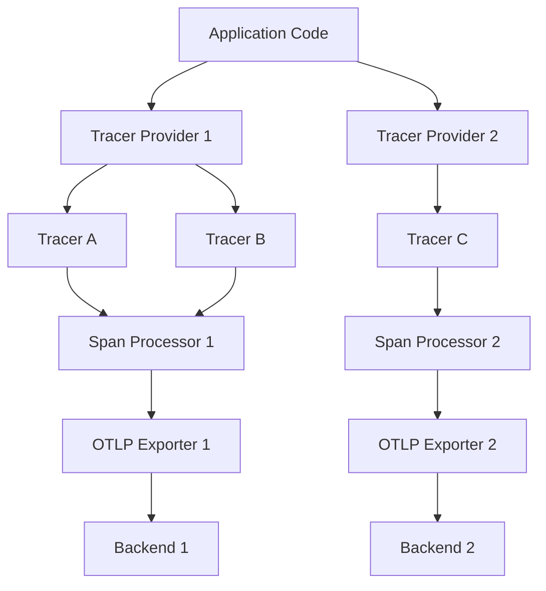

# How to Configure Multiple Tracer Providers in Python OpenTelemetry

Author: [nawazdhandala](https://www.github.com/nawazdhandala)

Tags: OpenTelemetry, Python, Tracer Provider, Configuration, Multi-Provider

Description: Learn how to configure and manage multiple tracer providers in Python OpenTelemetry for complex distributed systems with different tracing requirements.

Managing multiple tracer providers in Python OpenTelemetry becomes necessary when you're working with complex distributed systems that require different tracing strategies. You might need to send traces to different backends, apply different sampling strategies, or isolate tracing for specific components of your application.

## Why Multiple Tracer Providers?

In production environments, you often encounter scenarios where a single tracer provider doesn't meet all your needs. Consider a microservices architecture where some services need high-fidelity tracing while others require only basic monitoring. Or imagine working with multi-tenant systems where each tenant's traces must be routed to separate storage backends for compliance or security reasons.

The default OpenTelemetry setup uses a global tracer provider, which works well for simple applications. However, this global singleton pattern becomes limiting when you need fine-grained control over how different parts of your application generate and export traces.

## Understanding Tracer Provider Architecture

Before implementing multiple providers, you need to understand how OpenTelemetry's tracer provider architecture works. A tracer provider is responsible for creating tracers, which in turn create spans. Each provider can have its own configuration, including processors, exporters, samplers, and resource attributes.



## Basic Multi-Provider Setup

The first step in using multiple tracer providers is to explicitly create and manage them rather than relying on the global provider. Here's a basic example that sets up two separate providers with different configurations.

```python
from opentelemetry import trace
from opentelemetry.sdk.trace import TracerProvider
from opentelemetry.sdk.trace.export import BatchSpanProcessor
from opentelemetry.exporter.otlp.proto.grpc.trace_exporter import OTLPSpanExporter
from opentelemetry.sdk.resources import Resource

# Create first provider for high-priority traces
# This provider sends traces to a production monitoring backend
high_priority_resource = Resource.create({
    "service.name": "payment-service",
    "service.environment": "production",
    "service.priority": "high"
})

high_priority_provider = TracerProvider(resource=high_priority_resource)
high_priority_exporter = OTLPSpanExporter(
    endpoint="https://production-traces.example.com:4317",
    headers={"api-key": "prod-key-here"}
)
high_priority_provider.add_span_processor(
    BatchSpanProcessor(high_priority_exporter)
)

# Create second provider for low-priority traces
# This provider sends traces to a development/debugging backend
low_priority_resource = Resource.create({
    "service.name": "payment-service",
    "service.environment": "production",
    "service.priority": "low"
})

low_priority_provider = TracerProvider(resource=low_priority_resource)
low_priority_exporter = OTLPSpanExporter(
    endpoint="https://debug-traces.example.com:4317",
    headers={"api-key": "debug-key-here"}
)
low_priority_provider.add_span_processor(
    BatchSpanProcessor(low_priority_exporter)
)

# Get tracers from each provider
# Notice we don't use trace.get_tracer() which would use the global provider
high_priority_tracer = high_priority_provider.get_tracer("payment.critical")
low_priority_tracer = low_priority_provider.get_tracer("payment.debug")
```

## Applying Different Sampling Strategies

One powerful use case for multiple providers is applying different sampling rates to different types of operations. Critical paths might need 100% sampling, while less important operations can be sampled at lower rates to reduce costs.

```python
from opentelemetry.sdk.trace.sampling import (
    TraceIdRatioBased,
    ParentBased,
    ALWAYS_ON,
    ALWAYS_OFF
)

# Provider with always-on sampling for critical operations
critical_provider = TracerProvider(
    resource=Resource.create({"service.name": "api-gateway"}),
    sampler=ALWAYS_ON  # Sample every trace
)

# Provider with 10% sampling for routine operations
routine_provider = TracerProvider(
    resource=Resource.create({"service.name": "api-gateway"}),
    sampler=ParentBased(
        root=TraceIdRatioBased(0.1)  # Sample 10% of root spans
    )
)

# Provider with no sampling for local debugging
debug_provider = TracerProvider(
    resource=Resource.create({"service.name": "api-gateway"}),
    sampler=ALWAYS_OFF  # Don't sample anything
)

critical_tracer = critical_provider.get_tracer("critical-path")
routine_tracer = routine_provider.get_tracer("routine-path")
debug_tracer = debug_provider.get_tracer("debug")
```

## Multi-Tenant Tracing Architecture

For multi-tenant applications, you often need to route each tenant's traces to separate backends for security or compliance. Here's how to implement dynamic provider selection based on tenant context.

```python
from typing import Dict
from threading import Lock

class TenantTracerManager:
    """
    Manages separate tracer providers for each tenant.
    Each tenant's traces are exported to their dedicated backend.
    """
    def __init__(self):
        self._providers: Dict[str, TracerProvider] = {}
        self._tracers: Dict[str, trace.Tracer] = {}
        self._lock = Lock()

    def get_tracer_for_tenant(self, tenant_id: str) -> trace.Tracer:
        """
        Returns a tracer configured for the specified tenant.
        Creates the provider and tracer on first access.
        """
        if tenant_id in self._tracers:
            return self._tracers[tenant_id]

        with self._lock:
            # Double-check after acquiring lock
            if tenant_id in self._tracers:
                return self._tracers[tenant_id]

            # Create tenant-specific resource attributes
            resource = Resource.create({
                "service.name": "multi-tenant-api",
                "tenant.id": tenant_id,
                "tenant.tier": self._get_tenant_tier(tenant_id)
            })

            # Create provider with tenant-specific configuration
            provider = TracerProvider(resource=resource)

            # Configure tenant-specific exporter endpoint
            exporter = OTLPSpanExporter(
                endpoint=f"https://traces-{tenant_id}.example.com:4317",
                headers={"tenant-id": tenant_id}
            )

            provider.add_span_processor(BatchSpanProcessor(exporter))

            # Cache the provider and tracer
            self._providers[tenant_id] = provider
            tracer = provider.get_tracer(f"tenant.{tenant_id}")
            self._tracers[tenant_id] = tracer

            return tracer

    def _get_tenant_tier(self, tenant_id: str) -> str:
        # In a real application, look up the tenant's pricing tier
        # This affects sampling rates or trace retention
        return "premium"  # or "standard", "enterprise", etc.

    def shutdown_tenant(self, tenant_id: str):
        """
        Cleanly shuts down a tenant's tracer provider.
        Call this when a tenant is being offboarded.
        """
        if tenant_id in self._providers:
            provider = self._providers[tenant_id]
            provider.shutdown()
            del self._providers[tenant_id]
            del self._tracers[tenant_id]

# Usage example
tenant_manager = TenantTracerManager()

def handle_request(tenant_id: str, request_data: dict):
    # Get the appropriate tracer for this tenant
    tracer = tenant_manager.get_tracer_for_tenant(tenant_id)

    with tracer.start_as_current_span("process_request") as span:
        span.set_attribute("request.id", request_data.get("id"))
        # Process the request with tenant-isolated tracing
        result = process_data(request_data)
        return result
```

## Combining Global and Custom Providers

Sometimes you want to use the global provider for standard auto-instrumentation while adding custom providers for specific components. Here's how to mix both approaches.

```python
from opentelemetry.instrumentation.flask import FlaskInstrumentor
from flask import Flask

# Set up the global provider for auto-instrumentation
# This will capture all Flask requests, database calls, etc.
global_provider = TracerProvider(
    resource=Resource.create({"service.name": "web-app"})
)
global_exporter = OTLPSpanExporter(endpoint="https://main-backend.example.com:4317")
global_provider.add_span_processor(BatchSpanProcessor(global_exporter))

# Register as global provider
trace.set_tracer_provider(global_provider)

# Auto-instrument Flask using the global provider
app = Flask(__name__)
FlaskInstrumentor().instrument_app(app)

# Create a separate provider for custom business logic tracing
# This goes to a different backend for business analytics
analytics_provider = TracerProvider(
    resource=Resource.create({
        "service.name": "web-app",
        "trace.type": "business-analytics"
    })
)
analytics_exporter = OTLPSpanExporter(
    endpoint="https://analytics-backend.example.com:4317"
)
analytics_provider.add_span_processor(BatchSpanProcessor(analytics_exporter))

# Get a tracer from the analytics provider
analytics_tracer = analytics_provider.get_tracer("business.analytics")

@app.route("/checkout")
def checkout():
    # Flask auto-instrumentation creates a span using the global provider

    # Add business-specific tracing using the analytics provider
    with analytics_tracer.start_as_current_span("checkout_flow") as span:
        span.set_attribute("cart.value", 150.00)
        span.set_attribute("user.tier", "premium")

        # This span goes to the analytics backend
        # The Flask span goes to the main backend
        process_checkout()

    return {"status": "success"}
```

## Managing Provider Lifecycle

When using multiple providers, proper lifecycle management becomes critical. You need to ensure all providers are shut down cleanly to flush pending spans and release resources.

```python
import atexit
from contextlib import contextmanager

class ProviderRegistry:
    """
    Central registry for managing multiple tracer providers.
    Handles initialization, retrieval, and cleanup.
    """
    def __init__(self):
        self._providers: Dict[str, TracerProvider] = {}
        self._shutdown_registered = False

    def register_provider(self, name: str, provider: TracerProvider):
        """Register a provider with a unique name."""
        self._providers[name] = provider

        # Register shutdown handler on first provider registration
        if not self._shutdown_registered:
            atexit.register(self.shutdown_all)
            self._shutdown_registered = True

    def get_provider(self, name: str) -> TracerProvider:
        """Retrieve a registered provider by name."""
        if name not in self._providers:
            raise ValueError(f"Provider '{name}' not registered")
        return self._providers[name]

    def get_tracer(self, provider_name: str, tracer_name: str) -> trace.Tracer:
        """Get a tracer from a specific provider."""
        provider = self.get_provider(provider_name)
        return provider.get_tracer(tracer_name)

    def shutdown_all(self):
        """Shutdown all registered providers."""
        for name, provider in self._providers.items():
            try:
                provider.shutdown()
                print(f"Shutdown provider: {name}")
            except Exception as e:
                print(f"Error shutting down provider {name}: {e}")

    @contextmanager
    def temporary_provider(self, name: str, provider: TracerProvider):
        """
        Context manager for temporary providers.
        Automatically cleans up when exiting the context.
        """
        self.register_provider(name, provider)
        try:
            yield provider
        finally:
            provider.shutdown()
            del self._providers[name]

# Usage
registry = ProviderRegistry()

# Register long-lived providers
prod_provider = TracerProvider(resource=Resource.create({"env": "prod"}))
prod_provider.add_span_processor(BatchSpanProcessor(OTLPSpanExporter()))
registry.register_provider("production", prod_provider)

# Use a temporary provider for a specific operation
with registry.temporary_provider("test", TracerProvider()) as test_provider:
    tracer = test_provider.get_tracer("test")
    with tracer.start_as_current_span("test_operation"):
        # Do something that needs isolated tracing
        pass
# Provider automatically shut down here
```

## Performance Considerations

Running multiple tracer providers adds overhead. Each provider maintains its own span processors, exporters, and buffering. Here are strategies to minimize the performance impact.

```python
from opentelemetry.sdk.trace.export import SimpleSpanProcessor, ConsoleSpanExporter

# Use SimpleSpanProcessor for low-volume, high-priority traces
# This exports spans immediately without batching
critical_provider = TracerProvider()
critical_provider.add_span_processor(
    SimpleSpanProcessor(OTLPSpanExporter(endpoint="critical-endpoint"))
)

# Use BatchSpanProcessor for high-volume traces
# This batches spans before exporting, reducing network overhead
bulk_provider = TracerProvider()
bulk_provider.add_span_processor(
    BatchSpanProcessor(
        OTLPSpanExporter(endpoint="bulk-endpoint"),
        max_queue_size=4096,  # Larger buffer for high volume
        max_export_batch_size=512,  # Export in larger batches
        schedule_delay_millis=5000  # Wait up to 5 seconds before exporting
    )
)

# For debugging, use ConsoleSpanProcessor to avoid network overhead
debug_provider = TracerProvider()
debug_provider.add_span_processor(
    SimpleSpanProcessor(ConsoleSpanExporter())
)
```

## Practical Use Cases

Multiple tracer providers shine in these real-world scenarios:

**1. Environment-based routing:** Development traces go to a local Jaeger instance, staging traces to a shared backend, and production traces to a high-availability cluster.

**2. Cost optimization:** Critical user-facing endpoints get full tracing with expensive real-time analytics, while background jobs use cheaper batch processing with sampling.

**3. Compliance and data residency:** EU customer traces stay in EU data centers, US customer traces in US data centers, each with their own provider.

**4. A/B testing instrumentation:** Control group uses standard tracing, experimental group uses enhanced tracing with additional metrics to measure the impact of new features.

**5. Vendor migration:** Run two providers simultaneously during a migration from one observability platform to another, ensuring no data loss during the transition.

Multiple tracer providers give you the flexibility to adapt your observability strategy to your application's specific needs. While the added complexity requires careful management, the benefits in terms of cost control, compliance, and operational flexibility make it worthwhile for sophisticated production systems.
