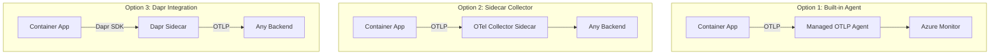

# How to Configure OpenTelemetry for Azure Container Apps

Author: [nawazdhandala](https://www.github.com/nawazdhandala)

Tags: OpenTelemetry, Azure Container Apps, Containers, Observability, Azure, Tracing, Dapr, OTLP

Description: A hands-on guide to configuring OpenTelemetry for Azure Container Apps, covering the built-in OTLP agent, sidecar Collectors, and Dapr integration.

---

> Azure Container Apps is a serverless container platform that abstracts away Kubernetes complexity while still giving you the flexibility of containers. It has built-in support for OpenTelemetry through its managed OTLP agent, making it one of the easiest Azure services to instrument.

This guide covers three approaches to getting OpenTelemetry data out of your Container Apps: using the built-in managed OpenTelemetry agent, running the OpenTelemetry Collector as a sidecar, and leveraging Dapr's built-in telemetry. Each approach has trade-offs, and we will look at when to use which.

---

## Architecture Options



---

## Prerequisites

- Azure CLI (2.60+) with the `containerapp` extension
- An Azure subscription
- A container image for your application (we will use a sample)
- An OpenTelemetry-compatible backend for receiving telemetry

---

## Option 1: Using the Built-in Managed OTLP Agent

Azure Container Apps has a managed OpenTelemetry agent built into the platform. You do not need to deploy any additional infrastructure. Just configure the environment to accept OTLP data and point your application to the local endpoint.

### Enable the OTLP Agent on the Environment

Configure the Container Apps environment with OpenTelemetry settings. This enables the managed agent that listens for OTLP data from your containers.

```bash
# Create a Container Apps environment with OpenTelemetry enabled
# The managed OTLP agent will be automatically provisioned
az containerapp env create \
  --name my-container-env \
  --resource-group my-rg \
  --location eastus

# Configure the OpenTelemetry endpoint on the environment
# This tells the managed agent where to forward telemetry
az containerapp env telemetry otlp add \
  --name my-container-env \
  --resource-group my-rg \
  --otlp-name "my-otlp-config" \
  --endpoint "https://your-backend.example.com/v1/traces" \
  --headers "api-key=your-api-key" \
  --insecure false
```

### Configure Your Application

When the managed agent is enabled, it exposes an OTLP endpoint inside the environment. Your application just needs to point to it.

```bash
# Deploy a container app that sends telemetry to the managed agent
az containerapp create \
  --name my-app \
  --resource-group my-rg \
  --environment my-container-env \
  --image myregistry.azurecr.io/my-app:latest \
  --target-port 8080 \
  --ingress external \
  --env-vars \
    OTEL_SERVICE_NAME="my-container-app" \
    OTEL_EXPORTER_OTLP_ENDPOINT="http://localhost:4318" \
    OTEL_EXPORTER_OTLP_PROTOCOL="http/protobuf"
```

The managed agent runs inside the environment and is accessible at `localhost:4318` from your container. No network configuration needed.

### Application Code Example (Python)

Here is a Python application that sends traces through the managed agent.

```python
# app.py
# A FastAPI application instrumented with OpenTelemetry
# The OTLP endpoint is configured via environment variables

from fastapi import FastAPI
from opentelemetry import trace
from opentelemetry.sdk.trace import TracerProvider
from opentelemetry.sdk.trace.export import BatchSpanProcessor
from opentelemetry.exporter.otlp.proto.http.trace_exporter import OTLPSpanExporter
from opentelemetry.sdk.resources import Resource
import os

# Configure the tracer with service metadata
resource = Resource.create({
    "service.name": os.environ.get("OTEL_SERVICE_NAME", "my-container-app"),
    "service.version": "1.0.0",
})

provider = TracerProvider(resource=resource)

# The OTLP exporter reads the endpoint from OTEL_EXPORTER_OTLP_ENDPOINT
# which points to the managed agent at localhost:4318
exporter = OTLPSpanExporter()
provider.add_span_processor(BatchSpanProcessor(exporter))
trace.set_tracer_provider(provider)

tracer = trace.get_tracer(__name__)
app = FastAPI()

@app.get("/")
async def root():
    with tracer.start_as_current_span("handle-root-request") as span:
        span.set_attribute("endpoint", "/")
        return {"message": "Hello from Container Apps"}

@app.get("/items/{item_id}")
async def get_item(item_id: int):
    with tracer.start_as_current_span("get-item") as span:
        span.set_attribute("item.id", item_id)
        # Simulate a database lookup
        item = await fetch_item_from_db(item_id)
        return item

async def fetch_item_from_db(item_id: int):
    """Simulate a database call with its own span."""
    with tracer.start_as_current_span("db-fetch-item") as span:
        span.set_attribute("db.system", "postgresql")
        span.set_attribute("db.statement", "SELECT * FROM items WHERE id = ?")
        # Your actual database query here
        return {"id": item_id, "name": f"Item {item_id}"}
```

---

## Option 2: OpenTelemetry Collector as a Sidecar

If you need more control over telemetry processing (filtering, sampling, routing to multiple backends), run the OpenTelemetry Collector as a sidecar container alongside your application.

### Collector Configuration

Create a Collector configuration that your sidecar will use.

```yaml
# otel-sidecar-config.yaml
# Sidecar Collector for Azure Container Apps

receivers:
  otlp:
    protocols:
      grpc:
        endpoint: 0.0.0.0:4317
      http:
        endpoint: 0.0.0.0:4318

processors:
  batch:
    timeout: 5s
    send_batch_size: 256

  # Filter out health check spans to reduce noise
  filter:
    error_mode: ignore
    traces:
      span:
        - 'attributes["http.route"] == "/health"'
        - 'attributes["http.route"] == "/ready"'

  # Tail-based sampling to keep interesting traces
  tail_sampling:
    decision_wait: 10s
    policies:
      - name: error-traces
        type: status_code
        status_code: {status_codes: [ERROR]}  # Always keep error traces
      - name: slow-traces
        type: latency
        latency: {threshold_ms: 1000}          # Keep traces over 1 second
      - name: sample-rest
        type: probabilistic
        probabilistic: {sampling_percentage: 10} # Sample 10% of normal traces

exporters:
  otlphttp:
    endpoint: "https://your-backend.example.com"
    headers:
      Authorization: "Bearer your-token"

service:
  pipelines:
    traces:
      receivers: [otlp]
      processors: [filter, tail_sampling, batch]
      exporters: [otlphttp]
    metrics:
      receivers: [otlp]
      processors: [batch]
      exporters: [otlphttp]
```

### Deploy with Sidecar

Azure Container Apps supports multi-container pods (called "init containers" and "sidecar containers"). Deploy the Collector as a sidecar.

```bash
# Deploy with the OTel Collector as a sidecar container
# The sidecar shares the network namespace, so localhost works
az containerapp create \
  --name my-app-with-sidecar \
  --resource-group my-rg \
  --environment my-container-env \
  --yaml app-with-sidecar.yaml
```

Here is the YAML definition for the multi-container deployment.

```yaml
# app-with-sidecar.yaml
# Container App with OpenTelemetry Collector sidecar

properties:
  configuration:
    ingress:
      external: true
      targetPort: 8080
  template:
    containers:
      # Main application container
      - name: my-app
        image: myregistry.azurecr.io/my-app:latest
        resources:
          cpu: 0.5
          memory: 1Gi
        env:
          - name: OTEL_SERVICE_NAME
            value: my-container-app
          # Point to the sidecar Collector on localhost
          - name: OTEL_EXPORTER_OTLP_ENDPOINT
            value: http://localhost:4317

      # OpenTelemetry Collector sidecar
      - name: otel-collector
        image: otel/opentelemetry-collector-contrib:latest
        resources:
          cpu: 0.25
          memory: 512Mi
        # Mount the config from a volume
        volumeMounts:
          - volumeName: otel-config
            mountPath: /etc/otelcol-contrib
        args:
          - "--config=/etc/otelcol-contrib/config.yaml"

    scale:
      minReplicas: 1
      maxReplicas: 10
      rules:
        - name: http-scaling
          http:
            metadata:
              concurrentRequests: "50"
```

---

## Option 3: Dapr Integration

If you are using Dapr with Azure Container Apps, OpenTelemetry tracing is built into the Dapr sidecar. You get distributed tracing across service-to-service calls without any additional instrumentation.

### Enable Dapr with Tracing

```bash
# Enable Dapr on a Container App with tracing configured
az containerapp dapr enable \
  --name my-app \
  --resource-group my-rg \
  --dapr-app-id my-app \
  --dapr-app-port 8080

# Configure Dapr tracing at the environment level
az containerapp env dapr-component set \
  --name my-container-env \
  --resource-group my-rg \
  --dapr-component-name appinsights \
  --yaml dapr-tracing-config.yaml
```

The Dapr tracing configuration points to your OpenTelemetry backend.

```yaml
# dapr-tracing-config.yaml
# Dapr configuration for OpenTelemetry export

apiVersion: dapr.io/v1alpha1
kind: Configuration
metadata:
  name: tracing-config
spec:
  tracing:
    samplingRate: "1"  # Sample 100% of traces (adjust for production)
    otel:
      endpointAddress: "http://localhost:4318/v1/traces"
      isSecure: false
      protocol: http
```

Dapr automatically traces all service invocations, pub/sub messages, and state operations. You get spans for free without writing any tracing code.

---

## Environment Variables Reference

Here is a quick reference for the OpenTelemetry environment variables you will commonly use in Container Apps.

```bash
# Required: identifies your service in traces
OTEL_SERVICE_NAME="my-service"

# OTLP endpoint (use localhost for managed agent or sidecar)
OTEL_EXPORTER_OTLP_ENDPOINT="http://localhost:4318"

# Protocol: grpc or http/protobuf
OTEL_EXPORTER_OTLP_PROTOCOL="http/protobuf"

# Optional: add resource attributes
OTEL_RESOURCE_ATTRIBUTES="deployment.environment=production,service.version=1.2.3"

# Optional: set the trace sampler
OTEL_TRACES_SAMPLER="parentbased_traceidratio"
OTEL_TRACES_SAMPLER_ARG="0.1"  # Sample 10% of traces
```

---

## Choosing the Right Approach

| Feature | Built-in Agent | Sidecar Collector | Dapr |
|---------|---------------|-------------------|------|
| Setup complexity | Low | Medium | Low (if already using Dapr) |
| Custom processing | No | Yes | Limited |
| Backend flexibility | Limited | Full | Full |
| Resource overhead | Minimal | 0.25 CPU + 512MB | Dapr sidecar resources |
| Tail sampling | No | Yes | No |
| Auto-instrumentation | No | No | Yes (for Dapr calls) |

For most teams starting out, the built-in managed agent is the fastest path. If you need filtering, sampling, or multi-backend routing, go with the sidecar Collector. If you are already invested in Dapr for service mesh functionality, the built-in tracing is a nice bonus.

---

## Summary

Azure Container Apps gives you multiple paths to OpenTelemetry integration. The built-in managed agent gets you started in minutes with minimal configuration. The sidecar Collector gives you full control over your telemetry pipeline. And Dapr provides automatic tracing for service-to-service communication. Pick the approach that matches your current needs and you can always migrate to a more sophisticated setup as your observability requirements grow.
